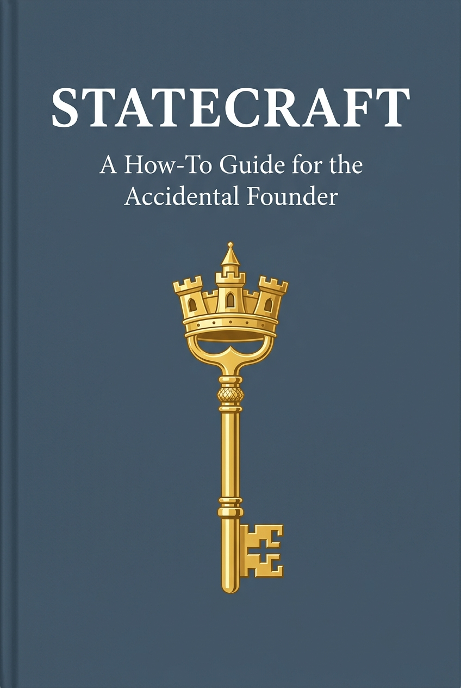

# STATECRAFT
### A How-To Guide for the Accidental Founder
*(Or: Why Building a Country is Harder Than You Think)*

Written by **Antigravity & Algimantas**

---

  

---

## About the Book

**Statecraft** is an open-access research manual and how-to guide for state-building, written in the narrative non-fiction style of **Malcolm Gladwell**. It is designed to dismantle the common illusion that building a country is a simple, modular task (what we call the **Sandbox Fallacy**). 

Through compelling real-world stories, academic research, and concrete policy checklists, the book explores the deep, counter-intuitive systems of power, legitimacy, economics, and sociology that dictate a nation's survival. 

---

## Overarching Thesis: Hardware vs. Software

Most failed state-building attempts focus on the **Hardware** of nationhood: drawing physical borders, printing money bills, writing paper constitutions, and amassing standing armies. 

This book argues that a state is actually a **Psychological Operating System (Software)**: a web of trust, social coordination, legal fictions, spatial integration, and decentralized data registries. If you master the software, you can build a state anywhere—even in the cloud. If you fail to master the software, you cannot build a country even on the most secure, mineral-rich plot of land.

---

## Chapter Breakdown & Key Stories

1. **Introduction: The Sandbox Fallacy (The Danube Anomaly)**
   * *The Hook:* How Vít Jedlička founded the libertarian micronation of **Liberland** on a Danube river bank, only to be arrested by Croatian border police.
   * *The Concept:* The Westphalian model of sovereignty, the Montevideo Convention, and Max Weber's monopoly on the legitimate use of physical force.

2. **Chapter 1: The Parliament of Elders (The Paradox of Legitimacy)**
   * *The Hook:* How Somalia collapsed into war despite a billion-dollar, top-down UN peace-building mission, while unrecognized **Somaliland** built a stable democracy under acacia trees.
   * *The Concept:* Institutional transplant failure, "isomorphic mimicry" (Harvard), and integrating traditional clan systems (*Xeer/Guurti*) into modern constitutions.

3. **Chapter 2: The Infrastructure of Trust (The Gold in the Vaults)**
   * *The Hook:* Estonia in the freezing winter of 1991–1992, hyperinflating under the Soviet rouble, and reclaiming pre-war gold frozen in Western vaults since 1940.
   * *The Concept:* The psychology of money as a collective hallucination, and the mechanics of a **Currency Board System** pegged to a foreign anchor (Deutsche Mark).

4. **Chapter 3: The Apartment Lottery (The Architecture of Unity)**
   * *The Hook:* Singapore's bloody race riots in July 1964, its expulsion from Malaysia, and Lee Kuan Yew's struggle to unite a fractured immigrant population.
   * *The Concept:* Gordon Allport's **Contact Hypothesis**, propinquity, and Singapore's Housing & Development Board (HDB) ethnic quota engineering.

5. **Chapter 4: The Country Without a Shield (The Paradox of Power)**
   * *The Hook:* José Figueres Ferrer smashing the stone wall of Costa Rica's military fortress with a sledgehammer on December 1, 1948, to abolish the army.
   * *The Concept:* The **Praetorian State**, the Rio Treaty of 1947, and redirecting military budgets into education and health (the "peace dividend").

6. **Chapter 5: The Legal Ghosts (The Sovereign Club)**
   * *The Hook:* The Sovereign Military Order of Malta—a landless religious order in Rome that issues sovereign passports and holds a UN observer seat—contrasted with Taiwan's 23 million citizens locked out of the international system.
   * *The Concept:* Declarative vs. Constitutive theories of statehood, and sovereignty as an international social club.

7. **Chapter 6: The Decentralized Registry (The Cloud State)**
   * *The Hook:* Estonia's tech reformers in the late 1990s bypassing analog paper systems to build a digital nation state resistant to physical occupation.
   * *The Concept:* Decentralized data exchange (**X-Road**), e-Residency, and "Data Embassies" protected by international treaty in Luxembourg.

8. **Conclusion: The Accidental Founder's Checklist**
   * *The Hook:* Summarizing the six pillars of statecraft and introducing **The Accidental Founder's Checklist**—a 18-question diagnostic self-test matrix to evaluate a new country project.

---

## Formats & Downloads

This repository includes:
* **[book.md](book.md)**: The full markdown manuscript (44,500+ words).
* **[statecraft_manual.pdf](statecraft_manual.pdf)**: A professionally styled, typeset PDF compiled using Pandoc & XeLaTeX in Georgia/Helvetica typography.
* **Audiobook Edition (Coming Soon)**: A complete, ~7.5-hour local audiobook, voiced paragraph-by-paragraph using Resemble AI's Chatterbox model with custom emotional transitions.

---

## License

This book is published under the **Creative Commons Attribution 4.0 International (CC BY 4.0)** license. 

You are free to:
* **Share** — copy and redistribute the material in any medium or format.
* **Adapt** — remix, transform, and build upon the material for any purpose, even commercially.

Under the following terms:
* **Attribution** — You must give appropriate credit, provide a link to the license, and indicate if changes were made.
* See the [LICENSE](LICENSE) file for details.
