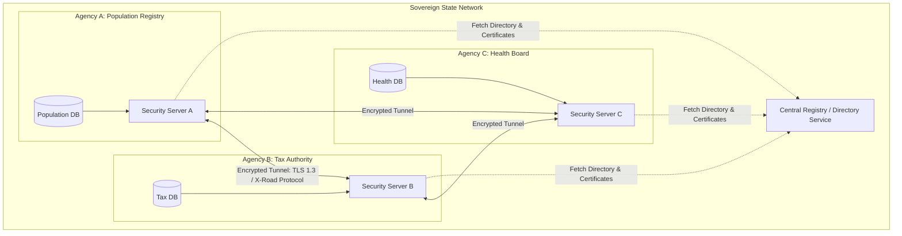
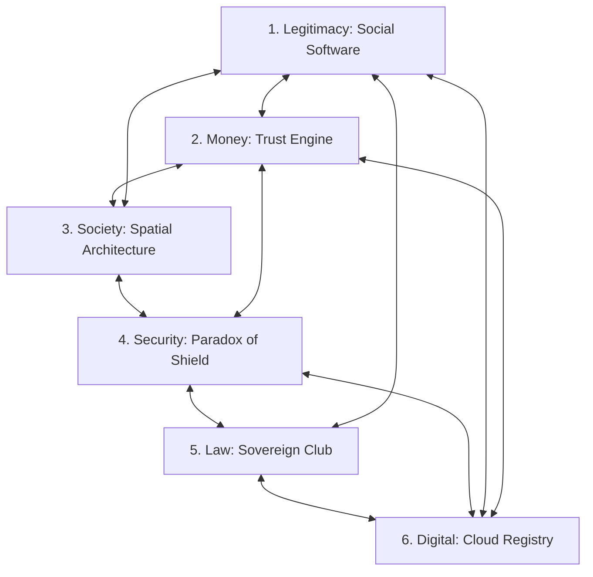

# Introduction: The Sandbox Fallacy

## 1. The Hook: The Danube Anomaly

If you travel to the borderlands where Croatia meets Serbia, about halfway between the cities of Zagreb and Belgrade, you will find yourself in a landscape that feels suspended in time. Here, the Danube River flows slow and heavy, a muddy artery cutting through low-lying floodplains, dense willow forests, and silent marshes. The air in summer is thick with humidity and the high-pitched hum of millions of mosquitoes. It is a quiet place, where the only sounds are the occasional call of a heron and the gentle lapping of the river against the clay banks. But in the spring of 2015, this damp, forgotten corridor of Eastern Europe suddenly became the center of a bizarre global drama.

At the heart of this drama was a seven-square-kilometer pocket of land known as Gornja Siga. In the local dialect, it means "upper tufa," referring to the porous limestone deposits found along the riverbank. Gornja Siga is a peninsula of sorts, bounded on three sides by a wide, sweeping bend of the Danube and on the fourth by a drainage canal. It has no paved roads, no running water, and no electricity. For decades, its only inhabitants were wild boars, deer, and the occasional fisherman seeking shelter from a sudden storm. 

But Gornja Siga possessed one attribute that made it unique on the surface of the earth. Due to a historical quirk of cartography and post-war diplomacy, it was unclaimed. 

To understand how a piece of land in the heart of Europe could belong to no one, you have to go back to the nineteenth century. Under the Austro-Hungarian Empire, engineers undertook a massive project to straighten the winding course of the Danube. The river, which had previously looped and meandered across the landscape like a discarded ribbon, was channeled into a cleaner, more navigable bed. In doing so, the engineers inadvertently created a geographical puzzle. 

When the Socialist Federal Republic of Yugoslavia dissolved in the early 1990s, the newly independent republics of Croatia and Serbia had to draw their borders. Croatia argued that the border should follow the old meanders of the river, as recorded in the Austro-Hungarian cadastral land registry. This would give Croatia several large pockets of land on the Serbian side of the river. Serbia, on the other hand, argued that the border should follow the current, straightened course of the Danube. 

This disagreement created a series of territorial mismatches. If you accepted the Serbian claim, certain parcels of land belonged to Serbia. If you accepted the Croatian claim, they belonged to Croatia. But Gornja Siga was different. Because of the mismatch, it fell into a diplomatic blind spot. Serbia, following the straightened river, declared that Gornja Siga—which lay on the west bank of the river, the Croatian side—was Croatian territory. Croatia, sticking to the old cadastral map, insisted that the land belonged to Serbia. Neither country wanted to claim it, because doing so would undermine their broader legal arguments for the rest of the disputed border. 

In the language of international law, Gornja Siga had become *terra nullius*—no man's land. It was a blank spot on the map, a tiny tear in the fabric of global sovereignty.

Enter Vít Jedlička.

Jedlička was a thirty-one-year-old Czech politician and activist, a man with a round face, a quick smile, and a relentless, boyish energy. He was a devout believer in the principles of libertarianism, a political philosophy that views state intervention as the root of most human suffering. For years, Jedlička had fought within the mainstream Czech political system, running for office and writing articles decrying high taxes, government regulation, and the bureaucratic overreach of the European Union. But he had grown frustrated. He felt that the modern state was an inescapable, self-replicating machine. No matter who you voted for, the bureaucracy only grew larger, the tax codes longer, and the individual less free.

"I realized it was impossible to change the system from within," Jedlička would later reflect. "The state has too much inertia. If you want to show the world a better way, you have to start from scratch. You have to build a new model."

In early 2015, Jedlička was reading about territorial disputes on Wikipedia when he stumbled upon the Danube anomalies. He stared at the screen, transfixed. A piece of land in Europe that no state claimed. It was the ultimate blank canvas. 

On April 13, 2015—a date chosen because it was the birthday of Thomas Jefferson—Jedlička, his girlfriend Jana Markovičová, and a childhood friend loaded a modest car with a yellow-and-black flag, a folding table, a camera, and a bottle of champagne. They drove east from Prague, crossing the borders of Slovakia and Hungary, until they reached the muddy tracks that led into the floodplains of the Danube.

The journey to Gornja Siga was not a heroic march; it was a damp, exhausting struggle. The road quickly deteriorated into a swamp of deep clay. The car got stuck, forcing them to continue on foot. They hiked through dense undergrowth, their boots sinking into the wet earth, fighting off swarms of early-spring insects. After hours of walking, they reached a small clearing beneath a towering willow tree. 

Jedlička planted the flagpole in the soft soil. The flag he raised was simple: a yellow field representing libertarianism and individual liberty, split by a black stripe representing anarchy and the absence of state coercion. In the center was a coat of arms featuring a bird (symbolizing freedom) soaring above a river (the Danube) and a tree (representing growth and life). 

With the flag fluttering in the river breeze, Jedlička uncorked the champagne and made a declaration. He proclaimed the establishment of the Free Republic of Liberland. Its motto was simple and uncompromising: *To live and let live*.

"We wanted to build a country where people could prosper without the heavy hand of the state," Jedlička said. "A place where taxes are voluntary, where regulation is minimal, and where the individual is truly sovereign."

If Jedlička had performed this ceremony twenty years earlier, it would have been nothing more than a quirky footnote, an eccentric weekend trip that ended when the champagne ran out. But Jedlička understood something fundamental about the modern world: in the digital age, a physical presence is only half the battle. The real territory is online.

The moment they returned to their hotel room, they launched the official Liberland website and posted photos of the flag-planting on Facebook. They issued a press release to international news agencies, declaring the birth of the world’s newest sovereign state and inviting people to apply for citizenship.

What happened next was a tipping point of the digital era.

The story was picked up by a local news portal, then by national newspapers in the Balkans, and within forty-eight hours, it had exploded across the global media. The BBC, CNN, *The New York Times*, and *Time* magazine all carried features on the young Czech who had founded a country in a swamp. 

To a world weary of economic stagnation, rising taxes, and political polarization, the idea of Liberland was intoxicating. It was the ultimate startup. 

Within three days, the Liberland website crashed under the weight of traffic. Within a week, Jedlička had received over 200,000 applications for citizenship from every corner of the globe. Within a month, that number had grown to half a million. Engineers in Silicon Valley, doctors in Turkey, entrepreneurs in Germany, and refugees in Syria all applied to become "Liberlanders." 

Volunteers emerged to draft a constitution based on the ideas of the American founding fathers and Swiss direct democracy. A virtual economy began to take shape, complete with a native cryptocurrency called the Merit. People offered to donate boats, solar panels, and building materials to help construct the new capital city, to be named Liberpolis.

For a brief, shining moment, it seemed as if the old rules of geography and power had been rewritten. The internet had democratized the state. If you could build a virtual community of half a million people, who cared about the mud and the mosquitoes? The digital republic had arrived.

---

## 2. The Pivot: The Arrest on the Riverbank

On May 9, 2015, less than a month after the flag-planting, Vít Jedlička was feeling confident. He had spent the preceding weeks traveling across Europe, giving interviews, meeting with potential investors, and basking in the glow of international celebrity. He had become a head of state in exile, a president without a palace but with a massive, loyal online following. 

Now, he decided, it was time to return to his country. He wanted to establish a permanent camp on Gornja Siga, to begin the physical transformation of the swamp into a libertarian utopia.

Jedlička and a small group of supporters chartered a boat in the Hungarian town of Mohács and began sailing south down the Danube. They carried tents, generators, and food supplies. As the boat neared the bend of the river where Liberland lay, the mood was celebratory. They were the pioneers of a new age, preparing to settle the last free land in Europe.

But as the boat approached the shore of Gornja Siga, a sleek, blue-and-white patrol boat surged out from the reeds. On its side were the words *Policija*—the Croatian border police. 

The officers on the patrol boat did not look like they were interested in libertarian philosophy. They were armed, professional, and stone-faced. They intercepted Jedlička’s vessel, ordered him to step onto Croatian soil, and immediately placed him under arrest. 

The self-proclaimed president of Liberland was put into the back of a police van, driven to the small Croatian town of Beli Manastir, and locked in a holding cell. The next morning, he was brought before a local magistrate, charged with illegally crossing the state border.

The courtroom scene was a masterpiece of legal absurdity. 

Jedlička’s lawyers argued that he could not have committed a border offense because he had entered Gornja Siga, a territory that Croatia officially claimed was *not* part of Croatia. If the land did not belong to Croatia, how could the Croatian police arrest someone for entering it? The Croatian government’s position was equally convoluted: they insisted that the land was not Croatian, but it was also not *terra nullius*. It was, they claimed, a "disputed zone" under temporary Croatian administrative control, and they were legally obligated to secure it as the external border of the European Union.

The magistrate was unimpressed by the philosophical arguments. Jedlička was found guilty, fined 2,400 Croatian kunas, and released. Over the following months, the pattern repeated itself. Whenever Liberland volunteers tried to land on the peninsula—by boat, by foot, or even by swimming—they were met by Croatian police, arrested, fined, and sometimes jailed. The Croatian authorities established a permanent checkpoint near the site and declared Gornja Siga a restricted military zone.

The arrest of Vít Jedlička is the point where the romantic myth of the accidental founder collides head-on with the cold, unyielding machinery of the international system. It is the moment where we must pivot from the internet to the law library, from the ideals of freedom to the hard reality of power.

To understand why Liberland stalled on the muddy banks of the Danube, we must look at the legal framework that defines what a state actually is. 

For nearly a century, the gold standard for statehood has been the Montevideo Convention on the Rights and Duties of States, signed in Uruguay in 1933. The convention was a product of a specific historical moment—an attempt by the nations of the Americas to establish clear, objective rules that would prevent stronger powers (namely the United States) from arbitrarily declaring which governments were legitimate and which were not.

Under Article 1 of the Montevideo Convention, a state as a person of international law should possess the following qualifications:
1. A permanent population;
2. A defined territory;
3. A government; and
4. The capacity to enter into relations with other states.

At first glance, Jedlička’s Liberland seemed to have a plausible claim to all four. 
*   **Territory**: Gornja Siga was a defined, seven-square-kilometer parcel of land.
*   **Population**: While no one lived there permanently, over 500,000 people had signed up for citizenship online, forming a committed community.
*   **Government**: Liberland had a president, a cabinet, a constitution, and a set of laws.
*   **Capacity for Relations**: Jedlička was actively writing letters to foreign governments, setting up representative offices, and lobbying diplomats.

But the Montevideo Convention is not a self-executing checklist. It is a legal framework that exists within a political reality. And that reality was defined long before 1933 by a German sociologist named Max Weber.

In January 1919, in the chaotic aftermath of the First World War, Weber delivered a lecture at Munich University titled *Politik als Beruf* (Politics as a Vocation). In it, he laid out a definition of the state that has remained the bedrock of political science ever since. 

A state, Weber argued, cannot be defined by its ends or its ideals. It can only be defined by the specific means that are peculiar to it: physical force. 

"A state," Weber wrote, "is a human community that (successfully) claims the *monopoly of the legitimate use of physical force* within a given territory."

Note the words Weber uses: *successfully*, *monopoly*, and *physical force*. 

The Montevideo Convention describes the outward symptoms of a state, but Weber describes its DNA. A state does not exist because it has a constitution or a population list on a server. A state exists because it has the physical capability to exclude others from its territory, and because its neighbors recognize its right to do so. 

When the Croatian police officer stepped onto the bank of Gornja Siga and put handcuffs on Vít Jedlička, he was demonstrating Weber’s monopoly in action. Croatia did not need to win the intellectual argument about who owned Gornja Siga. Croatia had the boats, the guns, the courts, and the prisons. Croatia had the monopoly on physical force. Liberland had a website. 

In the struggle between the digital checklist and the physical monopoly, the monopoly wins every single time.

---

## 3. The Investigation: The Sandbox Fallacy

The story of Liberland is not unique. It is part of a long, colorful history of people who have tried to build their own countries, only to find themselves crushed by the physical and legal reality of the international system. 

To understand why these attempts fail, we have to examine a cognitive bias that is particularly common among modern founders: the Sandbox Fallacy.

In the world of software development, a "sandbox" is a safe, isolated environment where programmers can test new code, build applications, and run experiments without the risk of damaging the host operating system. If something goes wrong in the sandbox, you simply delete the instance and start over. There are no legacy databases to corrupt, no dependencies to break, and no real-world consequences.

The Sandbox Fallacy is the belief that the physical world contains sandboxes. 

It is the assumption that if you can find a piece of land that is unclaimed, or a reef that is submerged, or an old military platform in international waters, you have found a blank space where you can write your own political operating system from scratch. It is the belief that the state is a modular, plug-and-play technology.

But the physical world has no sandboxes. Every square inch of the earth is already written in deep, messy, historical legacy code. 

When a modern founder looks at a map and sees a blank space, they are seeing a map projection, not the reality of power. Modern borders are not lines drawn on a piece of paper; they are relational networks of agreements, treaties, and military alliances. They are kept in place because the states on either side have agreed, through decades of negotiation and often violence, that those lines serve their mutual interests.

Consider the physical reality of how borders are actually defended. It is rarely about high walls and barbed wire. It is about administrative consensus. 

If you walk across the border between France and Belgium today, there are no guards, no passports, and no fences. You only know you have crossed because the road signs change language. But this border is not soft; it is incredibly hard. It is backed by the entire weight of the European Union, the Schengen Agreement, and the mutual recognition of two sovereign governments. If you try to build a cabin in the middle of that border and declare it a new country, you will not be met by a military force; you will be met by a local building inspector and a police car. The state's monopoly on force is so complete that it does not even need to be visible.

When we compare Liberland's failure to other historical micronation attempts, we see the Sandbox Fallacy play out in three distinct ways.

### Case 1: The Loophole Strategy (Sealand)

The most famous micronation in the world is the Principality of Sealand. In 1967, a former British army major named Roy Bates took over HM Fort Roughs, a derelict anti-aircraft platform built by the British government during the Second World War. The platform sat in the North Sea, roughly seven miles off the coast of Suffolk, England. 

Bates’s strategy was built on a legal loophole. At the time, British territorial waters only extended three miles from the coast. Fort Roughs sat in international waters. Because the platform was abandoned and outside the jurisdiction of any state, Bates argued it was *terra nullius*, and that he could legally occupy it and declare it a sovereign principality.

For a while, the loophole held. In 1968, when the British navy tried to evict Bates, his son Michael fired warning shots from the platform. The British government brought Bates to court, but the judge ruled that because the incident occurred outside territorial waters, the court had no jurisdiction. Sealand had won its first legal battle.

But Sealand’s sovereignty was an illusion. In 1978, a German businessman who had been appointed "prime minister" of Sealand staged a coup, taking Michael Bates hostage. Roy Bates hired a helicopter, launched a counter-offensive, and retook the platform, holding the German businessman captive. The German government sent a diplomat from its London embassy to the platform to negotiate the hostage's release. 

Bates claimed this visit was *de facto* recognition of Sealand's sovereignty by Germany. But the international club was unimpressed. When the UK government eventually extended its territorial waters to twelve miles in 1987, Sealand found itself inside British territory. The UK chose to ignore Sealand rather than evict it, viewing it as a harmless tourist curiosity. Sealand survived not because it was sovereign, but because it was too small and insignificant for the British state to bother crushing it. The loophole had not created a state; it had created a hostage to tolerance.

### Case 2: The Engineering Strategy (The Republic of Minerva)

In the early 1970s, a Lithuanian-American real estate millionaire named Michael Oliver decided to bypass the problem of finding unclaimed land by building his own. 

Oliver was a radical libertarian who wanted to create a society free from taxes and government regulations. He identified the Minerva Reefs, a pair of submerged coral reefs in the Pacific Ocean, south of Fiji and Tonga. The reefs were underwater at high tide, meaning they did not belong to any country. 

Oliver’s organization, the Ocean Life Research Foundation, raised millions of dollars. They sent a ship to the reefs and began dumping tons of sand and gravel to raise the land above sea level. They constructed a small stone tower, planted a flag featuring a torch, and declared the Republic of Minerva in January 1972. They even minted their own silver currency, the Minerva dollar.

The reaction of the neighboring states was immediate and hostile. 

The Kingdom of Tonga, a Pacific island nation, did not care about the libertarian theory of *terra nullius*. They saw an artificial island being built in their economic backyard, and they viewed it as a threat. In June 1972, King Tāufaʻāhau Tupou IV of Tonga issued a royal proclamation claiming the Minerva Reefs. 

Tonga sent a small military force on a royal vessel to the reefs. They landed on the artificial sandbar, hauled down the Minerva flag, and raised the Tongan flag. The Tongan parliament ratified the annexation, and the South Pacific Forum formally recognized Tonga’s claim. 

Oliver and his supporters, having no military capability, could do nothing. The Republic of Minerva vanished beneath the waves, swallowed by the physical force of a neighboring kingdom. The engineering strategy had failed because Oliver had forgotten that physical land, once created, must be physically defended.

### Case 3: The Legalistic Strategy (The Principality of Hutt River)

In 1970, an eccentric wheat farmer named Leonard Casley found himself in a bitter dispute with the government of Western Australia over wheat production quotas. Casley faced ruin because the state had introduced strict limits on the amount of wheat he could sell. 

Instead of filing a lawsuit, Casley decided to secede. 

He studied British and Australian constitutional law and identified what he believed was a legal loophole. He argued that under the British Treason Agreement Act of 1495, a subject had the right to secede from the Crown if the monarch failed to protect them. Casley declared his 75-square-kilometer farm to be the Principality of Hutt River, appointed himself Prince Leonard, and declared independence from Australia.

For fifty years, the Australian government’s response was a masterclass in administrative containment. They did not send the army to evict Prince Leonard. Instead, they treated him with a cold, bureaucratic silence. 

They did not recognize his passport, they did not allow him to run his own post office, and they insisted that he was still subject to Australian tax laws. When Casley stopped paying income tax, the Australian Taxation Office quietly built a case against him. 

For decades, the dispute simmered. Hutt River became a quirky tourist attraction, selling its own stamps and currency to visitors. But the administrative machinery of the Australian state never stopped grinding. 

In 2017, the Supreme Court of Western Australia ordered the Principality to pay $3 million in unpaid taxes. Prince Leonard’s son and successor, Prince Graeme, was forced to announce the dissolution of the Principality in August 2020. The farm was sold to pay the tax bill. The legalistic strategy had failed because Casley had confused the complexity of legal arguments with the raw power of administrative enforcement.

---

| Attempt | Strategy | Primary Loophole / Method | Failure Mode | Outcome |
| :--- | :--- | :--- | :--- | :--- |
| **Liberland** (2015) | The Geopolitical Gap | Territorial dispute between Croatia and Serbia (*terra nullius*) | Intercepted by Croatian police exercising administrative control | Exists only online; territory inaccessible |
| **Sealand** (1967) | The Maritime Loophole | Military platform in international waters outside 3-mile limit | Tolerate-but-ignore policy; territorial waters eventually extended | Harmless tourist curiosity; no real sovereignty |
| **Minerva** (1972) | The Engineering Feat | Dredging submerged reefs in the South Pacific | Military annexation by the Kingdom of Tonga | Land reclaimed by the sea and Tongan sovereignty |
| **Hutt River** (1970) | The Legalistic Secession | Wheat quota dispute; interpretation of 1495 Treason Act | Administrative enforcement of tax laws | Sovereign claim dissolved to pay Australian tax debt |

---

What these stories teach us is that sovereignty is not a game of legal hide-and-seek. You cannot find a loophole so clever that the state will simply shrug its shoulders and let you walk away with a piece of its territory. 

The state is not a computer program that can be hacked. It is a social, historical, and physical reality. If you want to build a country, you cannot ignore the legacy code. You must learn how to write it.

---

## 4. The Manual Page: Technical Reference

```
STATECRAFT MANUAL                          SECTION 0: FOUNDATIONAL CONCEPTS
REFERENCE: MONTEVIDEO & WESTPHALIA         EFFECTIVE: JULY 2026
```

### I. The Montevideo Convention Criteria (1933)

The Montevideo Convention on the Rights and Duties of States remains the primary treaty governing the definition of statehood under public international law. While signed as a regional treaty in the Americas, its Article 1 is widely accepted as reflective of customary international law.

```
+-----------------------------------------------------------------+
|               MONTEVIDEO CRITERIA FOR STATEHOOD                 |
+------------------------------------+----------------------------+
| 1. Permanent Population            | 2. Defined Territory       |
|    - Numerical size irrelevant     |    - Borders may be        |
|    - Must exhibit community life   |      disputed or narrow    |
|    - Virtual/online presence       |    - Must be a natural     |
|      does not qualify              |      portion of the earth  |
+------------------------------------+----------------------------+
| 3. Government                      | 4. Capacity for Relations  |
|    - Must exercise effective administrative | - Ability to enter into  |
|      control over territory and population   |   treaties and relations |
|    - Monopoly on physical force    | - Requires recognition   |
|      (Weberian criterion)          |   by existing states     |
+------------------------------------+----------------------------+
```

#### Legal Interpretations & Operational Constraints

1.  **Permanent Population**: The population must inhabit the territory with the intent of permanent residence. A transient or purely virtual population is legally insufficient. Under custom, there is no minimum population requirement (e.g., Vatican City has fewer than 1,000 residents), but the population must have a physical presence and an organized social structure within the territory.
2.  **Defined Territory**: The territory must be a natural portion of the earth's surface. Artificial islands, oil platforms, or digital domains do not constitute territory under public international law. Border disputes with neighboring states do not invalidate statehood (e.g., Israel’s borders are disputed, yet its statehood is recognized), but there must be a stable, recognizable core territory.
3.  **Government**: The government must exhibit **effective control** over the territory. This means it must possess the administrative capacity to enforce laws, collect taxes, maintain public order, and exclude unauthorized actors. The government must be independent of foreign control.
4.  **Capacity to Enter into Relations**: This criterion is deeply tied to the concept of **Recognition**. A state cannot enter into relations if no other state is willing to receive its diplomats or sign treaties with it.

#### Theoretical Perspectives: Declaratory vs. Constitutive Theories

In international law, two competing schools of thought explain how a state achieves sovereignty:

*   **The Declaratory Theory**: This theory, explicitly endorsed by Article 3 of the Montevideo Convention, states that the political existence of a state is independent of recognition by other states. If a territory meets the four criteria of Article 1, it is a state. Recognition is merely a "declaration" of an existing fact.
*   **The Constitutive Theory**: This theory argues that a state only becomes a person of international law through the act of **recognition** by other states. Under this view, even if an entity has a population, territory, and government, it is not a state until the existing members of the international club choose to recognize it. In practice, the constitutive theory dominates modern geopolitics.

---

### II. Westphalian Sovereignty

Westphalian Sovereignty is the foundational organizing principle of the modern international system. It emerged from the Peace of Westphalia in 1648, which ended the Thirty Years' War in the Holy Roman Empire and the Eighty Years' War between Spain and the Dutch Republic.

```
                   THE WESTPHALIAN MODEL
                   
     +-----------------------------------------------+
     |              SOVEREIGN EQUALITY               |
     |  - All states are legally equal under law    |
     +-----------------------+-----------------------+
                             |
     +-----------------------v-----------------------+
     |             TERRITORIAL INTEGRITY             |
     |  - State has exclusive authority over land    |
     +-----------------------+-----------------------+
                             |
     +-----------------------v-----------------------+
     |               NON-INTERVENTION                |
     |  - External powers cannot interfere in internal |
     |    affairs of a sovereign state               |
     +-----------------------------------------------+
```

#### Core Tenets

1.  **Territoriality**: The state is tied to a specific geographic space. Within this space, the state's authority is absolute and exclusive. No external authority (such as the Pope or the Holy Roman Emperor) has jurisdiction within the state's borders.
2.  **Sovereign Equality**: Regardless of size, population, wealth, or military power, all sovereign states are legally equal in the international arena. A vote by Tuvalu in the UN General Assembly carries the same legal weight as a vote by the United States.
3.  **Non-Intervention**: States are legally prohibited from intervening in the domestic affairs of other sovereign states. This rule is designed to prevent stronger states from using internal political disputes as a pretext for invasion or regime change.

---

### III. De Facto vs. De Jure Sovereignty

The distinction between *de facto* (in fact) and *de jure* (in law) sovereignty is one of the most critical concepts for any founder to understand. It represents the divide between physical reality and legal recognition.

```
+-----------------------------------------------------------------------+
|                 SOVEREIGNTY COMPARISON MATRIX                         |
+----------------------+----------------------+-------------------------+
| Feature              | De Facto Sovereignty | De Jure Sovereignty     |
+----------------------+----------------------+-------------------------+
| Definition           | Control in physical  | Recognition in law      |
|                      | reality              |                         |
+----------------------+----------------------+-------------------------+
| Source of Authority  | Military control,    | UN membership, treaties,|
|                      | police, tax systems  | diplomatic recognition  |
+----------------------+----------------------+-------------------------+
| Vulnerability        | High risk of military| High stability; borders |
|                      | invasion or collapse | legally protected       |
+----------------------+----------------------+-------------------------+
| Example: Taiwan      | High (Full control   | Low (Only 12 states     |
|                      | on the ground)       | recognize officially)   |
+----------------------+----------------------+-------------------------+
| Example: Order of    | Low (No territory or | High (Recognized by 113 |
| Malta                | physical population) | states; UN observer)    |
+----------------------+----------------------+-------------------------+
```

#### Operational Definitions

*   **De Facto Sovereignty**: The actual, physical exercise of power over a territory and population. An entity with *de facto* sovereignty has its own courts, police force, military, and tax collection mechanisms. It governs the territory in reality, regardless of whether the rest of the world recognizes its right to do so.
*   **De Jure Sovereignty**: The legal recognition of a state's sovereignty by the international community, typically formalized through diplomatic recognition and membership in the United Nations. An entity with *de jure* sovereignty has the legal right to govern, even if it does not have physical control over the territory (e.g., governments-in-exile during wartime).

#### Case Studies in the Sovereign Divide

1.  **Somaliland**: An absolute outlier of *de facto* sovereignty. Somaliland has met all the Montevideo criteria since 1991. It has a stable democracy, its own currency, and a professional military. Yet, it has zero *de jure* recognition. It is legally treated as a province of Somalia. Because it lacks *de jure* status, Somaliland cannot access loans from the World Bank, sign official trade treaties, or purchase modern defensive weaponry.
2.  **Taiwan (Republic of China)**: A highly successful, high-tech nation of 23 million people with complete *de facto* sovereignty. However, because of the geopolitical influence of the People's Republic of China, Taiwan's *de jure* sovereignty is suppressed. It exists in a diplomatic twilight zone, relying on informal relationships and defensive alliances to protect its physical autonomy.
3.  **The Sovereign Military Order of Malta (SMOM)**: A mirror image of Somaliland. The Order has no territory and no population, meaning it has zero *de facto* sovereignty. Yet, it enjoys *de jure* sovereignty, maintaining diplomatic relations with 113 states and issuing passports that are honored worldwide. It is a legal ghost that exists in the diplomatic ledger but not on the physical map.

---

```
[END OF SECTION 0]
```


\newpage

# Chapter 1: The Parliament of Elders (The Paradox of Legitimacy)

## 1. The Hook: Mogadishu’s Mirage and the Acacia Tree

In the early morning hours of January 5, 1991, the hum of the air conditioners inside the United States Embassy compound in Mogadishu was drowned out by the rhythmic, deafening chop of helicopter blades. Operation Eastern Exit was underway. For weeks, the capital of Somalia had been disintegrating. The regime of Mohamed Siad Barre—a dictator who had spent twenty-one years balancing clan rivalries through a combination of Marxist rhetoric, Soviet heavy weaponry, and American financial aid—was collapsing. Barre, now mockingly referred to by his own citizens as the "Mayor of Mogadishu" because his authority ceased at the city limits, was preparing to flee in a tank. Outside the embassy gates, the streets belonged to teenage militiamen armed with Soviet-made Kalashnikovs, driving "technicals"—pickup trucks with heavy machine guns bolted to the cargo beds. 

Inside the embassy, American diplomats, their families, and foreign nationals huddled in the dark, waiting to be evacuated by U.S. Navy Sea Stallion helicopters launched from warships stationed off the coast. By the time the last helicopter lifted off into the humid night air, the state of Somalia had effectively ceased to exist. The ministries were looted; the national archive was burned; the police force evaporated. In a matter of days, a nation-state of eight million people was reduced to a geographic designation.

The response of the international community was swift, massive, and entirely orthodox. This was the dawn of the post-Cold War era, a moment of supreme confidence in the power of liberal democracy and international institutions. If a state had broken, the prevailing wisdom went, then the international community knew exactly how to fix it. In December 1992, the United States launched Operation Restore Hope, landing 28,000 troops on the beaches of Mogadishu under the glare of international television cameras. The mission was historic: it was a military-humanitarian intervention designed not to defeat a foreign enemy, but to rebuild a nation from scratch.

Over the next three years, the United Nations and its backers poured billions of dollars into Somalia. The strategy was drawn directly from the standard state-building manual. To fix Somalia, one had to build a modern, centralized state. The formula was simple: bring the warring factions together, host a series of high-profile peace conferences, draft a modern constitution, establish a parliament, set up ministries, train a national police force, and hold democratic elections. 

The venues for this ambitious project were carefully chosen. They were the ballrooms and conference halls of luxury hotels in foreign capitals—the Hilton in Addis Ababa, the Norfolk in Nairobi, the grand resorts of Djibouti. Here, far from the dust and gunfire of Mogadishu, Western-educated Somali elites, international lawyers, and UN diplomats gathered. They sat at polished mahogany tables, drank sparkling water, and argued over the finer points of constitutional law. They draft-negotiated clauses on federalism, separation of powers, and human rights. Millions of dollars were spent on "per diems" to keep the delegates at the table. 

Every few years, these conferences would culminate in a triumphant signing ceremony. A new Transitional Federal Government (TFG) would be announced. A new president would shake hands with UN officials. The international community would pledge hundreds of millions of dollars in aid to the new administration. The template had been applied; the institutions had been created.

But then, a curious thing would happen. The newly minted president, the parliamentarians, and the cabinet ministers would fly back to Somalia, and their authority would instantly vanish. The transitional governments could not collect taxes. They could not enforce laws. They could not even secure the streets outside the heavily fortified government compound in Mogadishu, which had to be protected by foreign peacekeeping troops. The national army, trained at great expense by foreign militaries, repeatedly dissolved into sectarian militias. The institutions existed on paper, but they had no purchase on the reality of the country. They were ghost institutions, inhabiting a haunted house of a state. For three decades, the multi-billion-dollar, top-down state-building project in Somalia remained one of the most expensive and protracted failures in modern history.

***

But while Mogadishu was burning, a completely different scene was unfolding just a few hundred miles to the north. 

In May 1991, as the rest of the country slid into anarchy, the leaders of the northern clans of Somaliland—a region that had been a British protectorate before joining Italian Somalia in a hasty 1960 merger—gathered in the port city of Burao. They declared the unilateral independence of the Republic of Somaliland. 

The response of the international community was not support, but a collective shrug. The United Nations refused to recognize Somaliland's independence, fearing that redrawing the borders of Africa would open a Pandora’s box of secessionist movements. No foreign embassies were opened in Hargeisa, the capital. No foreign peacekeepers were sent to secure the borders. No international aid packages were approved. Somaliland was isolated, impoverished, and legally non-existent.

Yet, over the next three decades, Somaliland pulled off an extraordinary feat. While southern Somalia remained a global synonym for instability, Somaliland built a peaceful, functioning, and remarkably stable democracy. They established a national currency, the Somaliland shilling, and managed to stabilize its value. They built a national police force and an army that successfully secured the territory. They held multiple democratic elections for the presidency and parliament, utilizing advanced biometric voter registration systems. Today, the streets of Hargeisa are safe to walk at night, and the local economy is bustling.

How did they do it? How did a self-declared state with no international recognition, no foreign aid, and no military support succeed where the massive, resource-rich, UN-backed apparatus in Mogadishu failed so spectacularly?

The answer lies in where—and how—they built their institutions.

Instead of luxury hotels in Nairobi or Addis Ababa, the foundational political conferences of Somaliland took place in dusty, wind-swept towns like Burao, Berbera, and Borama. They were not funded by foreign governments or international NGOs; they were funded by the local population. When the grand peace conference of Borama was convened in 1993, there were no per diems. The delegates—more than a hundred traditional clan elders, along with hundreds of observers—slept in local homes or on woven mats under the stars. The food they ate was donated by local merchants and pastoralists, who brought sheep, goats, and bags of rice to the conference site. 

And the conferences did not take place in air-conditioned ballrooms. They took place under the wide, shading branches of the acacia tree. 

Under the acacia tree, time worked differently. A UN-sponsored peace conference was always run on a tight, bureaucratic schedule: two weeks to draft a charter, three days to select a cabinet, a hard deadline driven by the funding cycles of foreign donors. In Borama, the conference lasted for five months. The elders did not begin by discussing the structure of a parliament or the division of tax revenues. They began by talking about blood. They talked about the camels that had been stolen during the civil war, the pasture lands that had been occupied, and the families that had lost sons. 

They used a traditional system of dispute resolution known as *Xeer*. They sat in circles, chewed leaves of *qat*, and talked until consensus (*talo*) was reached. If a dispute arose over a water well, they did not consult a constitutional draft written by a French legal scholar; they negotiated a compensatory agreement based on centuries-old customary law. Only after they had resolved the immediate, concrete grievances between the clans did they turn their attention to the design of the state.

When they finally drafted a framework for the new republic, they did not copy the constitution of a Western democracy. Instead, they built a hybrid system. They created a bicameral parliament where the lower house was elected by democratic vote, but the upper house—the *Guurti*—was composed entirely of traditional clan elders. They took the traditional, informal system of clan governance that had kept the peace for generations and formalized it into the architecture of a modern state.

The contrast between Mogadishu and Hargeisa is a modern parable of statecraft. It reveals a fundamental truth that every accidental founder—whether they are building a country, a community, or a company—must grasp: **legitimacy cannot be imported; it must be grown from the soil.**

---

## 2. The Pivot: The Pathology of Isomorphic Mimicry

To understand why the UN's state-building project in Somalia failed, we have to look at a concept developed by three development economists at the Harvard Kennedy School: Lant Pritchett, Michael Woolcock, and Matt Andrews. They call it **isomorphic mimicry**.

The term is borrowed from evolutionary biology. In nature, some species survive by mimicking the appearance of others. The hoverfly, for example, has no stinger, but it has evolved yellow and black stripes that make it look exactly like a wasp. To a predator, the hoverfly looks dangerous, but it is entirely harmless. It has mimicked the *form* of a wasp without possessing any of the *function*—the venom, the stinger, the aggression—that makes the wasp a threat.

In the realm of state-building and institutional design, isomorphic mimicry is the practice of creating organizations and laws that look like successful institutions in other places, but lack the capability or legitimacy to function. It is the political equivalent of the hoverfly.

Pritchett, Woolcock, and Andrews argue that when developing countries or international donors attempt to build institutions, they almost always fall into this trap. They build the outward structures—the ministries, the audit agencies, the anti-corruption commissions, the written constitutions—because those structures make them look like a "modern, capable state" to the outside world. But these structures are merely decorative. They are paper-mache institutions.

Consider the classic "State-in-a-Box" kit that the international community deploys to post-conflict zones. The kit contains:
1. A written constitution (usually drafted by international consultants, emphasizing separation of powers and human rights).
2. A parliament building (often funded by a foreign donor).
3. A civil service framework (with standardized job descriptions and grade levels).
4. An independent judiciary (complete with a supreme court).
5. An anti-corruption agency.

When the UN built these institutions in Mogadishu, they were engaging in isomorphic mimicry. They were creating the appearance of a state to satisfy the expectations of the international system. A state, in the eyes of the UN, is an entity that has a president, a cabinet, a parliament, and a written constitution. Therefore, to make Somalia a state, one had to construct those specific things.

But this approach confuses the *symptoms* of a successful state with its *causes*. 

A functioning parliament is not the cause of a peaceful society; it is the result of a pre-existing social contract that allows people to resolve their differences through debate rather than violence. A written constitution is not the source of law; it is the formalization of a society’s shared values and power dynamics. If you build the parliament and write the constitution without the underlying social contract, you have built nothing but a stage set.

Why do these copy-pasted institutions fail so consistently? They fail because they lack what sociologists call **locational legitimacy**.

Legitimacy is the invisible engine of any institution. It is the quality that makes people obey a law, pay a tax, or accept a judicial ruling even when it goes against their personal interests. Without legitimacy, a state must rely entirely on coercion—on police, soldiers, and prisons—to maintain order. But coercion is incredibly expensive and highly unstable. A state that must shoot its citizens to enforce a tax is not a state; it is an occupying army.

In a stable democracy like Sweden or Canada, legitimacy is *rational-legal*. People obey the law because they believe the system that created the law is fair, transparent, and democratic. They trust the process.

But in a society that has undergone decades of conflict, where the central state has been an instrument of violence and exploitation, rational-legal legitimacy does not exist. People do not trust the state. They do not trust the police. They do not trust the courts.

In these societies, legitimacy resides elsewhere. It resides in traditional systems of authority—in clans, tribes, religious networks, and customary law. These are the institutions that have actually kept people alive, secured their property, and resolved their disputes when the state collapsed. 

When the UN tried to build a state in Somalia, they ignored these traditional systems. Indeed, they viewed them as obstacles to modernization. The goal of the international community was to build a "clean," modern state that would transcend clan divisions. They wanted to replace the "primitive" clan system with a modern bureaucracy.

By doing so, they created a fatal mismatch. They built modern institutions that had zero legitimacy in the eyes of the population, while ignoring the traditional institutions that possessed absolute legitimacy. They built a state that existed only in the minds of foreign donors and the elite Somalis who occupied the government offices.

This is the **capability trap**. When an organization or a state is forced to adopt foreign templates to secure funding or recognition, it focuses its energy on mimicking those templates rather than solving its actual problems. It becomes highly skilled at producing reports, hosting workshops, and passing laws, but completely incapable of delivering public services or maintaining order. It becomes a state that can draft a brilliant climate change policy but cannot collect the garbage on the streets.

Somaliland’s founders avoided the capability trap because they were forced to. Because the international community refused to recognize them or give them aid, they had no incentive to engage in isomorphic mimicry. They did not have to impress the IMF, the World Bank, or the UN. They did not have to build a paper-mache anti-corruption commission to unlock a structural adjustment loan.

Instead, they had to build institutions that actually worked for the people on the ground, using the resources they had. And the only resource they had was the traditional clan system and the customary law of the *Xeer*.

---

## 3. The Investigation: The Mechanics of the Hybrid State

To design a functioning hybrid state, one must move beyond the general concept of "tradition" and analyze the precise mechanics of how customary systems operate. In Somaliland, this meant integrating the *Xeer*—the traditional legal system—into a modern constitutional order.

### The Mechanics of the *Xeer*

The *Xeer* is a polycentric legal system. Unlike statutory law, which is centralized and territorial (applying to anyone who steps inside a country's borders), the *Xeer* is personal and covenantal. It is a system of contracts between specific lineage groups. 

The fundamental unit of this system is the *diya-paying group*, known in Somali as the *jifo*. The *jifo* is a lineage group consisting of men who trace their descent to a common ancestor, usually four to eight generations back. The members of a *jifo* are bound by a mutual agreement to share the financial risks and liabilities of its members.

Under the *Xeer*, there is no distinction between civil and criminal law. All infractions are treated as torts—civil wrongs that require compensation. The primary goal of the law is not to punish the offender, but to restore the equilibrium of wealth and relationship between the clans.

Consider how a serious crime, such as a homicide, is resolved under the *Xeer*:

```
+-----------------------------------------------------------------------+
|                    THE XEER DISPUTE RESOLUTION FLOW                   |
+-----------------------------------------------------------------------+
|                                                                       |
|   1. Homicide Occurs                                                  |
|          |                                                            |
|          v                                                            |
|   2. Clans Mobilize (Elders step in immediately to prevent a feud)    |
|          |                                                            |
|          v                                                            |
|   3. Ad-hoc Assembly (Elders from Clan A & B meet under acacia tree)   |
|          |                                                            |
|          v                                                            |
|   4. Negotiation (Calculate Diya: 100 camels standard for a male)     |
|          |                                                            |
|          v                                                            |
|   5. Execution of Settlement (Surety/Damiin provided by guarantor)    |
|          |                                                            |
|          v                                                            |
|   6. Social Restoration (Peace feast; balance restored between clans)  |
|                                                                       |
+-----------------------------------------------------------------------+
```

When a murder occurs, the victim's clan does not contact the police. Instead, the elders of the victim's clan and the killer's clan immediately step in to prevent a blood feud. A blood feud occurs when the victim's relatives seek revenge by killing any member of the killer's clan. To prevent this cycle of violence, the elders declare a temporary truce.

The elders then convene an ad-hoc court, sitting in a circle under an acacia tree. They do not refer to a written legal code. Instead, they rely on their memory of legal precedents (*xeer-hure*). The rules of the *Xeer* are highly structured:
*   **The standard *diya* (blood money)** for the killing of a man is 100 camels. For a woman, it is 50 camels.
*   **The distribution of the payment**: The killer’s immediate family is responsible for a portion of the camels, while the wider *jifo* pays the rest. This ensures that the financial burden is shared, but the individual family still feels the cost.
*   **The receipt of the payment**: The compensation is distributed to the victim’s close family and their *jifo*.
*   **The *damiin* (surety)**: To ensure that the agreement is executed, a third, neutral clan acts as a guarantor (*damiin*). If the killer's clan fails to pay the camels on schedule, the guarantor clan is responsible for paying them, and will subsequently use its own leverage to extract the payment from the killer’s clan.

This system is a highly efficient and logical technology for a pastoralist society. Prisons are static, expensive institutions. In a nomadic society, you cannot drag a prison across the desert. Moreover, locking a man in a cell does nothing to help the victim’s family. It deprives the community of a working hand, while forcing the community to pay to feed the prisoner. The *Xeer*, by contrast, focuses on compensation. It transfers resources from the offending clan to the victim's clan, helping to support the dependents who have lost a breadwinner. Crucially, it replaces the cycle of revenge with a financial transaction. It makes peace profitable and war expensive.

---

### The Borama Synthesis: Formalizing the Elders

The genius of the founders of Somaliland was their realization that this traditional legal system could be used as the foundation of a modern democratic state. 

During the Borama Conference, the delegates debated how to structure the legislative branch of the new government. The modernizers wanted a unicameral parliament elected by popular vote. The traditionalists wanted a council of elders to run the country.

The compromise was the creation of a **hybrid political order**. They established a bicameral parliament consisting of:
1.  **The House of Representatives (the Lower House)**: An elected body where members compete for seats through democratic elections, representing the modern, territorial, and individualist principles of liberal democracy.
2.  **The House of Elders (the Upper House, or *Guurti*)**: A formalized council of 82 clan elders, selected through clan consensus, representing the traditional, lineage-based, and collective principles of Somali society.

The *Guurti* was designed to act as an institutional translator. It converted the informal, traditional authority of the elders into formal, constitutional power.

Consider how the *Guurti* functions in practice. In the early 2000s, as Somaliland transitioned to a multiparty democracy, the country faced a series of complex political crises. The first came in 2003, during the presidential election. The results were razor-thin: Dahir Riyale Kahin, the incumbent, was declared the winner by a margin of only 80 votes out of over 480,000 cast. 

In any other post-conflict state in Africa, this would have been a trigger for war. The opposition candidate, Ahmed Mohamed Silanyo, belonged to the dominant Isaaq clan, while the incumbent, Riyale, belonged to a minority non-Isaaq clan. Silanyo’s supporters claimed the vote was rigged, and the youth in Hargeisa began to mobilize for violence. The formal courts, still fragile and viewed with suspicion, could not resolve the crisis.

The *Guurti* stepped in. A delegation of elders from the *Guurti* met privately with Silanyo. They did not discuss the legal technicalities of the vote count. They appealed to the traditional code of the *Xeer*. They reminded him of the years of war, the lives that had been lost to build Somaliland, and the fragility of the peace. They told him that if he chose to fight, he would destroy the house he had helped to build. 

Silanyo relented. He conceded the election, telling his supporters that the preservation of peace in Somaliland was more important than the presidency. 

Seven years later, in 2010, Silanyo ran again and won. Riyale, the incumbent, conceded immediately, packing his bags and leaving office in a peaceful transfer of power. 

This is the **Paradox of Legitimacy**. The international community believed that a state could only be built by creating modern, rational-legal institutions and then forcing the population to accept them. Somaliland proved that a state is built by taking the existing, legitimate structures of a society and formalizing them into the architecture of the modern state. 

If you build a state that ignores the cultural software of its people, the software will eventually crash the hardware. Legitimacy cannot be imported; it must be grown from the soil.

---

### The Disarmament: A Comparative Analysis of Trust

The contrasting approaches to disarming the militias in Somalia and Somaliland highlight the different dynamics of top-down coercion vs. bottom-up consensus.

In Mogadishu, the UN and the United States viewed the disarmament of the militias as a military problem. They launched a series of search-and-seizure operations, setting up checkpoints and raiding weapon markets. They offered to buy back weapons from the militiamen.

This approach backfired. The warlords viewed the UN's disarmament campaign as an attempt to weaken them while leaving their rivals armed. They resisted by force, leading to a series of bloody clashes with U.S. and UN troops, culminating in the Battle of Mogadishu in October 1993, where 18 American soldiers and hundreds of Somalis were killed. The weapons buy-back program also created a speculative market. The price of weapons in Mogadishu rose, prompting arms dealers to import more weapons from neighboring countries to sell them to the UN. The militias used the money they received from the UN to buy newer, more advanced weaponry. 

In Somaliland, the disarmament was a social process. The elders of the *Guurti* traveled across the region, meeting with the local commanders and the young militiamen. They did not threaten them with military force or offer them money. They used the leverage of the clan system.

The elders told the militiamen: "You have fought well to defend our land from the dictator. But now the war is over. If you keep your weapons, you are no longer soldiers; you are bandits. And if you commit a crime, your clan will not pay the *diya* for you. We will disown you."

In Somali culture, to be disowned by your clan is to be cast out of the security network. It is a death sentence. The militiamen complied. They voluntarily handed over their technicals and heavy weapons to their respective clan elders. The elders then transferred these weapons to the new national government of Somaliland, forming the basis of the national army. The young men were integrated into the police force or the military, receiving a modest salary paid for by taxes collected from the Hargeisa livestock market.

The disarmament succeeded because it was backed by the moral authority of the clan elders. It was not an act of surrender to a foreign army or a corrupt state; it was an act of obedience to the family network.

---

## 4. The Manual Page (The Founder's Handbook)

For the accidental founder, the story of Somaliland is not just an interesting historical footnote. It is a design manual. It provides a blueprint for how to build institutions that are robust, legitimate, and capable of surviving in hostile environments.

Here is the technical guide to designing bottom-up legitimacy.

### A. The Core Concepts

Before you design an institution, you must master three fundamental concepts:

| Concept | Definition | The Founder's Interpretation |
| :--- | :--- | :--- |
| **Isomorphic Mimicry** | The adoption of institutional forms that mask a lack of functional capability. | "Looking like a state (or a corporation) without being one." |
| **Hybrid Political Order** | A system that combines formal state institutions with informal, customary structures. | "Integrating the existing cultural software with your new organizational hardware." |
| **Legal Pluralism** | The co-existence of multiple legal systems (e.g., customary, statutory, religious) within a single territory. | "Accepting that your rules are not the only rules that govern your members' behavior." |

---

### B. The Borama Process: A Policy Framework for Local Institutional Design

If you are building an organization in an environment where trust is low and formal institutions are weak, you must follow the Borama Process. This is a five-stage framework designed to cultivate bottom-up legitimacy.


#### Step 1: Identify the Existing Software (The Diagnostic Stage)
Before you write a single rule or draft a charter, you must map the existing systems of authority and dispute resolution. 
*   **Do not ask**: "What formal institutions do we need to build?"
*   **Do ask**: "How do people in this community currently resolve their disputes, protect their property, and insure themselves against risk?"
*   *Action*: Identify the informal leaders (the "elders," the network nodes) and the customary rules (the *Xeer*) that already possess legitimacy.

#### Step 2: Establish Local Financing (The Sovereignty Stage)
Foreign funding is a trap. It shifts the accountability of the institution away from the users to the donors.
*   **The Rule**: The scale of your institution must not exceed your capacity to fund it locally.
*   *Action*: Build a tax or fee structure that relies on local contributions, no matter how small. If the community does not pay for the institution, they will not own it, and they will not hold it accountable.

#### Step 3: Design the Hybrid Interface (The Scaffolding Stage)
Create a formal structure that incorporates, rather than replaces, the informal system.
*   **The Rule**: Do not try to make everyone act like a modern bureaucrat. Create an "upper house" or an advisory council for the traditional authorities.
*   *Action*: Allocate formal roles to informal leaders. Give them veto power over cultural or structural changes, while leaving the technical, day-to-day operations to professional managers.

#### Step 4: Accept Polycentric Rule-Making (The Legal Pluralism Stage)
Do not attempt to establish a single, centralized code of conduct immediately. Allow different subgroups to maintain their own internal rules, as long as they agree on a common interface for inter-group disputes.
*   **The Rule**: Customary law is not a relic of the past; it is a highly adaptive technology.
*   *Action*: Design dispute resolution mechanisms that prioritize mediation, compensation, and relationship restoration over punishment and exclusion.

#### Step 5: Test and Iterate (The Stress-Test Stage)
Do not assume your design is perfect. Wait for the first crisis. When the crisis occurs, do not rely on formal rules to resolve it; use the hybrid interface.
*   *Action*: Use the mediation power of the traditional council to resolve the crisis, then update your formal rules to reflect the settlement.

---

### C. The Mimicry Audit: A Diagnostic Checklist for Founders

How do you know if your organization is falling into the trap of isomorphic mimicry? Use this checklist to audit your institution:

*   [ ] **The Language Test**: Are your organizational documents, policies, and mission statements written in a jargon that only external consultants, donors, or investors understand? (If yes, you are mimicking).
*   [ ] **The Resource Test**: If all external funding, grants, or venture capital were cut off tomorrow, would the members of your organization continue to meet and work because they believe in the institution’s core value? (If no, you have built a paper-mache structure).
*   [ ] **The Dispute Test**: When a serious conflict arises within your organization, do members resolve it using your formal grievance procedures, or do they bypass the system to resolve it through informal networks? (If they bypass the system, your formal institutions lack legitimacy).
*   [ ] **The Metric Test**: Are you measuring success by inputs and forms (e.g., "number of training workshops held," "laws passed," "meetings convened") rather than outputs and capability (e.g., "garbage collected," "disputes resolved," "revenue generated")? (If yes, you are trapped in the capability trap).

---

### D. The Statecraft Matrix: Top-Down vs. Bottom-Up Design

| Dimension | Top-Down State-Building (The Mogadishu Model) | Bottom-Up Hybridity (The Somaliland Model) |
| :--- | :--- | :--- |
| **Primary Goal** | Modernization and template adoption. | Conflict resolution and survival. |
| **Source of Legitimacy** | External (UN, international law, donors). | Internal (Clans, *Xeer* customary law). |
| **Financing** | International aid and foreign loans. | Local taxation and diaspora remittances. |
| **Speed of Design** | Fast (driven by project funding cycles). | Slow (driven by consensus-building). |
| **Dispute Resolution** | Punitive and statutory (courts, prisons). | Compensatory and polycentric (*Xeer*). |
| **Failure Mode** | Collapse into anarchy when aid stops. | Stagnation or elite capture by traditional groups. |

The lesson for the accidental founder is clear: when you build a state or an organization, resist the temptation to build a hoverfly. Do not paint yellow and black stripes on a fragile structure and call it a wasp. 

Instead, look at the soil. Find the structures that are already holding the community together. Grab a shovel, build a seat under the acacia tree, and start from there. Customary structures might look messy, slow, and unscientific. But they have one advantage that no modern, copy-pasted template can ever match: they are alive. And in the brutal business of statecraft, survival is the only metric that matters.

---

### E. The Transition Path: Scaling Beyond Hybridity

A common criticism of hybrid political orders is that they are structurally static. Critics argue that while integrating traditional structures (like the *Guurti*) is effective for stabilizing a post-conflict zone, it locks in place a system of patriarchy, gerontocracy, and sectarian identity that prevents the development of a modern, individualist, and rights-based democracy. How does a hybrid state transition from traditional authority to rational-legal authority without triggering a system crash?

Somaliland’s recent history offers an instructive, albeit imperfect, model for this transition. The country has spent the last two decades engaged in a slow, sometimes painful process of **rational-legal encroachment**. The strategy is not to replace the traditional software, but to slowly expand the domain of the modern hardware.

```
       STABILIZATION PHASE                     TRANSITION PHASE                     CONSOLIDATION PHASE
   +-------------------------+            +-------------------------+            +-------------------------+
   |   Traditional Clans     |            |    Traditional Clans    |            |    Traditional Clans    |
   |   (Guurti / Xeer dominant) |         |      (Guurti Advisory)  |            |   (Customary / Ritual)  |
   +------------+------------+            +------------+------------+            +------------+------------+
                |                                      |                                      |
                v                                      v                                      v
   +------------+------------+            +------------+------------+            +------------+------------+
   |    Modern Institutions  |  =======>  |   Modern Institutions   |  =======>  |   Modern Institutions   |
   |      (Minimal / Paper)  |            |   (Electoral / Tax base)|            |    (Statutory / Bureaucratic)|
   +-------------------------+            +-------------------------+            +-------------------------+
```

1.  **Phase 1: Stabilization (The Borama Era)**: Traditional structures are dominant. The modern state is a shell, and the *Guurti* acts as the primary executive and legislative arbitrator. The law is almost entirely *Xeer*.
2.  **Phase 2: Encroachment (The Electoral Era)**: The state introduces political parties and popular elections, but limits them to three national parties to prevent direct alignment with the three major clans. The lower house becomes fully democratic, while the *Guurti* remains customary. The state begins to collect taxes and build a professional bureaucracy, slowly replacing the lineage-based dispute resolution with statutory courts for commercial and administrative disputes.
3.  **Phase 3: Integration (The Modern Era)**: The role of the *Guurti* is slowly shifted from direct legislative veto to advisory and ceremonial oversight. Customary law is codified, and statutory law becomes the primary system in urban areas, while *Xeer* remains the safety net in rural pastoralist communities.

This transition must be managed with extreme patience. If the state attempts to move too quickly from Phase 1 to Phase 3, it risks triggering a rejection by the traditional authorities, who will view the state's encroachment as a hostile threat to their power. The accidental founder must remember: **the goal of institutional development is not to reach the destination as quickly as possible, but to ensure that the travelers remain in the car.**


\newpage

# Chapter 2: The Infrastructure of Trust (The Gold in the Vaults)

## 1. The Hook: The Cold Winter of Tallinn

In the early morning hours of January 11, 1992, the Baltic wind off the Gulf of Finland did not merely blow through the streets of Tallinn; it seemed to inhabit them. It was a wind that carried the scent of frozen salt, damp concrete, and the sulfurous tang of low-grade Russian oil. Tallinn, the medieval capital of Estonia, was a city caught in a peculiar state of suspension. On paper, it was free. Five months earlier, during the chaotic collapse of the Soviet Union, the Estonian parliament had declared the restoration of its independent republic. The red, green, and white flag of the Estonian Soviet Socialist Republic had been lowered from the Tall Hermann tower, replaced by the blue, black, and white tricolor of a sovereign nation. 

But sovereignty is a slippery concept. You can hoist a flag, you can write a constitution, and you can declare yourself free to the heavens, but if you walk down to the local grocery store on Pikk Street in the winter of 1992, you quickly discover that independence does not keep the radiators warm. 

Estonia was dying of economic exposure. The shops were not merely empty; they were clean, swept of even the illusion of commerce. If you wanted to buy milk, you did not look for a carton; you looked for a queue that had begun forming at four in the morning, where citizens stood in the sub-zero dark, stamping their feet to keep the blood moving, holding empty glass bottles and paper coupons. The Soviet command economy had disintegrated, and in its place was a vacuum. Russia, Estonia’s primary supplier of raw materials, had cut off the supply of petrol and heating fuel. The central heating systems of Tallinn’s massive, gray panel-block suburbs—places like Lasnamäe and Mustamäe—grew cold. Hot water was rationed to a few hours a week. In the offices of government ministers, coats remained buttoned to the chin. People burned old newspapers, broken furniture, and books in cast-iron stoves.

At the center of this misery was a small, rectangular slip of paper: the Soviet rouble. 

Estonia was still member to the "rouble zone." It was a monetary union where Estonia had all of the obligations of partnership and none of the control. The printing presses that manufactured the rouble sat in Moscow, controlled by a Russian Central Bank that was desperately trying to finance a massive state deficit by printing currency at a rate that defied physics. The result was a classic economic contagion: hyperinflation. By the end of 1991, the inflation rate in Estonia was running at over 1,000 percent. The rouble was not money; it was a hot potato. If you received a handful of roubles for a week’s work, your primary objective was to get rid of them within hours, converting them into anything of physical substance—a sack of flour, a pair of boots, a box of matches, a bottle of vodka. 

To make matters worse, Moscow had run out of the actual paper currency itself. In January 1992, the Russian printing presses simply could not keep pace with the hyperinflation they had created. There was a physical shortage of banknotes. The Bank of Estonia was forced to ration cash to commercial banks. Enterprises could not pay wages; retirees could not withdraw their pensions. The economy was reverting to barter. A local heating plant would exchange hot water for timber; a dairy would trade butter for glass bottles.

It was in this climate of freezing rooms and empty pockets that a thirty-four-year-old former bank director named Siim Kallas sat in his office at the Bank of Estonia. Kallas was not a revolutionary in the traditional sense. He did not possess the theatrical charisma of a guerrilla leader or the soaring rhetoric of a political philosopher. He was a man of numbers—tidy, structured, wearing wire-rimmed glasses and a thick mustache that gave him the appearance of a school superintendent. But Kallas understood a fundamental truth that many of his political colleagues, caught up in the romance of national liberation, had missed.

"A country that does not control its own money," Kallas would later observe, "is not a country at all. It is a province with a flag."

Kallas’s office was located in a grand, neo-Renaissance building in central Tallinn that had once belonged to the pre-war Estonian central bank. The building had been returned to the state, but its vaults were empty. The Soviet authorities, upon occupying Estonia in 1940, had liquidated the country’s financial assets, shipped its gold to Moscow, and integrated its banking system into the Gosbank network. Now, fifty years later, Kallas was the president of a central bank that possessed no foreign exchange reserves, no gold, no credit rating, and no access to international capital markets. All he had was a staff of young, enthusiastic academics—many of them in their early twenties, who had never seen a modern commercial bank, let alone run one—and a printing order for a new currency, the Estonian Kroon, which had been designed and printed in Germany and Sweden but remained locked in crates because no one knew how to give it value.

How do you start a currency from nothing? 

If Kallas simply opened the crates and distributed the new Kroons to the public, the result would be predictable. The Kroon would immediately merge with the rouble in the public consciousness: a worthless piece of paper issued by a bankrupt government. It would be traded on the black market at a fraction of its face value, inflation would resume its march, and the dream of Estonian independence would dissolve into economic collapse. 

To understand the scale of Kallas’s problem, we have to understand what a currency actually is. We tend to think of money as a physical object—a gold coin, a silver dollar, a green piece of paper with the portrait of a president. But money is not a physical thing. Money is a system of relations. It is a social technology designed to solve a fundamental human problem: the problem of trust. 

In a small village, you do not need money. If you are a baker and your neighbor is a blacksmith, you can trade bread for iron tools because you know your neighbor. You know where he lives, you know his family, and you know his reputation. If he takes your bread and fails to deliver the tools, the social cost to him is catastrophic; he will be ostracized by the village. The trust is personal, local, and immediate. 

But what happens when the village grows into a city? What happens when the baker wants to trade with a merchant from another country, a man whose language he does not speak, whose gods he does not worship, and whose reputation he cannot verify? Personal trust no longer works. The system scales past the limits of human memory. 

To solve this, we invented money. Money is a device that allows us to depersonalize trust. It is an instrument that carries its own credibility. When you hand a merchant a gold coin, he does not need to know your name or your character; he only needs to know that the coin is made of gold, and that gold is scarce, durable, and universally valued. The trust is transferred from the person to the object. 

But in the twentieth century, we did something radical. We unmoored money from the physical world. We moved from commodity money—money backed by gold or silver—to fiat money. The word "fiat" comes from the Latin, meaning "let it be done." A fiat currency has value not because it is made of precious metal, but because a sovereign authority declares that it has value, and because the population agrees to participate in that declaration. 

This is what the historian Yuval Noah Harari calls a "collective hallucination." A hundred-dollar bill is, in reality, just a piece of paper with green ink. You cannot eat it, you cannot wear it, and you cannot use it to build a shelter. It has value only because we all agree that it has value. And we agree because we trust the institution that stands behind it—the Federal Reserve, the United States government, the legal system that enforces contracts. 

In 1992, Estonia had the flag, the parliament, and the desire. But it did not have the institution. It did not have the trust. If Siim Kallas wanted to save his country, he had to find a way to manufacture trust out of the frozen ground of Tallinn.

---

## 2. The Pivot: The Ghosts in the Vault

In the spring of 1992, Siim Kallas and his team of reformers found their solution not in an economic textbook, but in a legal archive. 

In June 1940, as the Red Army moved across the Baltic states, the diplomats of the independent Republic of Estonia did something that was small, bureaucratic, and ultimately redemptive. They did not attempt to ship the nation’s gold reserves back to Tallinn. Instead, they left them where they were. 

Over the course of the 1920s and 30s, the Bank of Estonia had deposited its gold reserves in three foreign institutions: the Bank of England in London, the Swedish Riksbank in Stockholm, and the Bank for International Settlements in Basel, Switzerland. When the Soviet Union annexed Estonia, the Soviet government presented the paperwork to these Western banks, demanding the immediate transfer of the Estonian gold to Moscow. 

It was a crucial geopolitical moment. If the Western powers complied, they would be tacitly recognizing the legality of the Soviet occupation. But they did not. The United States, followed by Great Britain and several other Western nations, issued the Stimson Doctrine—a policy of non-recognition of territorial changes achieved by force. The Western banks froze the Estonian accounts. For fifty-two years, the gold sat in the dark vaults of London, Basel, and Stockholm. It was a financial ghost, a legal fiction that remained intact while the Soviet Union rose, stagnated, and fell.

In early 1992, as Estonia struggled in the rouble zone, Kallas and the Estonian government made a formal request to the British, Swedish, and Swiss governments: We are back. We want our gold.

The response was not immediate. There were diplomatic hurdles, legal audits, and administrative hesitations. Sweden, which had controversially handed over some Baltic assets to the Soviets in 1946, agreed to compensate Estonia with cash and physical gold. The Bank of England, after verifying the legal succession of the Estonian state, agreed to release the gold held in its vaults. The Bank for International Settlements followed suit. 

By the summer of 1992, Estonia was suddenly in possession of 11.3 tons of physical gold. 

It was a triumph of historical justice, but it presented Kallas with a second, more complicated problem. Eleven tons of gold was a beautiful symbol, but in the brutal arithmetic of global finance, it was a pittance. At the prevailing market prices of 1992, 11.3 tons of gold was worth approximately $120 million. 

To put that number in perspective, $120 million was roughly equivalent to the cost of two weeks of oil imports for the country. If Kallas used the gold to buy goods, it would vanish before the winter returned. If he used the gold to back a traditional central bank, the market would look at the $120 million reserve, look at the country’s massive economic problems, and realize that the central bank was a paper tiger. Speculators would short the Kroon, dump their currency for foreign reserves, and deplete the gold in a matter of days. 

This is the pivot. The gold was not a solution because of its physical utility. It was a solution because of its *psychological* utility. 

Kallas realized that he could not use the gold to build a traditional central bank. A traditional central bank is an institution built on discretion. It has a board of governors who meet in wood-paneled rooms to decide how much money to print, what interest rates to set, and which banks to bail out. It is a political institution, constantly subject to pressure from politicians who want to win the next election by printing money to pay for projects. 

In a mature democracy like Germany or the United States, this discretion is balanced by decades of institutional independence, legal precedent, and public trust. The Federal Reserve or the Bundesbank can adjust the money supply because the market trusts that they will not abuse that power. 

But Estonia did not have decades. It did not have institutional independence. If the Bank of Estonia had the power to print money at discretion, the public would assume that the politicians would eventually force Kallas to print Kroons to pay for civil service wages or subsidize failing state-owned factories. The Kroon would be dead before it hit the streets.

If you cannot build trust, you must lease it. 

Kallas and his advisors, including a brilliant, twenty-five-year-old lawyer named Jüri Luik and a group of Western advisors, turned to an economic concept that was both ancient and radical: the **Currency Board System**. 

The Currency Board is not a central bank. It is, in fact, the anti-central bank. It is a system that strips the central bank of all discretion, all policy-making power, and all political utility. It takes the steering wheel of monetary policy and locks it in a steel box, throwing the key into the Baltic Sea.

Under a Currency Board, the rules are simple, transparent, and absolute:

First, the domestic currency is pegged to a foreign "anchor" currency at a fixed exchange rate.
Second, the currency board is legally obligated to hold foreign reserve assets equal to 100 percent of the domestic currency in circulation.
Third, the currency board must guarantee unlimited convertibility. Anyone can walk into the bank with domestic notes and exchange them for the anchor currency at the fixed rate, no questions asked.
Fourth, the currency board has no power to set interest rates, no power to conduct open-market operations, and—crucially—no power to lend money to the government or bail out commercial banks. 

By implementing this system, Estonia was not asking the world to trust the Bank of Estonia. It was asking the world to trust the German Deutsche Mark. 

The Deutsche Mark was the undisputed anchor of stability in Europe. The German Bundesbank was legendary for its fanatical commitment to price stability, a commitment forged in the trauma of the Weimar hyperinflation of the 1920s. By pegging the Kroon to the Deutsche Mark and backing every Kroon with German marks or gold, Estonia was effectively importing the credibility of the Bundesbank. It was a monetary transfusion, grafting the institutional heart of Europe’s strongest economy onto the fragile body of a Baltic state.

It was a high-stakes gamble. It meant that Estonia was giving up its monetary sovereignty. If the German economy experienced high interest rates, Estonia would experience high interest rates. If the German mark rose against the dollar, the Kroon would rise against the dollar, regardless of whether that was good for Estonian exporters. 

But Kallas knew that the alternative was not monetary sovereignty; the alternative was monetary chaos. In the hierarchy of national needs, credibility comes before independence.

---

## 3. The Investigation: The Vending Machine of Statecraft

To understand how the Estonian Currency Board functioned in practice, we have to look past the grand language of international treaties and examine the plumbing. The system was designed to run not like a government department, but like a mechanical vending machine. 

Imagine a vending machine that sells sodas for one dollar. The machine has a simple rule: if you put a dollar bill into the slot, it drops a can of soda. If you do not put a dollar bill in, no soda comes out. The machine does not have a committee that meets to discuss whether you deserve a soda. It does not look at your credit history. It does not decide to print "soda coupons" because the local economy is in a recession. It is a mechanical reflex. 

The Estonian Currency Board was that vending machine. 

The Bank of Estonia was legally divided into two distinct departments: the Issue Department and the Banking Department. The Issue Department was the vending machine. It held the nation’s foreign reserves—the pre-war gold, which had been converted into German Deutsche Marks and interest-bearing German government bonds. 

The exchange rate was set by law at **8 Estonian Kroons (EEK) to 1 German Deutsche Mark (DEM)**. 

This ratio was not chosen at random. It was the result of a precise mathematical calibration. Kallas and his team calculated the total value of Estonia's initial reserves—the $120 million in gold and foreign currency, plus the value of some state-owned forestry assets that were transferred to the bank's balance sheet—and divided it by the estimated monetary base of the country (the total value of roubles in circulation that would need to be exchanged). The 8:1 ratio ensured that the bank’s reserves were more than 100% of the liabilities. In fact, on the day of the launch, the Bank of Estonia’s reserves backed the Kroon at roughly 110 percent.

The legal framework was designed to be ironclad. The Currency Law, drafted by Jüri Luik and passed by the Estonian parliament in May 1992, made it a constitutional violation for the Bank of Estonia to alter the exchange rate or issue Kroons that were not backed by foreign assets. 

Here is how the automatic stabilizer of the currency board worked:

If a German investor wanted to build a furniture factory in the Estonian town of Pärnu, he would take 100,000 Deutsche Marks and wire them to the Bank of Estonia. The Issue Department would receive the marks, place them in its reserve account in Frankfurt, and automatically print 800,000 Kroons, which it would deliver to the investor’s account in Tallinn. The money supply in Estonia expanded. The investor would use those Kroons to buy timber, hire workers, and build the factory. 

But what if the factory failed? What if the investor decided to pull his money out of the country? He would take his 800,000 Kroons, walk into the Bank of Estonia, and demand his Deutsche Marks back. The Issue Department would take the Kroons, shred them (or remove them from circulation), and release 100,000 Deutsche Marks from its reserves. The money supply in Estonia contracted. 

There was no intervention. No central bank governor sat at a desk deciding whether to defend the currency by raising interest rates or buying bonds. The market adjusted itself. If money flowed out of the country, the money supply shrank, interest rates naturally rose (because money was scarce), and the economy cooled down, making Estonian assets cheaper and more attractive to foreign investors again. If money flowed into the country, the money supply expanded, interest rates fell, and the economy grew.

This mechanical simplicity created a stark contrast with the other nations that emerged from the wreckage of the Soviet Union. 

Look at Ukraine. In 1992, the Ukrainian government decided to take a conventional path. They established the National Bank of Ukraine as a standard central bank with full discretionary powers. They launched a transitional currency, the Karbovanets (commonly known as the coupon). 

Unlike Estonia, the Ukrainian government was dominated by old Soviet-era directors who ran massive, inefficient coal mines and agricultural collectives. These directors went to the parliament and demanded subsidies to keep their enterprises afloat and pay their workers. The parliament, fearing social unrest, turned to the National Bank of Ukraine and ordered it to print money. 

The National Bank complied. It had the discretion to do so. It printed Karbovanets to finance the government’s budget deficit, to lend to commercial banks controlled by oligarchs, and to prop up bankrupt state enterprises. 

The result was an economic catastrophe. In 1993, Ukraine’s annual inflation rate reached **4,735 percent**. The Karbovanets became a joke. Workers were paid in stacks of banknotes that were literally bound in bricks, and they had to spend them during their lunch hour because by dinner, the money would have lost ten percent of its value. The middle class was wiped out, savings were destroyed, and the economy contracted by more than 50 percent over the course of the 1990s. The country was trapped in a cycle of corruption, economic stagnation, and political instability that would hobble its development for a generation.

The same story played out in Belarus, in Georgia, and in Russia itself. In each case, the central bank’s ability to exercise "discretion" became a mechanism for political plunder. The politicians could not resist the temptation of the printing press. 

By choosing the Currency Board, Estonia took the steering wheel out of the hands of its politicians. It was an act of supreme institutional humility. The Estonians admitted that they did not have the political maturity, the institutional strength, or the public trust to run a discretionary monetary policy. So, they outsourced it to Frankfurt.

The launch of the Kroon was set for June 20, 1992. It was a logistical operation of military precision. 

At 4:00 AM, hundreds of conversion centers across the country—set up in schools, post offices, and municipal buildings—opened their doors. Every resident of Estonia, from pensioners to children, was allowed to exchange up to 1,500 Soviet roubles for Kroons at a rate of 10 roubles to 1 Kroon. This gave every citizen a starting balance of 150 Kroons (about 18.75 Deutsche Marks). Any savings beyond 1,500 roubles could be exchanged, but at a punitive rate of 100 roubles to 1 Kroon. 

It was a brutal, necessary devaluation. It wiped out the cash savings of the old Soviet elite and the black marketeers who had accumulated millions of roubles. But it gave the new Kroon a clean start. 

The reaction of the Estonian public was a mixture of anxiety and pride. People queued for hours, not to buy bread, but to hand over their dirty, worn Soviet paper and receive in return the crisp, beautifully printed Estonian Kroons. The notes featured portraits of Estonian cultural heroes—the writer Anton Hansen Tammsaare on the 25-kroon note, the linguist Ferdinand Johann Wiedemann on the 50-kroon note, the poet Lydia Koidula on the 100-kroon note. 

For the first time in fifty years, Estonians held money that felt like theirs. 

But did it work?

The statistics are striking. In May 1992, the month before the reform, the monthly inflation rate in Estonia was 21 percent. By July, the month after the reform, it had dropped to 11 percent. By September, it was 6.6 percent. Within two years, Estonia's annual inflation rate had stabilized in the low double digits, and by the late 1990s, it was matching West European standards. 

More importantly, the stability of the Kroon transformed the real economy. Foreign investors, who had previously looked at the Baltic states as a chaotic, high-risk zone, realized that they could invest in Estonia without the fear of currency risk. If they made a profit in Kroons, they could immediately convert those Kroons back into Deutsche Marks at a guaranteed rate of 8:1 and repatriate their capital. 

Money poured into the country. Swedish telecom firms, Finnish electronics manufacturers, and German logistics companies set up operations in Tallinn. The city’s port became one of the busiest on the Baltic Sea. Estonia became the "Baltic Tiger," transitioning from an impoverished Soviet province to a high-tech, digital economy in less than a decade. 

The currency board was the foundation of this miracle. It was not a perfect system—as we will see in the manual page, it carried significant risks—but for a state starting from scratch, it was the only way to build a house that would stand.

---

## 4. The Manual Page: The Monetary Founder's Blueprint

### SECTION II: MONETARY INFRASTRUCTURE
#### SYSTEM DESIGN: THE CURRENCY BOARD ARCHITECTURE

```
   ┌─────────────────────────────────────────────────────────────┐
   │                     THE SOVEREIGN STATE                     │
   │   (No fiscal printing authority; must balance budget or    │
   │    borrow at market rates from commercial lenders)          │
   └──────────────────────────────┬──────────────────────────────┘
                                  │ (No Credit / No Deficit Financing)
                                  ▼
   ┌─────────────────────────────────────────────────────────────┐
   │                  THE CURRENCY BOARD SYSTEM                  │
   │                                                             │
   │  ┌──────────────────────┐         ┌──────────────────────┐  │
   │  │   ISSUE DEPARTMENT   │         │  BANKING DEPARTMENT  │  │
   │  │                      │         │                      │  │
   │  │ Holds 100% Backing   │         │ (Optional)           │  │
   │  │ in foreign reserve   │         │ Clearing & settlement│  │
   │  │ assets (Gold/DEM/EUR)│         │ services for banks.  │  │
   │  │                      │         │ No lender-of-last-   │  │
   │  │ Prints domestic notes│         │ resort capability.   │  │
   │  │ only upon receipt of │         └──────────────────────┘  │
   │  │ anchor reserves.     │                                   │
   │  └──────────┬───────────┘                                   │
   └─────────────┼───────────────────────────────────────────────┘
                 │ (100% Legal Peg: e.g., 8 EEK = 1 DEM)
                 ▼
   ┌─────────────────────────────────────────────────────────────┐
   │                     THE REAL ECONOMY                        │
   │    (Unlimited exchange: Domestic Notes <──> Foreign Reserves)│
   └─────────────────────────────────────────────────────────────┘
```

#### I. Core Operational Principles

A Currency Board is a monetary authority that issues notes and coins exchangeable into a foreign anchor currency at a fixed rate and backed 100% by foreign reserves. It is designed for new, reforming, or hyperinflationary states that lack the institutional credibility to manage a discretionary central bank.

1. **The Rule of 100% Reserve Backing**: The board must hold foreign reserve assets (gold, top-tier foreign government bonds, or liquid cash deposits in the anchor currency) equal to at least 100% of the value of the domestic currency in circulation (M0 monetary base). 
2. **The Fixed Peg**: The exchange rate between the domestic currency and the anchor currency is fixed by statute, ideally at a level that is simple, memorable, and mathematically aligned with the initial reserves.
3. **Guaranteed Convertibility**: The authority is legally obligated to buy and sell domestic currency for the anchor currency in unlimited quantities at the official rate. There are no capital controls or foreign exchange restrictions.
4. **The Credit Firewall**: The board is prohibited from extending credit to the government, state-owned enterprises, or commercial banks. It cannot purchase government debt or print money to finance fiscal deficits. 
5. **No Lender of Last Resort**: The board does not bail out failing banks. Commercial banks must manage their own liquidity or seek support from foreign parent banks or private credit markets.

---

#### II. Step-by-Step Implementation Guide

##### Step 1: The Reserve Audit and Sourcing
Before launching a currency board, the state must secure its initial reserve assets. 

1. **Calculate the Minimum Reserve Requirement (MRR)**:
   $$\text{MRR} = \text{Target Monetary Base (M0)} \times \text{Exchange Rate (Peg)}$$
   The target M0 must include all physical banknotes in circulation plus all commercial bank clearing accounts held at the monetary authority.
2. **Asset Mobilization**:
   - Recover historical sovereign assets frozen in foreign jurisdictions.
   - Secure stabilization loans from the International Monetary Fund (IMF) or World Bank.
   - Liquidate non-essential state-owned assets (forestry, land, ports) and convert the proceeds into the anchor currency.
   - If reserves are insufficient to cover 100% of M0, execute a one-time devaluation of the existing domestic currency (or the foreign currency in circulation, e.g., roubles) to reduce the liabilities of the monetary authority until they match the available reserves.

##### Step 2: Selecting the Anchor Currency
The choice of anchor currency is the most critical decision in the architecture design. The anchor currency must be:
- **Liquid and Stable**: Issued by a country with low inflation, a deep capital market, and a highly independent central bank.
- **Trade-Aligned**: The anchor country should be a primary trading partner or the source of significant foreign direct investment (FDI) for the new state.
- **Historically/Psychologically Credible**: The currency must carry immediate prestige in the minds of the local population (e.g., the German Deutsche Mark in Eastern Europe, the US Dollar in Latin America).

##### Step 3: Drafting the Legislative Charter
The currency board must be established by a statutory law that is difficult to repeal, ideally requiring a supermajority in the national parliament. The law must contain the following provisions:
- **The Mandate**: "The sole purpose of the Monetary Authority is to maintain the fixed exchange rate of [X] domestic units to [1] anchor unit."
- **The Reserve Restriction**: "The Issue Department shall at all times maintain reserves in [Anchor Currency/Gold] valued at no less than 100 percent of the total outstanding notes, coins, and demand liabilities of the Authority."
- **The Loan Ban**: "The Authority shall not extend credit, directly or indirectly, to the Government, any public agency, or any commercial bank."
- **The Convertibility Guarantee**: "The Authority shall, upon demand, exchange domestic currency for the anchor currency at the official rate without limitation or fee."

##### Step 4: Structuring the Balance Sheet
The monetary authority must be split into two separate ledgers: the **Issue Department** and the **Banking Department**.

*   **Issue Department (The Currency Board Vending Machine)**:
    *   *Assets*: Gold reserves, anchor currency deposits at foreign central banks, foreign government bonds.
    *   *Liabilities*: Banknotes and coins in circulation, commercial bank reserve deposits.
*   **Banking Department (Operational Services)**:
    *   *Assets*: Liquid deposits, clearing system assets.
    *   *Liabilities*: Government accounts, clearing accounts.

```
   TYPICAL BALANCE SHEET: ISSUE DEPARTMENT
   ┌─────────────────────────────────────┬─────────────────────────────────────┐
   │ ASSETS                              │ LIABILITIES                         │
   ├─────────────────────────────────────┼─────────────────────────────────────┤
   │ 1. Gold Reserves (Valued at market) │ 1. Banknotes in circulation         │
   │ 2. Anchor Currency Cash Deposits    │ 2. Coins in circulation             │
   │ 3. Anchor Government Bonds (Liquid) │ 3. Commercial Bank clearing deposits│
   ├─────────────────────────────────────┼─────────────────────────────────────┤
   │ TOTAL ASSETS (e.g., $110M)          │ TOTAL LIABILITIES (e.g., $100M)     │
   ├─────────────────────────────────────┴─────────────────────────────────────┤
   │ NET SURPLUS (RESERVE RATIO: 110%)                                         │
   └───────────────────────────────────────────────────────────────────────────┘
```

##### Step 5: Executing the Conversion Protocol
1. **Declare a Conversion Window**: Typically 3 to 5 days.
2. **Establish Conversion Centers**: Utilize schools, post offices, and commercial bank branches. Securitization must be managed by the national police or military.
3. **Apply the Exchange Ratio**:
   - Establish a low-tier threshold (e.g., $100 equivalent) for immediate 1:1 parity exchange to protect small savers.
   - Apply a devalued rate for balances above the threshold to wipe out speculative capital and balance the reserve ledger.
4. **De-monetize the Old Currency**: Collect and physically destroy the old banknotes or ship them back to the issuing nation (if exiting a monetary union like the rouble zone).

---

#### III. System Vulnerabilities & Mitigation Strategies

While a Currency Board provides immediate credibility and price stability, it introduces structural vulnerabilities that the accidental founder must manage:

##### 1. The Loss of the Lender of Last Resort (LOLR)
*   **The Risk**: If a commercial bank experiences a run (panic withdrawals by depositors), the currency board cannot print money to bail it out. If a major bank collapses, it can trigger a systemic banking crisis.
*   **Mitigation**: 
    *   *Reserve Requirements*: Force commercial banks to maintain high liquid reserve ratios (e.g., 10-15%) in the anchor currency.
    *   *Fiscal Reserve Fund*: The government must build a separate fiscal surplus (e.g., Estonia's Stabilization Reserve Fund) held in foreign banks, which can be used to extend emergency loans to solvent but illiquid banks.
    *   *Foreign Parent Banking*: Encourage foreign acquisition of the domestic banking sector. If Swedish or German banks own the local banks, the parent banks in Stockholm or Frankfurt will act as the lenders of last resort, importing foreign banking stability.

##### 2. The Interest Rate Shock (The German Collar)
*   **The Risk**: The domestic economy loses control over its interest rates. If the anchor country raises interest rates to cool down its own economy, the currency board state will experience rising interest rates, even if its local economy is in a recession.
*   **Mitigation**:
    *   *Labor Market Flexibility*: Since the exchange rate cannot adjust to make exports cheaper during a crisis, domestic wages and prices must be flexible. The state must deregulate the labor market to allow wages to fall during economic downturns, restoring competitiveness without devaluation (internal devaluation).
    *   *Fiscal Discipline*: The government must run balanced budgets or surpluses during boom years to build a buffer for recession years.

---

## 5. The Gladwellian Epilogue: The Outlier of the Baltics

In the study of economic transitions, there is a concept known as path dependency. It is the idea that the decisions made in the first hours of a crisis create a groove so deep that the nation is bound to travel along it for decades, regardless of where it leads. 

In the winter of 1992, Estonia stood at a crossroads. Its neighbors—Ukraine, Belarus, Russia—chose a path of discretion, of gradualism, of political negotiation. They believed that the transition from communism to capitalism could be managed by central planners, that the pain of reform could be cushioned by printing money, and that the state could preserve its industrial past while building its democratic future. 

It was a path that led to hyperinflation, oligarchic capitalism, and institutional decay. 

Estonia chose the other path. It chose the path of the vending machine. By adopting the Currency Board System, Estonia made a choice that was counter-interactive, radical, and deeply humbling. It acknowledged its own weaknesses. It accepted that the ultimate proof of sovereignty is not the power to print money, but the discipline to prove you don't have to. 

By tying its currency to the Deutsche Mark, Estonia did not lose its independence. It imported the rule of law. It created a stable, predictable, and transparent economic space that allowed its citizens to look past the survival of the next hour and start planning for the next decade. 

In 2011, nineteen years after Siim Kallas stood in his empty vault, Estonia officially retired the Kroon. The currency had done its job. The country was admitted to the Eurozone, completing its integration into the economic heart of Europe. Today, Estonia is one of the most prosperous, tech-savvy nations in the world—a country where taxes are filed online in three minutes, where voting is done from laptops, and where the freezing winters of 1992 feel like a distant, half-forgotten dream. 

But if you walk through the streets of Tallinn's Old Town, past the medieval walls and the modern glass offices of tech startups, you are walking on a foundation that was built in the dark, cold days of 1992, out of eleven tons of old gold and a collective hallucination that worked.


\newpage

# Chapter 3: The Apartment Lottery (The Architecture of Unity)

## 1. The Spark at Geylang

If you were to stand in the Padang—the grand playing field in the heart of downtown Singapore—on the afternoon of Tuesday, July 21, 1964, the heat would have felt like a physical weight. In the tropics, July brings a heavy humidity that rises from the harbor, trapping the smells of coal smoke and sweat. 

More than twenty thousand Malay Muslims had gathered on the Padang to celebrate the birthday of the Prophet Muhammad, a day of deep religious devotion and communal pride. Across the field was a sea of black songkok caps, white robes, and vibrant sarongs, their voices rising in chants. They had planned a grand procession, a march of nearly ten miles that would snake from the Padang, through the working-class neighborhoods of Kallang, and terminate in the Malay-majority enclave of Geylang. 

To a casual observer, the gathering was a peaceful display of civic identity. But if you stood at the margins of the field, near the colonial-era cricket club, you would have sensed a very different kind of energy. The air was charged with a quiet, dangerous tension.

Singapore in the summer of 1964 was not a nation. It was a volatile, half-formed political experiment. Just ten months earlier, the island had merged with its northern neighbor, Malaya, along with Sabah and Sarawak, to form the Federation of Malaysia. The merger was sold as an economic necessity: Singapore was a resource-poor island, and Malaya was its rich hinterland. It seemed the only logical path to survival. 

Instead, the merger had become a pressure cooker. 

In Kuala Lumpur, the federal capital, the ruling alliance was built on the premise of Malay political supremacy. The Malays were the indigenous people, but they were economically disadvantaged compared to the immigrant Chinese, who dominated commerce. To protect the Malay position, the federal constitution guaranteed them special privileges in civil service employment, education, and land ownership. 

But Singapore was different. In Singapore, the Chinese made up seventy-five percent of the population. The local government was led by Lee Kuan Yew. Lee and his colleagues in the People’s Action Party (PAP) preached a different gospel: a "Malaysian Malaysia"—a democratic state where all citizens, regardless of race, would hold equal status. 

To the conservative Malay elites in Kuala Lumpur, Lee’s rhetoric was not a call for equality; it was an existential threat to the political birthright of the indigenous Malays. To the Chinese working class of Singapore, Kuala Lumpur’s policies felt like the codification of second-class citizenship.

For months, the newspapers in both cities had been stoking the embers. *Utusan Melayu*, the leading Malay-language daily, ran a series of highly inflammatory editorials, accusing Lee Kuan Yew of plotting to subjugate the Malays. Pamphlets written in Hokkien and Malay circulated in the housing estates, whispering of coming ethnic clashes. The city was a dry tinderbox. 

The procession left the Padang at 2:00 p.m., moving slowly under the blazing sun. As the marchers wound their way through the streets of Kallang, the heat and the friction of the crowd began to take their toll. 

By 5:00 p.m., the tail end of the procession had reached the junction of Kallang Road and Lorong 12 Geylang. Geylang was a transition zone of wooden Malay houses on stilts (kampongs) bordered by Chinese shophouses. 

At this junction, a group of Malay youths began to fall behind the main body of the parade. A Chinese volunteer policeman, tasked with keeping the crowd moving and directing traffic, stepped forward. He asked the youths to speed up and rejoin the procession. 

What happened next remains a subject of intense historical dispute. Some eyewitnesses claimed the policeman was rude, using his baton to nudge the marchers. Others claimed the youths were looking for a pretext, primed by weeks of political speeches to see any authority figure as a Chinese oppressor. 

Words were exchanged—sharp, biting insults in Malay and Hokkien. A hand pushed a chest. A baton was raised. 

In a fraction of a second, the thin veneer of social order evaporated. A rock was thrown, arching through the humid air and smashing the windshield of a passing car. A bottle followed, shattering against the asphalt. Within minutes, the Kallang junction was a war zone.

The riot did not spread slowly; it erupted like a chain of explosions. Mobs of Malay youths turned back toward the city, armed with bottles, iron bars, and sharpened bicycle spokes. Chinese gangs emerged from the nearby shophouses, carrying meat cleavers, heavy wooden poles, and bottles of kerosene. 

The violence was intimate and chaotic, fought with hands, feet, and improvised weapons. It took place in the narrow alleys, on the wooden bridges crossing the Kallang River, and inside the crowded shophouses where families cowered behind barred windows.

A Malay postman riding his bicycle was pulled off his seat, beaten to death, and his bicycle thrown into a canal. A Chinese trishaw rider was cornered by a group of Malay youths in Geylang and stabbed repeatedly with bicycle spokes. Cars were overturned and set ablaze, their thick, oily black smoke rising into the evening sky.

By 6:30 p.m., the government declared a state of emergency. The British military was mobilized, and a strict curfew was imposed. Anyone found on the streets after dark was subject to immediate arrest, and the police were authorized to use live ammunition to disperse gatherings.

The curfew was a week-long nightmare. Singapore was a city of 1.8 million people, packed into a tiny island. Most lived in squalid, overcrowded tenements with shared bucket latrines. When the curfew fell, the city became deathly quiet, save for the rumbling of military Land Rovers. Inside the dark shophouses, families lay flat on the floor, listening to the footsteps on the pavement outside, fearing a mob with gasoline.

The curfew would remain in place for eleven days. The violence left thirty-six people dead and more than five hundred injured. But the physical casualties were only a fraction of the damage. The true victim of the July riots was the social fabric of Singapore. The fragile, everyday trust that allowed a Chinese vegetable vendor to buy fish from a Malay fisherman had been shattered. The communities withdrew into themselves. The Chinese stayed in Chinatown; the Malays stayed in Geylang; the Indians stayed in Little India. The city had split along its seams.

One year later, on the morning of August 9, 1965, the political experiment collapsed. The Malaysian parliament, desperate to rid itself of the volatile, Chinese-majority city and its troublesome leader, voted to expel Singapore from the federation. 

That afternoon, Lee Kuan Yew sat before the television cameras of Radio Television Singapore. He was thirty-nine years old, but he looked twice his age. His eyes were bloodshot, his face etched with exhaustion. For Lee, the merger had been a lifelong dream. Now, he was being forced to lead a country that he had never wanted to exist alone.

As he tried to read the proclamation of independence, his voice began to crack. He stopped, took a sip of water, and tried to continue. He failed. The prime minister of the world’s newest nation broke down and wept on national television.

"For me," Lee whispered, his voice trembling, "it is a moment of anguish. All my life, my whole adult life, I have believed in merger and unity of the two territories."

He was now the leader of an accidental country. It had no natural resources. It imported its drinking water from the very country that had just expelled it. And, most terrifyingly of all, its population was a volatile, traumatized mix of immigrants who had just spent the previous year murdering each other in the streets.

"We are not a nation," Lee would later reflect. "We are a collection of immigrant communities who came to make a living and intended to return home."

How do you turn a collection of mutual enemies into a nation? How do you build a state when the very people who populate it do not trust one another to walk down the same street? 

The traditional response is to turn to the tools of soft power. You write a constitution, design a flag, and compose a national anthem. You build schools and teach a common history, hoping that over generations, the children of the rioters will forget the blood on the asphalt.

But Lee Kuan Yew was not a traditionalist. He was a realist who believed that human behavior was shaped by material conditions. If you wanted to change the way people thought, you had to change the way they lived. You had to design the physical spaces of their daily lives. You had to start with the housing.

---

## 2. The Architecture of Trust

To understand the audacity of Singapore’s experiment, we have to understand a fundamental quirk of human psychology. It is a concept that sociologists call *homophily*—literally, "love of the same." 

Homophily is the powerful, almost evolutionary drive to seek out those who resemble us. We do it automatically. We choose friends who share our background, our religion, our language, and our class. In the natural world, homophily is a survival mechanism. In the social world, it is the silent engine of segregation.

In the mid-20th century, a Harvard psychologist named Gordon Allport became obsessed with this engine. In 1954, he published a book that would become the cornerstone of modern sociology: *The Nature of Prejudice*.

Allport’s central insight was both simple and deeply counter-intuitive. He argued that prejudice is not merely a moral failing; it is a cognitive shortcut. The human brain is a categorizing machine. When we encounter a stranger, our brain immediately looks for clues to place them in a category: "us" or "them." And if we have no meaningful contact with "them," we fill the blank space with stereotypes, fear, and suspicion.

This led Allport to formulate what is now known as the **Contact Hypothesis**. 

The Contact Hypothesis states that under the right conditions, interpersonal contact between members of different groups can effectively reduce prejudice and build trust. But Allport added a crucial caveat. 

Simply throwing people together does not work; casual, superficial contact can actually *increase* prejudice. If you force two hostile groups to compete for the same scarce resources, or if you place them in a hierarchy where one group holds all the power, contact will only breed contempt. 

For contact to build trust, Allport argued, it must meet four very specific conditions:

1. **Equal Status**: Both groups must participate in the relationship as equals. There can be no master-servant dynamic.
2. **Common Goals**: The groups must work together toward a shared objective.
3. **Intergroup Cooperation**: The achievement of the goal must depend on the active cooperation of both parties.
4. **Support of Authorities**: The contact must be sanctioned by law, custom, or institutional authority. The rules of the game must encourage integration.

To see how these conditions work, we can look at the famous Robbers Cave Experiment conducted in 1954 by Muzafer Sherif. He divided twenty-two eleven-year-old boys at a summer camp in Oklahoma into two groups: the Eagles and the Rattlers. 

Kept separate at first, the groups built strong internal bonds. When competitive games were introduced, hostility erupted; the boys shouted insults, burned flags, and trashed cabins. Casual contact in the dining hall only led to food fights. 

Sherif then introduced "superordinate goals"—problems that could only be solved if both groups worked together. He damaged the camp’s water pipe, forcing the boys to cooperate to find the leak. When the food truck broke down, the boys had to pull it together with a rope. Within days, the hostility vanished. They were eating together, playing together, and sharing the bus home. 

Allport’s theory was elegant, but it presented a massive practical challenge. How do you create these conditions in a real, functioning city? How do you force millions of citizens to interact as equals and cooperate daily?

The answer lies in the geography of our daily lives.

Shortly after Allport published his book, social scientists at MIT led by Leon Festinger began studying a housing project called Westgate, built for married WWII veterans. The residents were demographically homogenous. 

Festinger wanted to know: how do friendships form? His study revealed that the single most important predictor of friendship was not personality, but **propinquity**—physical proximity.

Festinger discovered that residents who lived on the same floor were far more likely to become friends than those on different floors. More specifically, people living near stairwells or mailboxes had more friends because their physical location forced them into "passive contact." They bumped into neighbors while throwing out trash or retrieving mail. 

These brief, unplanned, low-stakes interactions—the nod in the hallway, the comment about the weather, the holding of a door—were the building blocks of trust. They were what Festinger called "functional distance." If you change the physical layout of a building, you change the patterns of passive contact, and thus the social network of the community.

Scale this up to an entire city. 

In a natural market economy, cities segregate. The rich cluster in one neighborhood; the poor are pushed to another. The Chinese build their enclaves; the Malays build theirs; the Indians do the same. Each group creates its own schools and places of worship. 

In such a segregated city, the functional distance between groups is infinite. A Chinese child living in Chinatown can go his entire youth without ever having a conversation with a Malay child in Geylang. When a crisis occurs, the "other" is not a person with a name; they are a caricature, a threat.

This was the realization that drove Lee Kuan Yew. He understood that if you allow citizens to self-segregate in the physical world, they will inevitably segregate in the political world. A nation could not be built on the soft soil of speeches. It had to be built on the hard concrete of urban design.

---

## 3. The Anatomy of the HDB and the EIP

To see what this looks like, you must leave the skyscrapers of Marina Bay and take the MRT train to Toa Payoh. 

Toa Payoh was the first town designed and built entirely by the Housing and Development Board (HDB). Today, it is a monument to high-density planning. Towering apartment blocks rise from manicured lawns, connected by wide paths to food courts and subway stations.

In 1960, when the HDB was established, Toa Payoh was a vast shantytown known as "The Big Swamp." It was a maze of wooden huts, open sewers, and dirt tracks, and a hotbed of crime and ethnic tension. 

The HDB’s mandate was simple: clear the slums and build cheap, fireproof housing. The man chosen to lead this effort was Lim Kim San, a wealthy businessman who refused to draw a salary. Lim was a logistical genius. 

Lim’s defining moment came in May 1961, during the Bukit Ho Swee Fire. A massive blaze swept through an unplanned squatter settlement, destroying over 2,200 wooden homes and leaving sixteen thousand people homeless in a single afternoon. Lim bypassed bureaucratic red tape, cleared the ruins, and built high-density blocks on the site within nine months. By showing that the state could move faster and build better than the private market, Lim secured the public legitimacy the HDB needed. Under his leadership, the HDB built more than twenty-one thousand flats in just three years.

But the real challenge was deciding who got to live in them.

In the early days, flats were allocated on a first-come, first-served basis. But the government noticed a disturbing trend. Displaced families used their housing vouchers to buy apartments next to people they knew. Chinese families from Chinatown bought flats in the same blocks. Malay families from rural kampongs clustered together in the eastern estates. The Indian families moved to the northern corridors. The old ethnic enclaves were not being dismantled; they were simply being rotated ninety degrees and stacked vertically. 

By the late 1980s, the trend was accelerating. In some HDB estates, the proportion of Malay residents had risen to over forty percent, while in others, Chinese residents made up more than ninety percent. If these enclaves solidified, the ethnic riots of 1964 would return.

On March 1, 1989, the government introduced the **Ethnic Integration Policy (EIP)**. 

The EIP declared that every HDB neighborhood, and every individual block of flats within those neighborhoods, must reflect the national demographic breakdown of Singapore. 

At the time, the national population was roughly seventy-six percent Chinese, fifteen percent Malay, and seven percent Indian and other minor groups. The government translated these national ratios into strict, legal caps for every HDB estate and block:

- **Chinese Cap**: 84% at the neighborhood level, 87% at the individual block level.
- **Malay Cap**: 22% at the neighborhood level, 25% at the individual block level.
- **Indian/Other Cap**: 10% at the neighborhood level, 13% at the individual block level.

How does this work? 

Imagine you are a Chinese homeowner living in Block 102, Toa Payoh. You decide to sell your apartment on the open resale market. Before you can sell, you must log into the HDB portal and check the ethnic quota for your block. 

If Block 102 has already reached its Chinese cap of eighty-seven percent, you cannot sell your flat to a Chinese buyer. It does not matter if a Chinese buyer offers you $50,000 above your asking price. The sale is legally barred. You can only sell your apartment to a Malay, Indian, or Eurasian buyer. Conversely, if the Malay quota for the block is full, a Malay owner cannot sell to another Malay; they must sell to a Chinese or Indian buyer.

This is an extraordinary intervention into the free market. It directly infringes on private property rights. A homeowner trapped by a quota limit may have to wait months to find a buyer from the eligible ethnic group, sometimes accepting a lower price than they would have received on an open, unrestricted market.

In the West, such a policy would be political suicide. But in Singapore, the policy has remained in place for nearly four decades. It is the sacred cow of Singaporean statecraft.

Why? Because the social benefits of the EIP are visible in every corner of the island.

By forcing every block to reflect the national demographics, the EIP created a city where there are no ghettos. If you walk down the corridor of any typical HDB block, you will see a red paper lantern hanging outside one door, a green crescent star sticker on the next, and a brass oil lamp (diya) on the third. 

The physical layout of the HDB block is designed to maximize "functional distance." The apartments are arranged along long, open-air common corridors. When you leave your front door to go to the elevator, you must walk past the windows of your neighbors. You see what they are cooking for dinner. You hear their music. You see their children doing homework. 

At the base of every HDB block is the "void deck"—a large, open ground floor that is left empty of apartments. The void deck is the village square of the high-rise era. It is where the HDB installs concrete tables with chessboards, children’s playgrounds, and fitness corners. 

It is also where the milestones of life occur. On any given weekend, a void deck on one side of a block might be decorated with white sheets for a Malay wedding feast, while the void deck on the other side is set up with red candles for a Chinese funeral wake. The residents walk past both, navigating the scents of curry and burning paper money. They are forced to share the space.

But the ultimate site of integration is the **hawker center**.

When the HDB cleared the slums, they also cleared the thousands of unlicensed street food vendors. The government did not ban them. Instead, they built large, open-air structures, equipped them with running water, gas, and electricity, and rented the stalls at subsidized rates.

A Singaporean hawker center is a study in sensory overload. It is a loud, hot, chaotic space where hundreds of people sit at shared tables, eating under a metal roof. But the layout of the stalls is not accidental. 

The HDB did not group the Chinese noodle vendors in one corner and the Malay satay sellers in another. They interspersed them. A stall selling Hainanese Chicken Rice (non-halal) sits directly adjacent to a stall selling Nasi Lemak (halal), which sits next to a stall selling Roti Prata. 

Because the tables are communal, you cannot choose your neighbors. A Chinese businessman in a suit sits next to a Malay construction worker, who sits next to an Indian schoolgirl. They share the same table, they use the same tissue packets to reserve their seats, and they return their trays to the same clearing stations.

In the language of Allport, the hawker center meets every single condition of the Contact Hypothesis:
- **Equal Status**: Everyone stands in the same line, pays the same price, and sits at the same plastic chairs.
- **Common Goals**: The goal is simple and universal—to get a cheap, delicious meal.
- **Intergroup Cooperation**: The vendors and customers cooperate to share the space, clean the tables, and respect dietary restrictions.
- **Support of Authorities**: The entire system is built, managed, and subsidized by the state to encourage public mixing.

---

## 4. The Cost of Segregation: A Western Contrast

To understand the necessity of Singapore’s spatial engineering, we must contrast it with the alternative. What happens when a state leaves the geography of its cities to the market, or worse, when it actively uses urban planning to enforce division?

Let us look at two distinct Western examples: the city of Chicago, Illinois, and the suburbs of Paris, France.

### The Chicago Grid: Redlining and the Creation of the Underclass

In 1933, the United States government established the Home Owners' Loan Corporation (HOLC) to refinance home mortgages. To assess the risk of these loans, the HOLC hired local real estate agents to create color-coded maps of every major American city. The maps graded neighborhoods on a scale from A (minimal risk, coded green) to D (hazardous, coded red).

This process became known as **Redlining**. 

If a neighborhood had even a single Black family living on a block, the entire area was colored red. The HOLC appraisers noted that the presence of Black residents made the area unstable and unsafe for investment.

The consequences of redlining were catastrophic. For decades, Black Americans were legally and financially barred from buying homes in the expanding suburbs. The Federal Housing Administration (FHA) explicitly required that suburban developments like Levittown, New York, include "racial covenants"—deeds that legally prohibited the resale of homes to non-whites.

In Chicago, this created a rigid, dual housing market. Black families were squeezed into a narrow corridor on the city’s South and West Sides, known as the "Black Belt." Because they could not get conventional mortgages, they were forced to buy homes on contract—predatory loans where the buyer made monthly payments but did not build equity. If they missed a single payment, they were evicted and lost everything.

While white Americans built wealth through homeownership, Black Americans were locked in geographic isolation. 

Today, the map of Chicago remains virtually unchanged. The red lines drawn by the HOLC in 1937 still dictate the life chances of the city’s residents. If you drive down State Street, the segregation is palpable. To the north, the neighborhoods are wealthy and white; to the south, they are poor, Black, and struggling. 

The functional distance between a white teenager in Lincoln Park and a Black teenager in Englewood is as vast as the distance between two planets. They do not attend the same schools, play in the same parks, or share the same tables. When racial tensions flare, there is no shared space to cushion the blow. The city is a collection of hostile enclaves, separated by expressways and decades of distrust.

```
[HOLC Map Designations: 1937]
   │
   ├──> A (Green): Affluent White   ───> Capital Accumulation & Wealth Transfer
   └──> D (Red): Black/Immigrant   ───> Contract Buying, Disinvestment & Isolation
```

### The Parisian Banlieues: The Architecture of Isolation

Now, cross the Atlantic to France. 

France operates under a philosophy of universalism, where the state does not recognize race, ethnicity, or religion. Constitutionally, there are only "citizens," and it is illegal for the government to collect demographic data on race or religion. This color-blind philosophy was supposed to prevent division. But when it was applied to urban planning, it had the opposite effect.

In the post-war boom of the 1950s and 60s, France needed cheap labor to staff its factories. Hundreds of thousands of immigrant workers arrived from former French colonies in North and West Africa. To house them, the government built high-rise apartment complexes on the outskirts of major cities. These complexes, known as the *grands ensembles*, were designed in the spirit of modernist architect Le Corbusier—clean towers of concrete and glass.

These areas became known as the **banlieues**—the suburbs.

At first, the banlieues were viewed as a modern triumph. But in the 1970s, as deindustrialization began, the wealthy and middle-class residents moved out, buying houses in the private market. The banlieues were left to the poor and the immigrants.

Because the French state was "color-blind," it refused to manage the demographic makeup of these neighborhoods. It assumed that integration would happen naturally. It was a fatal assumption.

The banlieues were physically isolated from the cities they served, cut off by major highway ring roads (like the *Boulevard Périphérique* in Paris) and served by irregular train lines. The local schools became concentrated zones of disadvantage. The youth of the banlieues, bearing Arab or African names and listing suburban zip codes on their resumes, found themselves systematically shut out of the French job market.

By the 1990s, the banlieues had become hotbeds of unemployment and drug trafficking. They were vertical enclaves of despair, cut off from the cultural and economic life of France.

In the autumn of 2005, two teenagers in the Parisian suburb of Clichy-sous-Bois—Bouna Traoré and Zyed Benna—were walking home from a football match. They saw a police car and, fearing a random identity check, they ran. They hid in an electrical substation. Both were electrocuted and died.

Their deaths triggered three weeks of riots that tore through the banlieues of France. More than ten thousand cars were burned, public buildings were torched, and three thousand people were arrested. 

The riots of 2005 were not a religious uprising. They were an architectural scream. The youth of the banlieues were protesting their geographic and social isolation. They were French citizens on paper, but in reality, they were prisoners of a concrete ring road.

```
[Urban Spatial Comparison]

Singapore (HDB/EIP):
┌─────────────────────────────────────────────────────────┐
│ Integrated High-Rises (Corridors, Void Decks, Hawker)   │
└─────────────────────────────────────────────────────────┘
  * Demographic Caps: Enforced mixing
  * Public Spaces: Designed for passive contact

Paris (Banlieues):
┌─────────────────────────────────────────────────────────┐
│ Isolated Grands Ensembles (Cut off by Périphérique)    │
└─────────────────────────────────────────────────────────┘
  * Color-blind Policy: De facto enclaves
  * Public Spaces: Disconnected, high unemployment zones
```

The contrast between Singapore and the West is stark. Chicago used spatial planning to enforce racial division. Paris ignored spatial planning in the name of color-blind equality, allowing enclaves to form by default. 

Singapore looked at the raw data of human psychology. It accepted that humans are naturally tribal, and that cities naturally segregate. It did not try to change human nature with speeches. It changed human behavior with walls, elevators, corridors, and dining tables. It is a policy that is authoritarian, expensive, and deeply illiberal. But it is also a policy that works.

---

## 5. The Accidental Founder's Manual: Spatial Demographics Management

For the accidental founder, the lesson of Singapore is clear: **you cannot govern a state if you do not design its space.** 

If you allow your citizens to choose their neighbors based on market forces or cultural comfort alone, they will construct walls of segregation that no national curriculum can dismantle. Spatial integration is the prerequisite for social trust.

The following manual details the architectural, regulatory, and mathematical protocols required to design and manage spatial integration in a multi-ethnic state.

---

### I. Mathematical Modeling: The Index of Dissimilarity

To manage spatial integration, you must first measure it. The primary tool for this is the **Duncan Index of Dissimilarity ($D$)**, a mathematical measure of the demographic difference between two spatial scales (e.g., a neighborhood versus the city as a whole).

$$D = \frac{1}{2} \sum_{i=1}^{N} \left| \frac{a_i}{A} - \frac{b_i}{B} \right|$$

Where:
*   $N$ is the number of spatial sub-units (e.g., blocks or tracts) in the larger area.
*   $a_i$ is the population of Group A in sub-unit $i$.
*   $A$ is the total population of Group A across the entire metropolitan area.
*   $b_i$ is the population of Group B in sub-unit $i$.
*   $B$ is the total population of Group B across the entire metropolitan area.

#### Interpretation:
*   **$D = 0.0$**: Perfect integration. Every block has the exact same demographic ratio as the city.
*   **$D = 1.0$**: Absolute segregation. Every block is occupied entirely by one group.
*   **Threshold of Action**: Any city or district where $D > 0.40$ is at risk of structural polarization. If $D > 0.60$, the system is in a state of chronic segregation, and ethnic enclaves have hardened.

---

### II. Regulatory Protocol: The Ethnic Integration Policy (EIP)

```
[Step-by-Step EIP Resale Transaction Flow]

  ┌──────────────────────────────────────────────────────────┐
  │ 1. Seller lists property on HDB Resale Portal            │
  └─────────────────────────────┬────────────────────────────┘
                                │
                                ▼
  ┌──────────────────────────────────────────────────────────┐
  │ 2. Portal automatically checks Block & Neighborhood caps  │
  └─────────────────────────────┬────────────────────────────┘
                                │
            ┌───────────────────┴───────────────────┐
            │                                       │
            ▼ (Below Quota)                         ▼ (At/Above Quota)
  ┌───────────────────────────┐           ┌───────────────────────────┐
  │ Transaction Approved      │           │ Purchase Restricted       │
  │ Open to all buyers        │           │ Only open to under-       │
  └───────────────────────────┘           │ represented groups        │
                                          └───────────────────────────┘
```

If your state allocates public housing or regulates the private real estate market, you must implement demographic caps at two distinct geographic resolutions:

#### 1. The Macro-Scale (The Neighborhood)
The cap for any single ethnic group within a neighborhood must be set at **$P_n + 5\%$**, where $P_n$ is the group’s percentage of the national population.
*   *Rationale*: This allows for organic variation while preventing any group from establishing a geographic majority large enough to monopolize local civic institutions (schools, community boards).

#### 2. The Micro-Scale (The Building/Block)
The cap for any single ethnic group within an individual building or apartment block must be set at **$P_n + 8\%$**.
*   *Rationale*: This ensures that the immediate corridor-level peer group remains integrated, preventing vertical enclaves from forming within a larger diverse neighborhood.

#### 3. The Resale Matching Rule
When a property is sold:
*   If the buyer belongs to a group that is *under* the cap for both the block and the neighborhood, the transaction is approved.
*   If the buyer belongs to a group that has *reached* the cap in either the block or the neighborhood, the transaction is blocked, *unless* the seller is of the same ethnic group.
*   *Mitigation Policy*: To protect sellers from financial loss due to a restricted buyer pool, the state must offer a buy-back option at fair market value if the property remains unsold after 180 days on the market.

---

### III. Architectural Blueprint: The Contact Corridor

The design of multi-family housing must reject the "hotel corridor" model (double-loaded, enclosed hallways with doors facing each other directly across a narrow space) in favor of the **Open-Air Contact Corridor**.

```
[Open-Air Contact Corridor Design Layout]

┌─────────────────────────────────────────────────────────────┐
│                       Common Walkway                        │
│                                                             │
│   [Door 1]     [Window 1]    [Trash Chute]   [Door 2]       │
│   ┌──────┐      ┌──────┐       ┌───────┐     ┌──────┐       │
│   │      │      │      │       │       │     │      │       │
│   │  C1  │      │  C1  │       │ Shared│     │  M1  │       │
│   │      │      │      │       │ Area  │     │      │       │
│   └──────┘      └──────┘       └───────┘     └──────┘       │
│  Chinese Owner               Shared Interaction              │
│                              Node (Garbage/Mail)             │
└─────────────────────────────────────────────────────────────┘
```

#### 1. Single-Loaded Open Corridors
Apartments must be built along single-loaded corridors (units are on one side only, with the other side open to the elements and protected by a waist-high parapet).
*   *Behavioral Effect*: Residents leaving their homes must walk along a public ledge rather than an enclosed tunnel. This maximizes visibility and increases the probability of spontaneous greetings.

#### 2. The Semi-Private Threshold
Each front door must be recessed by 1.2 meters from the main corridor line, and the kitchen or living room window must face the corridor.
*   *Behavioral Effect*: This creates a transition zone. Residents can keep their windows open for ventilation, exposing the sights and sounds of the home to the corridor, which demystifies the "other" and reduces domestic isolation.

#### 3. Interaction Nodes
Garbage chutes, mailboxes, and laundry-drying areas must be centralized at the elevator lobbies rather than isolated inside individual apartments or private balconies.
*   *Behavioral Effect*: This forces residents to leave their private spheres to perform basic domestic chores, creating opportunities for passive contact at functional transit points.

---

### IV. Civic Infrastructure: The Hawker Protocol

To build social cohesion, you must construct shared dining infrastructure that acts as a secular cathedral for the state.

#### 1. The Interspersed Tenant Rule
Stalls serving different cultural foods must be interspersed. You must ban ethnic zoning (e.g., no "Halal Corner" or "Vegetarian Aisle"). 
*   *Behavioral Effect*: Customers waiting in line for different cuisines are forced to stand next to each other, exposing them to the sights and aromas of different culinary traditions.

#### 2. The Communal Table Standard
Tables must be large (seating 6 to 10 people) and fixed to the floor. Private booths or two-person tables must be limited to less than 15% of the total seating capacity.
*   *Behavioral Effect*: During peak dining hours, customers are forced to share tables with strangers ("choping" and seating sharing). This reduces the social distance between classes and ethnicities.

#### 3. The Neutral Tray System
The cleaning and return of dining ware must be managed through centralized tray return stations, with separate color-coded returns for Halal and non-Halal dishes.
*   *Behavioral Effect*: This structural accommodation demonstrates the state’s respect for religious practices (kosher/halal) while maintaining a single, integrated space for dining. It proves that integration does not require assimilation.

---

### V. Warning Metrics for the Accidental Founder

If you are monitoring your state's social health, look for the following diagnostic signs:

*   **The School Boundary Shift**: If the demographic makeup of public schools in a district differs by more than 15% from the demographic makeup of the surrounding neighborhood, parents are utilizing enrollment workarounds to avoid integrated schools.
*   **The Commercial Enclave Index**: If more than 60% of the commercial signs on a high street are in a single language not shared by the national majority, the neighborhood is transitioning from a shared space to an exclusive ethnic zone.
*   **The Elevator Silence Threshold**: If observations of residential elevators show zero verbal or non-verbal interactions (nods, smiles) over a sample of 100 trips, the "functional distance" of the building is too high. The architecture is failing to convert physical proximity into social comfort. You must introduce community events or redesign the lobby nodes.

---

### Summary Checklist for the Founder

*   [ ] Calculated the **Index of Dissimilarity ($D$)** for all major urban centers.
*   [ ] Codified **EIP block and neighborhood quotas** based on national ratios.
*   [ ] Standardized **single-loaded open corridors** for all public housing.
*   [ ] Positioned **communal tables** as the primary seating in civic eateries.
*   [ ] Enforced **interspersed stall layouts** in state-subsidized food centers.
*   [ ] Set up a **buy-back program** to mitigate property value losses from quotas.


\newpage

# Chapter 4: The Country Without a Shield (The Paradox of Power)

## 1. The Hook: The Sledgehammer at the Gate

On the damp, gray morning of December 1, 1948, the air in the Central Valley of Costa Rica carried the sharp, earthy scent of wet soil and tropical mist, mixed with the faint, sulfurous tang of the Irazú volcano sleeping in the distance. The capital city of San José, situated in a high volcanic bowl nearly four thousand feet above sea level, was waking up to a quietness it had not known for months. For forty-four days, this tiny Central American republic had been convulsed by a savage, desperate civil war. It was a brief conflict in the grand scale of global history, but for Costa Rica, it was an existential earthquake. More than two thousand men—farmers, coffee pickers, students, and shopkeepers—had died in the muddy mountain passes of the Cerro de la Muerte and along the cobblestone avenues of Cartago. The country, long proud of its peaceful civic culture, was bruised, traumatized, and deeply divided.

At the center of this fractured capital stood the Cuartel Bellavista.

The Bellavista was not merely a military barracks; it was a physical statement of dominance. It was a massive, lemon-yellow stone fortress that sat on a hill overlooking the eastern side of San José, its crenellated battlements rising like the teeth of a medieval dragon. Its walls, constructed of thick masonry and heavy brick, were over three feet thick, designed to withstand siege artillery. At each corner, imposing octagonal towers jutted into the sky, their walls pierced by narrow gun slits for Maxim machine guns. The yellow paint of the fortress was scarred and pockmarked with fresh, jagged bullet holes and black scorch marks from the rebel artillery barrages. For decades, the Bellavista had been the nerve center of the Costa Rican military, the ultimate sanctuary of the state’s monopoly on physical force. To the citizens of San José, it was an ominous presence—a monument to the power of the barracks over the assembly.

On this morning, a highly unusual crowd had assembled on the muddy parade ground outside the fortress. There were members of the foreign diplomatic corps, dressed in dark, formal wool suits and fedoras despite the damp warmth, whispering to one another in English, French, and Spanish. There were school children from the nearby Lyceum, wearing their crisp, white-linen uniforms and blue ties, clutching small paper flags. There were mothers in heavy black lace veils, holding the hands of young children, their eyes hollowed by the loss of husbands and sons in the mountain fighting.

And then, standing in neat, rigid rows, were the rebel soldiers of the National Liberation Army. These were the men who had just won the war. Their faces were dark and sunburned from weeks in the highlands, their khakis stained with the red volcanic clay of the coffee plantations, their leather boots caked in mud. They stood with their chests pushed out, their Mauser rifles held at attention, their leather holsters heavy on their hips. They were waiting for what soldiers always wait for in the wake of a victorious campaign: the military parade, the promotion of colonels to generals, the distribution of medals, the speeches celebrating martial valor, and the division of the spoils of state power.

But the man who was about to speak did not look like a general.

José Figueres Ferrer, known to every Costa Rican simply as "Don Pepe," was a remarkably compact man. Standing barely five feet three inches tall, he had a high, balding forehead, intensely bright dark eyes that seemed to constantly scan his surroundings, and a thin, neatly trimmed mustache. He did not wear a dress uniform adorned with gold braid or medals. Instead, he wore a simple, slightly rumpled khaki civilian suit that hung loosely on his small frame. 

Don Pepe was not a career officer. He was an engineer, a agriculturalist, and an intellectual. He had spent his youth studying at the Massachusetts Institute of Technology, wandering the libraries of Boston, and reading classical philosophy, economics, and sociology. When he returned to Costa Rica, he bought a rugged, wild plot of land in the mountains of the southern valley, naming it *La Lucha sin Fin*—"The Struggle Without End." There, he built a successful agricultural community, growing cabbages, raising dairy cattle, and cultivating sisal to make rope. He had been dragged into politics only when the corrupt government of Teodoro Picado, backed by the military and allied with the local communist party, systematically rigged the 1948 presidential election to prevent the opposition candidate, Otilio Ulate, from taking office. Figueres had fled to the mountains, organized a ragtag army of volunteers, and launched a rebellion to restore democratic order.

Don Pepe walked slowly toward the towering yellow wall of the Cuartel Bellavista. He was accompanied by his top commanders and members of the founding junta. But in his hands, he did not carry a ceremonial sword or a field marshal's baton. He carried a heavy, double-faced iron sledgehammer with a long, weathered hickory handle.

The chatter in the crowd died down. A heavy silence fell over the parade ground. The only sound was the wind rustling through the pine trees on the hillsides. Don Pepe stopped three feet from the fortress wall. He looked up at the yellow battlements, his small figure completely dwarfed by the massive stone structure. He planted his feet, gripped the hickory handle with both hands, swung the hammer back over his shoulder, and drove it forward with all his strength.

*Thwack.*

The sound was a dull, bone-jarring impact that echoed off the cobblestones and reverberated through the hollow corridors of the barracks. The iron head of the hammer struck the plaster, sending a shower of white dust and yellow stone chips flying into the air. Don Pepe did not pause. He pulled the hammer back and swung again.

*Thwack.*

A collective murmur, a mixture of shock and confusion, ran through the ranks of the rebel officers. This was not a symbolic, gentle tap. Don Pepe was swinging the hammer like a laborer clearing a field, his shoulders bunching, his face flush with exertion. With each blow, the yellow plaster crumbled away, exposing the dark, rough clay bricks underneath. He was defacing the military's holiest shrine. 

After several heavy blows, breathing heavily, Don Pepe lowered the sledgehammer, turned his back to the broken wall, and looked out at the crowd. He did not shout. He spoke in the dry, precise, almost academic tone of an engineer presenting a technical report to a board of directors.

"The military spirit is the enemy of the republic," Figueres declared. "We are transforming this fortress into a house of culture. Today, we declare the national army of Costa Rica dissolved. We believe that a country does not need an army of soldiers, but an army of teachers. We hand the keys of this barracks to the University of Costa Rica, so that it may become a national museum for all our people."

He reached into his pocket, pulled out a large, heavy ring of iron keys, and handed them to the rector of the university. The rebel officers stood frozen. The diplomats looked at one another in disbelief. 

In the long, bloody history of the nation-state, what Don Pepe had just done was not just unusual; it was an act of political heresy. 

Consider the context of December 1948. The world was not entering an era of peaceful disarmament. It was entering the darkest, most paranoid phase of the Cold War. In Washington, the Joint Chiefs of Staff were drawing up plans for global containment. In Moscow, Stalin was consolidating his grip on Eastern Europe. In Asia, Mao Zedong's armies were sweeping across China. And closer to home, the Caribbean basin was a geopolitical minefield. To the north of Costa Rica lay Nicaragua, ruled by the ruthless dictator Anastasio Somoza García, who possessed a highly trained, American-armed National Guard and a personal hatred for Figueres. To the northwest lay Honduras and El Salvador, both governed by military regimes that had ruled through terror for decades. To the south, Panama was dominated by the massive military apparatus of the United States.

For a tiny, impoverished nation of fewer than a million people, surrounded by hostile, heavily armed dictatorships, to voluntarily dismantle its military was the equivalent of a man walking into a room full of hungry wolves and deliberately throwing away his gun. It violated the most fundamental axiom of classical political theory.

Since the Peace of Westphalia in 1648, the definition of a sovereign state had been built on a single, non-negotiable foundation: the monopoly on the legitimate use of physical force. Max Weber, the great German sociologist, argued that a state only exists to the extent that it can defend its borders and enforce its laws through the threat of violence. Without an army, a state is not a state; it is merely a target.

To the political realists of the era, Figueres was a fool. They predicted that within months, Costa Rica would be invaded by Nicaragua, its democracy crushed, and its territory carved up by its neighbors. 

But José Figueres Ferrer was not a fool. He was a mathematician of power. He had spent his years of exile observing the political pathology of Central America, and he had noticed a pattern—a pattern that the military strategists in Washington, with their maps and troop counts, had completely ignored. 

Don Pepe had realized that for a small, developing nation in the twentieth century, the classical model of national security was a lie. He had realized that the greatest threat to a democracy does not come from the army across the border. 

It comes from the army in the barracks down the street.

***

## 2. The Pivot: The Pathology of the Praetorian State

To understand the genius of Don Pepe’s sledgehammer, we must first look at the pathology of the neighborhood. In the mid-twentieth century, Central America was a laboratory for a political disease known to historians as **Praetorianism**.

The term, of course, has its roots in the Roman Empire. In 27 BC, the Emperor Augustus, seeking to secure his personal safety in a city prone to political assassinations, established the Praetorian Guard. It was a highly logical, defensive measure: nine cohorts of elite, well-paid soldiers stationed in and around Rome, loyal directly to the emperor. 

But Augustus had introduced a fatal flaw. By creating an autonomous, elite force loyal directly to its commander rather than to the Senate, he established a group with its own corporate interests. The protectors soon became the masters. In 41 AD, they assassinated Caligula and declared Claudius emperor. In 193 AD, they murdered Emperor Pertinax and auctioned the Roman Empire to senator Didius Julianus for 25,000 sesterces per soldier. The shield had become the sword.

In the twentieth century, the nations of Central America had become modern Praetorian States. The military was not an instrument of the state; the state was an instrument of the military.

Take the case of Nicaragua. In the 1920s, the United States Marines occupied Nicaragua to protect American commercial interests and stabilize the country. Before they left, they created the *Guardia Nacional* (National Guard). The American goal was noble on paper: to train a professional, non-partisan constabulary that would stand apart from the country’s warring political factions and maintain order. 

But the Americans made the classic mistake of focusing on the hardware of the state rather than its software. The moment the Marines sailed away, a clever, ambitious officer named Anastasio Somoza García seized control of the Guard. He used the military’s monopoly on organization and weapons to assassinate his rivals, depose the civilian president, and install himself as dictator. For the next forty-three years, the Somoza family ruled Nicaragua as a private fiefdom. The National Guard did not protect Nicaragua from foreign enemies; it protected the Somoza family from the Nicaraguan people, operating as a private army, a tax collector, and a political police force.

Or look at Guatemala. In 1944, a popular uprising led by students and reformist junior officers overthrew the dictator Jorge Ubico, initiating a decade of democratic progress known as the "Guatemalan Spring." The new government, led by Juan José Arévalo and later Jacobo Árbenz, attempted to build a modern social democracy, constructing schools, implementing labor laws, and introducing agrarian reform. 

But the military remained a separate, autonomous caste. It had its own courts, its own financial institutions, and its own internal chain of command that answered to no civilian minister. In 1954, when Árbenz attempted to expropriate unused land owned by the American multinational United Fruit Company, the company lobbied the Eisenhower administration, which launched a CIA-backed coup. The military, realizing that its corporate privileges were threatened by the civilian government’s conflict with the United States, refused to fight. They forced Árbenz to resign and installed a military junta. For the next thirty-six years, Guatemala was ruled by a succession of military regimes that conducted a scorched-earth campaign against their own population, resulting in the genocide of Mayan communities and the deaths of more than two hundred thousand civilians.

This was the default setting of Latin American politics. A civilian leader would propose a reform—a new tax on the wealthy, a labor law, a school building program. The traditional landowning elites, feeling threatened, would appeal to the officer corps. The tanks would rumble out of the barracks, the constitution would be suspended, and the president would be sent into exile.

In his classic 1968 study, *Political Order in Changing Societies*, the Harvard political scientist Samuel Huntington identified this phenomenon as the defining feature of politically underdeveloped societies. In a Praetorian society, Huntington argued, there is no consensus on the rules of political competition. The social forces of the country—the wealthy, the church, the students, the labor unions—confront one another directly. And in a direct confrontation between social forces, the force that possesses the guns always wins. 

"In a praetorian system," Huntington wrote, "the military does not just defend the state; it becomes the state."

Why is the military in a developing country so prone to this?

First, there is **Resource Asymmetry**. Where civilian courts, legislatures, and civil services are weak, the military is a model of efficiency, possessing communication networks, transport, and arms. When a crisis occurs, it is the only tool that works. The temptation to intervene is overwhelming.

Second, there is **Threat Misalignment**. With the United States guaranteeing regional defense, Central American nations faced zero external invasion risk. Having no foreign wars to fight, national militaries turned inward. The "enemy" became the labor organizer, the peasant, or the student activist. The military ceased to be a shield and became a political referee and internal occupier.

José Figueres Ferrer understood this mathematical reality. He looked at the Costa Rican military—which had historically been small but had still intervened in politics, most notably in the brutal dictatorship of Federico Tinoco in 1917—and realized that it was a useless ornament for external defense. If Nicaragua chose to invade Costa Rica with its full military power, Costa Rica’s tiny, poorly trained army of three thousand men would be swept aside in a weekend. But if Costa Rica kept its army, the army would eventually turn on the government.

Don Pepe realized that the only way to win the game was to change the rules. He did not try to reform the military, to professionalize it, or to subject it to civilian oversight. He knew that once the military existed as an institution, it would always protect its own power. 

So, he deleted the institution. He took the gun off the table, melted it down, and used the metal to build schools.

***

## 3. The Investigation: The Judo of the Defenseless

But how do you survive in a neighborhood of dictators when you have no army?

To the political realists of 1948, Costa Rica's survival was a mystery. They assumed that without a military, the country would be immediately swallowed by its neighbors. Yet, over the next eight decades, while its neighbors were devastated by civil wars, military coups, and state-sponsored terror, Costa Rica remained the most stable, prosperous democracy in Latin America. It did not have a single coup. It did not have a single political assassination. 

How did they pull off this geopolitical miracle?

The answer lies in understanding a concept we can call **Systemic Security**. Costa Rica did not simply disarm and hope that the world would be nice to them. Instead, they engaged in a highly sophisticated form of diplomatic engineering. They realized that if they could not build a physical shield, they had to construct a legal and moral shield so strong that no neighbor would dare to cross it. They turned their very defenselessness into their greatest strategic asset.

The first pillar of this strategy was the **Inter-American Treaty of Reciprocal Assistance**, signed in Rio de Janeiro in September 1947, commonly known as the Rio Treaty. The Rio Treaty was a historic agreement. Signed two years before the North Atlantic Treaty Organization (NATO), it was the world’s first regional collective security pact. Its core mechanism was simple but absolute, laid out in Article 3: "An armed attack by any State against an American State shall be considered as an attack against all the American States, and, consequently, each one of the said Contracting Parties undertakes to assist in meeting the attack."

For Costa Rica, the Rio Treaty was a diplomatic goldmine. By signing it, they had effectively outsourced their hard-power requirements to the United States and the other nations of the Western Hemisphere. But a treaty is only as strong as its enforcement. To make it work, Costa Rica had to develop a new doctrine of security—a doctrine based on the mobilization of international law rather than military force.

This doctrine was put to the test almost immediately. On December 10, 1948—nine days after Don Pepe struck the wall of the Cuartel Bellavista—a force of several hundred Costa Rican exiles, loyal to the deposed president Calderón Guardia and backed by the Nicaraguan dictator Anastasio Somoza, crossed the border from Nicaragua. They captured the border town of La Cruz and began marching south toward San José.

In any other country, the response would have been standard: declare martial law, mobilize the army, call up the reserves, and send troops to the front lines. But Costa Rica had no army to mobilize.

Instead, Don Pepe did not call his generals. He called his diplomats.

Costa Rica appealed immediately to the newly formed **Organization of American States (OAS)** in Washington, D.C. The OAS had been founded in Bogotá, Colombia, earlier that year, and the Costa Rican crisis was its very first test. The Costa Rican ambassador argued before the OAS Council that his nation was the victim of an unprovoked, foreign-sponsored invasion that violated the Rio Treaty.

The OAS acted with unprecedented speed. They invoked the treaty, formed an emergency committee, and dispatched an military-diplomatic commission to Costa Rica. The commissioners flew to San José, traveled by jeep and horseback to the northern border, and verified that the invasion force had been organized, armed, and launched from Nicaraguan territory with the direct assistance of Somoza’s National Guard.

Here we see the counter-intuitive mechanics of the **Asymmetry of Defenselessness**.

Imagine if Costa Rica had possessed a standing army. If they had sent troops to the border to fight the invaders, Somoza would have claimed that Costa Rican forces had provoked the clash, or that Costa Rica was planning an invasion of Nicaragua. The conflict would have been framed as a typical, muddy, bilateral border skirmish between two rival militaries. The international community, faced with two armed nations clashing in the jungle, would have responded with diplomatic caution. They would have called for "both sides to exercise restraint," proposed a ceasefire, and dragged out negotiations for months while the fighting continued on the ground.

But because Costa Rica had no army, there was no "both sides." The narrative was clean, sharp, and morally unambiguous: a heavily armed, brutal military dictatorship was invading a peaceful, unarmed democracy that had just abolished its army. The moral clarity was absolute. 

The United States, which was eager to prove that the new OAS system could resolve conflicts in the Americas without direct U.S. military intervention, put immense pressure on Somoza. Washington made it clear to the Nicaraguan dictator that if he did not withdraw his support for the invasion, the Rio Treaty would be fully activated, which meant the U.S. Navy and Air Force could be deployed to secure the Costa Rican border. Somoza, realizing he was facing the combined power of the hemisphere, backed down. He disarmed the exiles, closed the border, and the invasion collapsed without a major battle.

In January 1955, the system was tested again, and this time, the threat was far more serious. Somoza, still furious at Figueres, authorized a second, much larger invasion. A force of nearly five hundred well-armed exiles, led by Calderón Guardia’s brother, crossed the border. This time, they possessed a small fleet of military aircraft—including AT-6 Texan trainers converted for combat—which began strafing and bombing Costa Rican towns, including Liberia and San Ramón.

Costa Rica’s "defense force" was a ragtag collection of civil guards, police officers, and volunteer civilians—farmers, teachers, and shopkeepers—who rushed to the historic hills of Santa Rosa carrying old Mauser rifles, hunting shotguns, and machetes. They fought with incredible bravery in the dry forest, holding the line at the Hacienda Santa Rosa—the same site where Costa Ricans had defeated the American filibuster William Walker in 1856. But they were completely outgunned in the air. They had no anti-aircraft weapons and no planes.

Don Pepe did not panic. He did not try to buy weapons on the black market. Once again, he mobilized the OAS. 

The OAS Council met in emergency session in Washington. The moral clarity of the situation was once again absolute. Under the authority of the OAS, the United States government agreed to sell Costa Rica four P-51 Mustang fighter planes—some of the most potent fighter aircraft of the era—for the symbolic price of exactly one dollar each. 

The Mustangs were delivered to San José within twenty-four hours. Costa Rican commercial airline pilots, who had never flown a military fighter in their lives, were given a crash course in the cockpit. They took to the skies, intercepted the rebel planes, and established air superiority. The OAS also sent military observers to patrol the border and establish a demilitarized buffer zone. Somoza, realizing that he was fighting not just Costa Rica but the entire inter-American system backed by the United States, pulled his forces back. The invasion was over.

These two crises demonstrated a counter-intuitive principle of modern statecraft: **Strategic Vulnerability**. 

In the anarchic world of international relations, we assume that safety is a function of strength. But for a small state, strength can be a trap. A small state with a medium-sized army is a target; it invites attack because it can be engaged on military terms. But a small state with *no* army is a taboo. To attack it is to commit a naked violation of the international legal order, forcing the guardians of that order to intervene to preserve their own credibility. Costa Rica's lack of defense was its greatest defense. It placed the moral, legal, and military burden of its protection entirely on its allies.

But the diplomatic shield was only half the story. The true miracle of the Costa Rican model was what happened inside the country once the military was gone. This is the story of the **Peace Dividend**.

When a state maintains a military, it is committing to a massive, permanent, and non-productive drain on its treasury. Tanks, combat aircraft, and artillery are depreciating assets. They do not generate wealth; they consume it. They sit in hangars and motor pools, requiring constant, expensive maintenance, until they are obsolete, at which point they must be replaced by even more expensive systems. 

In 1948, Costa Rica's national defense budget was roughly 15% of the national budget. When Figueres abolished the army, he did not return this money to the wealthy landowners or spend it on grand government buildings. Instead, he redirected the funds to two specific sectors: public education and public healthcare.

Let us look at the numbers. In the decades following the 1949 Constitution, Costa Rica's education budget rose to over 20% of its national expenditure—one of the highest ratios in the world. They built schools in every mountain village, every coastal port, and every coffee-growing valley. They made primary and secondary education free, universal, and compulsory. They trained a professional corps of teachers and built a world-class university system.

By the 1980s, the results were staggering. While its neighbors—Guatemala, El Salvador, Honduras, and Nicaragua—struggled with literacy rates below 60%, Costa Rica’s literacy rate reached 96%, higher than many parts of the United States.

Next, they invested the remaining funds in the *Caja Costarricense de Seguro Social* (CCSS), a universal, single-payer healthcare system. They built modern hospitals in the cities and mobile health clinics in the rural areas. They eradicated malaria, tuberculosis, and hookworm. They built clean, chlorinated water systems in nearly every community, drastically reducing infant mortality. Today, Costa Rica's life expectancy is 80.8 years—higher than that of the United States, despite having a fraction of the U.S. per capita GDP.

This investment in human capital had a profound sociological impact. 

In her study of Central American stability, the political scientist Deborah Norden notes that the greatest predictor of political stability in a country is not the size of its security forces, but the size of its middle class. When a population is educated, healthy, and has a stake in the economic system, the appeal of radical political movements drops to zero.

In the 1970s and 1980s, Central America was consumed by the fires of the Cold War. In Nicaragua, the Sandinista revolution overthrew the Somoza dynasty, leading to a brutal counter-revolutionary war funded by the United States. In El Salvador, a civil war between Marxist FMLN guerrillas and right-wing military death squads killed more than seventy-five thousand people. In Guatemala, a succession of military dictators carried out a genocidal campaign against indigenous communities, killing over two hundred thousand.

But in Costa Rica, the fire never caught. 

There were no Marxist guerrilla movements. There were no right-wing death squads. Why? Because there was no landless, illiterate, desperate class of peasants for the guerrillas to recruit. The "peace dividend" had built a wall of social cohesion that was far stronger than any military fortress. A Costa Rican citizen, even a poor one in a rural province, had access to a school, a doctor, and a clean glass of water. They believed in the democratic system because the system actually delivered tangible benefits to their lives.

In 1987, the President of Costa Rica, Oscar Arias Sánchez, stood before the Nobel Committee in Oslo to receive the Nobel Peace Prize for drafting the Esquipulas Peace Agreement, which helped bring an end to the civil wars of Central America. 

In his acceptance speech, Arias spoke of his country not as a weak nation that had survived by luck, but as a strong nation that had survived by design.

"We are an unarmed people," Arias said. "We have destroyed our weapons. We have built schools where our barracks used to be. And because of this, we are stronger than all the armies that surround us. We are a country of teachers, not soldiers. We have proven that peace is not a dream; it is a policy."

Don Pepe’s sledgehammer had not just broken a wall. It had rewritten the formula for state survival.

***

## 4. The Manual Page: Founder's Manual: Defense & Security

```
================================================================================
                    FOUNDER'S MANUAL: SYSTEM DEPLOYMENT
--------------------------------------------------------------------------------
MODULE 4.1: THE DEMILITARIZATION PROTOCOL & ALTERNATIVE DEFENSE PARADIGMS
================================================================================
```

### I. Conceptual Definitions

For the accidental founder, designing the security architecture of a new state requires discarding classical militarist assumptions. You must understand three core variables:

1. **The Praetorian Coefficient ($\mathcal{PC}$)**
   The probability that the state’s military apparatus will intervene in domestic politics to overthrow the civilian administration.
   $$\mathcal{PC} = \frac{\text{Internal Police Role} \times \text{Institutional Autonomy}}{\text{External Threat Salience} \times \text{Civilian Bureaucratic Strength}}$$
   *Rule of Thumb:* If your state has low external threats but maintains a high-strength military with internal policing powers, your $\mathcal{PC}$ approaches $1.0$ (guaranteed coup within a 20-year horizon).

2. **Collective Security Arbitrage ($\mathcal{CSA}$)**
   The policy of outsourcing hard-power deterrence to a multilateral treaty network or a hegemonic protector, thereby reducing the state’s defense expenditure to near-zero while maintaining sovereign integrity.

3. **The Peace Dividend Multiplier ($\mathcal{PDM}$)**
   The fiscal rate of return achieved by redirecting capital from non-productive, depreciating military assets (tanks, small arms ammunition, combat aircraft) to productive, appreciating human capital assets (public schools, preventative healthcare clinics, research infrastructure).

---

### II. Comparative Matrix of Defense Paradigms for Small States

| Paradigm | Core Mechanism | Primary Benefit | Primary Risk | Ideal Use Case | Examples |
| :--- | :--- | :--- | :--- | :--- | :--- |
| **Complete Demilitarization** | Constitutional ban on standing army; security outsourced to international law and regional treaties. | Zero defense budget; $\mathcal{PC} = 0$; high moral and diplomatic leverage. | Vulnerability to sudden, systemic collapse of international treaties. | Insular/border states with strong regional integration. | Costa Rica, Iceland, Mauritius |
| **Citizen Militia** | Universal conscription; civil-military integration; weapons kept at home; "porcupine" defense-in-depth. | High deterrence value; prevents military-civilian divide; strong civic cohesion. | High ongoing economic cost of conscription; risk of domestic weapons proliferation. | States facing highly credible, land-border threats. | Switzerland, Singapore, Finland |
| **Hegemonic Underwriting** | Formal bilateral agreement (e.g., COFA) yielding defense rights to a foreign superpower. | Absolute hard-power protection; zero capital expenditure on advanced weapon systems. | Significant loss of foreign policy autonomy; dependency on the domestic politics of the protector. | Small microstates or island nations. | Palau, Monaco, Micronesia |
| **Private Security Outsourcing** | Relies on private military contractors (PMCs) for specific defense and intelligence services. | Highly scalable; no permanent domestic military class; pay-as-you-go hard power. | Mercenary loyalty volatility; high risk of human rights abuses; lack of international legitimacy. | Transition states with temporary security deficits. | Historical Sierra Leone, small corporate enclaves |

---

### III. The Demilitarization Checklist

If your analysis indicates that complete demilitarization is the optimal path for your state, you must execute the transition systematically to prevent a security vacuum.

```
[ ] STEP 1: CONSTITUTIONAL DE-ESCALATION
    Implement an absolute constitutional ban on the creation and maintenance of a
    standing military. 
    *Action:* Draft a clause similar to Article 12 of the Costa Rican Constitution: 
    "The army as a permanent institution is proscribed. For the watch and preservation
    of public order, there shall be the necessary police forces."

[ ] STEP 2: LAW ENFORCEMENT BIFURCATION
    Separate domestic police, border patrol, and intelligence services into distinct
    civilian agencies. Do not allow them to share command structures, heavy weaponry, 
    or military doctrines. 
    *Rationale:* A militarized police force is simply a Praetorian army by another name.
    Keep domestic police under the Ministry of Government, and border/coast guards under
    the Ministry of Public Security.

[ ] STEP 3: REGIONAL TREATY ARBITRAGE
    Before formalizing disarmament, secure membership in a robust mutual defense pact
    (e.g., Rio Treaty, NATO, or a bilateral defense treaty with a regional hegemon).
    *Action:* Ensure the treaty contains a clear "an attack on one is an attack on all"
    clause and that your state is recognized as a neutral, disarmed member.

[ ] STEP 4: DIVIDEND RING-FENCING
    Pass organic laws that legally bind the savings from the defense budget directly
    to human capital trust funds.
    *Warning:* If the savings are absorbed into general administrative expenses, they
    will be captured by bureaucratic corruption, destroying the social cohesion dividend.
```

---

### IV. Alternative Model Case Studies

#### 1. The Swiss/Singapore Citizen Militia Model

For states where complete demilitarization is impossible due to immediate, hostile neighbors, the **Citizen Militia** model offers an alternative method to suppress the Praetorian Coefficient.

```
                     +---------------------------------------+
                     |          UNIVERSAL CONSCRIPTION       |
                     +---------------------------------------+
                                         |
                                         v
                     +---------------------------------------+
                     |    CIVIL-MILITARY BLENDING PROTOCOL   |
                     +---------------------------------------+
                                         |
             +---------------------------+---------------------------+
             |                                                       |
             v                                                       v
+---------------------------------------+               +---------------------------------------+
|        CITIZEN-SOLDIER MATRIX         |               |          TOTAL DEFENSE SYSTEMS        |
| - Weapons stored at citizen residences|               | - Roadways serve as emergency runways |
| - Military rank tied to civilian job  |               | - Structural bunkers in all buildings |
| - Annual training cycles (3-4 weeks)  |               | - Food and fuel stockpiles (2-year)   |
+---------------------------------------+               +---------------------------------------+
```

*   **Mechanic:** Every able-bodied citizen undergoes mandatory training, returning to civilian life with their basic infantry gear and service rifle. The army does not exist as a separate, isolated professional caste.
*   **Result:** A professional officer corps cannot easily launch a coup, because the weapons and the bulk of the fighting force are distributed throughout the general population. If the generals try to seize the parliament, they face an armed, trained citizenry defending their own homes.

#### 2. Hegemonic Underwriting: The Palau/COFA Model

For micro-states (population < 100,000), the administrative overhead of maintaining any military or militia is economically ruinous. The solution is **Hegemonic Underwriting**.

```
+------------------+     Defense Rights (Exclusive Access)     +------------------+
|      PALAU       | ----------------------------------------> |  UNITED STATES   |
| (Population: 18k)| <---------------------------------------- |   (Superpower)   |
+------------------+     Financial Aid & Security Shield       +------------------+
```

*   **Mechanic:** Under the Compact of Free Association (COFA), the United States provides direct financial assistance, access to federal programs, and full defense protection. In return, the U.S. receives exclusive military access to the island’s land, territorial waters, and airspace, with the right of veto over any third-party military presence.
*   **Result:** Palau maintains sovereign control over its domestic affairs, currency, and culture, while paying zero dollars for national defense.

---

### V. Operational Warning to the Founder

If you choose to dismantle your military, you must prepare for the **Disarmament Transition Phase (DTP)**. The most dangerous moment for a reforming state is the window *after* the decision is made but *before* the international treaties and social trust systems are fully mature.

```
       HIGH RISK ZONE: Disarmed but treaty not active
       ==============================================
       [Disarm Decision] --------------> [Treaty Active]
              |                                 |
              v                                 v
       (No Military)                     (OAS / Superpower Shield)
```

During this transitional window (typically 6 to 18 months), you must maintain a highly alert, covert intelligence unit to monitor internal military factions. The old guard of the military will seek to strike *before* they lose their weapons and their pensions. You must bribe the senior officer corps with generous early-retirement packages and land grants, converting their physical threat into economic complacency. 

Do not attempt to fight the old guard with ideals; buy them out with the very budget you will soon save.


\newpage

# Chapter 5: The Legal Ghosts (The Sovereign Club)

## I. The Via Condotti Paradox

If you take a taxi to the Via Condotti in the heart of Rome’s luxury shopping district on a warm afternoon, you will find yourself in one of the most intensely commercialized, highly congested corridors on the planet. This is a street of sensory overload, a glittering runway of human aspiration. The air is thick with the scent of dark espresso, expensive leather, and the heavy, sweet perfume wafting from the open doorways of high-end boutiques. On any given day, the narrow cobblestones are crowded with tourists, influencers, and window shoppers gazing at the latest displays from Gucci, Valentino, Prada, and Bulgari. It is a temple dedicated to the material markers of modern success and physical presence.

But if you walk down the street to number 68, you will encounter a grand, baroque palace with massive, iron-studded wooden gates. Above the portal hangs a carved coat of arms featuring a white, eight-pointed cross on a red shield. If you look closely, you might notice two flags flying from the first-floor windows: the green, white, and red tricolor of Italy, and a red banner bearing that same white cross. 

If you step through those gates, you are performing a minor miracle. You are, in the eyes of international law, leaving Italy. 

This is the Palazzo Malta. It is the headquarters of the Sovereign Military Order of Malta—or, to use its full name, the Sovereign Military Hospitaller Order of Saint John of Jerusalem, of Rhodes, and of Malta. The Palazzo, along with the Villa del Priorato di Malta on the Aventine Hill, enjoys extraterritorial status. The Italian police have no jurisdiction here. The Italian tax authorities cannot cross the threshold. The ground beneath your feet is a sovereign enclave, a tiny island of independence floating in the middle of Rome.

This is where the story of statecraft enters the realm of the surreal. The Sovereign Military Order of Malta (SMOM) does not control a single square mile of land. It has no physical territory other than these two properties in Rome, which are leased from Italy. Its permanent population is virtually non-existent; the knights and dames who make up the Order live all over the world as citizens of their home countries. It has no tax base, no national army, and no domestic economy. 

Yet, the Order is recognized as a sovereign entity by 113 nations. It exchanges ambassadors, conducts diplomatic missions, and enters into binding international treaties. It issues its own passports, which are accepted at border controls from Frankfurt to Tokyo. It prints its own postage stamps, which mail letters across the globe through bilateral agreements. It mints its own currency, the scudo, and registers its own diplomatic vehicles. And, perhaps most remarkably, it has a seat as a permanent observer at the United Nations, sitting in the same assembly halls as the United States, China, and the United Kingdom.

How does an entity with no land, no taxpayers, and no physical borders obtain the ultimate legal shield of sovereignty? To answer that, we must travel back nearly a thousand years, to a dusty hospital in the city of Jerusalem.

In the mid-eleventh century, before the first crusader had set foot in the Holy Land, a group of merchants from the Italian republic of Amalfi obtained permission from the Caliph of Egypt to build a church, a convent, and a hospital in Jerusalem. Their purpose was simple: to care for the pilgrims of all faiths who arrived in the holy city exhausted, sick, and penniless. The journey from Europe to Jerusalem was an extraordinary ordeal, fraught with physical peril. Pilgrims faced shipwrecks, banditry, extortion, and devastating diseases. By the time they reached the gates of the Holy City, many were near death, their bodies broken by the road. The hospital, led by a Benedictine monk known to history as Blessed Gerard, was designed as a sanctuary from this harsh reality.

Gerard and his companions were not warriors. They were healers and administrators of charity. They established a hospice that could accommodate hundreds of patients, providing them with food, clean clothing, and medical care. The patients were referred to as "our lords, the sick," reflecting a radical theology of service. To prevent infection—long before the germ theory of disease was ever conceived—the hospital enforced strict codes of hygiene. The patients were bathed regularly, their linen was changed daily, and they were served food on silver platters. The use of silver was not an exercise in luxury; rather, it was a practical observation that food served on silver was less likely to spoil, a medieval anticipation of silver's natural antimicrobial properties. Furthermore, the hospital was open to everyone: Christians, Muslims, and Jews were treated side-by-side by the same healers. It was a high-functioning system of universal care built in a region torn by sectarian strife.

But the world changed. In 1099, the armies of the First Crusade captured Jerusalem. The quiet, monastic hospital suddenly found itself at the epicenter of a global conflict. As the crusader states were established, they faced constant military threats. The Hospitallers realized that they could not protect their patients if they could not protect themselves. Under Gerard’s successor, Raymond du Puy, the Order took on a dual identity. They remained hospitallers, but they also became knights. Clad in black surcoats with a white cross, they built castles, trained soldiers, and became one of the most formidable military forces in the medieval world.

For the next seven centuries, the history of the Order was a history of displacement and reinvention. When Jerusalem fell to Saladin in 1187, the knights retreated to Acre. When Acre fell in 1291, they fled to Cyprus. Seeking their own territory, they launched a naval invasion of Rhodes in 1310. For two centuries, they ruled Rhodes as a sovereign maritime state, building a powerful navy and a legendary fortress city. In 1522, after a desperate six-month siege by Ottoman Sultan Suleiman the Magnificent, the outnumbered knights negotiated an honorable surrender. Suleiman, admiring their courage, allowed them to leave the island with their weapons, their treasures, and their flags.

In 1530, Emperor Charles V of Spain granted the knights the islands of Malta and Gozo. The rent was famously symbolic: one Maltese falcon, delivered every year on All Saints’ Day to the Viceroy of Sicily. In Malta, the knights constructed Valletta, a stone fortress city, and survived the legendary Great Siege of 1565. Suleiman sent a massive armada to crush them, but the Grand Master, Jean de Valette, led a desperate, brilliant defense. Against all odds, the knights held the island, converting Malta into the maritime shield of Southern Europe.

But in 1798, that land was taken from them by Napoleon Bonaparte. On his way to Egypt, Napoleon arrived off the coast of Malta and demanded entry. The Grand Master, Ferdinand von Hompesch, refused, citing the Order's charter which forbade them from taking up arms against fellow Christians. Napoleon used this as a pretext to invade. The knights, bound by their vows and lacking the will to fight a French army, surrendered. Napoleon expelled the Order from Malta, confiscated their treasury, and established French rule. The knights were scattered across Europe. For decades, the Order existed in a legal limbo, moving its headquarters from Trieste to Ferrara, and finally, in 1834, to Rome.

When the knights settled at the Palazzo Malta in Rome, they had no land left. The Treaty of Amiens in 1802 had promised to restore Malta to the Order, but the British eventually took control of the island, and the knights never returned. By all conventional metrics of political science, the Order should have dissolved. Instead, they pulled off one of the greatest survival acts in the history of international law: they convinced the world that their sovereignty was a property of their historical identity, not the soil.

Consider the tools of this landless sovereignty. The diplomatic passport issued by the Order is a dark red booklet, embossed with gold insignia. It is one of the rarest travel documents in existence, with only about 500 active passports in circulation for high officials and envoys. The passport is accepted at border controls worldwide, granting its holders full diplomatic immunity. 

Similarly, the Order’s postal service, the Poste Magistrali, has printed stamps since 1966. Through bilateral treaties signed with Italy and dozens of other nations, letters mailed from the Palazzo Malta are collected, transferred to the Italian postal system, and delivered internationally. 

Even more striking is the Aventine Hill property, the Villa del Priorato di Malta. The gate designed by the architect Piranesi in 1765 features a small, brass keyhole that frames a vaulted path of manicured cypresses. At the far end of the path rises the dome of Saint Peter’s Basilica. It is a stunning visual metaphor. Piranesi, a master of perspective and spatial drama, designed the gate to create an active tension between proximity and distance. By looking through a tiny keyhole, you look across three distinct sovereign jurisdictions: you are standing in Italy, looking through the garden of the Sovereign Military Order of Malta, at the dome of the Vatican City. It is a reminder that sovereignty is not about scale; it is about geometry. It is about how the lines are drawn, and who agrees to look through them.

How do we explain this? Why does Italy allow a landless organization to run a sovereign enclave in the middle of its capital? Why does the United Nations allow its ambassadors to speak in the General Assembly? 

The answer is that the Sovereign Military Order of Malta is the ultimate insider in what we might call the "Sovereign Club." It has a history that predates most modern states. It has a track record of diplomatic engagement that spans centuries. And, crucially, it poses no threat to anyone. The Order does not claim territory from its neighbors. It does not run a military that could threaten Italian security. Its modern mission is entirely humanitarian; it runs hospitals, ambulance corps, and disaster relief operations in over 120 countries. For the nations of the world, recognizing the Order of Malta is a low-risk, high-prestige gesture. It allows them to participate in a grand, historical tradition of diplomacy while supporting a global charity. It is sovereignty as a performance, a legal fiction that has been accepted for so long and by so many that it has become concrete reality.

But what happens when you are a physical giant, but a legal ghost that the club refuses to admit?

## II. The Spectrum of Existence

To understand the bizarre nature of the Sovereign Club, we must contrast the landless knights of Rome with a very different entity located six thousand miles to the east: the island of Taiwan.

If you fly into Taipei, you are entering a society that is, by every physical measure, a superpower. Taiwan has a population of 23 million people—more than three-quarters of the member states of the United Nations. It occupies a defined territory of 36,000 square kilometers, complete with bustling cities, high-speed rail networks, and deep-water ports. It has its own constitution, its own laws, and a highly stable democratic government with a president and a parliament elected through free and fair elections. 

Taiwan has its own currency, the New Taiwan Dollar, which is traded on global markets. It has its own central bank, its own tax system, and its own police force. Most importantly, it has its own military—a highly sophisticated force of over 150,000 active-duty personnel, equipped with F-16 fighter jets, Patriot missile defense systems, and modern naval destroyers. 

In the global economy, Taiwan is not just a participant; it is an indispensable hub. It produces over 60 percent of the world’s semiconductors and over 90 percent of the most advanced microchips. If Taiwan were to disappear tomorrow, the global technology sector would grind to a halt within days. The smart phones in our pockets, the servers that power the internet, the navigation systems in our cars—all of them depend on the physical factories of Taiwan, specifically those run by the Taiwan Semiconductor Manufacturing Company (TSMC). 

The story of TSMC is a study in structural leverage. Founded in 1987 by Morris Chang, a Chinese-born, American-educated engineer, TSMC pioneered the "pure-play foundry" model. Before TSMC, chip companies designed and manufactured their own silicon. Chang realized that as chips became more complex, the cost of building factories (fabs) would grow exponentially. His solution was simple: build a factory that only manufactured chips designed by others, promising never to compete with its customers. Today, that single business-model decision has made Taiwan the ultimate bottleneck of global capitalism. The world cannot afford to let Taiwan fall, not because of legal treaties, but because its factories are the physical foundation of the digital age. This is what policy analysts call Taiwan's "Silicon Shield."

Yet, if you look at an official map of the United Nations, Taiwan is not there. 

Taiwan has no ambassador in Washington, D.C. Instead, its diplomats work out of an office building called the "Taipei Economic and Cultural Representative Office." When Taiwan’s president travels abroad, the visits are classified as "transit stops" or "private tours" to avoid offending other nations. Taiwan is excluded from the World Health Organization, the International Civil Aviation Organization, and Interpol. When its athletes compete in the Olympic Games, they cannot fly their national flag or play their national anthem; they must march under the synthetic banner of "Chinese Taipei" and listen to a "National Banner Song" instead.

As of 2026, only twelve countries in the world maintain official diplomatic relations with Taiwan. Almost all of them are tiny microstates in the Pacific, Latin America, and Africa—nations like Palau, Tuvalu, and Paraguay, along with the Holy See. 

If the Sovereign Military Order of Malta is a state without land, Taiwan is a land without statehood. It is a ghost in the machine of international relations. It exists in reality, but it does not exist in the official ledger of nations.

And then, at the far end of this spectrum, there is a third entity that challenges the very definitions of what a country can be: the Principality of Sealand.

In the early 1960s, during the height of the pirate radio boom in the United Kingdom, pirate radio broadcasters sought places to set up transmitters outside the jurisdiction of British law. They found their answer in the Thames Estuary. During the Second World War, the British government had built several offshore fort platforms to defend against German bombers. These forts, known as the Maunsell Forts, consisted of concrete towers topped by steel decks, anchored to the seabed.

One of these platforms was HM Fort Roughs. Located approximately seven miles off the coast of Suffolk, it was situated in international waters—at the time, British territorial waters extended only three miles from the coast. After the war, the military abandoned the fort, leaving it to rust in the North Sea.

On September 2, 1967, a former British army major named Roy Bates occupied the platform, evicting a rival group of pirate radio broadcasters. But Bates did not just launch a radio station; he declared the platform to be the Principality of Sealand. He appointed himself Prince Roy, his wife Joan became Princess Joan, and their son Michael became the Crown Prince. They raised a flag—a red, white, and black diagonal tricolor—and declared their independence. 

For the next fifty years, the Bates family treated Sealand like a real country. They minted Sealand silver dollars, printed Sealand postage stamps, and designed passports. They established a constitution with a senate and a judiciary. 

They also defended their sovereignty with force. In 1968, when a British trinity house vessel approached the fort, Michael Bates fired warning shots from a .22 pistol. The British government arrested him. In the resulting trial, Regina v. Bates, the defense argued that because the platform lay seven miles out, it was in international waters, outside the three-mile limit of British territorial authority. The judge, Mr. Justice Chapman, agreed, ruling that the courts of England and Wales had no jurisdiction over the incident. The charges were dismissed. For Roy Bates, this was a de facto recognition of Sealand’s independence. If British law did not apply on the fort, then the fort must be a sovereign space.

Ten years later, in 1978, Sealand faced a coup. A German businessman named Alexander Achenbach hired a group of Dutch and German mercenaries. They stormed the platform while Prince Roy was away, taking Michael Bates hostage. Roy Bates launched a counter-attack, hiring a helicopter pilot and launching a dawn raid to recapture the platform. They held the mercenaries as prisoners of war. Germany was forced to send a diplomat from its London embassy directly to the platform to negotiate the release of the prisoners. Prince Roy claimed this visit was yet another official recognition of Sealand's sovereignty by West Germany.

Today, Sealand still sits in the North Sea. It is a rusting platform, its territory no larger than a tennis court. It has no permanent population and is not recognized by any country in the world. 

How do we make sense of this spectrum? We are looking at two competing theories of what makes a country: the **Constitutive Theory** and the **Declarative Theory**.

The Constitutive Theory of statehood argues that a state is a social construct. An entity does not become a state simply by existing; it becomes a state because other, existing states decide to recognize it. Recognition is "constitutive" of statehood. Think of it like admission to an exclusive country club. You must be accepted by the existing members. Under this theory, the Order of Malta is a state because 113 members have signed the ledger. Taiwan is not a state because the most powerful members have blackballed its application. Sealand is a fantasy because the club doesn't even know it exists.

The Declarative Theory of statehood, by contrast, was formalized in the **Montevideo Convention on the Rights and Duties of States** in 1933. Article 1 defines the four classic criteria: a permanent population, a defined territory, a government, and the capacity to enter into relations with other states. Crucially, Article 3 states: "The political existence of the state is independent of recognition by the other states." 

Under the Declarative Theory, statehood is a matter of fact, not permission. Under this view, Taiwan is indisputably a state. Sealand has a weak, disputed claim. The Order of Malta is not a state under Montevideo, as it has no permanent population of citizens and no defined territory.

In the abstract halls of law schools, these two theories are presented as equal options. But in the cold, hard world of international politics, the Constitutive Theory wins every time. Why? Because the Declarative Theory is a description of reality, but the Constitutive Theory is a description of power. If you want to run a country, you cannot survive on reality alone. You need power, and that power comes from the consensus of the Sovereign Club.

## III. The Gates of the Club

To understand why the Sovereign Club guards its gates so fiercely, we have to look at the tragic history of Taiwan’s diplomatic isolation. It is a story that reveals the cold, transactional nature of sovereignty—and shows why recognition is the ultimate legal shield.

In 1945, the Republic of China (ROC), led by Chiang Kai-shek’s Nationalist government, was a founding member of the United Nations and one of the five permanent members of the UN Security Council, holding the veto power alongside the United States, the Soviet Union, the United Kingdom, and France. 

But in 1949, Nationalist forces lost the Chinese Civil War to Mao Zedong’s Communists. Mao declared the People’s Republic of China (PRC) in Beijing, and Chiang’s government fled to the island of Taiwan. 

At that moment, two governments claimed to represent China. For the next two decades, the international system engaged in a massive exercise in denial. Led by the United States, the Western alliance insisted that the government in Taipei was the sole legitimate government of all of China. The UN seat remained in the hands of the ROC. The ambassador from Taipei sat on the Security Council, representing a mainland population of over 500 million people with whom he had no contact.

But by the late 1960s, this arrangement was becoming structurally unsustainable. The PRC was growing in economic and military power. Furthermore, the Sino-Soviet split offered a massive geopolitical opportunity. In Washington, Richard Nixon and Henry Kissinger saw a chance to rewrite the Cold War map by forging a relationship with Beijing to isolate Moscow.

In July 1971, Kissinger embarked on a secret trip to Beijing, code-named Operation Marco Polo. Feigning a stomach ailment during a visit to Pakistan, he vanished from public view and flew to Beijing to meet with Premier Zhou Enlai. The meetings were highly successful, laying the groundwork for Nixon’s historic visit. But Beijing’s price for this normalization was absolute: the derecognition of Taiwan. Under the "One China" principle, any country that wanted to have diplomatic relations with the PRC had to sever all official ties with the ROC.

The climax occurred on October 25, 1971, in the General Assembly hall of the United Nations in New York. For years, the UN had debated the "Question of China." George H.W. Bush, the U.S. Ambassador to the UN, fought a desperate rearguard action, proposing a "dual representation" formula where the PRC would take the Security Council seat and the ROC would retain its seat in the General Assembly. 

It was a sensible compromise, but it was dead on arrival. Neither Beijing nor Taipei would accept it; both insisted that sovereignty was indivisible. Chiang Kai-shek’s government remained fiercely committed to the "Han and rebels cannot stand together" policy, refusing to sit in the same chamber as the Communists. Mao Zedong was equally uncompromising.

The debate over UN General Assembly Resolution 2758 was intense and highly charged. The representatives of the ROC argued that they were the founders of the UN and had upheld the charter. But the arguments of realpolitik were stronger. The resolution was short, declaring it had decided "to restore all its rights to the People's Republic of China and to recognize the representatives of its Government as the only legitimate representatives of China to the United Nations, and to expel forthwith the representatives of Chiang Kai-shek from the place which they unlawfully occupy at the United Nations..."

The vote was a landslide: 76 in favor, 35 against, and 17 abstentions. The representatives of Taiwan gathered their papers and walked out of the assembly hall before the final vote was recorded. They did not return. The passage of Resolution 2758 triggered a diplomatic cascade. One by one, the nations of the world scrambled to establish relations with Beijing, cutting ties with Taipei. Japan switched recognition in 1972. The United Kingdom, Australia, Canada, and West Germany followed. The final blow came on December 15, 1978, when President Jimmy Carter announced that the United States would formally recognize the PRC as the sole legal government of China, terminate its mutual defense treaty with Taiwan, and withdraw its military forces from the island.

For the people of Taiwan, this was the "Diplomatic Apocalypse." Overnight, they went from being a pillar of the international order to a non-person. What happens to a state when the club revokes its membership? It loses the legal protections that keep it safe.

Consider the case of the Twin Oaks estate in Washington, D.C., the official residence of the ROC Ambassador. Built in 1888, the stunning Georgian Revival mansion was a symbol of Taiwan’s diplomatic prestige. When the Carter administration switched recognition, the PRC claimed ownership of Twin Oaks under international laws governing state property succession. To prevent Beijing from seizing it, Taiwan's diplomats sold the estate for the symbolic price of $10 to a private American organization, the Free China Relief Association, just before the January 1 deadline.

The property was saved only because the United States Congress intervened, passing the **Taiwan Relations Act (TRA)** of 1979. The TRA is a unique piece of legislation designed to maintain a relationship with a country that the US officially claims does not exist. It declared that the laws of the United States would apply to Taiwan in the same way they apply to foreign countries, guaranteeing that all property owned by Taiwan before 1979 would remain theirs. To conduct relations, the TRA established the **American Institute in Taiwan (AIT)**, a private, non-profit corporation staffed by State Department officials on "temporary leave" to act as a de facto embassy.

The Taiwan model is a brilliant piece of legal engineering, but it is a fragile existence. Because Taiwan lacks official recognition, its security is a constant source of anxiety. It cannot join collective defense treaties. If China were to launch an invasion of Taiwan, the United States is not legally bound to defend the island in the way it is bound to defend its NATO allies. 

This is why recognition is the ultimate legal shield. When a state is recognized, its borders are protected by the charter of the United Nations. Article 2(4) of the UN Charter prohibits the threat or use of force against the territorial integrity or political independence of any state. An attack on a recognized state is a violation of international law, triggering the possibility of UN-sanctioned military action.

Without recognition, a state exists in a legal gray zone. If China attacks Taiwan, Beijing can argue that it is not invading a sovereign country, but is merely conducting a domestic police action to reclaim a renegade province. To the rest of the world, intervening in such a conflict carries immense legal and political risks.

The Sovereign Club is a protection cartel. The existing members guard the gates because they want to preserve their own security and territorial integrity. If the club makes it easy to get in, then any separatist region—be it Catalonia, Scotland, Kurdistan, or Somaliland—can demand a seat at the table. By keeping the gates locked, the club maintains the fiction that borders are permanent. It is a system designed by the winners of history to protect their winnings.

For the accidental founder, this reality is both a warning and a guide. If you want to build a country, you cannot rely on the Montevideo criteria alone. You can build the most efficient bureaucracy and the strongest economy, but if you do not understand how to navigate the Sovereign Club, you will remain a ghost. You will be a country without a shield.

## IV. The Manual Page: Navigating the Sovereign Club

```
================================================================================
SECTION 5.1: THE SOVEREIGN CLINIC                  [ADMINISTRATIVE PROTOCOL]
================================================================================

This document outlines the playbook for securing, managing, and leveraging 
sovereignty under international law. In statecraft, sovereignty is a dual-key 
system requiring both de facto functionality (Declarative) and de jure 
acceptance (Constitutive). 

--------------------------------------------------------------------------------
1. THE DUAL-KEY SOVEREIGNTY MATRIX
--------------------------------------------------------------------------------

A founder must monitor their state's status across both dimensions. Failure 
in either matrix results in systemic vulnerability.

+------------------+-----------------------------+-----------------------------+
| PARAMETER        | DECLARATIVE STATEHOOD       | CONSTITUTIVE STATEHOOD      |
+------------------+-----------------------------+-----------------------------+
| Legal Source     | Montevideo Convention (1933)| International Consensus      |
| Focus            | Internal Reality (Facts)    | External Recognition (Club) |
| Core Requirement | Control of Territory & Pop. | Diplomatic Treaties & Votes |
| Primary Tool     | Bureaucracy, Police, Taxes  | Foreign Relations Office    |
| Vulnerability    | Diplomatic Isolation        | Territorial Eviction        |
| Example          | Taiwan (High Fact, Low Club)| SMOM (Low Fact, High Club)  |
+------------------+-----------------------------+-----------------------------+

--------------------------------------------------------------------------------
2. THE MONTEVIDEO COMPLIANCE PROTOCOL (DECLARATIVE PATHWAY)
--------------------------------------------------------------------------------

Before seeking external recognition, you must establish a baseline of de facto 
control that satisfies the four criteria of the Montevideo Convention:

A. Population Stabilization:
   * Establish a registry of citizens with unique biometric identifiers.
   * Document a permanent residency requirement (minimum 183 days per year).
   * Issue physical identity documents to prevent nomadic dilution.

B. Territorial Delineation:
   * Map borders using GPS coordinates registered with the International 
     Hydrographic Organization or relevant regional body.
   * Establish border checkpoints, even if they are symbolic or virtual.
   * Maintain physical infrastructure on the claimed land to show occupancy.

C. Administrative Execution (Government):
   * Create a centralized system for the collection of taxes or duties.
   * Deploy a security force holding a monopoly on the legitimate use of 
     violence within the defined territory.
   * Establish a dispute resolution mechanism (courts) accessible to citizens.

D. Capacity for External Relations:
   * Establish a Ministry of Foreign Affairs (MFA).
   * Appoint diplomatic representatives with clear credentials.
   * Create a communications network capable of sending secure cables.

--------------------------------------------------------------------------------
3. THE RECOGNITION PLAYBOOK (CONSTITUTIVE PATHWAY)
--------------------------------------------------------------------------------

Gaining entry to the Sovereign Club is a progressive, non-linear process. A 
founder should follow the "Staircase of Recognition" to minimize risk and 
maximize diplomatic return.

       THE STAIRCASE OF DIPLOMATIC RECOGNITION
  
  [ LEVEL 4: UN MEMBERSHIP ] -----------> The Ultimate Goal (Veto Barrier)
       ^
  [ LEVEL 3: BILATERAL TREATIES ] ------> Formal Recognition (Ambassadors)
       ^
  [ LEVEL 2: UNOFFICIAL MISSIONS ] -----> De Facto Relations (Trade Offices)
       ^
  [ LEVEL 1: TECHNICAL ENGAGEMENT ] ----> Functional Recognition (ITU, ISO)

### LEVEL 1: Technical & Functional Engagement
Do not begin by asking superpowers for recognition. Instead, target functional, 
apolitical international bodies where entry criteria are technical rather 
than political.
*   **The Postal Play**: Apply for UPU membership or sign treaties with 
    neighboring postal authorities. Postal delivery is a soft marker of sovereignty.
*   **The Standards Game**: Join the ISO to obtain a country code (e.g., ISO 
    3166-1 alpha-2). A two-letter code is required for internet TLDs (.tw, .ee) 
    and financial routing.
*   **The Registries**: Establish ship and aviation registries that conform 
    strictly to international safety standards.

### LEVEL 2: The Unofficial Representation Model (The "Taiwan Playbook")
When formal recognition is blocked by a geopolitical rival, establish a 
dual-track system to conduct relations without official status.

*   **Corporate Shelling**: In target countries, incorporate a private, 
    non-profit entity (e.g., "The [State Name] Economic and Cultural Center"). 
    This entity will act as your de facto embassy.
*   **Staffing Fictions**: Staff these offices with MFA officials who are 
    placed on "temporary leave" or "secondment" from the civil service. This 
    protects their career path while maintaining operational professionalism.
*   **Consular Services Under the Table**:
    *   Do not issue visas directly from the representative office. Instead, 
        issue "travel authorizations" online.
    *   Use a private database to verify identities, printing the entry permit 
        as a PDF that the traveler presents at your border.
*   **Asset Protection**: Store all state property abroad in the name of these 
    private corporations. This prevents a rival from claiming them under 
    sovereign succession laws.

### LEVEL 3: Bilateral Treaties & Mutual Recognition
Target vulnerable, small, or transactionally minded members of the UN. 

*   **The Microstate Coalition**: Target Pacific, Caribbean, or African microstates 
    who have low geopolitical exposure. These countries often trade diplomatic 
    recognition for economic development assistance or trade agreements.
*   **The Mutual Recognition Treaty (MRT)**: Draft bilateral treaties that focus 
    on mutual benefits. Frame the treaty around joint challenges:
    *   *Double Taxation Treaties*: Crucial for business flows.
    *   *Extradition Treaties*: Establishes mutual trust in legal systems.
    *   *Visa-Free Agreements*: Enhances the value of your passport.

### LEVEL 4: UN Membership (The Sovereign Apex)
UN membership is the ultimate legal shield, but it is defended by the five 
permanent members of the Security Council (P5), who hold veto power.

*   **The Observer Pathway**: If a veto is guaranteed, apply for Permanent 
    Observer status under the precedent of the Holy See and the Sovereign 
    Military Order of Malta. This requires a majority vote in the General 
    Assembly but avoids the Security Council veto.
*   **The Leverage Strategy**: Build a coalition of G77 (developing) nations by 
    aligning your diplomatic positions with their resource demands. A large 
    bloc of votes in the General Assembly can force concessions from the P5.

--------------------------------------------------------------------------------
4. TREATY DRAFTING PROTOCOL: THE MUTUAL RECOGNITION AGREEMENT (MRA)
--------------------------------------------------------------------------------

When drafting an MRA, use the following standardized clauses to ensure 
compliance with international legal norms.

                  MUTUAL RECOGNITION AGREEMENT
                  
Between: The State of [Founder's State] ("Party A")
And:     The Republic of [Partner State] ("Party B")

ARTICLE I: RECOGNITION OF SOVEREIGNTY
The Parties formally recognize each other as sovereign, independent states under 
the principles of international law, and agree to conduct relations in 
accordance with the Charter of the United Nations.

ARTICLE II: DIPLOMATIC MISSIONS
The Parties agree to establish formal diplomatic relations and to exchange 
diplomatic representatives at the rank of Ambassador Extraordinary and 
Plenipotentiary. The properties, personnel, and communications of these 
missions shall enjoy the immunities set forth in the Vienna Convention on 
Diplomatic Relations of 1961.

ARTICLE III: APPLICABILITY OF LAW
Party B agrees that all assets, properties, and accounts registered in the name 
of Party A, its agencies, or its designated representative corporations within 
the jurisdiction of Party B shall remain the exclusive property of Party A, 
immune from seizure, expropriation, or transfer to any third party claiming 
sovereign succession.

--------------------------------------------------------------------------------
5. TROUBLESHOOTING DIPLOMATIC CRISES
--------------------------------------------------------------------------------

A. Derecognition Event:
   * *Symptom*: A key ally announces they are switching recognition to a rival.
   * *Immediate Action*: Within 24 hours, transfer all embassy real estate and 
     bank assets to a pre-established private foundation.
   * *Mitigation*: Restructure the official embassy into an "Economic Office" 
     under the Taiwan model to preserve operational channels.

B. Passport Rejection:
   * *Symptom*: A major transit hub refuses to accept your citizens' passports.
   * *Immediate Action*: Negotiate a bilateral transit document agreement. 
     Agree to issue a secondary identity document read by standard scanners.
   * *Mitigation*: Ensure your passport chip conforms strictly to the International 
     Civil Aviation Organization (ICAO) Doc 9303 standards. Many rejections 
     are technical, not political.

================================================================================
END OF FILE                                           [STATECRAFT INSTRUCTIONS]
================================================================================


\newpage

# Chapter 6: The Digital Fortress (The Cloud State and the Decoupled Registry)

## 1. The Hook: The Startup in the Ruins

If you had walked into the prime minister’s office in Tallinn in the late autumn of 1992, you would have been forgiven for thinking you had stepped backward in time, or perhaps into a stage play about the collapse of an empire. The walls were covered in the dreary, institutional wallpaper favored by Soviet bureaucrats—a shade of faded mustard that seemed designed to induce melancholy. The radiator clanked and hissed like a dying steamship, emitting more soot than heat. Outside the window, the Baltic sky was the color of wet slate, and the air smelled of burning lignite and cheap diesel fuel. 

Sitting behind a massive, dark oak desk was Mart Laar. He was thirty-two years old. 

By any conventional measure of political leadership, Laar was absurdly, almost comically, unqualified. He was a historian by training, a man who spent his twenties studying the nineteenth-century Estonian national awakening and the armed resistance of the "Forest Brothers" against Soviet occupation. He had never run a business. He had never managed a government department. He had never even owned a computer. When he was appointed Prime Minister of the newly restored Republic of Estonia, his entire cabinet was similarly green. The average age of his government was thirty-five. They were known, not entirely affectionately, as the "boys' choir."

"I was young and crazy," Laar would later recall, his voice carrying the mild, self-deprecating chuckle of a survivor. "We didn’t know what was possible, so we did what was impossible."

The country Laar inherited was not just poor; it was structurally broken. For fifty years, Estonia had been integrated into the command economy of the Soviet Union. When the union collapsed, it took Estonia’s economic foundations with it. The inflation rate of the Russian rouble, which Estonia was still forced to use, was running at over 1,000 percent. The shops were empty of bread, milk, and soap. In the freezing winter of 1991–1992, the government had to ration heating oil; apartments in Tallinn dipped below freezing, and residents slept in coats and boots. The state’s administrative machinery was a mountain of carbon-paper ledgers, rusting filing cabinets, and rotary-dial telephones that rarely connected to lines outside the city limits.

But the most terrifying thing in Estonia in 1992 was not the economic ruin. It was the geography.

If you stand on the top of Toompea Hill in Tallinn and look north, you see the Gulf of Finland. Look south and west, and you see flat, marshy plains that roll uninterrupted toward the horizon. Now look east. Just two hundred kilometers away lies Russia. 

In 1992, the Russian military was not a distant threat; it was an occupying force. There were still over twenty thousand Russian troops stationed on Estonian soil, occupying military bases, controlling airfields, and refusing to leave. The tanks of the Northwestern Group of Forces were parked in forests just a few hours’ drive from the parliament building. Estonia’s own military consisted of a few thousand poorly armed volunteers with mismatched uniforms and hunting rifles. If Moscow decided to reverse the events of 1991 and send its armored divisions back across the border, the physical defense of Estonia would have lasted less than forty-eight hours. The country would have been swallowed before the United Nations could draft a resolution.

This is the classic dilemma of the accidental founder of a nation. You have successfully declared your independence. You have a flag, a national anthem, and a seat at the table of nations. But you are tiny, your neighbor is a nuclear-armed giant with imperial nostalgia, and you have no money to build a conventional military deterrent. How do you survive?

Most nations in this position would have followed the historical playbook. They would have built concrete bunkers along the border, instituted mandatory conscription, and spent every scrap of their meager GDP buying surplus cold-war weapons from the West. They would have tried to play the game of physical deterrence, even though the math was hopelessly against them.

Mart Laar and his young reformers did something else. They realized that in the game of physical mass, Estonia would always lose. Therefore, they had to change the game entirely. They had to decouple the state from the physical territory it occupied. 

The story of how they did this begins with a surprising visit from a delegation of Swedish diplomats in 1993. 

The Swedes, eager to help their newly independent neighbor across the Baltic Sea, arrived in Tallinn with a generous offer. They were upgrading their own telecommunications network and had a large quantity of analog telephone exchanges that were being decommissioned. They offered to donate these exchanges to Estonia, free of charge. To a country where getting a telephone line installed could take ten years of waiting on a bureaucratic registry, this seemed like a godsend. 

Mart Laar looked at the analog exchanges, looked at his young cabinet, and said no. 

The Swedes were flabbergasted. "They thought we were crazy," Laar said. "Here we were, a country with nothing, refusing free technology from one of the richest nations in the world."

But Laar had a different logic. He understood what economists call the *advantages of backwardness*—a concept popularized by the economic historian Alexander Gerschenkron. Gerschenkron argued that relatively backward countries do not need to follow the same step-by-step path that advanced nations took. Because they do not have massive capital invested in older, obsolete technologies, they can leapfrog directly to the cutting edge. 

If Estonia accepted Sweden's analog exchanges, they would spend the next twenty years building an analog infrastructure, hiring technicians to maintain it, and locking themselves into a technology that was already dying. They would be constantly trying to catch up to Sweden. By refusing the gift, Estonia forced itself to go straight to digital. They skipped the analog era entirely.

This was the spark that ignited what would become "e-Estonia." The reformers looked at the mountain of paper bureaucracy that defined the post-Soviet state—the stamps, the signatures, the carbon copies, the long lines of citizens waiting in drafty corridors to get a permit to get another permit—and they saw it not as a necessity, but as a liability.

In a traditional state, bureaucracy is physical. It is housed in brick-and-mortar buildings. It is filed in cabinets. It is signed with ink. This physical nature makes it vulnerable. In 1940, when the Soviet Union occupied Estonia, they did not just march in troops; they walked into the government offices, seized the paper land registries, confiscated the citizen files, and rewrote the records. They erased the old Estonia by seizing its paper.

Laar and his team asked a radical question: What if the state did not exist in paper? What if the registry of who owns what land, who is a citizen, who has paid what taxes, and who has what rights was not stored in a physical building that could be bombed, burned, or occupied by a foreign army?

What if the state could be moved to the cloud?

To do this, however, they had to solve a fundamental problem of human coordination. They had to build an infrastructure of trust in a society where trust had been systematically destroyed by fifty years of totalitarian rule. Under the Soviet regime, the state was the enemy; citizens survived by lying to it, hiding from it, and subverting it. The reformers had to construct a digital system that was so secure, so transparent, and so efficient that the population would willingly trust it with their lives.

They did not start with a grand master plan. They started with a series of small, counter-intuitive experiments. They created a flat tax system that was so simple it could be calculated on a single sheet of paper—and later, filed online in less than three minutes. They passed a law that made digital signatures legally equivalent to handwritten ones. They put computers in every school and connected them to the internet, a project called the *Tiigrihüpe* (Tiger Leap).

And then, in 2001, they launched the technology that would permanently rewrite the rules of statecraft. They called it the X-Road.

---

## 2. The Pivot: State as a Service (SaaS)

To understand what the X-Road is, it is helpful to understand what it is not. 

When most governments decide to digitize their operations, they build a giant, centralized computer system. They build a master database—a digital fortress—where they store everything: your tax records, your medical history, your driver's license, your address, and your criminal record. They build a giant server farm, surround it with barbed wire and armed guards, and call it secure.

But this centralized model is a relic of the mainframe era. It is the digital equivalent of the old Westphalian state: a single, vulnerable target. If you are an enemy state, or a sophisticated hacker, you only need to penetrate one wall to get everything. If that central server goes down, the entire government grinds to a halt.

Estonia’s tech reformers, led by a brilliant cyberneticist named Uuno Vallner, realized that a centralized database was a geopolitical suicide note. If Russia launched a cyberattack against a central Estonian database, they could erase the country's records in an afternoon. 

So, Estonia built the X-Road as a decentralized network. 

The X-Road is not a database. It is a set of protocols, an invisible secure highway that connects hundreds of independent databases maintained by different government agencies and private companies. There is no master server. The police department has its database; the tax board has its database; the hospitals have theirs; the schools have theirs. If a police officer pulls you over on a dark road near the Russian border and needs to check if your driver's license is valid, their patrol car computer does not query a central government hub. Instead, via the X-Road, it sends an encrypted query directly to the transport department's database. The transport department verifies the license and sends the answer back. The transaction takes milliseconds.

This architecture represents a profound philosophical shift in the nature of the state. It is the transition from the state as a *landowner* to the state as a *service provider*—or, in the language of modern technology, **State as a Service (SaaS)**.

In the Westphalian system, which has governed the world since 1648, sovereignty is strictly tied to soil. A state is defined by the physical territory within its borders. The government is the entity that exercises a monopoly on the legitimate use of violence within that territory. If you lose the soil, you lose the state.

But SaaS decouples the functions of the state from the physical land. 

Think about what a government actually does on a day-to-day basis. Strip away the flags, the military parades, and the ceremonial speeches, and what remains? A state is essentially a manager of registries. It is a giant database that keeps track of who owns what house (the land registry), who is allowed to practice medicine (the medical registry), who owes what money (the tax registry), and who is a member of the community (the citizen registry). 

If you can digitize these registries, secure them with cryptography, and make them accessible from anywhere in the world, the physical territory of the state becomes secondary. The state becomes a software platform that runs on top of the physical world.

This decoupling has two revolutionary consequences for the accidental founder.

First, it changes the economics of governance. In the physical world, scaling a state is incredibly expensive. If your population grows, you need to build more government offices, hire more clerks, print more forms, and build bigger archives. The marginal cost of adding a new citizen is high. But in a SaaS model, the marginal cost of adding a new user to the state platform is virtually zero. Once you have built the secure data exchange layer and the digital identity infrastructure, adding the one-millionth citizen costs the same as adding the one-hundredth.

Second, it changes the nature of national defense. In a conventional invasion, the enemy’s goal is to capture the capital city, occupy the government buildings, and seize control of the state apparatus. If the state's registries are physical, they are captured. But if the state is run via a decentralized digital registry like the X-Road, there is no central apparatus to seize. The physical government buildings in Tallinn could be occupied, the parliament could be turned into barracks for foreign troops, but the state would still exist. 

The registry of who owns the land in Estonia, who has money in the banks, and who has the right to vote would remain intact, running on servers located outside the country's physical borders. The physical territory would be occupied, but the sovereign registry would remain free.

"The X-Road," says Tarvi Martens, one of the key architects of Estonia's digital identity system, "is not just a technical solution. It is a social contract written in code."

To make this social contract work, however, the founders of e-Estonia had to solve the twin problems of identity and consent. They had to create a way for citizens to prove who they were in the digital wilderness, and they had to give them absolute control over their own data. They had to build the digital identity card.

---

## 3. The Investigation: The Architecture of the Cloud State

To understand how Estonia built its digital fortress, we must look at the specific, elegant pieces of engineering that make it work. The system rests on three pillars: the decentralized data exchange (X-Road), the digital identity (eID), and the immutable log.

Let us start with the digital identity card, the eID. 

In most Western countries, digital identity is a fragmented, insecure mess. You log into your bank with one password, your tax portal with another, and your health records with a third. Many of these systems rely on weak authentication methods, like SMS verification or security questions about your mother's maiden name. They are easily phished, easily hacked, and offer no legal certainty.

Estonia bypassed this by making the digital identity card mandatory for every citizen and resident. 

The card looks like a standard credit card, but it contains a gold-plated microchip. This chip holds two private cryptographic keys, protected by two separate PIN codes. 
*   **PIN1** (four digits) is used for **authentication**. It proves who you are. When you insert your card into a reader (or use your mobile phone with a secure SIM card) and enter PIN1, you generate a cryptographic handshake that proves your identity to any connected database.
*   **PIN2** (five digits) is used for **authorization**. It creates a digital signature. Under Estonian law—specifically the Digital Signatures Act of 2000—a signature created with PIN2 has the exact same legal validity as a handwritten signature on a physical piece of paper. It cannot be repudiated. You can use it to sign a mortgage, buy a car, or cast a vote in a parliamentary election.

The genius of the eID is that the private keys never leave the chip. When you sign a document, the document is sent to the chip, the chip signs it using the private key, and the signed document is sent back. The key itself is never exposed to the computer or the internet. It is cryptographically impossible to steal the key without physically possessing the card and knowing the PIN.

But how do these databases talk to each other without compromising privacy? This is where the X-Road’s architecture becomes crucial. 

The X-Road operates on a principle called the **Once-Only Principle**. 

In a traditional bureaucracy, you are constantly asked to provide the same information to different agencies. The DMV wants your utility bill to prove your address; the school district wants your birth certificate to enroll your child; the tax office wants your employment contract. The state is constantly duplicating data, creating mismatched records and massive administrative friction.

Under the Once-Only Principle, the Estonian state is legally forbidden from asking you for information it already has stored in another database. Your address is stored in the Population Registry, and only there. Your medical records are stored in the Health Registry, and only there. 

If the Ministry of Education needs to verify that you are eligible for a student grant, they cannot ask you to bring in a paper tax return. Instead, their system automatically sends an encrypted query via the X-Road to the Tax and Customs Board’s database. The tax database verifies your income and sends a simple "Yes" or "No" back to the Ministry of Education. The data is not copied; it is merely accessed.

This brings us to the third, and perhaps most revolutionary, pillar of the system: the **Immutable Log**.

In most countries, the greatest threat to data privacy is the state itself. Citizens fear that government officials—police officers, tax inspectors, politicians—are sifting through their private records behind closed doors. And historically, they have been right. In the physical world, if a corrupt clerk opens your paper file in a filing cabinet, they leave no trace.

Estonia solved this by turning the tables. In e-Estonia, the citizen is the owner of their data. 

Every time any government official or private company accesses your data via the X-Road, the transaction is logged. The log is not stored by the agency that accessed the data, nor is it stored by the agency that holds the data. Instead, it is recorded in a secure, decentralized ledger. 

When you log into your personal state portal (eesti.ee), you can see a complete list of everyone who has looked at your records. You can see that a doctor looked at your health records at 10:14 AM on a Tuesday, or that a police officer checked your driver's license at 11:30 PM on a Saturday. 

If a government employee accesses your data without a valid legal reason—if, for example, a police officer looks up the address of their neighbor or a celebrity—it is a serious criminal offense. The log is admissible in court. In Estonia, government officials have been fired and prosecuted because citizens noticed unauthorized queries in their logs and alerted the data protection ombudsman. 

To ensure that these logs cannot be altered or erased by the government itself, Estonia uses a technology called **KSI Blockchain** (Keyless Signature Infrastructure). Developed by an Estonian cybersecurity company called Guardtime in the mid-2000s, KSI Blockchain is a distributed ledger designed to verify the integrity of data without relying on trusted central authorities. 

Long before Bitcoin made the term "blockchain" famous, Estonia was using cryptographic hash chains to sign every state log, every registry entry, and every system configuration. Every second, the state generates a cryptographic hash of all system events, which is merged into a global Merkle tree. Once a hash is written to the blockchain, it is mathematically impossible to change a single digit of any record without breaking the entire chain. Even the Prime Minister, or the chief system administrator, cannot erase a log entry to cover their tracks. The state's past is permanently written in cryptographic stone.

In 2014, having secured their internal state, the Estonian reformers took another step. They realized that if the state is a software platform, they did not have to limit its users to people who happened to be born within Estonia's physical borders. 

They launched **e-Residency**. 

The program was the brainchild of Taavi Kotka, the state's first Chief Information Officer, Siim Sikkut, a policy adviser, and Ruth Annus, a government official. Their goal was simple: to grow Estonia’s digital economy by exporting its digital infrastructure. 

For a fee of around one hundred euros, anyone in the world can apply for e-residency. After a background check by the Estonian police, the applicant receives a digital ID card identical to the one used by Estonian citizens. 

An e-resident does not get a physical passport. They do not get the right to live in Estonia, nor do they get the right to vote in Estonian elections. But they do get access to the e-Estonia platform. From their laptop in Tokyo, Berlin, or Lagos, an e-resident can register an Estonian company in less than fifteen minutes, open an EU bank account, access international payment processors, and sign contracts with legal certainty under EU law. 

For digital nomads, freelancers, and entrepreneurs in developing countries who are locked out of the global financial system, e-residency is a lifeline. For Estonia, it is a massive economic driver. Today, there are more than 100,000 e-residents who have founded over 25,000 companies in Estonia, paying millions of euros in taxes and fees to a country they may never have physically visited.

But the ultimate test of the cloud state came not from economic growth, but from geopolitical crisis. 

In April 2007, Estonia was hit by the world's first coordinated state-sponsored cyberattack. Following a dispute with Russia over the relocation of a Soviet war memorial in Tallinn, Estonia's government websites, bank networks, newspaper servers, and telecommunications infrastructure were flooded by a massive Distributed Denial of Service (DDoS) attack. The traffic came from Russian IP addresses, including government servers. For a few days, the digital state was under siege. ATMs stopped working, government offices could not communicate, and the country was temporarily cut off from the digital world.

Estonia survived the attack because of the decentralized nature of the X-Road and the quick response of its cybersecurity teams. But the event was a wake-up call. It proved that if the servers hosting Estonia's registries were physically located only in Estonia, they were still vulnerable to physical destruction or network isolation. 

What if a physical invasion cut the underwater internet cables connecting Estonia to Europe? What if a bomb destroyed the state server farm in Tallinn?

The solution was the **Data Embassy**. 

In 2017, Estonia signed a bilateral agreement with the government of Luxembourg. Under the treaty, Estonia leased a highly secure, Tier 4 data center run by the Luxembourg government. 

This data center hosts a mirror copy of Estonia's critical state registries: the land registry, the population registry, the business registry, the treasury, and the identity management system. 

The legal engineering of this agreement is as important as the technical engineering. Under the treaty, the servers in Luxembourg enjoy the exact same diplomatic status as a physical embassy. They are sovereign Estonian territory. The Luxembourg police cannot enter the server room; the Luxembourg courts cannot subpoena the data; the Luxembourg government cannot touch the power switches. The servers are protected by the Vienna Convention on Diplomatic Relations.

If Russian tanks were to roll across the border tomorrow, capture Tallinn, and shut down the physical infrastructure of the country, the Estonian state would not die. 

The government would invoke its disaster recovery protocol. The Prime Minister and the cabinet, using their eID cards from secure locations abroad, would log into the Luxembourg servers. They would declare the digital government active. 

The land registry in Luxembourg would still prove who owns every house in Estonia, preventing the occupying power from confiscating property. The bank registries would prove who owns what money. The citizen registry would prove who is an Estonian. The state would continue to collect taxes, pay pensions, and pass laws from the cloud. 

"We can lose our territory," Taavi Kotka once said. "But as long as we keep our data, we keep our country."

---

## 4. The Manual Page: Blueprints for the Cloud State

This section provides the technical specifications, architectural designs, and legal frameworks required to deploy a decentralized, sovereign digital state.

```
SYSTEM ARCHITECTURE MANUAL: SOVEREIGN CLOUD STATE
DOCUMENT ID: SC-MAN-006-REV2026
CLASSIFICATION: PUBLIC / IMPLEMENTATION BLUEPRINT
```

### 4.1 Decentralized Data Exchange Architecture (X-Road Model)

A sovereign government must avoid centralized database architectures. All public and private sector systems must connect via a peer-to-peer, secure data exchange layer.



#### Technical Components:
1.  **Security Servers**: The gatekeepers of the network. Every agency or database must connect to the data exchange layer through a physical or virtual Security Server. The Security Server manages:
    *   **Mutual TLS Encryption**: End-to-end encryption between security servers.
    *   **Cryptographic Signatures**: Every message sent is signed with the sender’s organization certificate (X.509) and timestamped.
    *   **Access Control**: Enforcement of local database access policies.
2.  **Central Registry**: A non-data-hosting directory service that publishes:
    *   The list of active members (agencies and security servers).
    *   The public key infrastructure (PKI) certificates for all members.
    *   The address lookup table for message routing.
3.  **Semantic Interoperability Layer**: A unified schema registry (e.g., XML/JSON schemas via WSDL or OpenAPI) that defines standard data formats for all queries.

#### Operational Rules for Data Exchanges:
| Parameter | Rule | Implementation Specification |
| :--- | :--- | :--- |
| **Data Ownership** | Once-Only Principle | Data must be stored in one authorized registry only. No secondary database may store a permanent copy of primary data fetched from another registry. |
| **Logging** | Mandatory KSI Signatures | Every request and response payload hash must be signed and written to a Keyless Signature Infrastructure (KSI) blockchain ledger within 1.0 seconds. |
| **Authentication** | Two-Factor Cryptographic | All queries must contain the digital signature of the querying system, matching an active certificate in the Central Registry. |

---

### 4.2 Digital Identity (eID) Infrastructure

A sovereign digital identity requires a Public Key Infrastructure (PKI) backed by hardware security modules (HSM) and physical cryptographic tokens.

#### The Cryptographic Token Specification:
*   **Chip Standards**: ISO/IEC 7816 compliant smart card or eSIM with Common Criteria EAL6+ certification.
*   **Cryptographic Algorithms**: Elliptic Curve Cryptography (ECDSA) with NIST P-384 or Ed25519 for signatures; RSA 4096 as a legacy fallback.
*   **Key Storage**: Private keys must be generated directly on the smart card chip and marked as non-exportable. 

```
PIN Configuration Profile:
+---------------------------------------------------------+
| PIN 1 (Min 4 digits): Authentication Key Access         |
| -> Unlocks Private Key for TLS Handshakes               |
+---------------------------------------------------------+
| PIN 2 (Min 5 digits): Non-Repudiation Signature Key     |
| -> Unlocks Private Key for Legal Document Signatures   |
+---------------------------------------------------------+
| PUK Code (8 digits): Admin key to unlock blocked PINs  |
+---------------------------------------------------------+
```

#### Verification Lifecycle Workflow:
1.  **Enrollment**: Citizen registers in person at a physical government station. Biometrics (fingerprints, facial scans) are bound to a unique state identification number.
2.  **Key Generation**: The HSM on the card generates the public/private key pairs. The private key remains on the card. The public key is sent to the State Certification Authority (CA).
3.  **Certificate Issuance**: The CA signs the public key, creating an X.509 certificate. The certificate is loaded onto the card.
4.  **Revocation (OCSP)**: When a transaction occurs, the relying party verifies the certificate validity in real-time using the Online Certificate Status Protocol (OCSP) or a Certificate Revocation List (CRL).

---

### 4.3 Data Sovereignty and Immutable Logging Protocol

To prevent internal surveillance and maintain trust, governments must implement an auditable logging system that empowers the citizen.

#### The Data Tracker Audit Mechanism:
1.  **Query Tracing**: Every database read query must log the ID of the individual clerk, the legal basis of the query (e.g., case number), the timestamp, and the target citizen’s identification number.
2.  **Citizen Dashboard**: The citizen portal must expose these logs via an immutable read-only API.
3.  **Redress Path**: Citizens must have a single-click interface to flag unauthorized queries, triggering an automated alert to the State Data Protection Inspectorate.

#### KSI Blockchain Integration Blueprint:
Every transaction log entry must be hashed and aggregated into a Merkle tree at the end of each block window (e.g., 1 second).

$$\text{Root Hash } R = H(Hash_1 \parallel Hash_2 \parallel \dots \parallel Hash_n)$$

The Root Hash $R$ is published to a distributed ledger across multiple independent jurisdictions. If a malicious actor alters a log entry in the local database:

$$\text{Local Hash } H(\text{Modified Log}) \neq Hash_x$$

$$\text{Recomputed Root } R' \neq R$$

The system instantly detects the mismatch, flags the tampering, and invalidates the altered records in court proceedings.

---

### 4.4 Government Disaster Recovery: The Data Embassy Blueprint

When physical sovereignty is threatened, digital sovereignty must be preserved through geographic distribution under international diplomatic protection.

#### Legal Architecture (The Treaty Design):
A formal bilateral treaty must be signed between the Host Country and the Guest Country. The treaty must contain the following clauses:

```
ARTICLE 4: INVIOLABILITY OF THE DATA EMBASSY
1. The premises, server racks, network equipment, and digital storage devices
   belonging to the Guest Country and located within the territory of the Host
   Country shall be inviolable. 
2. Agents of the Host Country may not enter the server racks or access the data
   stored therein without the express consent of the Ambassador of the Guest
   Country.
3. The servers and data shall be immune from search, requisition, attachment,
   or execution by any administrative, judicial, or military authority of the
   Host Country.
4. The Host Country shall permit the Guest Country to import, install, and operate
   cryptographic communication equipment under full diplomatic pouch privileges.
```

#### Technical Disaster Recovery Protocol (Active-Passive Replication):

```
+-----------------------------------+             +----------------------------------+
|      Primary State Node           |             |    Sovereign Data Embassy        |
|      (Physical Territory)         |             |     (Luxembourg / Host)          |
|                                   |             |                                  |
| +-------------------------------+ |             | +------------------------------+ |
| |  Master Database Registries   | |             | | Mirror Database Registries   | |
| +-------------------------------+ |             | +------------------------------+ |
|                 |                 |             |                 ^                |
|                 |                 |             |                 |                |
|                 v                 |             |                 |                |
|       [Transaction Stream] -------|-------------|-----------------+                |
|                                   |             | (Encrypted VPN Tunnel via fiber) |
|                 |                 |             |                                  |
|                 v                 |             |                                  |
|      [Local Security Gateway]     |             |                                  |
+-----------------------------------+             +----------------------------------+
                                                            |
                                                            v (Upon Physical Invasion)
                                                  +----------------------------------+
                                                  |   Digital Government Protocol   |
                                                  |   - Cabinet convenes in cloud    |
                                                  |   - Identity CA verified         |
                                                  |   - State registers active       |
                                                  +----------------------------------+
```

1.  **Synchronization**: Real-time write-ahead log (WAL) replication of critical databases (Land, Population, Business, Treasury) from the primary node to the Data Embassy over encrypted, dedicated fiber networks.
2.  **Heartbeat Monitoring**: The Data Embassy monitors the primary node. If the primary node goes offline due to physical destruction, cyber war, or network partition:
    *   The Data Embassy enters **Standby Sovereign Mode**.
    *   It initiates DNS redirection for all state services (`.gov` equivalent) to point to the Data Embassy IP addresses.
3.  **Cloud Cabinet Activation**: Cabinet members log in from secure locations using their eID cards. The cabinet executes a signed cryptographic command to activate the Data Embassy as the primary state authority.
4.  **State Continuity**: The state functions continue. Citizens access services, banks verify balances, and foreign partners verify identities through the Data Embassy node, maintaining the continuity of the legal state.


\newpage

# Chapter 7: The Pump Handle (The Biosecurity Paradox)

## 1. The Hook: The Stench of Soho

In the late summer of 1854, London did not smell like a modern metropolis. It smelled of decay. To walk through the narrow, twisting streets of Soho was to wade through a sensory assault that is almost impossible for the modern mind to comprehend. London, the capital of the world’s greatest empire, was home to nearly two and a half million people, but it possessed a sanitation system that had changed very little since the Middle Ages. 

Beneath the floorboards of Soho’s crowded tenements lay tens of thousands of cesspools. They were brick-lined pits, often four or five feet deep, designed to collect the bodily waste of the households above. When these pits filled up, they overflowed. In the poorest quarters, the waste seeped through the cellar walls, turning basement flats into stagnant pools of nightsoil. For the wealthy, the solution was the "nightsoil man"—laborers who would arrive in the dead of night to shovel out the pits and cart the waste away to be sold as fertilizer. But in Soho, a working-class enclave populated by tailors, shoemakers, and Irish immigrants, few landlords could afford the fee. The waste simply sat, fermenting in the humid summer heat.

And then there was the smell of the air. It was a thick, yellow fog of sulfur, decomposing animal remains from local slaughterhouses, and the sharp, ammonia tang of horse manure. The Victorians had a word for this foul atmospheric soup: *miasma*. 

To the established medical minds of the era, the miasma was not merely unpleasant; it was lethal. It was the source of all pestilence. The prevailing medical orthodoxy, championed by the brilliant but dogmatic sanitary reformer Edwin Chadwick and the Registrar-General of Public Health, William Farr, held that disease was airborne. "All smell is disease," Chadwick famously declared. The logic seemed intuitive. When cholera struck a neighborhood, it was always the dirtiest, smelliest quarters that suffered most. Therefore, the bad air must be carrying the poison. 

Under the influence of this theory, Chadwick and the Metropolitan Commission of Sewers embarked on a massive campaign to clean London’s air. Their solution was simple and, to their minds, elegant: flush the cesspools. They ordered that waste be swept out of the brick pits and into the newly constructed underground sewer lines, which emptied directly into the River Thames. 

It was a triumph of Victorian engineering. The smells of Soho were, in many places, diminished. The air grew cleaner. But Edwin Chadwick had committed a catastrophic, historical error. In his haste to clear the air, he had flushed millions of gallons of untreated human waste directly into the river that provided London with its drinking water. The very people who were trying to save the city were the ones who were poisoning it.

On August 31, 1854, the poison took hold.

***

The outbreak began at 40 Broad Street. The index case was a six-month-old baby girl named Frances Lewis. She had fallen ill with diarrhea and exhaustion. Her mother, Sarah Lewis, did what any Victorian mother would do: she washed the baby’s dirty diapers in a bucket of water and then emptied the bucket into the cesspool located in the front vault of the house, just beneath the pavement.

Directly outside the front door of 40 Broad Street, only three feet away from that very cesspool, stood the Broad Street water pump. 

The Broad Street pump was famous throughout Soho. While other pumps in the neighborhood delivered water that was yellow, turbid, and smelled faintly of sulfur, the Broad Street water was cold, clear, and sparkling. It had a pleasant, slightly sharp taste that residents swore by. People came from blocks away with pitchers and buckets to collect water from the Broad Street pump. 

Over the next forty-eight hours, a silent catastrophe swept through the neighborhood. 

Cholera is a terrifyingly efficient killer. The bacterium, *Vibrio cholerae*, attacks the lining of the small intestine, producing a toxin that causes the body to rapidly flush all its fluids. The onset is sudden and brutal. A person can wake up feeling perfectly healthy, eat breakfast, and be dead by dinnertime. The symptoms begin with a sudden, painless torrent of watery diarrhea—often described as "rice-water stools"—followed by violent vomiting. Within hours, the body is completely dehydrated. The skin turns a ghastly, bruised blue as the blood thickens in the veins. The eyes sink into the skull; the muscles cramp with agonizing intensity. The victim remains fully conscious, trapped inside a collapsing body, until their heart finally stops.

By September 2, the streets of Soho were filled with the sound of mourning. In the tenement buildings surrounding the Broad Street pump, entire families were wiped out in a single night. In one house on Broad Street, eleven people died in twenty-four hours. The local undertakers could not keep up; coffins were stacked on the sidewalks. Those who had the means fled the city, packing their belongings into carts and running from the invisible cloud of miasma they believed was settling over the neighborhood. Within a week, three-quarters of the residents of Soho had abandoned their homes. The streets were deserted, save for the doctors, the priests, and the dying.

But amid the panic, a quiet, forty-one-year-old physician named John Snow did not run. Instead, he walked directly into the hot zone.

Snow was an outsider in the grand, aristocratic world of Victorian medicine. The son of a Yorkshire coal-yard laborer, he had risen through the ranks of the profession through sheer, stubborn intellect and a relentless capacity for observation. He was a pioneer in the field of anesthesiology, having designed an inhaler that allowed doctors to precisely control the dosage of ether and chloroform. In 1853, he had administered chloroform to Queen Victoria during the birth of her eighth child, Prince Leopold, forever changing the social acceptability of pain relief in childbirth.

But Snow had a second, secret obsession. For years, he had doubted the miasma theory. To Snow, the airborne explanation made no sense. If cholera was spread through the air, why did it target the digestive tract rather than the lungs? Why did it begin with vomiting and diarrhea rather than coughing and fever? 

In 1849, Snow had self-published a pamphlet titled *On the Mode of Communication of Cholera*, in which he proposed a radical alternative: cholera was caused by an active, microscopic agent that was swallowed, reproduced in the intestines, and then excreted back into the water supply. It was a waterborne disease. 

The medical establishment reacted with polite derision. The *Lancet* criticized Snow for his lack of evidence. The great and the good of the medical registry dismissed his theory as "peculiar." 

Now, in the Soho outbreak of 1854, Snow saw his laboratory. 

Beginning on September 3, Snow began a systematic, door-to-door investigation of the Soho outbreak. He carried a small notebook and a street map of the parish. At every house where a death had occurred, he asked a simple, monotonous question: *Where did the deceased obtain their drinking water?*

He went to the Office of the Registrar-General to secure the official list of deaths. Armed with this data, he began to construct what would become one of the most famous visual documents in the history of science: the Soho cholera map. 

On a standard street map of Soho, Snow drew a small, black horizontal bar for every death at the address where it occurred. As the bars accumulated, a pattern began to emerge. The deaths were not distributed randomly across the parish, nor were they concentrated in the areas with the worst smells. Instead, they clustered with mathematical precision around a single point: the Broad Street water pump. 

Yet, Snow knew that a simple correlation was not enough to convince his colleagues. To defeat the miasma theory, he had to resolve the anomalies. He had to explain the cases that did not fit the pattern. 

First, there was the Broad Street Brewery, located just a block away from the pump. The brewery employed seventy workers. It was surrounded on all sides by tenements where dozens of people had died. Yet, when Snow interviewed the owner, Mr. Huggins, he discovered a startling fact: not a single brewery worker had contracted cholera. 

Why? Because the workers were allowed a free daily ration of beer, and they rarely drank water. Furthermore, the brewery had its own private well, and the water used in the brewing process was boiled. 

Second, there was the Poland Street Workhouse, a massive municipal institution housing over five hundred impoverished inmates. The workhouse was located in the heart of the epidemic zone, but it had recorded only five deaths. Snow investigated and found that the workhouse had a private well on the premises and never sourced its water from the street.

But the most compelling anomaly—the case that would ultimately seal Snow’s argument—lay far outside the borders of Soho. 

Snow received word that a widow named Susannah Eley had died of cholera in Hampstead, a wealthy, leafy suburb located several miles north of London. Hampstead was famous for its clean air and high elevation; there had been no cases of cholera in the area for months. How had Mrs. Eley contracted the disease?

Snow traveled to Hampstead and interviewed Mrs. Eley’s son. He learned that the widow had lived in Soho years before. She had developed a fondness for the water from the Broad Street pump, believing it had a superior, refreshing taste. Every day, she paid a carrier to bring a large stone bottle of Broad Street water up the hill to Hampstead. A bottle had arrived on August 31, just as the outbreak was beginning. Mrs. Eley had drank the water, shared it with her niece, and within forty-eight hours, both women were dead.

By September 7, Snow had his proof. He had mapped the deaths, accounted for the anomalies, and identified the vector of transmission. 

That evening, Snow walked into a meeting of the St. James’s Parish Board of Guardians. The vestrymen were gathered in a tense, airless room, desperate and exhausted by the mounting death toll. They expected another presentation on the virtues of burning tar, clearing drains, or distributing flannel belts to the poor. 

Instead, Snow stood before them and laid out his map. He showed them the black bars clustering around the Broad Street pump. He explained the brewery, the workhouse, and the widow in Hampstead. He did not ask them to rebuild the sewer system or evacuate the parish. He made a single, incredibly simple request: 

"Remove the handle from the Broad Street water pump."

The guardians were skeptical. The idea that a disease as deadly as cholera could be spread by water that looked and tasted perfectly clean ran counter to every medical doctrine of the age. It seemed too simple, too mundane. But the situation was dire, and the man standing before them spoke with the quiet, unshakeable confidence of a man who had looked at the data. 

They voted to approve his request.

The next morning, September 8, a workman arrived at the corner of Broad and Cambridge Streets and unscrewed the handle of the pump. 

Within days, the outbreak began to subside. The line of deaths on Snow’s map stopped growing. The panic slowly dissipated, and the residents of Soho began to return to their homes. 

John Snow had not cured cholera. He did not yet know what a bacterium was; the germ theory of disease was still decades away from global acceptance. But he had done something equally revolutionary. He had demonstrated that by changing a single, small piece of physical infrastructure—by removing a pump handle—a state could halt a deadly epidemic in its tracks. He had invented the modern science of epidemiology.

---

## 2. The Pivot: The Sovereignty of the Living

Why does the story of a pump handle in Victorian London belong in a manual for state-builders? 

Because it illustrates the most fundamental, yet frequently ignored, paradox of political power: **public health is the baseline security of the state.**

When we think of statecraft, we tend to think of the high-level architecture of governance. We think of constitutions, treaties, central banks, and standing armies. We imagine the state as an intellectual contract or a monopoly on the legitimate use of violence. But this is a luxury of the living. 

Before you can have a constitution, you must have citizens. Before you can collect a tax, you must have taxpayers. Before you can deploy an army, you must have soldiers who are healthy enough to carry rifles. The state is, at its most basic level, a biological project. It is an agreement among a group of living human beings to cooperate for their mutual survival. 

If a state cannot protect its population from dying of disease, then all the other structures of governance—the courts, the parliament, the currency—become irrelevant. They are ghost institutions, ruling over a graveyard. 

This is the concept of **biosecurity**. It is not a modern, post-9/11 invention, nor is it a sub-genre of national defense. It is the ancient, foundational prerequisite of sovereignty. 

To understand why this is true, we have to look at what happens to the human psyche when a biological crisis strikes. 

In a normal political crisis—an invasion by a foreign power, a severe economic depression, or a natural disaster like a flood—the social fabric of a community often tightens. People seek solidarity. They look to their neighbors for support, and they look to the state for leadership. The threat is external, visible, and shared. 

But an epidemic is different. An epidemic does not build solidarity; it dissolves it. 

When an invisible, lethal pathogen enters a community, the threat is no longer external. The threat is internal. It is intimate. The source of danger is not a foreign soldier; it is your neighbor, your friend, your parent, your child. Every human contact becomes a potential act of suicide. The simple, everyday rituals of human cooperation—shaking hands, sharing a meal, tending to the sick—are transformed into vectors of death.

Under the pressure of this fear, the software of civilization quickly disintegrates. 

We see this pattern repeat across history, recorded by its most acute observers. In his *History of the Peloponnesian War*, the Greek historian Thucydides describes the plague that struck Athens in 430 BC. The Spartan army was at the gates of the city, but it was the plague inside the walls that destroyed Athenian power. 

Thucydides writes of a complete breakdown of law and order (*anomia*). People, realizing they were under a sudden and unpredictable death sentence, abandoned all moral and civic obligations. They spent their money immediately on sensual pleasures, believing their lives and fortunes were temporary. They neglected the gods, for they saw that the pious and the impious died alike. They refused to obey the laws of the state, because no one expected to live long enough to face a trial. 

"The catastrophe was so overwhelming," Thucydides observed, "that men, not knowing what would happen next to them, became indifferent to every rule of religion or law."

The Athenian state did not fall to Spartan spears; it dissolved from within because the biological glue that held its citizens together had melted. 

A similar collapse occurred during the Black Death in the fourteenth century. The Italian writer Giovanni Boccaccio, describing the plague in Florence in his *Decameron*, wrote of parents abandoning their sick children, of judges fleeing their courts, and of a population that had surrendered to a nihilistic despair. The state did not merely fail to provide services; it ceased to exist in the minds of the people.

This is the psychological reality of epidemics: **fear of disease is a highly corrosive acid.** It destroys trust. And trust is the ultimate currency of the state.

When a government fails to manage a public health crisis, its legitimacy evaporates with terrifying speed. The social contract is breached. In the Hobbesian formulation, the citizen yields their natural liberty to the sovereign in exchange for the protection of their life. If the sovereign cannot protect the citizen’s life from a microscopic invader, the citizen is released from their obligation to obey. 

At this point, the state is forced into a desperate, losing game. To maintain order, it must rely on raw, physical coercion. It deploys police and soldiers to enforce quarantines, lock down cities, and control movement. But coercion is incredibly expensive, logistically difficult, and politically volatile. 

A state that must point bayonets at its citizens to keep them inside their homes has already lost its authority. It has transformed itself from a protector into an occupier. 

For the accidental founder of a state or a community, the lesson of John Snow is clear. You cannot treat public health as a secondary, "soft" policy area to be dealt with after you have secured your borders and stabilized your economy. Biosecurity is not a welfare benefit; it is the infrastructure of survival. 

If you do not build a system to monitor, contain, and treat disease, your state will remain highly vulnerable to sudden, catastrophic collapse. The pump handle is not just a piece of Soho history; it is a symbol of the thin line that separates a functioning society from biological anarchy.

---

## 3. The Investigation: Barbed Wire vs. The Map

How does a state build a resilient public health infrastructure? 

Historically, the response of central governments to epidemics has been characterized by a single, blunt instrument: the top-down, military quarantine. 

The word *quarantine* comes from the Italian *quarantena*, meaning "forty days"—the period that ships were forced to sit in isolation off the coast of Venice during the Black Death. The logic of the traditional quarantine is simple, intuitive, and authoritarian. You draw a line on a map, you enforce that line with armed men, and you trap the sick inside with the healthy in the hope that the disease will burn itself out before it can cross the barrier. 

It is an approach that treats an epidemic as a military invasion, and the population as potential enemy combatants. 

But history is littered with the failures of this model. When the state attempts to manage a biological crisis through raw coercion, it almost always accelerates the very social collapse it is trying to prevent. 

To understand the failure of top-down coercion, we have to travel forward in time, from the muddy streets of Victorian London to the sweltering heat of West Africa in the summer of 2014. 

In August of that year, the republic of Liberia was facing an existential threat. The Ebola virus, a highly lethal pathogen spread through direct contact with the bodily fluids of infected individuals, was spreading out of control in the capital city of Monrovia. Ebola is a horrific disease. It causes severe fever, muscle pain, vomiting, diarrhea, and in many cases, internal and external bleeding. The mortality rate can be as high as ninety percent. 

The epicenter of the Monrovia outbreak was West Point, a dense, impoverished, and legally unrecognized slum built on a narrow sandy peninsula jutting into the Atlantic Ocean. West Point was home to an estimated 75,000 people, packed into tin-roofed shacks with no running water, no sewer system, and a deep, historical distrust of the Liberian government. 

For decades, the residents of West Point had experienced the state primarily as an instrument of violence and corruption. The police raided their homes; the city government threatened them with eviction. 

When Ebola entered West Point, the residents reacted with skepticism and fear. Many believed the virus was a hoax invented by the government to extract aid money from Western donors. When the Ministry of Health established a temporary Ebola holding center in a local school, the community panicked. They saw the center not as a place of healing, but as a death trap that was importing infected people from other parts of the city into their neighborhood. 

On August 16, an angry crowd stormed the school. They looted the ward, carrying away contaminated mattresses, medical supplies, and patients who had been kept in isolation. The virus was now loose in the community, and the patients were hidden in the dense maze of shacks. 

Inside the presidential palace, the government panicked. Under pressure from international advisors who warned that Monrovia was on the verge of collapse, President Ellen Johnson Sirleaf decided to deploy the ultimate tool of state power. 

She ordered a complete, military quarantine of West Point.

In the early morning hours of August 20, the residents of West Point woke up to find their community surrounded. The military and riot police had blocked all entry and exit points. They strung loops of razor-sharp barbed wire across the main road leading out of the peninsula. Coast Guard gunboats patrolled the waters off the beaches, preventing anyone from escaping by sea. 

The government’s message was clear: West Point was locked down. No one could leave, and no one could enter. 

The result was an immediate, catastrophic failure of statecraft. 

First, the quarantine did not stop the spread of the virus. By trapping 75,000 people in an overcrowded slum with no sanitation, the government had created a giant incubator. Healthy families were locked inside tiny, unventilated rooms with relatives who were actively shedding the virus. 

Second, the state had failed to plan for the logistics of survival. There were no plans to distribute food, clean water, or basic medicines to the blockaded population. Within hours of the lockdown, the price of rice and water inside West Point doubled. Starvation became a more immediate threat than the virus. 

Third, the quarantine completely destroyed whatever remaining trust the community had in the government. The residents did not see the soldiers as public health workers; they saw them as jailers who had left them to die. 

Riots broke out at the barricades. Crowds of young men gathered, throwing stones at the soldiers. The military responded with live ammunition and tear gas. During the chaos, a fifteen-year-old boy named Shakie Kamara was shot in the legs by security forces. As he lay on the hot dirt, bleeding to death, residents begged the soldiers to let an ambulance through. The soldiers refused. Shakie Kamara died on the street, his body becoming a symbol of the state's brutality.

Meanwhile, the quarantine proved to be a sieve. Because the residents were desperate, a massive black market for smuggling emerged. People paid bribes to soldiers to let them crawl under the barbed wire or sneak out on fishing boats under the cover of darkness. The virus continued to leak out of West Point, but now it was invisible, carried by people who were running from the law. 

The quarantine had to be lifted after just eleven days. It had accomplished nothing. It had not contained the virus; it had driven the epidemic underground, increased transmission, sparked violent riots, and cost the life of an innocent child. 

***

But then, something extraordinary happened. 

After the disaster of the West Point quarantine, the Liberian government and its international partners did something that John Snow would have recognized. They abandoned the barbed wire, and they picked up the map. 

They realized that if they wanted to stop Ebola, they had to build a system based not on coercion, but on **legitimacy, trust, and community-led data**.

They turned to the residents of West Point. They recruited local leaders, youth groups, market women, and traditional elders to form what they called "Community Task Forces." These were not government bureaucrats or soldiers; they were people who lived in the neighborhood, who knew the families, and who were trusted. 

These volunteers were trained as "Active Case Finders." Equipped with simple questionnaires and thermometers, they went door-to-door through the maze of shacks, much like John Snow had done in Soho. Because they were neighbors, they were welcomed into homes where government health workers would have been met with silence or hostility. 

They asked simple, non-threatening questions. They checked temperatures. They identified sick people, not to arrest them, but to connect them with community-run isolation units where they would receive food, water, and basic care. 

They also tackled the most dangerous vector of Ebola transmission: traditional burial practices. In Liberia, burying the dead is a sacred, communal ritual that involves washing and kissing the corpse. But an Ebola corpse is highly infectious. 

Instead of deploying military teams to seize bodies—a practice that led families to hide corpses in their homes—the Community Task Forces worked with local pastors, imams, and elders to design "safe and dignified burials" that respected both public health science and local religious traditions. 

The impact was immediate. Within weeks of shifting to this bottom-up, community-led model, the number of new Ebola cases in West Point plummeted to zero. The epidemic was beaten not by the army, but by a network of local volunteers armed with data, thermometers, and trust.

***

The contrast between the West Point quarantine and the Community Task Force model is the central lesson of public health statecraft. It reveals a fundamental truth: **coercion is a weak technology for managing biological systems.**

An epidemic is not a war that can be won with weapons. It is a complex, decentralized network of human interactions. To stop a virus, you must change how people behave in their most private moments: how they wash their hands, how they care for their sick, how they bury their dead. 

You cannot enforce these behaviors at the point of a gun. You can only achieve them through voluntary cooperation. And voluntary cooperation requires legitimacy. 

John Snow’s Soho map was not just an intellectual breakthrough; it was a tool of legitimacy. When Snow went to the Parish Board of Guardians, he did not call for the police to blockade Broad Street. He showed them the data. He built a transparent, empirical case that allowed the guardians to make a logical, targeted decision. 

Public health infrastructure is not built of concrete, barbed wire, and military blockades. It is built of three invisible pillars:
1. **Community Trust**: The belief that the state’s guidelines are designed for the public good, not for social control.
2. **Empirical Surveillance**: The bottom-up collection of accurate, real-time data to identify the source of transmission.
3. **Radical Transparency**: The willingness of the state to share its data, acknowledge its uncertainties, and work with the population rather than commanding them.

As an accidental founder, your goal is to design a state that operates like John Snow with his map, not like the Liberian military with its barbed wire. You must build systems that gather data from the bottom up, communicate that data with absolute transparency, and rely on the trust of your community to implement containment. 

Only then can you secure the biological foundation of your sovereignty.

---

## 4. The Statecraft Manual: Public Health and Biosecurity Protocols

This section outlines the technical protocols, administrative structures, and policy frameworks required to establish a resilient, legitimate public health infrastructure.

```
================================================================================
STATECRAFT MANUAL: VOLUME VII, SECTION 4
DOCUMENT CLASS: ADMINISTRATIVE PROTOCOL
SUBJECT: EPIDEMIC SURVEILLANCE, COMMUNICATION, AND CONTAINMENT
================================================================================
```

### I. Protocols for Epidemic Surveillance & Early Warning Systems (EWS)

Surveillance is the sensory organ of the state. Without it, the administration is blind, reacting to outbreaks only after they have reached catastrophic proportions. The state must establish a dual-track surveillance system combining passive municipal reporting with active, non-invasive digital and biological tracking.

#### 1. Passive Surveillance: Municipal Sentinel Networks
*   **Establishment of Sentinel Sites**: Designate every primary healthcare clinic, pharmacy, and local community center as a "Sentinel Site."
*   **Standardized Case Definitions**: Distribute simplified, symptom-based reporting protocols to all Sentinel Sites. Do not wait for laboratory confirmation to trigger an alert; utilize clinical indicators (e.g., "cluster of three or more individuals with acute watery diarrhea within 48 hours").
*   **Daily Digital Reporting**: Mandate that all Sentinel Sites log daily symptom tallies via a secure, lightweight digital portal. If zero cases are observed, sites must submit a "zero report" to ensure continuous system compliance.

#### 2. Active Surveillance: Biological & Environmental Tracking
*   **Wastewater Genomic Sequencing (WGS)**: Establish routine sampling of municipal wastewater at key nodes in the sewage network. WGS can detect pathogens (including poliovirus, influenza, and coronaviruses) shed in human waste up to two weeks before clinical cases present in hospitals.
*   **Syndromic Digital Surveillance**: Partner with regional telecommunications providers and internet platforms to monitor anonymized search queries, pharmaceutical sales (e.g., anti-diarrheal or antipyretic purchases), and workplace absenteeism rates. Sudden spikes in these indicators serve as early warning anomalies.

#### 3. The Response Trigger Matrix
The state must establish a clear, automated escalation protocol based on surveillance data:

| Alert Level | Indicator | Administrative Action | Trigger Authority |
| :--- | :--- | :--- | :--- |
| **Level 1: Monitor** | Baseline pathogen levels detected in wastewater. | Standard weekly reporting; routine clinic monitoring. | Department of Health (DOH) Director |
| **Level 2: Alert** | Pathogen concentration in wastewater increases by 200% over 7 days, OR a local clinical cluster is identified. | Deploy field epidemiologists; initiate targeted clinical testing; prepare local isolation wards. | Chief Medical Officer (CMO) |
| **Level 3: Outbreak** | Confirmed transmission chains across multiple Sentinel Sites; hospital admissions rising. | Activate Emergency Operations Center (EOC); initiate community tracing networks; execute targeted non-coercive containment. | Head of State / Prime Minister |

---

### II. Guidelines for Public Health Communication

During a biological crisis, information is a medical intervention. Poor communication breeds fear, which leads to social fragmentation and non-compliance. The state must adhere to four core principles of crisis communication:

#### 1. The Rule of Radical Transparency
*   **Publish Raw Data**: Establish a publicly accessible, real-time data dashboard detailing case numbers, hospitalizations, deaths, and geographic clusters. Do not hide negative data to prevent panic; the discovery of hidden data is the primary driver of public panic.
*   **Acknowledge Uncertainty**: If the transmission mechanism, mortality rate, or source of a pathogen is unknown, the state must explicitly state: *"We do not know the answer to this question, but we are actively investigating, and we will update you as soon as the data is verified."*

#### 2. The Principle of Decentralized Messaging
*   **Bypassing the Bureaucracy**: Do not rely solely on centralized government spokespeople or politicians to deliver public health messages. The public frequently views political figures with suspicion.
*   **Empowering Trusted Vectors**: Identify, brief, and supply local community leaders, religious figures, teachers, and independent medical professionals with communication kits. People are far more likely to follow advice delivered by their local pastor, imam, or family doctor than by a government minister.

#### 3. Countering Misinformation Through "Pre-bunking"
*   **The Inoculation Strategy**: Do not wait for a rumor to spread before debunking it. Use surveillance networks to identify rising anxieties (e.g., fear of vaccine side effects) and proactively publish clear, simple scientific explanations before the myth takes root.
*   **Avoid Amplification**: When addressing active rumors, do not repeat the false claim in detail. Instead, state the verified fact clearly and explain the mechanism behind the falsehood.

---

### III. Comparative Matrix of Healthcare Models

The administrative structure of a state's healthcare system determines its resilience during a crisis. The founder must choose a model that balances daily efficiency with emergency scalability.

| Model | Funding Source | Access Policy | Administrative Efficiency | Crisis Resilience | State Control |
| :--- | :--- | :--- | :--- | :--- | :--- |
| **Centralized Single-Payer** *(e.g., UK NHS)* | General taxation. | Universal; free at the point of delivery. | **High**: Centralized procurement and unified patient databases reduce overhead. | **High**: Can rapidly reallocate resources and staff across the country. | **Absolute**: The state directly manages hospitals and staff. |
| **Decentralized Insurance** *(e.g., Germany)* | Mandated sickness funds (employer/employee split). | Universal; managed through private/public insurers. | **Medium**: Multiple insurers create administrative overhead and billing complexity. | **Medium**: Strong local capacity, but coordinated national mobilization is slow. | **Low**: The state regulates, but does not directly operate, the system. |
| **Public-Private Hybrid** *(e.g., Singapore)* | Mandated health savings accounts (Medisave) + state-subsidized public hospitals. | Universal safety net; cost-sharing to prevent overconsumption. | **High**: Market mechanisms keep costs low; minimal administrative waste. | **Very High**: Public hospitals operate as state enterprises, allowing swift emergency directives. | **High**: The state controls planning, price schedules, and infrastructure. |

*Statecraft Recommendation:* For the accidental founder, the **Public-Private Hybrid (Singapore Model)** offers the highest resilience and financial sustainability. It preserves market efficiency during peacetime while maintaining the state's power to direct resources, mandate pricing, and mobilize clinical staff during a biosecurity crisis.

---

### IV. Step-by-Step Containment Protocols

When an outbreak is confirmed (Alert Level 3), the state must execute containment protocols designed to disrupt transmission while maintaining economic viability and public trust.

#### Step 1: Decentralized Case Investigation & Contact Tracing
*   **Mobilize Community Task Forces**: Instantly deploy trained, local volunteers (Active Case Finders) to the affected sectors. 
*   **Execute Ring Contact Tracing**: For every confirmed case, identify all contacts who spent more than fifteen minutes within two meters of the index case during the infectious window. 
*   **Deploy Non-Coercive Supported Isolation**: Do not force contact-traced individuals into military camps. Ask them to isolate at home or in designated community lodges. The state must provide:
    *   Direct delivery of daily food rations and clean water.
    *   A stipend to cover lost daily wages.
    *   Daily tele-health checks with a community health volunteer.

#### Step 2: Supply Chain Logistics & Cold-Chain Infrastructure
*   **Establish the National Medical Stockpile**: Maintain a perpetual, decentralized inventory of Personal Protective Equipment (PPE), rapid diagnostic tests, and critical therapeutics.
*   **Secure the Cold-Chain**: If a vaccine requires ultra-cold storage (e.g., mRNA vaccines requiring -70°C), establish a distribution hub network utilizing existing commercial logistics (e.g., dairy distributors or beverage companies) who possess refrigerated transport fleets.
*   **Draft Emergency Procurement Protocols**: Suspend standard bureaucratic tendering processes during a Level 3 emergency to allow direct, audited purchases of critical supplies from verified international manufacturers.

#### Step 3: Ring Vaccination & Targeted Therapeutics
*   **Deploy the Ring Strategy**: Rather than attempting to vaccinate the entire population simultaneously—which is logistically impossible in the early stages of a rollout—vaccinate the "rings" around confirmed cases.
*   **Priority Ring 1**: Primary contacts of the confirmed case (family, close co-workers).
*   **Priority Ring 2**: Secondary contacts (neighbors, social circle) and frontline healthcare workers in the sector.
*   **Establish Mobile Vaccination Units**: Deploy self-contained vaccination vans to the affected sectors, utilizing community centers or schools as pop-up clinics. This brings the medical intervention directly to the population, bypassing the need for long-distance travel.

#### Step 4: Normalization & Post-Action Review (PAR)
*   **Establish De-escalation Metrics**: Containment measures must only be eased when the transmission rate ($R_t$) remains below 1.0 for fourteen consecutive days, and the test positivity rate falls below 5%.
*   **Conduct the PAR**: Within thirty days of de-escalating to Level 1, the Department of Health must publish a public report detailing the source of the outbreak, the efficacy of the containment protocols, the failures of the logistics system, and amendments to the Statecraft Manual for future operations.

```
================================================================================
END OF FILE: STATECRAFT MANUAL, VOLUME VII
================================================================================
```


\newpage

# Chapter 8: The Human Engine (Education, Culture, and the Forge of Citizens)

## 1. The Hook: The Prussia of the Mind

On the afternoon of October 14, 1806, the sky over the rolling hills of Saxony was a bruised, heavy purple, and the air was thick with the scent of damp earth, black powder, and horse sweat. On a plateau near the university town of Jena, two worlds collided. 

On one side stood the Prussian army. To the eyes of any contemporary observer, they were the undisputed masters of war. They were the heirs of Frederick the Great, the legendary soldier-king who had turned a sandy, fragmented Baltic principality into the most feared military machine in Europe. The Prussian soldiers were magnificent specimens of military order. They marched in perfect, geometric columns, their blue wool coats immaculate, their brass buttons catching the dim autumn light. Their movements were governed by a mechanical precision that had been honed through years of brutal, repetitive drills. When a Prussian commander gave an order, his men moved as a single, multi-headed beast, reloading their muskets, presenting arms, and firing in rhythmic volleys that sounded like the tearing of giant canvas sheets. They were, in the literal sense of the word, a machine.

On the other side stood the French *Grande Armée*, led by a short, thirty-seven-year-old Corsican named Napoleon Bonaparte. The French army was everything the Prussian army was not. They were chaotic, fluid, and fast. They did not march in rigid lines; they swarmed over the landscape in loose, adaptable columns, led by skirmishers who fired from behind trees and stone walls. More importantly, the French soldiers were not mercenaries or peasant conscripts driven by fear of the officer’s cane. They were the children of the French Revolution. They were citizens who believed they were carrying the torch of liberty, equality, and fraternity to the enslaved peoples of Europe. They fought with a manic, self-directed energy that the Prussian machine had no way to compute.

The battle of Jena-Auerstedt was not a defeat; it was an annihilation. By nightfall, the legendary Prussian machine had been shattered into a thousand pieces. The Prussian infantry, unable to adapt to the fluid, decentralized tactics of the French, was cut down in droves. The retreat turned into a panicked, screaming rout. The Duke of Brunswick, the commander of the Prussian forces, lay dying with his eyes shot out. Within two weeks, Napoleon rode triumphantly under the Brandenburg Gate in Berlin, wearing his simple gray coat, while the Prussian king, Frederick William III, fled in disgrace to the frozen borders of East Prussia.

The fall of Prussia sent a shockwave through the intellectual elite of Europe. How could a state so thoroughly organized for war collapse in a single afternoon? How could the descendants of Frederick the Great be so easily swept aside by a rabble of French citizens?

The answer came from a most unlikely place. In the winter of 1807, Berlin was a cold, miserable, occupied city. French soldiers patrolled the cobblestone streets, and the imperial eagle flew over the royal palace. In the amphitheater of the Berlin Academy of Sciences, a thirty-five-year-old philosopher named Johann Gottlieb Fichte stood before a crowd of cold, hungry, and demoralized Germans. Fichte was a man of intense, almost fanatical passion, with a sharp nose, burning eyes, and a voice that could make a lecture on transcendental idealism sound like a call to arms. 

Fichte delivered a series of fourteen lectures that would come to be known as the *Addresses to the German Nation* (*Reden an die deutsche Nation*). The atmosphere in the hall was electric with danger. French spies and officers stood in the back of the room, their hands resting on their sabers, listening closely to see if this academic was trying to incite a riot. Fichte, however, did not call for a rebellion. He did not ask the Germans to take up arms. He understood that a physical rebellion would be easily crushed by Napoleon's veterans. 

Instead, Fichte argued that the defeat at Jena was not a failure of military strategy, or weapons, or leadership. It was a failure of the German spirit. It was a software crash.

"The state," Fichte declared to the shivering audience, "has been constructed on a false foundation." The old Prussia had treated its people as mechanical cogs. It had demanded outward obedience through physical force, but it had never touched the inner life of the individual. When the physical structure of the state was broken by Napoleon's armies, the citizens had no internal reason to keep fighting. They had no shared identity, no common software, no love for the nation. They were merely subjects who had changed masters.

If Prussia was to survive, Fichte argued, it had to build a new kind of citizen. It had to construct an educational system that would lay hold of the child’s inner life, that would mold their character, their desires, and their very will to serve the needs of the state.

Fichte’s language was chillingly, brilliantly precise. He wrote: 

> "If you want to influence him at all, you must do more than merely talk to him; you must fashion him, and fashion him in such a way that he simply cannot will otherwise than what you wish him to will."

This was the birth of a radical new concept: the state-run, compulsory, universal school system. 

Before Fichte, education in Europe was a fragmented, voluntary, and largely private affair. If you were wealthy, you hired tutors or sent your sons to elite academies run by the church. If you were poor, your children worked in the fields or the workshops, perhaps attending a Sunday school run by the local parish to learn their catechism and a smattering of letters. The state had nothing to do with it. The idea that the government should build schools, train teachers, write curricula, and force every child in the territory to attend under pain of imprisonment was not just foreign; it was viewed as an outrageous violation of family and religious liberty.

But Fichte saw the school not as a place of individual enlightenment, but as the ultimate engine of state power. The school would become a laboratory where the raw, chaotic nature of the child would be systematically tempered, disciplined, and forged into national strength. In the school, the child would learn that their primary duty was not to God, or to their family, or to themselves, but to the *Volk*—to the state.

The Prussian court, desperate for survival and searching for a way to rebuild the nation from the ashes, listened to Fichte. They realized that they could not match France in population or wealth, but they could match them in organization. They could build a human engine that was more efficient, more disciplined, and more uniform than anything the world had ever seen.

The task of building this engine was given to Wilhelm von Humboldt, a brilliant diplomat, linguist, and philosopher who was appointed to lead the newly established Department of Public Instruction. Humboldt was a humanist who believed in the harmonious development of the individual (*Bildung*), but he was also a practical servant of the Prussian state. Under his leadership, and the administrators who followed him, Prussia rolled out the first modern public school system.

They established the *Volksschule*—the people’s school—for the masses. Attendance was made strictly mandatory for every child between the ages of seven and fourteen. Parents who failed to send their children to school were fined, and police officers were sent to round up truant children. The curriculum was standardized across the kingdom. Every child, whether the son of a Silesian coal miner or a Pomeranian farmer, would learn the exact same history, sing the same national songs, speak the same standardized High German, and learn to write in the same neat, uniform script.

The Prussian reformers had realized a fundamental truth of statecraft: the battlefield of the nineteenth century was not decided on the muddy plateaus of Jena or Waterloo. It was decided in the classroom. When Prussia marched to war against Austria in 1866 and France in 1870, its armies did not win because they had better rifles, but because they had a literate, disciplined, and punctual soldierly class. The soldiers could read maps, understand complex written orders, and execute maneuvers with clockwork synchronization because they had spent seven years of their childhood practicing those exact habits under the watchful eye of a state schoolmaster. 

As the German geographer and politician Oscar Peschel famously observed after the crushing Prussian victory at Sadowa: *"Der preußische Schulmeister hat die Schlacht gewonnen"*—"The Prussian schoolmaster won the battle."

---

## 2. The Pivot: Installing the Cultural Software

To understand why the Prussian invention was so revolutionary, we must step back from the history books and look at the state as an engineer looks at a complex system. 

If you are the accidental founder of a new nation, you will spend your first months focusing on what we might call the "hardware" of sovereignty. You will worry about the border posts, the police forces, the tax collection offices, the central bank, and the digital registries. You will draft a constitution and design a flag. But you will quickly discover a frustrating reality: you can have the most beautiful hardware in the world, but if you do not have the right software running on the minds of your population, the system will crash.

A state is not merely a collection of physical assets and legal codes. It is a shared cognitive construct. It exists only because a large group of people—most of whom will never meet, never see each other's faces, and never share a meal—believe that it exists. They must believe that the pieces of colored paper in their pockets have value, that the laws passed by strangers in the capital city are legitimate, and that the person living on the other side of the country is their compatriot, someone they are obligated to support, protect, and, if necessary, die for.

This shared belief system is the **cultural software** of the state. 

How do you install this software? In the ancient world, it was installed through religion, ritual, and the immediate personal authority of the king or chieftain. But in the modern, large-scale nation-state, where populations run into the millions and diversity is the norm, these traditional installation methods fail. The state must build its own installer. 

That installer is the school system.

```
+---------------------------------------------------------+
|                  THE STATE OPERATING SYSTEM             |
+---------------------------------------------------------+
|  [Hardware Layer]                                       |
|  - Territory, Borders, Police, Currency, Infrastructure  |
+---------------------------------------------------------+
|  [Software Layer: Installed via School System]          |
|  - Language Standardization (Shared Communication Protocol)|
|  - National Mythos (Shared History & Group Identity)     |
|  - Civic Norms (Voluntary Compliance & Punctuality)     |
|  - Cognitive Alignment (Shared Value Framework)         |
+---------------------------------------------------------+
|  [User Layer: The Citizens]                             |
|  - Uniform execution of state functions and civic duties|
+---------------------------------------------------------+
```

When a child walks through the doors of a school for the first time, they are not just entering a building to learn how to read, write, and compute. They are entering the state's processing plant. The school is the place where the raw, diverse, and chaotic elements of human biology are refined and standardized into citizens. 

Consider what actually happens in a school. A child is taken away from their family for six to eight hours a day, placed in a room with age-peers, and subjected to a set of rules that are completely different from those of the home. In the home, authority is personal, emotional, and flexible. In the school, authority is impersonal, institutional, and rule-bound. The child must sit in a designated seat, raise their hand to speak, ask permission to use the bathroom, and move only when a bell rings. 

This is not accidental; it is functional. The school is training the child in the core behaviors required by the modern state:
*   **Voluntary Compliance**: The child learns to obey rules not because their parents are watching, but because the rules are "the rules." They internalize the legitimacy of institutional authority.
*   **Punctuality and Routine**: The child learns to align their internal biological clock with the artificial clock of the organization. They learn that showing up late is a moral failing.
*   **Standardized Communication**: The child learns the official national language, wiping out regional dialects and patois that could hinder internal trade and administrative control.
*   **Shared Memory**: The child learns a curated history of the nation—its triumphs, its sacrifices, its enemies. They learn who they are supposed to love and who they are supposed to fear.

In the 1960s, economists like Theodore Schultz and Gary Becker formalized this relationship through what they called **Human Capital Theory**. They argued that traditional economics, which viewed economic output as a simple function of physical capital (factories, machines) and labor (raw muscle-hours), was missing the most important variable. 

Labor, Schultz and Becker argued, is not a homogeneous commodity. A worker with twelve years of education is not simply a worker who can work faster than a worker with none. They are a different kind of economic asset. The knowledge, cognitive skills, health, and behavioral habits of that worker are a form of capital—**human capital**—that can be grown, depreciated, and invested in. 

For the founder of a state, human capital is the ultimate source of wealth and power. You can have a territory rich in gold, oil, and arable land, but if your population has low human capital, your state will be weak, corrupt, and easily exploited. Conversely, you can have a tiny, rocky island with no natural resources at all—a place like Singapore or Hong Kong—but if you build a high-performing human capital engine, your state will become a global economic powerhouse.

But human capital is not just about producing efficient economic units. It is about national security. 

In the modern world, the most dangerous threats to a state are not physical invasions, but internal fragmentation. If a population does not share a common set of values and a common identity, the state will eventually tear itself apart. The school system is the immune system of the state. It is the place where the state inoculates its young against the viruses of tribalism, radicalism, and civic apathy. It is where the state builds the social trust that makes contracts enforceable, markets stable, and democracy possible.

When you write the curriculum for your national school system, you are not writing a syllabus. You are writing the code that will determine whether your state survives the next century. You are deciding what kind of minds will run your businesses, lead your armies, and vote in your elections. You are building the human engine of statecraft.

---

## 3. The Investigation: The Industrial Blueprint and Its Disruption

If you look at a school classroom today, whether in Chicago, Manchester, Tokyo, or Nairobi, you will see a remarkably consistent design. 

You will see children of the exact same age grouped together in a rectangular room. They sit in neat rows of desks, all facing a single adult who stands at the front of the room near a blackboard or digital screen. The day is divided into rigid, fifty-minute segments, marked by the loud ringing of a bell. When the bell rings, the children pack up their belongings and move in an orderly line down the hallway to another room, where the process repeats. The instruction is teacher-centric: the teacher talks, the children listen, take notes, and memorize facts. At regular intervals, the children are given standardized tests to measure how well they can recall these facts, and they are graded on a scale that compares them to their peers.

This is the industrial education model. It is so ubiquitous that we tend to view it as a law of nature, like gravity or the change of seasons. We assume that this is simply "how children learn."

But it is not. The industrial school is a highly specific, historical piece of engineering. It was designed in the early nineteenth century in Prussia, not to optimize human learning, but to optimize human compliance. It was a model built to solve a very specific problem of the Industrial Revolution: how to take a population of independent, self-directed agricultural peasants and turn them into compliant, punctual, and reliable factory workers and infantrymen.

```
THE INDUSTRIAL ASSEMBLY LINE OF CITIZENSHIP (PRUSSIAN MODEL)
+------------------+     +-------------------+     +------------------+
|   Raw Material   |     |    Processing     |     |  Finished Output |
| (Diverse Child)  | --> | (Grade/Bell/Test) | --> | (Standard Worker)|
+------------------+     +-------------------+     +------------------+
          ^                        ^                         ^
          |                        |                         |
      Age-Batched             Standardized               Compliant,
    Raw Inputs Only           Instruction               Punctual, &
                            & Rote Learning              Obedient
```

Think about the requirements of an early industrial factory. The factory owner did not need creative thinkers. He did not need children who could question authority, collaborate on projects, or follow their own intellectual curiosities. In fact, those qualities were a liability. 

The factory owner needed workers who could stand at an assembly line for twelve hours a day, performing the same repetitive physical task over and over again, without complaining, without getting distracted, and without questioning the supervisor. He needed workers who would show up exactly on time, respond reflexively to the factory whistle, and treat the rules of the shop floor as absolute.

The Prussian school system was the perfect preparatory school for the industrial factory. It took the child out of the variable, self-directed rhythms of farm life and placed them on a human assembly line. 
*   **Grade levels** were the educational equivalent of industrial batch processing, grouping children by their "manufacturing date" (their age) rather than their individual capabilities or interests.
*   **The factory bell** trained the child to switch tasks not when they had finished, but when the system demanded it. 
*   **Standardization** ensured that the output was uniform and interchangeable; a clerk trained in Munich could step into an office in Berlin and perform the exact same administrative tasks.

When the Industrial Revolution swept across the West, nations looked at Prussia and were filled with envy. In the United States, a reformer named Horace Mann, the first secretary of the Massachusetts Board of Education, traveled to Europe in 1843 to study its educational systems. He returned to Boston transfixed by the Prussian model. He saw in it a tool of social utility. Massachusetts was then undergoing rapid industrialization and urbanization, flooded by waves of poor Irish immigrants who spoke different dialects, practiced a different religion, and had no experience with the discipline of factory life. 

Mann realized that the Prussian model could be used to "Americanize" these immigrants, to teach them self-control, cleanliness, respect for law, and the basic literacy required by the new manufacturing economy. Over the next half-century, Mann’s supporters fought to establish compulsory public schooling based on the Prussian blueprint across the United States. By the early twentieth century, the industrial model had become the global standard, exported to every continent by colonial empires, missionary groups, and modernizing governments.

But we are no longer living in the early nineteenth century. We are living in the twenty-first century, and the industrial blueprint is failing catastrophically.

The tragedy of the modern school is that it is still running the Prussian software, even though the hardware of our economy has completely changed. The jobs that the Prussian school was designed to prepare children for—repetitive, routine, manual, and administrative tasks—are precisely the jobs that are being automated by algorithms, robotics, and artificial intelligence. The modern factory does not need a thousand men standing at an assembly line; it needs three technicians monitoring a bank of automated robots. The modern office does not need a hundred clerks filing paper ledgers; it needs a single software program.

The skills that now drive economic growth and individual prosperity are those that are uniquely human: creativity, complex problem-solving, critical thinking, emotional intelligence, collaborative teamwork, and the ability to learn, unlearn, and relearn on a continuous basis. 

Yet, these are the very skills that the industrial school is designed to suppress. 

If a child in an industrial school shows too much curiosity and wants to spend all day reading history instead of moving to math class when the bell rings, they are punished for being off-task. If they want to collaborate with their peers on a test, they are punished for cheating. If they question the validity of the curriculum, they are punished for insubordination. The system is producing graduates who are over-trained for a world of routine compliance that no longer exists, and under-trained for a world of creative complexity that does.

How do we build a different kind of human capital engine? How do we design a school system for the post-industrial era?

To answer this question, we must look at two modern outliers that have broken away from the Prussian blueprint: Finland and Estonia.

```
THE POST-INDUSTRIAL HUMAN CAPITAL NETWORK (MODERN BLUEPRINT)
         +---------------------------------------+
         |        Individualized Learner         |
         +---------------------------------------+
            /                 |                 \
           /                  |                  \
+-------------------+ +---------------+ +-------------------+
| Professional      | | Digital eID   | | Competency-Based  |
| Autonomous Teacher| | & e-School    | | Continuous Path   |
+-------------------+ +---------------+ +-------------------+
```

### The Finnish Model: The Power of Trust and Autonomy

In the late 1960s, Finland was a relatively poor country, its economy heavily dependent on forestry and agriculture, its politics overshadowed by the cold-war presence of its giant neighbor, the Soviet Union. The Finnish government realized that if it was to survive and prosper, it had to upgrade its human capital. They embarked on a series of educational reforms that would take thirty years to fully realize.

But instead of doubling down on the industrial model—instead of introducing more testing, more standardization, and more administrative control—the Finns did something counter-intuitive. They went in the opposite direction. They built a system based on trust, professionalism, and autonomy.

First, they reformed teacher training. They shut down the old normal schools and decreed that every teacher in Finland—from kindergarten to high school—must hold a research-based master's degree. The state pays for this education, but the selection process is brutally competitive. Only the top ten percent of applicants are admitted to teacher training programs, making it harder to become a teacher in Finland than to become a doctor or a lawyer. 

Because the teachers are highly trained professionals, the state treats them as such. Finland has no school inspectors. It has no national test-based accountability systems. There are no school league tables published in the newspapers, and no teacher-evaluation metrics based on student test scores. The teachers are given complete autonomy to design their own curricula, choose their own textbooks, and assess their students as they see fit. 

Second, the Finns dismantled the rigid structures of the classroom. Finnish children do not start formal school until they are seven years old. Before that, their education is play-based, focused on social skills and physical movement. When they do start school, their days are short—often only four or five hours long. They have very little homework, and they are given fifteen minutes of outdoor play for every forty-five minutes of classroom instruction. 

There are no standardized tests in Finland, save for a single matriculation exam at the age of eighteen for those wishing to go to university. The focus is not on memorizing facts for a test, but on learning how to learn, how to cooperate, and how to solve problems.

The result of this hands-off approach shocked the educational establishment. When the first PISA (Programme for International Student Assessment) test results were released in 2001, measuring the reading, math, and science skills of fifteen-year-olds across the OECD, Finland was at the very top of the world. They had achieved this not by pushing children harder, but by trusting them more; not by standardizing instruction, but by professionalizing teachers.

### The Estonian Model: The Digital Native Engine

While Finland built its human capital engine on trust and autonomy, its neighbor across the Baltic Sea, Estonia, took a different but complementary path. 

When Estonia regained its independence from the Soviet Union in 1991, it was, as we saw in Chapter 6, financially bankrupt and structurally broken. But its young reformers had a vision: they wanted to build a digital nation. They realized that they could not afford to build a conventional, paper-heavy administration, so they built a digital one. 

They understood that a digital state requires digital citizens. In 1996, the Estonian president, Lennart Meri, launched the *Tiigrihüpe* (Tiger Leap) project. The goal was simple but massive: to put computer labs in every single school in Estonia, connect them all to the internet, and train every teacher in digital pedagogy. 

They did not treat computer science as an elective or a vocational skill for future engineers. They integrated digital agency into the core curriculum from the first grade. Under the *ProgeTiiger* program, seven-year-olds learn the principles of coding using blocks, robots, and simple logic games. By the time they reach high school, they are writing code, designing web applications, and analyzing data.

But the real genius of the Estonian educational system is its integration with the state’s digital infrastructure. 

Every student, teacher, and parent in Estonia is connected through the **e-School** (*eKool*) platform. The platform is not just a digital gradebook. It is a communication hub that connects the entire educational community. Parents can see their children's homework, grades, and attendance in real-time. Teachers can share lesson plans, digital resources, and feedback. Students can submit assignments, collaborate on projects, and access their personal learning portfolios. 

The e-School system eliminates the administrative friction that plagues traditional school districts. There are no paper report cards, no physical permission slips, and no lost assignments. The data gathered by the e-School platform allows the Ministry of Education to monitor the health of the school system in real-time, identifying which schools need additional support, which teachers are performing exceptionally well, and which students are falling behind.

Furthermore, Estonia designed its education system to be highly equitable. Funding is allocated on a per-pupil basis, with additional funding directed to schools in rural or disadvantaged areas. This has prevented the creation of the educational ghettos that are common in countries like the United States, where school funding is tied to local property taxes.

The payoff has been spectacular. In the 2018 PISA rankings, Estonia surpassed Finland to become the number one education system in Europe, and one of the top five in the world. They proved that a state can build a high-performance human capital engine by combining the equity and professionalism of the Finnish model with the digital infrastructure of a cloud state.

---

## 4. The Manual Page: Technical Reference

```
STATECRAFT MANUAL                          SECTION 8: HUMAN CAPITAL ENGINE
DOCUMENT ID: HC-MAN-008-REV2026            EFFECTIVE: JULY 2026
CLASSIFICATION: PUBLIC BLUEPRINT           TARGET AUDIENCE: NATION FOUNDERS
```

This reference sheet outlines the specifications, metrics, and implementation frameworks required to establish a high-performance, non-industrial national human capital engine.

### 8.1 The Human Capital Index (HCI) Framework

The accidental founder must measure the performance of their nation's human capital engine using the World Bank's Human Capital Index (HCI) methodology, adapted for sovereign operational tracking. The HCI quantifies the amount of human capital a child born today can expect to attain by age 18, given the risks of poor health and poor education in the country.

#### Mathematical Representation of HCI:

$$HCI = \text{Survival} \times \text{School} \times \text{Health}$$

Where:

1.  **Survival ($S$)**: The probability that a child born today survives to age 5.
    
    $$S = 1 - \text{Under-5 Mortality Rate}$$

2.  **School ($e^{\phi \times LAYS}$)**: The contribution of quality-adjusted education, where $LAYS$ represents Learning-Adjusted Years of Schooling, and $\phi$ is the return to an additional year of education (globally estimated at $0.08$ or $8\%$).
    
    $$LAYS = EYS \times \left( \frac{\text{Harmonized Test Score (HTS)}}{625} \right)$$
    
    *   **Expected Years of Schooling ($EYS$)**: The number of years of school a child can expect to complete by age 18, calculated from enrollment rates:
        
        $$EYS = \sum_{a=4}^{17} \text{Enrollment Rate at Age } a$$
        
    *   **Harmonized Test Score ($HTS$)**: Standardized score based on international tests (PISA, TIMSS, PIRLS) mapped to a scale where $625$ represents advanced attainment and $300$ represents minimum competency.

3.  **Health ($e^{\gamma \times \text{Health Metrics}}$)**: The contribution of physical and cognitive development, measured by the fraction of children who are not stunted ($ASR_{stunting}$) and the adult survival rate ($ASR_{adult}$, the probability that a 15-year-old survives to age 60).

#### Operationalization Matrix:

| Component | Target Metric | Data Source | Policy Intervention |
| :--- | :--- | :--- | :--- |
| **Survival** | $> 99.5\%$ | Ministry of Health Birth Registries | Universal maternal care; neonatal nutrition subsidies |
| **EYS** | $14.0\text{ years}$ | e-School Attendance Log | Mandatory early childhood education (ages 3–5) |
| **HTS** | $> 525\text{ points}$ | National Competency Assessments | Problem-based curriculum; teacher clinical training |
| **LAYS** | $> 12.5\text{ years}$ | Derived calculation | Continuous teacher coaching; curriculum modernization |
| **Stunting** | $< 2.0\%$ | Pediatric Clinical Records | Maternal prenatal vitamins; early childhood nutrition support |
| **ASR (Adult)**| $> 95.0\%$ | Vital Statistics Registry | Preventive public health; wellness incentives |

---

### 8.2 Educational Model Comparison Matrix

Founders must choose an educational architecture. The matrix below defines the three dominant paradigms:

```
               [EDUCATIONAL ARCHITECTURAL SPECTRUM]
                 
   INDUSTRIAL (Prussian)     AUTONOMOUS (Finnish)     DIGITAL NATIVE (Estonian)
   +---------------------+   +---------------------+   +-----------------------+
   | - Centralized       |   | - Decentralized     |   | - Network-Centric     |
   | - Standardized      |   | - High Trust        |   | - Cryptographic       |
   | - Obedience Focus   |   | - Individualized    |   | - Equitably Scaled    |
   | - Low Cost/Low Val  |   | - High Cost/Teacher |   | - Modular Competency  |
   +---------------------+   +---------------------+   +-----------------------+
```

| Dimension | Standardized Industrial (Prussian) | Decentralized Autonomous (Finnish) | Digital Native (Estonian) |
| :--- | :--- | :--- | :--- |
| **Philosophical Base** | Obedience, discipline, compliance. | Trust, equity, holistic wellbeing. | Digital agency, equity, resilience. |
| **Structural Design** | Age-based grades; rigid class periods; bell schedule. | Flexible workspaces; no grades till age 10; long play breaks. | Mixed-age competency tracks; e-School portal; digital portfolios. |
| **Teacher Profile** | Technical executors; low-prestige; standardized pay. | Highly selected ($MA$ required); elite social status; high autonomy. | Professional innovators; tech-fluent; data-informed pedagogy. |
| **Assessment** | High-stakes standardized testing; rank-based grading. | Continuous qualitative assessment; single final matriculation. | Digital competence tracking; real-time learning analytics. |
| **Scaling Cost** | Low marginal cost per student; high infrastructure. | High cost of professionalization and teacher salaries. | Moderate infrastructure cost; low marginal admin cost via SaaS. |
| **Primary Output** | Compliant workers for routine industrial/admin jobs. | Creative problem-solvers; cooperative citizens. | Tech-literate entrepreneurs; self-directed lifelong learners. |

---

### 8.3 Step-by-Step Implementation Framework

To deploy a modern human capital engine, the state founder must execute the following three-phase transition framework:

```
+-----------------------------------------------------------------+
|               HUMAN CAPITAL ENGINE ROLLOUT TIMELINE             |
+-----------------------------------------------------------------+
| Phase 1: Competency Deconstruction (Months 1–12)                 |
| - Abolish traditional subjects. Create 5 core competency fields. |
| - Deploy state e-School Identity Registry.                     |
+-----------------------------------------------------------------+
| Phase 2: Teacher Academy & Clinical Residency (Months 13–24)    |
| - Transition teacher training to Clinical Residency model.      |
| - Launch micro-credentialing certification framework.           |
+-----------------------------------------------------------------+
| Phase 3: Lifelong Learning Incentives (Months 25+)              |
| - Initialize Individual Learning Accounts (ILA) for citizens.   |
| - Launch State Skills Credit System and Corporate Tax Credits.  |
+-----------------------------------------------------------------+
```

#### Phase 1: Competency-Based Curriculum Design (Months 1–12)
1.  **Abolish Subject Silos**: Replace traditional, isolated subjects (physics, history, geography) with five cross-disciplinary competency fields:
    *   *Quantitative Reasoning*: Applied math, logic, statistics, coding.
    *   *Communication & Rhetoric*: Language mastery, writing, public speaking, negotiation.
    *   *Scientific Inquiry*: Physics, chemistry, biology, ecological systems, empirical testing.
    *   *Systems & History*: History, economics, geopolitics, institutional architecture.
    *   *Creative & Human Development*: Art, music, physical fitness, emotional regulation, ethics.
2.  **Decouple Age from Progress**: Abolish traditional grade levels. Students progress through modules based on demonstrated mastery of skills, not time spent in seats. A 10-year-old student advanced in math may take module 5 in Quantitative Reasoning, while taking module 2 in Communication.
3.  **Deploy e-School Registry**: Establish the national e-School database, linked to the citizen's sovereign digital identity (eID). The database must record completed competencies, projects, and teacher evaluations, replacing transcripts with a cryptographically verifiable portfolio.

#### Phase 2: Teacher Accreditation & Professionalization (Months 13–24)
1.  **Clinical Residency Model**: Establish a national Teacher Academy. Abolish undergraduate education degrees. All prospective teachers must hold a bachelor's degree in a core discipline (e.g., Mathematics, History) and complete a two-year paid clinical residency program at an accredited training school, coupled with master’s-level coursework.
2.  **Continuous Micro-Credentialing**: Replace life-long teaching licenses with a rolling, competency-based certification framework. Teachers must earn specialized micro-credentials (e.g., *Digital Pedagogy*, *Autism Spectrum Support*, *Statistical Analytics*) every three years to maintain their active registration in the National Teacher Registry.
3.  **Competitive Compensation Protocol**: Bench-press teacher salaries to match those of senior engineers and lawyers in the national civil service scale, reducing attrition and attracting high-performing candidates.

#### Phase 3: Lifelong Learning Incentives (Months 25+)
1.  **Individual Learning Accounts (ILA)**: Upon attaining legal adulthood (age 18), every citizen receives an ILA loaded with a state-funded grant of $5,000 equivalent. These funds can only be spent at accredited education providers, university courses, coding bootcamps, or vocational training facilities.
2.  **State Skills Credit System**: For every year a citizen remains in the tax registry, the state credits their ILA with $500 equivalent. The credits accumulate tax-free and do not expire.
3.  **Corporate Co-Investment Tax Credits**: Companies that spend more than $3\%$ of their payroll on employee training receive a direct $150\%$ tax deduction on the excess training expenditure, encouraging private sector upskilling.


\newpage

# Chapter 9: The Extraction Engine (The Paradox of Fiscal Capacity)

## 1. The Hook: The Whiskey and the Wilderness

In the muggy heat of July 1794, the Monongahela Valley of western Pennsylvania smelled of damp earth, woodsmoke, and the sour, pungent mash of fermenting rye. To the cosmopolitan merchants of Philadelphia and Baltimore, this frontier land was a remote wilderness, separated from the coast by the rugged ridges of the Appalachian Mountains. To the settlers who lived there, however, it was a hard-won sanctuary. They were Scots-Irish, English, and German pioneers who had cleared the ancient forests with hand axes, built lives out of the clay, and made whiskey the center of their economy and culture.

On the western side of the Appalachians, geography was destiny. The land was fertile, yielding bumper crops of corn and rye. But a farmer could not eat a hundred bushels of grain before it rotted, and the cost of transporting it over the mountains to eastern markets was ruinous. There were no paved highways, only rutted packhorse trails. A single horse could carry only four bushels of loose grain. If a farmer attempted to haul his harvest to Philadelphia, the horse would consume more feed along the way than the grain was worth. 

But the settlers discovered an elegant solution: distillation. If you distilled twenty-four bushels of rye, you could reduce its bulk and weight into a single, twenty-four-gallon keg of whiskey. That keg could be slung over a packhorse and carried over the mountains with ease. Whiskey was compact, durable, and highly valuable. In a region where physical money—gold and silver coin—was virtually non-existent, whiskey became the currency of the frontier. It was used to pay farmhands, settle debts, purchase gunpowder, and buy land. It was the lifeblood of the wilderness.

Then, the new federal government in Philadelphia decided to tax it.

In 1791, at the urging of Treasury Secretary Alexander Hamilton, the United States Congress passed the Excise Act, levying a tax on domestic distilled spirits. Hamilton was a man of the coast, a brilliant technocrat who viewed the young republic's financial chaos with terror. The United States had emerged from the Revolutionary War with a national debt of fifty-four million dollars, and the individual states owed another twenty-five million. Hamilton’s grand design was to assume these state debts under the federal government, establish a national bank, and build a modern financial state. But to pay for this infrastructure, the federal government needed a reliable, independent source of revenue. It needed to extract wealth from its citizens.

To the western settlers, Hamilton’s excise tax felt like a knife in the back. It was not just that the tax was high—about nine cents per gallon, which could represent a third of a farmer’s cash income. It was that the tax had to be paid in cash, the very commodity they lacked. Furthermore, the law required all distillers to register their stills and keep records, a bureaucratic nightmare for illiterate frontier farmers. And if a farmer was accused of violating the act, he had to appear in a federal court in Philadelphia, hundreds of miles away, a journey that could take weeks and cost him his farm.

The settlers did not view Hamilton’s tax as a legitimate policy. They saw it as an aggressive act of resource extraction by a distant, coastal elite who offered them nothing in return. The British had taxed their tea; the Federalists were taxing their whiskey. To the men of the Monongahela, the moral equation was identical.

They resisted.

At first, the resistance was quiet, a collective pact of non-compliance. When federal tax collectors ventured into the western counties, they found themselves met by closed doors, cold stares, and silent forests. But when the government persisted, the resistance turned violent.

On September 6, 1791, a newly appointed tax collector named Robert Johnson was riding through Washington County when he was ambushed by a group of men disguised in women’s clothing, their faces blackened with coal dust. They dragged Johnson from his horse, stripped him naked, cut off his hair, and poured boiling tar over his skin, rolling him in feathers until he looked like a bizarre bird. They stole his horse and left him to walk miles through the dark to find shelter. 

Over the next three years, similar scenes played out across western Pennsylvania. Tax inspectors were beaten, their barns were burned, and local citizens who cooperated with the government had their property vandalized. The region was slipping out of the federal orbit. 

The crisis reached its boiling point in the summer of 1794. The man at the center of the storm was John Neville. Neville was a wealthy landowner, a veteran of both the French and Indian War and the Revolutionary War, and one of the largest distillers in the region. Despite his initial opposition to the tax, Neville had accepted the position of regional inspector of the excise. To his neighbors, this was a betrayal. He had crossed the line from citizen to extractor.

On July 15, 1794, Neville rode out with Federal Marshal David Lenox to serve processes on several local distillers. As they approached the farm of William Miller, an angry crowd gathered. Shots were fired, and Neville and Lenox were forced to retreat.

The next morning, before dawn, a mob of about thirty armed men from the local Mingo Creek militia surrounded Neville’s grand estate, Bower Hill. They demanded that Neville resign his commission and hand over his tax records. Neville, barricaded inside his home with his family and armed slaves, refused. When the militia advanced, Neville fired a warning shot that struck and killed a young rebel named Oliver Miller. A firefight erupted, and the militia retreated, carrying Miller’s body.

The death of Oliver Miller transformed a local protest into an armed rebellion. The next day, July 17, a force of nearly five hundred armed men, led by a veteran named James McFarlane, returned to Bower Hill. Neville had fled, but his home was now defended by a small detachment of eleven federal soldiers sent from Fort Pitt, commanded by Neville’s nephew, Major Abraham Kirkpatrick. 

The siege of Bower Hill was brief but bloody. The rebels set fire to Neville’s barns and slave quarters. Under the cover of a ceasefire negotiation, McFarlane stepped out into the open and was immediately shot and killed by a defender inside the house. Enraged, the rebels opened fire, storming the estate. Kirkpatrick and his soldiers surrendered, and the mob burned Bower Hill to the ground. The ashes of Neville's mansion drifted over the valley, a smoking monument to the collapse of federal authority.

In the weeks that followed, the rebellion grew. Under the leadership of David Bradford, a flamboyant, charismatic lawyer who styled himself a major general, the rebels seized the federal mail coaches, looking for letters that identified government sympathizers. On August 1, more than seven thousand armed men gathered at Braddock’s Field, just outside Pittsburgh. There was talk of secession, of forming an independent western state, or even of seeking an alliance with Spain or Great Britain. The young American republic was facing its first domestic crisis.

In Philadelphia, Alexander Hamilton saw the rebellion not as a disaster, but as an opportunity. For Hamilton, this was the ultimate test of the new state's viability. If the federal government could not enforce its laws and collect its taxes in Pennsylvania, it could not survive. A state without the power to extract resources was a fiction, a paper state that would eventually be carved up by foreign empires.

"A government," Hamilton wrote, "must have the energy to support itself, or it is no government at all."

Hamilton urged President George Washington to respond with overwhelming force. Washington, hesitant at first to shed American blood, agreed. On August 7, 1794, Washington issued a proclamation commanding the insurgents to disperse and invoked the Militia Act of 1792 to mobilize troops from Virginia, Maryland, New Jersey, and Pennsylvania.

The size of the army Washington assembled was staggering: 12,950 men. It was a force larger than any army Washington had commanded during the Revolutionary War against the British Empire. It was an army designed not just to restore order, but to execute a geopolitical performance. It was a display of state capacity.

In October 1794, President Washington, wearing his old military uniform, rode out at the head of the army, accompanied by Hamilton. They marched across the muddy trails of the Appalachians, their boots churning the clay of the mountain passes. It was the first, and only, time in American history that a sitting president would lead troops in the field.

As the massive federal army descended into western Pennsylvania, the rebellion evaporated. The rebel leaders, including David Bradford, fled down the Ohio River into Spanish territory. The farmers returned to their fields, their guns hidden in their barns. The federal troops arrested about a hundred men, but only two were convicted of treason, and Washington eventually pardoned both. The Whiskey Rebellion had ended without a major battle. But the lesson had been delivered. By marching thirteen thousand troops into the western wilderness to enforce a nine-cent tax on whiskey, the United States government had established a fundamental truth of statecraft: the state is an entity that can, and will, extract resources from its citizens by force if necessary.

***

Why did George Washington and Alexander Hamilton risk the fragile unity of a young nation over an excise tax on whiskey? Why did they assemble an army larger than the one that defeated Cornwallis at Yorktown just to arrest a few hundred farmers in Pennsylvania?

To understand their decision, we have to look past the tax itself. We have to look at the very nature of what a state is. We tend to think of states as systems of representation, of laws, or of shared cultural identity. But at its most fundamental, physical level, a state is a machine that converts resources into power. And to do that, it must first be able to pull those resources out of the society it governs. 

This is the story of fiscal capacity. It is the story of how the power to tax is not just a policy tool, but the defining spark that creates a modern state.

---

## 2. The Pivot: Tilly’s Crucible

To understand why Hamilton was so obsessed with the whiskey tax, we must turn to the work of a towering figure in twentieth-century historical sociology: Charles Tilly. 

Tilly spent his career studying the history of Europe, trying to understand how the chaotic map of the Middle Ages—a patchwork of thousands of duchies, bishoprics, free cities, and kingdoms—condensed into the modern system of nation-states. In his seminal essay, *War Making and State Making as Organized Crime*, Tilly offered a thesis that was as brilliant as it was provocative. 

Tilly argued that states are, in their origin, nothing more than highly successful protection rackets. 

Consider how a standard protection racket works. A group of armed men walks into a neighborhood merchant's shop. They tell the merchant that for a monthly fee, they will protect him from other criminals who might rob his store or burn down his building. If the merchant refuses, the armed men will beat him and burn down his shop themselves. The threat and the protection come from the same source. 

In Tilly’s view, the early monarchs of Europe operated on the exact same logic. They were warlords who controlled a territory. They offered their subjects protection from rival warlords, and in exchange, they demanded resources—grain, horses, men, and money. If the subjects refused to pay, the monarch's own soldiers would ravage their fields. 

Tilly summarized this relationship in a famous, five-word dictum: "War made the state, and the state made war."

```
           +-----------------------------------------------+
           |               THE TILLYAN CYCLE               |
           +-----------------------------------------------+
           |                                               |
           |             1. War Threat Arises              |
           |                      |                        |
           |                      v                        |
           |             2. Need for Military              |
           |                      |                        |
           |                      v                        |
           |          3. Extraction of Resources           |
           |             (Taxes, Conscription)             |
           |                      |                        |
           |                      v                        |
           |         4. Development of Bureaucracy         |
           |             (Registries, Treasuries)          |
           |                      |                        |
           |                      v                        |
           |         5. Increased State Capacity           |
           |                                               |
           +-----------------------------------------------+
```

The cycle worked like this: A monarch wanted to protect his territory or conquer his neighbor. Waging war required an army. By the sixteenth century, the technology of violence had changed. The invention of gunpowder, heavy artillery, and professional standing armies meant that war had become incredibly, catastrophically expensive. 

To pay for these new armies, the monarch had to build an administrative apparatus. He had to map the territory to know who lived where (land registries). He had to count the population to know who could be conscripted (censuses). He had to establish treasuries to collect and store money, and courts to punish those who refused to pay. 

The state was the accidental byproduct of an arms race. The monarchs who were successful at extracting resources from their populations survived; those who were weak at extraction were conquered and wiped off the map. This is the origin of **fiscal capacity**—the ability of a state to extract taxes from its economy to fund public goods, administration, and defense. 

But this history presents the accidental founder of a modern nation with a delicate, high-stakes dilemma. If state-building is an exercise in extraction, how much resource extraction is too much? And how much is too little? This is the **extractive balance**, and it is one of the most critical coordinates in statecraft.

```
       [ HIGH EXTRACTION ]  <============================>  [ LOW EXTRACTION ]
      Destroys legitimacy,                                  Starves the state,
      drives capital underground,                           prevents service delivery,
      triggers tax flight/rebellion.                        leads to collapse/weakness.
```

If a state extracts too little, it falls into the **weak state trap**. Without revenue, the state cannot pay its teachers, build roads, equip its police, or secure its borders. It becomes a paper state—a "phantom state." The institutions exist on paper, but they have no capability in reality. In this vacuum, rival organizations step in. Warlords, gang leaders, and informal networks offer the protection and services the state cannot provide, extracting their own "taxes" through extortion. The state loses its monopoly on violence because it could not finance its monopoly on administration. This is the tragedy of modern failed states like Somalia or the Democratic Republic of Congo. Their tax-to-GDP ratios are often below 5 percent.

But if a state extracts too much, or if it extracts through pure coercion without consent, it enters the **legitimacy death spiral**. 

When taxation is viewed as predatory—as a one-way extraction of resources from the population to enrich a corrupt elite—the social contract dissolves. Citizens do not view paying taxes as a civic duty; they view it as an act of extortion. They invest their energy not in productive enterprise, but in tax evasion, hiding their assets, moving their capital abroad, or fleeing the country. The economy shrinks, forcing the state to increase coercion to extract resources from a diminishing pool, which further destroys legitimacy, leading to rebellion.

This was the fate of the French Monarchy in 1789. The state’s extractive system was highly coercive, corrupt, and deeply unequal, exempting the nobility and clergy while crushing the peasantry under the weight of the *taille*. The state went bankrupt, forced to call the Estates-General to raise new taxes, which triggered the revolution that sent the king and his tax collectors to the guillotine.

The key task for the founder, then, is not simply to build an extraction machine. It is to build an extraction machine that is viewed as legitimate. It is to transition from coercive extraction to cooperative extraction, where citizens voluntarily participate in the funding of the state.

---

## 3. The Investigation: The Psychology of Compliance

In the winter of 1974, a young economist named Arthur Laffer sat in the restaurant of the Two Continents Hotel in Washington, D.C., having drinks with Donald Rumsfeld, Dick Cheney, and Jude Wanniski. The conversation turned to President Gerald Ford's proposal to raise taxes to fight inflation. 

Laffer argued that raising tax rates could actually decrease tax revenues. To explain his point, Laffer took a white cloth napkin from the table and drew a simple, parabolic curve. On the vertical axis, he wrote "Tax Revenue." On the horizontal axis, he wrote "Tax Rate."

```
    Tax Revenue ^
                |       *  *  *  (Optimal Rate / Revenue Maximized)
                |    *           *
                |  *               *
                | *                 *
                |*                   *
                +-----------------------> Tax Rate (0% to 100%)
```

Laffer’s logic was elegant: At a 0 percent tax rate, the government collects zero revenue. At a 100 percent tax rate, the government also collects zero revenue, because no one will work if the state confiscates their entire paycheck. Therefore, there must be a point somewhere in the middle—an optimal tax rate—where revenue is maximized. If a state raises its rates past this optimal point, it enters the "prohibitive range," where higher taxes discourage economic activity, drive transactions into the underground economy, and reduce the overall tax base.

The "Laffer Curve" became the intellectual foundation of supply-side economics. But as a design tool for statecraft, the Laffer Curve has a fatal flaw: it treats taxation as a simple, mechanical calculation based purely on economic incentives. It assumes that citizens are rational, mathematical calculators who choose to work or not work based on their marginal tax rate.

But human beings are not calculators. They are social creatures whose behavior is driven by trust, identity, and social norms. If you want to understand why people pay taxes, you have to look past Arthur Laffer's napkin and study the work of Margaret Levi.

Levi, a political scientist at the University of Washington, wrote a book in 1988 called *Of Rule and Revenue*. She went back through history, analyzing how different states collected taxes, from ancient Rome to modern democracies. She wanted to solve a puzzle that conventional economics could not explain.

In the standard economic model of tax evasion (the Allingham-Sandmo model), citizens are assumed to be utility maximizers. When deciding whether to pay their taxes, they calculate the probability of being audited, the size of the fine if they are caught, and the benefit of keeping the money. 

If this model were true, tax evasion would be the default behavior in almost every country. In the United States, for example, the audit rate for individual tax returns is less than 1 percent. The penalty for non-compliance, if you are caught, is rarely jail time. For a rational calculator, the math is clear: you should evade. Yet, the voluntary compliance rate in the United States is historically around 80 to 85 percent. Why?

Levi’s answer was a concept she called **quasi-voluntary compliance**.

Compliance is voluntary, Levi argued, because citizens choose to pay without a tax collector standing over them with a gun. But it is *quasi*-voluntary because it is backed by the threat of coercion if they fail to do so, and, crucially, because it is conditional on trust.

Levi argued that citizens will voluntarily comply with taxes if, and only if, they believe the state has met two conditions of trust:

1. **Vertical Trust (Reciprocity)**: The citizen trusts that the state will use the tax revenues to provide public goods—roads, schools, security, clean water—rather than lining the pockets of political elites. The citizen believes they are getting a fair return on their investment.
2. **Horizontal Trust (Fairness)**: The citizen trusts that their fellow citizens are also paying their fair share. No one wants to be a "sucker." If a farmer believes that his neighbor is evading taxes with impunity, his own willingness to comply evaporates, regardless of how much he values the state's services.

```
                  +-----------------------------------+
                  |   QUASI-VOLUNTARY COMPLIANCE      |
                  +-----------------------------------+
                                    |
            +-----------------------+-----------------------+
            |                                               |
            v                                               v
    [ VERTICAL TRUST ]                              [ HORIZONTAL TRUST ]
  "The state uses my tax                          "My neighbors are paying
   money to build schools                          their share; I am not
   and roads, not to enrich                        the only one complying."
   corrupt politicians."                                    |
            |                                               |
            +-----------------------+-----------------------+
                                    |
                                    v
                        [ HIGH VOLUNTARY COMPLIANCE ]
```

When these two axes of trust are high, a state can collect taxes with incredibly low administrative costs. The citizens police themselves. But when trust breaks down, the cost of tax administration skyrockets. The state must build an expensive, intrusive auditing and enforcement apparatus to force compliance, which further alienates the population.

To see the difference between coercive extraction and trust-based compliance, we can contrast three different historical and modern models of fiscal administration.

### The Roman Empire: Coercion and Privatization

In the Roman Republic and early Empire, the state did not possess a professional civil service or a centralized tax bureau. The Senate lacked the capacity to map the provinces and collect revenues from Spain, Greece, or Asia Minor. 

So, Rome outsourced its extraction. They used a system called **tax farming**.

The state would sell the right to collect taxes in a specific province to private syndicates of wealthy citizens, known as *publicani*. The syndicate would pay the Senate a fixed sum upfront, securing the contract. They would then travel to the province, accompanied by private security guards and Roman troops, and extract as much wealth as they could. 

The incentives of this system were disastrously misaligned. Since the *publicani* had paid a fixed fee to Rome, every additional denarius they extracted was pure profit. They operated with absolute coercion and zero reciprocity. They did not build roads or schools for the provinces; they extracted resources to enrich their investors in Rome. The result was rampant corruption, economic ruin, and constant rebellions. The provincials viewed the Roman tax collector as a bandit. The system destroyed the legitimacy of Roman rule, forcing the empire to maintain massive standing garrisons simply to prevent its tax base from rebelling.

### The Tax Havens: The Arbitrage of Trust

In the twentieth century, a new model of fiscal space emerged: the tax haven. Places like Switzerland, the Cayman Islands, and Liechtenstein did not build their economies on domestic extraction. Instead, they built their economies on the *lack* of trust in other states.

Consider Switzerland. In 1934, as European democracies were struggling with the Great Depression and Germany was falling under Nazi control, the Swiss Parliament passed the Banking Act, making it a criminal offense for a bank to disclose the identity of its account holders. 

This was a geopolitical strategy. Switzerland was offering the wealthy citizens of France, Germany, and Great Britain a vault. They were saying: *Your home states are unstable, coercive, and face high tax rates to fund wars. We offer you stability, secrecy, and zero extraction.*

The Swiss model was an arbitrage of trust. By building an institutional reputation for absolute reliability and legal protection, Switzerland attracted trillions of dollars of global capital. The Cayman Islands followed a similar path, transforming a mosquito-infested Caribbean territory into a legal ledger for global corporations by eliminating income, corporate, and capital gains taxes. For the accidental founder, the lesson of tax havens is that capital is highly mobile and sensitive to coercion. If your state's extraction is viewed as confiscatory or unpredictable, capital will flow to places that offer a digital vault.

### Estonia: The Digital Utility

And this brings us to Estonia, the modern outlier of fiscal capacity.

In 1992, when Mart Laar and his cabinet of thirty-somethings took power in Tallinn, they did not inherit a wealthy country with a long tradition of tax compliance. They inherited a post-Soviet wasteland where citizens had spent fifty years learning to cheat, hide, and subvert the state. Under the Soviet command economy, the state was the enemy; survival required lying to the bureaucrats.

Laar understood that if Estonia was to survive as an independent republic, it had to build fiscal capacity. It had to extract resources to build a modern infrastructure. But how do you build trust in a society that has spent generations learning to distrust the state?

Laar’s solution was radical simplicity.

In 1994, Estonia introduced the **Flat Tax System**. They abolished the complex, multi-tiered progressive income tax code that they had inherited—a code filled with loopholes and exemptions—and replaced it with a single, flat rate of 26 percent on all personal and corporate income. 

The logic was simple: the tax code had to be so easy to understand that it could be calculated on a single sheet of paper. There were no exemptions, no write-offs, and no deductions. If you earned money, you paid 26 percent. 

"If the tax system is simple," Laar said, "you don’t need an army of tax lawyers and accountants to navigate it. The rules are clear to everyone."

But the real breakthrough came a decade later, when Estonia combined this simplicity with its digital registry infrastructure, the X-Road.

In 2000, the Estonian Tax and Customs Board launched the **e-Tax System**. Instead of forcing citizens to fill out long, confusing paper forms, compile physical receipts, and mail them to a government office, the state built a digital utility.

Because the X-Road connects the databases of the banks, the employers, the land registry, and the tax board, the state already knows what you earned, what property you bought, and what bank accounts you hold. When an Estonian citizen logs into the e-Tax portal using their digital ID card, they find a pre-filled tax return. The system has already done the math. The screen displays their income, their transactions, and the tax owed or refund due. All the citizen has to do is review the numbers and click "Submit." The entire process takes less than three minutes. 

The e-Tax system transformed the psychology of compliance. It minimized the friction of paying taxes to near zero. In the calculations of the average citizen, the time and effort required to evade taxes—setting up offshore entities, managing cash transactions—became far higher than the three minutes required to log in and click a button. 

Today, more than 98 percent of all tax returns in Estonia are filed digitally. The tax board is not viewed as a coercive police agency; it is viewed as an efficient software service. The state has achieved high fiscal capacity not by increasing coercion, but by reducing friction and building an infrastructure of absolute transparency.

This is the holy grail of statecraft. The power to extract is not the power to threaten; it is the power to make compliance the easiest possible path.

---

## 4. The Manual Page: The Fiscal Founder's Blueprint

### SECTION IX: FISCAL CAPACITY AND EXTRACTION
#### SYSTEM DESIGN: THE EXTRACTION ENGINE

```
                          ┌──────────────────────────┐
                          │    Sovereign Treasury    │
                          │ (Allocation & Debt Mgmt) │
                          └─────────────┬────────────┘
                                        │
                         ┌──────────────┴──────────────┐
                         ▼                             ▼
            ┌─────────────────────────┐   ┌─────────────────────────┐
            │   Revenue Collection    │   │     Debt Management     │
            │  (Digital Admin Engine) │   │ (Sovereign Bonds/Loans) │
            └────────────┬────────────┘   └────────────┬────────────┘
                         │                             │
         ┌───────────────┼───────────────┐             │ (Debt-to-GDP < 60%)
         ▼               ▼               ▼             v
  ┌─────────────┐ ┌─────────────┐ ┌─────────────┐ ┌─────────────┐
  │  Flat Tax   │ │  VAT Engine │ │  Resource   │ │ Sovereign   │
  │  (Income)   │ │  (Digital)  │ │  Royalties  │ │  Bonds     │
  └─────────────┘ └─────────────┘ └─────────────┘ └─────────────┘
```

---

#### I. Core Operational Metrics: Fiscal Capacity

A state’s fiscal capacity is measured primarily by its **Tax-to-GDP Ratio**, representing the total tax revenue collected by the government as a percentage of the gross domestic product.

$$\text{Tax-to-GDP Ratio} = \left( \frac{\text{Total Tax Revenue}}{\text{Gross Domestic Product}} \right) \times 100$$

##### State Capacity Classification Table:

| Tax-to-GDP | Classification | Capacity Profile | Risk Profile |
| :--- | :--- | :--- | :--- |
| **< 15%** | **Low Capacity** | Danger Zone. The state cannot fund basic public services. High risk of institutional failure, corruption, and rise of warlords/informal networks. | High risk of sovereign collapse and instability. |
| **15% - 25%** | **Medium Capacity** | Developing State. Adequate for basic security, courts, and primary infrastructure. Capital accumulation is starting. | Moderate. Sensitive to commodity shocks and external debt. |
| **> 25%** | **High Capacity** | Mature State. Capable of funding advanced public goods, social safety nets, universal healthcare, and infrastructure. | Low. Strong domestic debt capacity and institutional trust. |

---

#### II. Taxation Structures: Design and Comparison

The accidental founder must choose a combination of four primary taxation structures to balance efficiency, equity, and administration costs.

##### 1. Flat Tax on Personal & Corporate Income
*   **Mechanics**: A single, uniform tax rate applied to all income levels with a high basic tax-free threshold to protect low-income earners.
*   **Pros**: Extremely low administrative cost. Easy to digitize. Low marginal rates reduce the incentive for tax evasion and capital flight.
*   **Cons**: Regressive in its raw form. Fails to redistribute wealth unless paired with a generous transfer system or a high tax-free allowance.

##### 2. Value Added Tax (VAT) / Goods and Services Tax (GST)
*   **Mechanics**: A multi-stage tax levied on the value added at each step of the production and distribution chain.
*   **Pros**: Self-enforcing. Businesses must provide tax invoices from their suppliers to claim input tax credits, creating an audit trail where buyers and sellers police each other.
*   **Cons**: Highly regressive. Disproportionately burdens low-income citizens. Requires rebate mechanisms on essential goods (food, medicine).

##### 3. Progressive Income Tax
*   **Mechanics**: Marginal tax rates increase as the taxpayer's income rises through predefined tax brackets.
*   **Pros**: Promotes equity and social cohesion by shifting the tax burden to higher-income citizens who have greater capacity to pay.
*   **Cons**: High administrative complexity. High incentive for tax planning, offshore evasion, and capital flight. Requires a large audit apparatus.

##### 4. Resource Royalties
*   **Mechanics**: Taxes or royalties levied on the extraction of non-renewable natural resources (oil, minerals, timber).
*   **Pros**: Generates massive revenue without taxing labor or capital. High initial fiscal capacity potential.
*   **Cons**: High risk of **Dutch Disease** (currency overvaluation destroying manufacturing) and the **Resource Curse** (elites capture the resource rents, destroying accountability).

---

#### III. Designing Digital Tax Administration Systems

To achieve high compliance without high coercion, the state must design its tax administration using an API-first, digital-by-default architecture:

##### 1. The Pre-Filled Database (API-First Integration)
*   Do not ask citizens to enter their income manually. Integrate the Tax Board directly with commercial bank APIs, corporate payroll networks, and the Land Registry via the state’s secure data exchange (X-Road).
*   All tax-relevant transactions must be automatically logged to the individual taxpayer's registry in real-time.

##### 2. The Zero-Friction User Interface
*   The tax filing interface must be designed for speed. The default return must be pre-filled. 
*   If the citizen agrees with the pre-filled calculation, the filing must be completed with a single cryptographic signature. The target interaction time must be less than five minutes.

##### 3. Eliminating the Human Interface
*   Remove direct human contact between tax auditors and taxpayers to minimize corruption. All queries, clarifications, and assessments must be routed through the encrypted digital portal.
*   Audit targets must be selected by anomaly-detection algorithms based on transaction discrepancies, not by individual bureaucratic discretion.

---

#### IV. Sovereign Debt Management Guidelines

When tax revenues are insufficient to cover capital expenditures, the state must manage its sovereign debt according to strict risk parameters to prevent default or inflation.

##### 1. The Debt-to-GDP Limit
*   The statutory ceiling for total public debt must be fixed at **60 percent of GDP** (aligned with international benchmarks like the Maastricht Treaty).
*   If debt exceeds 60%, the Treasury must trigger automatic fiscal adjustments to bring the ratio back within the safety margin.

##### 2. Currency Denomination Firewall
*   **The Golden Rule**: Never issue sovereign debt denominated in a foreign currency (e.g., US Dollars, Euros) unless you have guaranteed reserves or exports to cover it.
*   If the domestic currency depreciates, the real value of foreign-denominated debt will explode, leading to default. Issue debt in the domestic currency, even if it requires paying higher interest rates to attract investors.

##### 3. Sovereign Wealth Fund (SWF) Architecture
*   If the state receives windfalls from resource royalties or fiscal surpluses, it must deposit these revenues into a sovereign wealth fund invested globally.
*   **The Firewall rule**: The government may only spend the real return (the dividend) of the SWF, never the principal. This sterilizes foreign exchange inflows, prevents Dutch Disease, and preserves wealth for future generations.

##### 4. Sovereign Bond Issuance Checklist:
*   [ ] **Domestic Debt Market**: Develop a primary dealer network of domestic commercial banks to purchase short-term Treasury bills (T-bills) in the local currency.
*   [ ] **Long-Term Maturities**: Avoid issuing debt with short maturities during times of volatility. Structure bonds with maturities of 5, 10, or 30 years to lock in interest rates.
*   [ ] **Inflation-Linked Protection**: If domestic inflation is high, issue inflation-linked bonds to restore investor trust and secure lower borrowing costs.

---

## 5. The Gladwellian Epilogue: The Outlier of the Taxmen

In the study of economics, there is a concept known as **path dependency**. It is the idea that the first choice a country makes—often a small, seemingly insignificant decision made in the heat of a crisis—creates a groove so deep that the nation remains locked in it for decades, long after the original crisis has passed.

In the summer of 1794, Alexander Hamilton and George Washington chose the path of coercion. They chose to prove that the state could ride out with thirteen thousand troops and force its citizens to pay. It was a path that established the physical sovereignty of the United States, but it also built a legacy of hostility between the citizen and the taxman, a culture of tax planning, auditing, and structural evasion that persists to this day. The American tax code is now a monument to this path: a document of over seventy thousand pages, filled with loopholes, exemptions, and penalties, requiring a massive industry of accountants and lawyers to navigate. It is a system built on the assumption that citizens will evade, and that the state must police them.

Estonia, in the freezing winter of 1994, chose the other path. 

Mart Laar and his cabinet did not have thirteen thousand troops to enforce their will. They did not have the money to build a massive enforcement bureaucracy. So they chose the path of simplicity and trust. They created a tax system that was so simple it could not be cheated, and so clean that it did not invite resistance. They designed a system that treated the citizen not as a suspect to be audited, but as a customer to be served.

By building the e-Tax system on top of the X-Road, Estonia did not just digitize its bureaucracy; it redefined the relationship between the individual and the sovereign. It turned paying taxes into a digital transaction, as frictionless as buying a cup of coffee. 

The lesson for the accidental founder is that fiscal capacity is not a measure of how hard you can squeeze your citizens. It is a measure of how well you can build a system of mutual trust. If you build a state that treats taxation as a predatory extraction, you will spend your energy policing the ruins. But if you build a state that treats taxation as a transparent utility, your citizens will build the future for you. All they need is three minutes, a digital card, and a system they can trust.


\newpage

# Chapter 10: The Messmer Gambit (The Thermodynamics of Sovereignty)

## 1. The Hook: The Cold Winter of 1973

In the late afternoon of December 11, 1973, a damp, bone-chilling fog rolled off the Seine, wrapping the stone facade of the Palais de l'Élysée in a grey shroud. Inside the palace, the atmosphere was no less somber. Georges Pompidou, the second President of the French Fifth Republic, sat at his desk, his face visibly swollen and pale—a side effect of the heavy doses of cortisone he was taking to combat Waldenström's macroglobulinemia, the rare blood cancer that would kill him in less than four months. Across from him sat his Prime Minister, Pierre Messmer. 

Messmer was a man carved from a different wood. A veteran of the Free French Forces, he had fought under General Marie-Pierre Kœnig at the legendary Battle of Bir Hakeim in the Libyan desert, where a handful of French soldiers held out for fifteen days against Rommel’s Afrika Korps. Later, he had parachuted into Indochina, only to be captured by the Viet Minh, escaping after two months in captivity. Messmer had spent his youth administering vast, challenging territories in French West Africa and Cameroon. He was, by training and temperament, a classic *dirigiste* administrator: a man who believed that the state was not merely a referee in the economic game, but the primary actor, the central coordinator, and the final arbiter of national destiny.

On this December afternoon, Messmer and Pompidou were facing a threat that could not be defeated with tanks or paratroopers. Two months earlier, on October 6, Egypt and Syria had launched a surprise attack on Israel, initiating the Yom Kippur War. In response to Western support for Israel, the Organization of Arab Petroleum Exporting Countries (OAPEC), led by Saudi Arabia, had unleashed the "oil weapon." They announced a series of production cuts and a total embargo on oil shipments to the United States and the Netherlands, while raising the posted price of crude oil by 70 percent. By the time the winter of 1973 set in, the price of a barrel of crude had quadrupled, jumping from $3 to nearly $12.

For France, this was not an economic inconvenience; it was a civilizational emergency.

Since the end of the Second World War, France had lived through the *Trentes Glorieuses*—the thirty glorious years of uninterrupted economic growth, rapid industrialization, and skyrocketing standards of living. This economic miracle had been built on a single, silent assumption: that oil would always be cheap, and it would always flow. In 1950, coal had provided 75 percent of France’s energy. By 1973, oil accounted for nearly 70 percent of it. The country was consuming two million barrels of oil a day, and it imported 85 percent of its primary energy, almost all of it from the volatile sands of the Middle East.

The immediate consequences of the embargo were stark. The government banned neon advertising signs. It restricted the heating of public buildings to 20 degrees Celsius. It proposed car-free Sundays and ordered television broadcasts to shut down at 11:00 PM to conserve electricity. The French public, accustomed to the post-war boom, looked out at the dark, cold streets of Paris and felt a sudden, terrifying sense of vulnerability. They realized that their modern society—their cars, their factories, their heated apartments, their lit streets—was entirely dependent on the decisions of a few sheikhs in Riyadh and Abu Dhabi. 

Pierre Messmer looked at the data and saw a deeper, strategic catastrophe. He understood that a state that cannot control its own energy supply cannot control its own destiny. Its foreign policy is hostage to its fuel lines. Its economic stability is at the mercy of foreign cartels. In the vocabulary of statecraft, France had surrendered its sovereignty.

"In France, we have no coal, we have no oil, we have no gas," Messmer would later observe, summarizing the bleak reality facing his cabinet. "But we have ideas."

The idea Messmer had in mind was not a modest conservation program. It was not a diplomatic mission to negotiate preferential oil quotas with Arab states. It was a thermodynamic coup d'état. 

On March 5, 1974, Messmer walked into a radio studio and announced what would become known as the **Messmer Plan** (*le Plan Messmer*). It was the most radical, concentrated, and state-directed energy transition in human history. The plan was deceptively simple: France would completely eliminate oil from its electricity generation by building dozens of nuclear reactors as fast as humanly possible. The goal was to build 80 nuclear reactors by 1985 and 170 by the year 2000. 

To appreciate the sheer audacity of this decision, one must look at the starting point. In 1973, nuclear power accounted for just 8 percent of France’s electricity. The state-owned utility, Électricité de France (EDF), had only a handful of experimental reactors, mostly based on a domestic gas-graphite design (*Uranium Naturel Graphite Gaz*) that was proving to be commercially and technically inferior to American designs. The French industrial base was not geared for mass nuclear manufacturing. The regulatory framework was non-existent. The capital required was astronomical, representing a significant double-digit percentage of the entire national budget.

Under normal democratic conditions, a project of this scale would have taken decades to debate, legislatively authorize, and implement. It would have been bogged down in local planning public inquiries, environmental protests, and budgetary disputes. In the United States, the nuclear building boom of the late 1960s and 1970s was already stalling, paralyzed by a fragmented market where dozens of private utility companies ordered bespoke, custom-designed reactors from different manufacturers, leading to unique engineering challenges, regulatory bottlenecks, and massive cost overruns.

Messmer, however, did not operate under normal conditions. He bypassed the French Parliament entirely, utilizing a 1926 decree law that allowed the government to authorize public utility works by executive order. He concentrated all decision-making power within a small, elite group of state technocrats: the engineers of the *Corps des Mines*, the executives of EDF, and the scientists of the Commissariat à l’Énergie Atomique (CEA). 

But the true genius of the Messmer Plan lay in its engineering philosophy. Messmer and his team realized that if they wanted to build reactors quickly and cheaply, they could not treat them as bespoke civil engineering projects. They had to treat them like automobiles on an assembly line. 

They abandoned the domestic French gas-graphite technology and purchased a license for the pressurized water reactor (PWR) design from the American giant Westinghouse. They then handed this single, standardized design to two national champions: Framatome (for the reactor vessels and steam generators) and Alsthom (for the turbines). EDF was designated as the sole builder, operator, and owner of all the plants.

This was the **standardization paradigm**. France did not build fifty different nuclear plants; it built fifty-eight versions of the exact same plant, deployed in identical batches across the country. There were the 900-megawatt reactors, the 1,300-megawatt reactors, and later, the 1,450-megawatt N4 series. 

The advantages of this standardization were immense. Because every reactor in a series was identical, the engineering drawings only had to be made once. The components could be mass-manufactured in dedicated factories, driving down costs through economies of scale. The construction crews moved from one site to the next, repeating the same tasks, becoming faster and more efficient with each build. 

More importantly, standardization revolutionized safety and operations. If a valve failed at a reactor in Fessenheim, the maintenance teams at Tricastin, Gravelines, and Dampierre knew about it instantly. The fix was applied to the entire fleet. An operator trained at one plant could walk into any other plant of the same series and find the exact same control room layout, the exact same dials, and the exact same emergency procedures. 

The results of this mobilization were nothing short of miraculous. Between 1977 and 1987, France commissioned forty-five nuclear reactors. At the peak of construction in the early 1980s, France was opening a new nuclear reactor every six weeks. By 1990, the share of nuclear power in France’s electricity generation had surged from 8 percent to over 70 percent. France had not only eliminated oil from its grid; it had become the largest net exporter of electricity in the world, generating billions of euros in annual revenue by selling cheap, reliable, carbon-free power to its neighbors.

Pierre Messmer’s gamble had succeeded. In less than two decades, a country with "no coal, no oil, and no gas" had built the most secure, stable, and independent energy system in the industrial world. It had reclaimed its sovereignty, not by changing the maps of the Middle East, but by mastering the thermodynamics of its own soil.

---

## 2. The Pivot: The Thermodynamics of Sovereignty

To understand why Pierre Messmer’s gamble was so critical, we have to look past the political headlines and examine the physical reality of the modern state. 

We live in an era obsessed with information. We are told that data is the new oil, that code is the language of power, and that the modern economy exists in the weightless ether of the cloud. We build virtual states, decentralized ledgers, and digital registries. We celebrate the shift from the physical to the virtual, believing that we have somehow escaped the old, heavy constraints of geography and resources.

But this is an illusion. 

Every byte of data stored in the cloud must live on a physical silicon wafer in a server farm. Every line of code executed by an artificial intelligence must draw electricity from a copper wire. Every digital transaction requires a thermodynamic input. A server farm is not a virtual construct; it is a highly concentrated machine that converts raw electrical energy into heat and calculations. If you cut the power, the cloud evaporates.

Energy is the physical lifeblood of industrial society. It is the fundamental input that allows all other coordination to occur. 

In his landmark research on energy and society, the scientist and polymath Vaclav Smil has argued that human history is best understood as a series of transitions between different energy regimes. The transition from human muscle power to draft animals; the transition from wood to coal; the transition from coal to oil and electricity. Each of these transitions was accompanied by an order-of-magnitude increase in **energy density**—the amount of energy stored in a given system or region of space per unit volume or mass.

```
       WOOD           COAL            OIL            URANIUM
    [15-20 MJ/kg]  [24-30 MJ/kg]  [42-46 MJ/kg]  [3,900,000 MJ/kg]
    +--------+     +--------+     +--------+     +--------+
    |  ####  |     |  ####  |     |  ####  |     |  ####  |
    +--------+     +--------+     +--------+     +--------+
      Low Density    Medium         High           Ultra High
```

A kilogram of dry wood contains about 15 to 20 megajoules of energy. A kilogram of coal contains about 24 to 30 megajoules. A kilogram of crude oil contains about 42 to 46 megajoules. 

But a kilogram of uranium-235 contains approximately 3,900,000 megajoules. 

This is the thermodynamic secret of nuclear power. A single pellet of uranium fuel, about the size of a gummy bear, contains the same amount of energy as 800 kilograms of coal, 17,000 cubic feet of natural gas, or 570 liters of oil. 

This difference in energy density is not just a scientific curiosity; it is a geopolitical game-changer. It alters the logistics of statecraft. 

If your state relies on coal or natural gas for its power, you must secure a continuous, high-volume physical supply line. You need trains running on schedule, pipelines crossing international borders, and bulk cargo ships docking at your ports. These supply lines are fragile. They can be blocked by a strike, sabotaged by a terrorist, or cut off by a hostile foreign state. If the supply line stops for even a week, your grid collapses. Your factories go dark, your hospitals lose power, and your citizens freeze in their homes.

This is the vulnerability of **Energy Security**. A state has energy security when it has reliable access to fuel supplies at reasonable prices. But this security is often dependent on the goodwill of others. It is a contractual security, subject to the shifting winds of international politics.

**Energy Sovereignty**, by contrast, is the ability of a state to control its own energy generation, transmission, and distribution, free from foreign coercion or structural dependence. It is a thermodynamic state of independence.

When Pierre Messmer chose to build a standardized nuclear fleet, he was not just trying to secure France's electricity supply. He was trying to buy thermodynamic sovereignty. 

Because uranium is so energy-dense, the logistics of fuel storage are trivial. A nuclear reactor only needs to be refueled once every twelve to eighteen months. The fuel rods required to run France’s entire nuclear fleet for a year can be stored in a single, medium-sized warehouse. This means that even if the international uranium market were completely disrupted, France would have months, or even years, to find alternative sources before its grid felt the impact. It had decoupled its immediate electricity generation from the day-to-day fluctuations of international trade.

More importantly, energy density dictates the physical footprint of the state's energy infrastructure. 

A 1,000-megawatt nuclear power plant occupies a physical footprint of about one square mile. To generate the same amount of electricity from wind power, you would need an area of approximately 300 to 400 square miles covered in wind turbines. For solar power, you would need 50 to 100 square miles of solar arrays. 

This spatial efficiency is critical for statecraft. A small, concentrated energy source is easy to defend. It can be surrounded by a single perimeter fence, protected by a dedicated security force, and monitored with sensors. A decentralized energy source spread over hundreds of square miles of countryside is structurally indefensible. It presents an infinite number of soft targets for physical sabotage or cyber-attacks.

For the accidental founder of a new state, this thermodynamic reality is central. When you design your national architecture, you must ask yourself: Where does our thermodynamic input come from? 

If your digital, weightless state relies on power generated by natural gas imported from a large, aggressive neighbor, your digital sovereignty is a fiction. Your e-government, your digital land registry, and your smart grid are all running on a wire that your neighbor can cut at any moment. You have built a hoverfly state—an organization that has the form of a modern nation but lacks the physical muscle to defend its independence.

True sovereignty begins at the turbine. It is the ability to keep the lights on when the rest of the world is burning.

---

## 3. The Investigation: The Tale of Two Grids

To understand how these thermodynamic principles play out in the real world of modern geopolitics, we must conduct a comparative investigation of two neighboring nations that chose diametrically opposite paths: France and Germany.

For decades, the border between France and Germany has been more than a political boundary; it has been a dividing line between two competing philosophies of energy and statecraft.

On the western side of the Rhine, France maintained its centralized, state-driven, nuclear-centric model. On the eastern side, Germany embarked on one of the most ambitious and expensive policy experiments in modern history: the **Energiewende** (the Energy Transition).

The Energiewende was not born in a vacuum. It was the product of a deep-seated cultural and political movement that had been building in Germany since the late 1970s. The German anti-nuclear movement was unlike any other in the world. It was not just an environmental lobby; it was a broad, romantic, and highly organized social force that united conservative farmers in Wyhl, left-wing students in Frankfurt, and Protestant church groups in Bavaria. 

To the German anti-nuclear movement, the atom was not a source of clean energy; it was a symbol of state technocracy, environmental hubris, and the threat of nuclear annihilation. The Chernobyl disaster of 1986, which sent a radioactive cloud drifting across Central Europe, verified their worst fears. It created a deep, collective trauma that united the German public in a desire to rid the nation of nuclear power.

In 2000, a coalition government of the Social Democratic Party (SPD) and the Green Party, led by Chancellor Gerhard Schröder, formalized this sentiment into law. They negotiated a agreement with the country's energy utilities to phase out all of Germany's nuclear power plants by the early 2020s. 

In 2011, following the Fukushima nuclear accident in Japan, Chancellor Angela Merkel—a trained physicist who had previously supported extending the lifetimes of Germany’s nuclear plants—made a sudden, dramatic U-turn. She announced that Germany would accelerate its nuclear phase-out, closing eight reactors immediately and committing to shut down the remaining nine by December 2022.

```
                  ENERGY PHILOSOPHY COMPARISON
    +-------------------------------------------------------+
    |                    FRANCE                             |
    |  * Centralized, state-owned utility (EDF)             |
    |  * High energy density (Nuclear baseload ~70%)        |
    |  * Low strategic reliance on foreign fuel imports     |
    |  * Standardized fleet, small spatial footprint        |
    +-------------------------------------------------------+
                              vs
    +-------------------------------------------------------+
    |                    GERMANY                            |
    |  * Decentralized, market-driven subsidies             |
    |  * Low energy density (Wind/Solar intermittent)       |
    |  * High strategic reliance on Russian natural gas     |
    |  * Bespoke installations, large spatial footprint     |
    +-------------------------------------------------------+
```

To replace the lost nuclear capacity, Germany launched a massive expansion of renewable energy. They poured hundreds of billions of euros into subsidies for wind and solar power, funded through a surcharge on citizens' electricity bills. The landscape of Germany was transformed. Huge wind farms arose in the North Sea and across the plains of Lower Saxony; solar arrays covered the roofs of Bavarian villages.

On paper, the Energiewende looked like a spectacular success. The share of renewables in Germany’s electricity mix grew from under 7 percent in 2000 to over 40 percent by 2020. German politicians traveled to international climate conferences, presenting their country as the global model for the green transition.

But behind this green facade lay a dangerous, unresolved thermodynamic paradox. 

Wind and solar power are intermittent. The wind does not always blow, and the sun does not always shine. In the winter months, Germany regularly experiences what meteorologists call a **Dunkelflaute**—the dark doldrums. This is a period, sometimes lasting for two or three weeks, where a high-pressure system sits over Europe, bringing freezing temperatures, heavy cloud cover, and zero wind. 

During a *Dunkelflaute*, the output of Germany's wind turbines and solar panels drops to near zero. A country of 83 million people, with the largest industrial base in Europe, cannot run its steel mills, chemical plants, and auto factories on intermittent power. It needs a reliable, dispatchable **baseload capacity**—an energy source that can be turned on at the flick of a switch and run continuously, day and night, regardless of the weather.

Because Germany was phasing out its nuclear plants, and because it was committed to reducing its use of domestic lignite and coal to meet carbon reduction targets, it had only one option to balance the grid: natural gas.

Natural gas power plants are cheap to build, highly efficient, and can be ramped up or down in a matter of minutes to balance the fluctuations of wind and solar. But Germany had no natural gas of its own. It had to import it.

And the cheapest, most abundant source of natural gas was Russia.

The German political and corporate elite convinced themselves that this reliance was not a vulnerability, but a strategic asset. They developed a doctrine known as **Wandel durch Handel**—change through trade. The theory was that by integrating Russia into the European economy through long-term energy contracts, they would make conflict impossible. Russia would never cut off the gas because it was dependent on German payments; Germany would benefit from cheap energy to power its industrial engine.

The monument to this strategic belief was the Nord Stream pipeline system. 

Nord Stream 1, completed in 2011, and Nord Stream 2, completed in 2021, were engineered to carry natural gas directly from the Yamal Peninsula in Siberia, under the Baltic Sea, straight to the German coast at Lubmin. Crucially, these pipelines bypassed the traditional transit countries of Eastern Europe—Ukraine, Poland, and the Baltic states. 

```
    [Siberia Gas Fields] =============> (Nord Stream Pipelines) ============> [Germany]
                                    \
                                     =======> (Transit via Poland/Ukraine) ===> [Eastern Europe]
```

This pipeline geography was a geopolitical masterpiece for Moscow. It gave the Kremlin the power to cut off gas supplies to Kiev or Warsaw as a political lever, while keeping the gas flowing to Berlin, preventing a united European response. 

The warning signs were clear. In 2006 and 2009, Russia had shut off gas transit through Ukraine during price disputes, leaving parts of Southeastern Europe freezing in the dark. The United States, Poland, and the Baltic states repeatedly warned Germany that Nord Stream was a geopolitical trap, a noose that Moscow could tighten at will. 

But the German leadership, locked into their policy path, ignored the warnings. Gerhard Schröder, immediately after leaving office as Chancellor in 2005, accepted a lucrative position as chairman of the shareholders' committee of Nord Stream AG, a subsidiary of the Russian state-owned energy giant Gazprom. Prominent German industrial lobby groups pushed for closer integration. By 2021, Germany was importing 55 percent of its natural gas from Russia. Its entire economic model—the competitiveness of its manufacturing sector, the heating of its homes, the stability of its electricity grid—was built on a Russian pipe.

Then came February 24, 2022. 

When Russian tanks crossed the border into Ukraine, the strategic illusions of the Energiewende evaporated. Germany found itself thermodynamically naked. 

As Western nations imposed sanctions on Russia, Moscow began to squeeze the gas supply. First, they claimed that technical issues with Siemens turbines were delaying shipments through Nord Stream 1. Then, they cut the flow to 20 percent. By August 2022, the pipeline was shut down completely. In September, a series of underwater explosions ruptured both Nord Stream pipelines, turning them into expensive steel monuments on the Baltic seabed.

The impact on Germany was catastrophic. Wholesale gas prices in Europe surged by over 400 percent. German chemical giant BASF, which consumed more natural gas at its single Ludwigshafen site than the entire country of Switzerland, was forced to idle plants and warn of permanent shutdowns. The government had to spend over 200 billion euros to nationalize energy importers like Uniper, subsidize citizens' utility bills, and prevent a cascading collapse of the industrial sector.

To keep the lights on during the winter of 2022, Germany was forced to engage in a series of humiliating policy reversals. 

They rushed to build floating Liquefied Natural Gas (LNG) terminals on the North Sea coast, importing expensive gas shipped across the Atlantic from the United States and Qatar. They resurrected mothballed coal-fired power plants, burning lignite—the dirtiest, most carbon-intensive fuel available. They even demolished a wind farm in western Germany to expand the Garzweiler open-pit coal mine, forcing the evacuation of the historic village of Lützerath under the glare of international television cameras and climate protests.

Yet, despite this emergency, the political path dependency of the nuclear phase-out remained unbreakable. In April 2023, Germany shut down its last three remaining nuclear reactors—Isar 2, Neckarwestheim 2, and Emsland—depriving its grid of 4.3 gigawatts of clean, reliable, domestic baseload power at the very moment it was facing the worst energy crisis in its history.

Now look back across the Rhine to France. 

France faced its own challenges in 2022. A series of stress-corrosion cracks in the cooling pipes of its older reactors forced EDF to take nearly half of its nuclear fleet offline for maintenance. The timing was terrible, and France was temporarily forced to import electricity from Germany. 

But the French response was fundamentally different. The crisis was treated as an engineering problem, not a geopolitical catastrophe. The state-owned EDF mobilized teams of specialist welders from around the world to repair the pipes. By the winter of 2023, the reactors were returning to service. 

More importantly, France’s foreign policy remained autonomous. France did not have to hesitate to send armored combat vehicles and long-range missiles to Ukraine. It did not have to worry that a Russian gas cut would collapse its economy. Its energy system was domestic, sovereign, and resilient.

The contrast between the two grids is a stark lesson in statecraft. 

Germany pursued **Energy Security** through a complex network of international trade, relying on the theory that economic interdependence would guarantee peace. They built a decentralized, low-density energy system that looked green and modern on paper but was structurally dependent on a geopolitical rival. 

France pursued **Energy Sovereignty** through a centralized, high-density, state-directed system. They standardized their technology, took direct control of their utility, and built a system that was physically defensible and strategically independent.

For the accidental founder, the choice is clear. If you build your country on the assumption that the global market will always provide cheap resources, you have built your house on the sand. Sovereignty is not a legal document; it is a thermodynamic reality. If you do not own your energy, you do not own your state.

---

## 4. The Manual Page (Grid Resilience and Energy Transition)

This manual provides the technical specifications, architectural guidelines, and strategic frameworks for designing and securing the energy infrastructure of a newly founded state.

### A. The Core Concepts

Before designing a national energy grid, the state founder must master the four thermodynamic variables that dictate national survival:

| Concept | Technical Definition | Statecraft Application |
| :--- | :--- | :--- |
| **Energy Density** | The amount of usable energy stored in a given system or region of space per unit mass (MJ/kg) or volume (MJ/L). | Dictates the logistics of fuel storage, transport, and physical footprint of generation sites. Higher density equals easier defense. |
| **Baseload Capacity** | The minimum amount of electric power that a utility delivery system must consistently generate to meet the constant demands of its customers. | The thermodynamic floor of the state. If the baseload drops below this floor, the grid collapses. Cannot rely on intermittent sources. |
| **EROI (Energy Return on Investment)** | The ratio of the amount of usable energy acquired from a particular energy resource to the amount of energy expended to obtain that energy. | Dictates the economic surplus of the state. A society with a low average EROI must spend its labor and capital simply staying warm. |
| **Grid Inertia** | The kinetic energy stored in the rotating masses (turbines and generators) of the grid, which resists sudden changes in frequency. | The shock absorber of the grid. High inertia (provided by large nuclear, hydro, or fossil turbines) prevents immediate blackout during a sudden fault. |

---

### B. The Fuel Mix Guidelines (The Diversity Matrix)

A sovereign grid must not rely on a single energy source. The founder must engineer a diversified national energy mix optimized for resilience, dispatchability, and physical security. The table below outlines the strategic parameters for the four primary generation baseloads:

```
                  IDEAL NATIONAL GRID PROFILE
    +-------------------------------------------------------+
    |  Nuclear Baseload (40-60%)   |  Renewable (20-30%)    |
    |  * Ultra-high density        |  * Distributed risk    |
    |  * High grid inertia         |  * Intermittent        |
    +------------------------------+------------------------+
    |  Hydroelectric (10-20%)      |  Fossil Backup (10-20%)|
    |  * Fast response             |  * Dispatchable        |
    |  * Natural battery storage   |  * Strategic reserves  |
    +-------------------------------------------------------+
```

#### 1. Nuclear Baseload (Target: 40% - 60% of total capacity)
*   **Role**: Primary thermodynamic foundation. Provides high-inertia, zero-carbon, weather-independent power.
*   **Fuel Storage Rule**: The state must maintain a minimum of **24 months of fabricated fuel assemblies** in secure, domestic dry-storage facilities. 
*   **Standardization Mandate**: All reactors must be built to a single, standardized design within a series. The state must prohibit custom, one-off modifications to simplify maintenance and operator training.

#### 2. Renewable Generation (Target: 20% - 30% of total capacity)
*   **Role**: Distributed generation, lowering fuel imports and providing localized grid resilience.
*   **Intermittency Rule**: Every watt of solar or wind capacity added to the grid must be backed by a corresponding watt of dispatchable storage (battery, pumped hydro) or rapid-start backup generation.
*   **Spatial Distribution**: Avoid concentrated mega-arrays. Distribute generation across the territory to prevent a localized weather event (e.g., cloud cover, wind lull) from wiping out generation.

#### 3. Hydroelectric & Pumped Storage (Target: 10% - 20% of total capacity)
*   **Role**: Black-start capability and grid stabilization. Hydroelectric generators can go from standby to full power in less than 90 seconds, acting as the primary defense against sudden frequency drops.
*   **Strategic Storage**: Treat reservoirs as national batteries. The state must retain sovereign control over water flow rights, prioritizing grid stability over agricultural irrigation during energy emergencies.

#### 4. Fossil Fuel Backup (Target: 10% - 20% of total capacity)
*   **Role**: Strategic reserve and peaking capacity. 
*   **Infrastructure Rule**: Fossil plants must be dual-fuel capable (e.g., natural gas and distillate fuel oil) and must maintain a minimum of **90 days of fuel reserves on-site** in physical tanks, bypassing pipeline vulnerability.

---

### C. The Grid Protection Protocol (Physical & Cyber Security)

A nation's power grid is its most vulnerable physical system. The founder must implement a three-tiered security architecture to protect generation and transmission infrastructure:

```
                     GRID SECURITY ARCHITECTURE
    
             [ LEVEL 1: CYBER PHYSICAL AIR-GAPPING ]
             - Complete isolation of SCADA networks.
             - Physical unidirectional data diodes.
                                |
                                v
             [ LEVEL 2: PHYSICAL DEFENSE-IN-DEPTH ]
             - Triple-layered perimeter fences with sensors.
             - Hardened control rooms resistant to EMP.
                                |
                                v
             [ LEVEL 3: DECENTRALIZED ISLANDING ]
             - Microgrid switching to isolate local areas.
             - Local generation capacity matching local load.
```

#### Rule 1: Cyber-Physical Air-Gapping
*   **SCADA Isolation**: The Supervisory Control and Data Acquisition (SCADA) systems that control power plants, substations, and transmission lines must be completely air-gapped. They must have no physical or wireless connection to the public internet or the utility's commercial business network.
*   **Data Diodes**: Any data transmission from the operational network to the corporate network must pass through a physical, hardware-enforced **unidirectional data diode** that allows data to flow *out* for analysis but makes it physically impossible for signals to travel *in*.

#### Rule 2: Physical Defense-in-Depth
*   **Perimeter Hardening**: All high-voltage substations (500kV and above) must be designated as Level 1 Critical Infrastructure. They must be protected by triple-layered fencing, optical fiber vibration sensors, and non-line-of-sight thermal cameras.
*   **EMP Protection**: Control rooms and critical transformers must be housed within Faraday cages or shielded buildings designed to withstand a High-Altitude Electromagnetic Pulse (HEMP) or a localized geomagnetic disturbance (GMD).

#### Rule 3: Decentralized Islanding Capability
*   **Microgrid Partitioning**: The national transmission system must be engineered to perform automatic **islanding**. In the event of a catastrophic failure or physical attack on the main transmission backbone, the grid must automatically partition itself into self-sustaining local microgrids, keeping local generation matched to critical local load (hospitals, military sites, water treatment plants).

---

### D. The Strategic Transition Framework for a Newly Founded State

For a newly founded state, transitioning from zero infrastructure to a resilient, sovereign energy system requires a phased development plan. The following five-stage blueprint outlines the transition from immediate survival to long-term energy independence:

```
    STABILIZATION          HYBRIDIZATION          STANDARDIZATION        SOVEREIGNTY            CONSOLIDATION
     (Months 1-6)          (Years 1-3)            (Years 3-7)            (Years 7-12)           (Years 12+)
    +------------+        +------------+        +------------+        +------------+        +------------+
    | Rapid LNG/ | =====> | Solar/Wind +| =====> | Standard   | =====> | Commission | =====> | Zero-Carbon|
    | Diesel     |        | Hydro mix  |        | Reactor design|      | Standard   |        | Grid       |
    | Baseload   |        | and Storage|        | licensed   |        | Nuclear    |        | Complete   |
    +------------+        +------------+        +------------+        +------------+        +------------+
```

#### Step 1: The Stabilization Phase (Months 1–6)
*   **Objective**: Secure immediate electrical survival.
*   **Actions**: 
    *   Deploy containerized, modular medium-speed diesel generators and modular Liquefied Petroleum Gas (LPG) turbines.
    *   Establish a single, state-owned transmission company (TransCo) to prevent fragmented private grid development.
    *   Mandate that all new buildings install standardized, grid-tied solar micro-generation to offset peak daytime loads.

#### Step 2: The Hybridization Phase (Years 1–3)
*   **Objective**: Reduce fuel import dependence and establish basic grid stability.
*   **Actions**:
    *   Construct run-of-river hydroelectric projects and utility-scale solar arrays linked to lithium-iron-phosphate (LFP) battery storage banks.
    *   Implement physical security protocols at all primary distribution substations.
    *   Install automated grid monitoring sensors (Phasor Measurement Units) to track grid frequency changes in real-time.

#### Step 3: The Standardization Phase (Years 3–7)
*   **Objective**: Lay the engineering foundation for the long-term baseload.
*   **Actions**:
    *   Select a single Small Modular Reactor (SMR) design (e.g., 77-megawatt modular light-water reactors) for the state's future baseload.
    *   Establish a regulatory agency modeled on the International Atomic Energy Agency (IAEA) guidelines.
    *   Initiate bilateral fuel-supply agreements with multiple, geopolitically diverse uranium-mining states (e.g., Canada, Australia, Kazakhstan) to prevent single-source vulnerability.

#### Step 4: The Sovereignty Phase (Years 7–12)
*   **Objective**: Achieve true thermodynamic independence.
*   **Actions**:
    *   Commission the first standardized SMR units in a phased rollout, bringing clean, high-inertia baseload capacity online.
    *   Phase out the primary diesel and LPG generation, relegating them to emergency standby and black-start roles.
    *   Complete the air-gapping of all generation and transmission control networks, installing physical data diodes at all interfaces.

#### Step 5: The Consolidation Phase (Years 12+)
*   **Objective**: Secure the system for the next generation.
*   **Actions**:
    *   Establish domestic nuclear fuel fabrication facilities or secure long-term participation in a multilateral fuel bank.
    *   Export surplus clean, high-inertia power to neighboring grids, turning the state's energy resilience into a regional diplomatic and economic asset.
    *   Conduct annual, unannounced physical and cyber red-team stress tests on the entire grid infrastructure to verify defense readiness.

---

### E. The Accidental Founder's Energy Audit

The state founder must use this diagnostic checklist to evaluate the thermodynamic resilience of their territory:

*   [ ] **The Pipe Test**: Does more than 30% of your primary heating or electrical fuel arrive via a single pipeline or transit corridor controlled by a foreign power? (If yes, your state lacks sovereignty).
*   [ ] **The Weather Test**: If your territory experienced a three-week winter weather event with zero solar output and zero wind generation, would your grid remain stable? (If no, your grid lacks sufficient dispatchable baseload).
*   [ ] **The Air-Gap Audit**: Can a technician log into the system that controls turbine speeds or substation breakers using a password, VPN, or network link that touches the public internet? (If yes, your grid is vulnerable to immediate cyber-sabotage).
*   [ ] **The Fuel Reserve Audit**: Does the state possess sufficient physical, on-site fuel reserves to run its electrical grid, water treatment plants, and emergency services for at least 90 days without any imports? (If no, your state is vulnerable to a blockading operation).
*   [ ] **The Standardization Audit**: If an operator at your primary power plant is incapacitated during an emergency, can an operator from a different plant walk in and immediately run the control room without retraining? (If no, your operational risk is unacceptably high).


\newpage

# Chapter 7: Conclusion: The Architecture of the Accidental State

## I. The Hook: The Shifting Sands of Gornja Siga

In the spring of 2015, a thirty-one-year-old Czech libertarian and former financial analyst named Vít Jedlička did something that most of us have only ever contemplated in the quiet hours of a restless Sunday afternoon. He found a blank space on the map, drove to it, and declared himself president. 

The space in question was a seven-square-kilometer patch of marshy woodland on the west bank of the Danube River, known locally as Gornja Siga. Because of a historical cartographic quirk following the breakup of Yugoslavia—where Croatia claimed borders based on old cadastral registries and Serbia claimed borders based on the shifting, natural flow of the river—neither country officially claimed Gornja Siga. Under the long-standing doctrines of international law, Gornja Siga was *terra nullius*. No man's land. 

Jedlička, a man of quick smiles and boundless ideological enthusiasm, saw Gornja Siga not as a muddy floodplain, but as a blank canvas. He planted a flag, declared the birth of the Free Republic of Liberland, launched a sleek website, and drafted a constitution that banned taxation except on a strictly voluntary basis. Within weeks, the server hosting Liberland’s portal crashed under the weight of half a million citizenship applications. It was a modern fairy tale of the digital age: a country created out of nothing more than a flag, an unclaimed sandbar, and an internet connection. It was the ultimate expression of what we might call the *Sandbox Fallacy*—the seductive belief that a state is a modular, plug-and-play playground that can be assembled from scratch if you simply have enough passion, a clean slate, and a fast server.

But then, the world intervened. 

When Jedlička and a small band of pioneer-citizens attempted to physically occupy their new homeland, they were not met by Serbian or Croatian bureaucrats offering diplomatic handshakes. They were met by the Croatian police. The officers did not claim Gornja Siga belonged to Croatia; they simply arrested anyone who tried to step foot on it. Serbia, too, issued a dry statement clarifying that while they did not claim the territory, they would not tolerate the establishment of a foreign state on their border. Jedlička found himself banned from the very land he claimed to govern, relegated to hosting cabinet meetings in cheap hotels in neighboring towns, running a country that existed entirely on a hard drive in his backpack.

What Jedlička had run into was not a legal dispute, but the hard, unforgiving wall of human coordination. He had treated the state as a software package—something you could code, debug, and upload to the cloud. But a state is not software. Or rather, it is a piece of software that cannot run without a massive, heavy, and incredibly complex set of physical hardware. 

To understand why Jedlička failed, and why the task of building a country is so deceptively difficult, we have to look to another corner of the world, where another group of accidental founders faced a problem that was the exact opposite of Gornja Siga. 

In 1991, the East African nation of Somalia ceased to exist in any meaningful sense. The dictatorship of Siad Barre collapsed, plunging the country into a horrific civil war. Mogadishu became a labyrinth of warring clans and rocket-propelled grenades. The international response was swift, expensive, and orthodox. Under the banner of the United Nations and backed by billions of dollars, the world’s leading experts descended on the region. They held peace conferences in luxury hotels in Nairobi and Addis Ababa. They drafted impeccable, Western-style constitutions. They created parliaments, funded national armies, and appointed prime ministers. 

And every single one of those governments collapsed. The moment the UN peacekeepers left their fortified compounds, the institutions they built evaporated. The top-down, copy-paste state-building project did not bring stability; it brought decades of ruin.

But while the UN was failing in Mogadishu, a few hundred miles to the north, in the territory of Somaliland, a miracle was happening. Somaliland was a former British protectorate that had briefly merged with Italian Somalia. In the wake of the collapse, the local leaders declared their independence. They received no UN aid. No foreign peacekeepers secured their borders. Indeed, the international community actively refused to recognize their existence, viewing them as an illegal breakaway province. 

Yet, over the next three decades, Somaliland built a stable, peaceful, and functioning democracy. They held regular democratic elections with biometric voter registration. They created their own currency, the Somaliland shilling, and established a functioning police force and judiciary. Today, capital city Hargeisa is one of the safest cities in East Africa.

How did Somaliland succeed where the multi-billion-dollar UN apparatus failed? 

The answer lies under the shade of the acacia trees. 

Instead of gathering in air-conditioned conference rooms in foreign capitals, the founders of Somaliland gathered in the dust of their own villages. They held a series of grand clan conferences, or *shir*, that lasted for months. They did not try to copy-paste the constitutional machinery of a European democracy. Instead, they looked to their own traditional legal system, known as *Xeer*, which had governed the pastoralist clans for centuries. *Xeer* is a polycentric legal system where disputes are resolved not by central judges, but by negotiation and compensation between clan groups, overseen by elders.

Somaliland's founders realized something profound: they could not erase the clan system and replace it with a modern bureaucracy. If they tried, the bureaucracy would have no legitimacy. So they did something counter-intuitive. They integrated them. They created a hybrid parliament. The lower house, the House of Representatives, is elected by direct popular vote, representing modern democratic aspirations. But the upper house, the *Guurti*, is composed entirely of traditional clan elders. The *Guurti* acts as a constitutional anchor. If a political crisis arises, it is not resolved by a constitutional court using foreign legal texts; it is resolved by the *Guurti* using traditional negotiation methods. 

Legitimacy, the Somalilanders proved, cannot be imported. It must be grown from the soil.

This is the central paradox that links all accidental founders. The state-builder is constantly trying to balance the abstract with the physical, the imaginary with the real. Consider Siim Kallas in the summer of 1992. He was the president of the Bank of Estonia, a country that had just broken free from the Soviet Union. The Russian rouble was undergoing hyperinflation, losing value by the hour. Estonia had no control over its monetary policy; Moscow controlled the printing presses. The country was flooded with worthless paper money. Shops were empty, fuel was strictly rationed, and people stood in long lines just to buy bread. 

Kallas knew that political independence was an illusion without monetary independence. Estonia needed its own currency: the Kroon. But Kallas faced a psychological puzzle. A currency is, at its core, a collective hallucination. A piece of paper has value only because we believe others will accept it. Why would anyone trust a brand-new currency issued by a tiny, impoverished Baltic country with no foreign reserves and no track record? 

Kallas’s solution was to look backward. Before the Soviet occupation of 1940, the pre-war Republic of Estonia had deposited its national gold reserves in Western banks—specifically the Bank of England, the Swedish Riksbank, and the Bank for International Settlements in Switzerland. For fifty-two years, those banks had frozen the gold. Now, Kallas demanded it back. The Western governments agreed, and Estonia suddenly found itself in possession of 11.3 tons of physical gold. 

But Kallas did not spend the gold. Instead, he used it as a psychological shield. He established a Currency Board, pegging the new Kroon to the German Deutsche Mark at a fixed rate of 8 to 1. The law was absolute: the Bank of Estonia could not issue a single Kroon unless it had the physical reserves to back it. The psychological effect was immediate. By tying their currency to the strongest economy in Europe, Estonia imported the credibility of the German Bundesbank. Inflation plummeted, foreign investment flooded in, and the Kroon became the foundation of the Estonian economic miracle.

But what happens when the challenge is not trust in money, but trust in each other? 

In July 1964, Singapore was a powder keg. The tiny island was a dense, volatile patchwork of ethnic enclaves—Chinese shophouses in Chinatown, Malay stilt houses in Geylang, Indian quarters in Little India. There was almost no interaction between the groups. When a minor clash occurred during a religious procession, ethnic riots tore through the city, leaving thirty-six people dead and hundreds injured. A year later, when Singapore was expelled from the Federation of Malaysia, its prime minister, Lee Kuan Yew, wept on national television. He was the leader of a country that was not a country, but a collection of immigrant communities who had no common language, no natural resources, and a deep, simmering hatred for one another.

Lee Kuan Yew realized that you could not build a national identity through speeches and flags alone. You had to build it into the physical architecture of the city. He used the Housing and Development Board (HDB) to execute a radical social experiment: the Ethnic Integration Policy of 1989. The government cleared the slums, but they did not allow residents to resettle in their old ethnic enclaves. Instead, they enforced strict ethnic quotas in every single public housing block. If a block exceeded its Malay or Chinese quota, no flat could be sold to a member of that group. 

It was an authoritarian restriction on property rights, but the social consequences were transformative. A Chinese teacher, a Malay port worker, and an Indian accountant were forced to live on the same corridor. Their children played in the same playgrounds. They ate at the same hawker centers. The physical proximity forced a psychological proximity. Singapore did not build a nation by celebrating diversity in isolation; they built a nation by making isolation physically impossible.

And then there is the question of survival itself. How does a state protect itself in a hostile world? 

On December 1, 1948, the provisional president of Costa Rica, José Figueres Ferrer, walked up to the stone wall of the Cuartel Bellavista military fortress in San José. He lifted a heavy sledgehammer and struck the wall, sending plaster flying. He announced that Costa Rica was abolishing its national army. 

In 1948, this was considered suicidal. The Cold War was freezing the globe, and Central America was a landscape of military dictatorships, coups, and civil wars. Yet, while its neighbors spent the next half-century tearing themselves apart with tanks and death squads, Costa Rica remained a stable, peaceful democracy. By dismantling the military, Figueres did not make the country vulnerable; he made it secure. He eliminated the primary engine of domestic coups, redirected the military budget into public education and healthcare, and relied on the Rio Treaty of 1947 to guarantee international protection. Costa Rica proved that sometimes, the ultimate shield is the absence of a sword.

Finally, we must confront the strange, legalistic theater of sovereignty. Consider the Sovereign Military Order of Malta. The Order has no territory. Its "population" consists of a few dozen members living in a baroque palace on the Via Condotti in Rome and a villa on the Aventine Hill. Yet, under international law, it is a sovereign entity. It prints stamps, mints coins, issues license plates, and grants diplomatic passports that are recognized by over a hundred nations. It has a seat as a permanent observer at the United Nations. 

Now, contrast the Order of Malta with Taiwan. Taiwan has twenty-three million people, a defined territory, a modern high-tech military, a booming democratic economy, and control over the world’s most advanced semiconductor supply chains. Yet, Taiwan is a legal ghost. It is excluded from the United Nations, unrecognized by all but a handful of countries, and barred from using its own name at the Olympics. 

Sovereignty, it turns out, is not a physical attribute. It is a social construct. It is a club, and the gatekeeper is the collective consensus of the other members. 

What links all of these stories—from the mud of Gornja Siga to the acacia trees of Somaliland, from the gold vaults of Tallinn to the high-rises of Singapore, from the fortress walls of San José to the baroque palaces of Rome—is a singular, radical truth. A state is not a natural occurrence. It is not a feature of the landscape. It is a highly artificial, incredibly fragile coordination game. And the accidental founder is someone who, by choice or by necessity, is forced to sit down at the board and play.

***

## II. The Pivot: The Statecraft Matrix

To play the game of statecraft successfully, one must abandon the illusion of linear causality. In the world of business, we are taught to think in terms of inputs and outputs: if you build a better product, you will attract customers; if you optimize your supply chain, you will increase your margins. But in the architecture of a country, there are no independent variables. 

Instead, a state is governed by what we can call the **Statecraft Matrix**: a closed, highly sensitive system of six core pillars that are bound together in a continuous web of feedback loops. These six pillars are:

1. **Legitimacy** (The Social Software)
2. **Money** (The Trust Engine)
3. **Society** (The Spatial Architecture)
4. **Security** (The Paradox of the Shield)
5. **Law** (The Sovereign Club)
6. **Digital Infrastructure** (The Cloud Registry)

In the matrix, you cannot touch one pillar without vibrating the other five. If you attempt to manipulate a single lever in isolation, the system will self-correct, often with catastrophic consequences for the founder. 



Consider the relationship between **Legitimacy** and **Money**. The standard textbook economics view is that a currency is backed by the productive capacity of an economy. But as Estonia’s Siim Kallas understood, a currency is actually backed by *trust*. If a population does not believe in the legitimacy of the state, they will not hold its currency. They will dump it for dollars, gold, or stablecoins, triggering a run that destroys the state’s fiscal capacity. Conversely, if a currency collapses—as the rouble did in Estonia in 1991—it drags down the legitimacy of the government with it. Hyperinflation is not just an economic metric; it is a political acid that dissolves the social contract. Estonia’s Currency Board was not merely a monetary tool; it was a legitimacy machine. By tying the Kroon to the Deutsche Mark, Kallas was outsourcing Estonia’s monetary legitimacy to a country that already possessed it.

Now, trace the loop from **Money** to **Society**. A state’s economic policy is the architect of its social geography. In Singapore, Lee Kuan Yew did not treat housing as a welfare program; he treated it as a nation-building mechanism. By using state funds to build public housing and then implementing strict ethnic quotas, the state manipulated the physical spaces where citizens interacted. This spatial engineering (Society) had a direct impact on the stability of the currency (Money) and the economy. A city divided into hostile, segregated ethnic enclaves is a city prone to riots. Riots destroy businesses, scare away foreign capital, and devalue the currency. By forcing integration in the apartment corridors, Singapore secured its social peace, which in turn secured its economic credibility. The apartment lottery was the prerequisite for the Singapore Dollar’s stability.

But how do you protect that social peace and spatial integrity? This brings us to the friction between **Security** and **Law**. The conventional instinct of the state-builder is to build a massive wall—to invest in the tools of violence to deter external threats. But as Costa Rica demonstrated, a standing army is a highly volatile instrument. In a developing state with fragile institutions, a military is far more likely to turn its guns inward (destroying internal Legitimacy and Society) than to defend the borders against a foreign invader. Costa Rica resolved this by replacing physical security with legal security. They traded their army for a treaty. They realized that in the modern international system, **Law** (membership in the sovereign club and mutual defense pacts) could act as a substitute for physical **Security**. 

This trade-off, however, is only possible if the state has already secured its entry into the sovereign club. Taiwan, which has a massive military and a highly sophisticated society, remains insecure because it lacks international legal recognition. It is a giant without a birth certificate. The Sovereign Military Order of Malta, conversely, has no military and no land, yet it is secure in its sovereignty because it possesses the legal recognition of the club. 

In the twenty-first century, a new pillar has entered the matrix: **Digital Infrastructure**. Estonia’s transition to a digital state represents a fundamental realignment of the matrix. By building the X-Road and creating e-Residency, Estonia decoupled the state registry from physical territory. If a state’s land registry, treasury, and citizen database are decentralized across global servers with diplomatic immunity (Data Embassies), the physical occupation of the territory (Security) no longer means the death of the state. 

This digital infrastructure, in turn, rewrites the rules of **Legitimacy** and **Society**. An e-resident of Estonia lives in India, runs a company registered in Tallinn, pays taxes to the Estonian system, and signs contracts with partners in Brazil. The social contract is no longer bounded by geography. The state has become a service provider, and its legitimacy is determined not by historical narrative or ethnic cohesion, but by the uptime and security of its servers.

The lesson for the accidental founder is clear: you cannot build a country in parts. You cannot focus on security while ignoring the currency. You cannot draft laws that do not align with the spatial realities of your society. If you pull the lever of digital infrastructure, you must be prepared for it to reshape the nature of your legitimacy. The state is a clockwork mechanism; every gear is connected to the next. If you do not design for the matrix, the matrix will design you.

***

## III. The Investigation: The Future of Statecraft

If the twentieth century was defined by the expansion of the Westphalian club from a handful of colonial empires to nearly two hundred nations, the twenty-first century will test its rules to their limit. Our coordination systems are designed for a specific set of physical parameters: they assume that land is permanent, that humans are the sole authors of decisions, and that gravity keeps us bound to a single planet. 

But what happens when those parameters change? 

To understand the scale of the coming crisis, look to the Pacific Ocean, where Tuvalu is slowly drowning. A collection of nine low-lying atolls home to eleven thousand people, its highest point is just fifteen feet above sea level. By the end of this century, the entire country could be submerged. 

Under the Montevideo Convention, a state must possess a "defined territory" and a "permanent population." If Tuvalu’s land disappears beneath the waves, what happens to its statehood? 

In a traditional Westphalian world, the answer is simple: the state ceases to exist. A country without land is a contradiction in terms. But Tuvalu’s leaders are refusing to accept this legal death sentence. Instead, they have launched the "Rising Nations Initiative." They are digitizing their entire nation. They are mapping their islands in three dimensions, uploading their cultural heritage, their language, and their historical records to the cloud. More importantly, they are attempting to rewrite international law to recognize a new category: the *sovereign cloud state*. 

If Tuvalu moves its entire population to Fiji or Australia, but maintains its digital registry, its seat at the United Nations, its .tv top-level web domain (which funds a significant portion of its budget), and its sovereign authority over its exclusive economic zone, is it still a country? 

This is not a hypothetical question. It is the beginning of a fundamental decoupling of sovereignty from soil. If a state can survive as a legal and digital registry in the cloud, then the physical world is no longer the ultimate arbiter of nationhood. We are entering an era of "Virtual Westphalianism," where the landless state is no longer an anomaly like the Order of Malta, but a mainstream survival strategy. The accidental founder of the future may not be a pioneer planting a flag on a sandbar, but a digital archivist preserving a nation's ghost on a server in Luxembourg.

But if climate change threatens the physical foundation of the state, artificial intelligence threatens its cognitive foundation. 

Historically, the state has been managed by what we have called the "Bureaucratic Ghost"—the army of clerks, assessors, judges, and administrators who turn the abstract rules of the constitution into daily reality. Bureaucracy is a human technology, designed to solve the problem of scale. But it is slow, expensive, and prone to corruption. 

Now, imagine a state where the bureaucracy is run not by humans, but by decentralized autonomous agents powered by artificial intelligence. 

In this world, the land registry is a blockchain database. Disputes are resolved by algorithmic arbitration systems that parse legal precedents in milliseconds. Tax collection is automated, executed by smart contracts that monitor transactions in real time. The Currency Board is not run by economists like Siim Kallas, but by a predictive AI model that adjusts the money supply based on global macroeconomic feeds. 

This is not science fiction. It is the logical conclusion of Estonia’s e-Residency and X-Road. But it introduces a terrifying new question into the Statecraft Matrix: if you automate the state, where does **Legitimacy** reside? 

Legitimacy is a human relationship. It is built on trust, on shared culture, and on the belief that the ruler is accountable to the ruled. If the state is an algorithm, who do you appeal to when the system makes a mistake? When the AI judge denies your citizenship or the smart contract seizes your assets, you cannot negotiate under an acacia tree like the elders of Somaliland. You cannot strike the wall with a sledgehammer. The code is silent, and it is absolute. 

By replacing the human bureaucracy with algorithmic efficiency, we risk creating a state that is perfectly coordinated but completely detached from the society it governs. The accidental founder who builds an AI-driven network state may find that they have built a machine that runs flawlessly—but has no human citizens left inside it.

This tension between coordination and humanity reaches its absolute limit when we look beyond the Earth, to the prospect of private space colonization. 

In the near future, private corporations and charismatic billionaires plan to establish permanent human settlements on Mars and the Moon. These founders often fall victim to the ultimate version of the Sandbox Fallacy. They look at Mars and see the ultimate blank slate: a planet with no history, no existing populations, no borders, and no laws. They believe they can draft a new social contract from scratch, free from the red tape of Earth.

But Mars is not a sandbox. It is a vacuum. 

On Earth, the state does not control the air you breathe. It does not control the water that falls from the sky. The physical environment is a common good, provided by nature. But in space, the environment is entirely artificial. Every breath of oxygen, every drop of recycled water, every degree of heat, and every shield against solar radiation must be engineered and maintained by technology. 

And in a space colony, that technology will be owned by the company that built it. 

This creates a terrifying concentration of power. If the sovereign corporation controls the life support systems, it controls absolute power. There is no space for dissent, no room for strike or protest. If you disagree with the management, they do not need to send police to arrest you; they simply turn down the oxygen valve in your sector. 

In space, the **Security** pillar of the matrix is no longer about defending against external invaders. It is about the absolute control of the physical conditions of survival. 

How do you establish **Legitimacy** in an environment where survival depends on absolute obedience to a technical system? Can a private corporate colony ever transition into a true state, or will it inevitably devolve into a high-tech feudalism where the citizens are merely indentured servants of the life-support grid? 

The accidental space founder will learn, in the most brutal way possible, that you cannot build a society on technical coordination alone. Without the soft software of human rights, mutual trust, and democratic accountability, the colony will eventually suffer a catastrophic social collapse, long before the life-support machines fail.

What all of these trends point to is not the end of statehood, but the fragmentation of the Westphalian order. 

For nearly four hundred years, the nation-state has been the dominant unit of human organization. But the pressures of climate change, artificial intelligence, and space exploration are cracking the mold. We are likely to see a world of competing sovereign models: traditional nation-states clinging to their soil, landless cloud states representing displaced populations, algorithmic network states operating across borders, and corporate enclaves claiming sovereignty in space. 

The future of statecraft will not be defined by a single blueprint. It will be defined by a chaotic, experimental marketplace of governance. And the winners of that market will not be the ones with the biggest armies or the most data, but the ones who understand how to balance the delicate, interconnected clockwork of the Statecraft Matrix.

***

## IV. The Manual Page: The Accidental Founder's Checklist

If you are reading this manual, it is because you have decided to build a state. Perhaps you have found a sandbar on a river, perhaps you are building a digital community on a blockchain, or perhaps you are planning a city in a foreign desert. 

Before you plant your flag, write your constitution, or print your token, you must subject your project to a rigorous diagnostic test. The following checklist is designed to assess the viability of your state-building project across the six pillars of the Statecraft Matrix. 

Answer these questions honestly. If you cannot answer a question, or if your answer reveals a gap in your matrix, do not proceed. In the game of statecraft, an unbalanced matrix is a fatal flaw.

```
+-----------------------------------------------------------------------+
|                 STATECRAFT VIABILITY DIAGNOSTIC TEST                  |
|                                                                       |
| Pillar Score: Rate each pillar from 1 (Fragile) to 5 (Resilient)      |
| Minimum Viability Threshold: 20/30 total score, with no pillar < 3    |
+-----------------------------------------------------------------------+
```

### Pillar 1: Legitimacy (The Social Software)
*Legitimacy is not imported; it must be grown from the soil of existing human relationships.*

*   **Question 1.1: What is your Cultural Anchor?** 
    What existing, pre-state social structures, traditions, or beliefs are you formalizing? (e.g., Somaliland’s *Guurti*). If you are building a state that ignores or attempts to erase the cultural software of your population, what is your plan for when the population rejects your hardware?
*   **Question 1.2: The Crisis Protocol.** 
    When your government makes a highly unpopular decision or faces a constitutional crisis, what is the non-coercive mechanism that prevents the state from splintering? Who is the trusted arbiter of last resort?
*   **Question 1.3: The Accountability Loop.** 
    How do the governed voice their dissent, and how does the system adapt to that dissent? If the only feedback mechanism is exit (leaving the state) or voice (protest), how do you prevent exit from draining your tax base and voice from turning into rebellion?

### Pillar 2: Money (The Trust Engine)
*Monetary sovereignty is the discipline to prove you do not need to print money.*

*   **Question 2.1: The Credibility Anchor.** 
    Why should a rational agent accept your currency or token in exchange for real goods? If you do not have decades of institutional track record, whose credibility are you leasing? (e.g., Estonia’s Currency Board).
*   **Question 2.2: The Capital Flight Test.** 
    If your currency loses 30% of its value tomorrow, what prevents your citizens from converting all their assets to a foreign reserve currency or cryptocurrency and leaving your system? Do you have the reserves to defend your peg?
*   **Question 2.3: The Fiscal Engine.** 
    How does the state extract value (taxes, transaction fees) to fund its public services? Is this extraction voluntary, automated, or coercive? If it is coercive, do you have the enforcement capacity to collect it without destroying your legitimacy?

### Pillar 3: Society (The Spatial Architecture)
*National unity is built on shared floors, not flags.*

*   **Question 3.1: The Segregation Prevention Mechanism.** 
    How will you prevent your citizens from self-segregating along economic, ethnic, or ideological lines in the physical or digital spaces you control? (e.g., Singapore’s Ethnic Integration Policy).
*   **Question 3.2: The Hawker Center Test.** 
    Where are the shared physical or digital spaces where different classes, groups, and ideologies are forced to interact, dine, and communicate on a daily basis? If these spaces do not exist, how will you prevent the formation of political echo chambers?
*   **Question 3.3: The Common Language.** 
    What is the shared medium of communication that binds your population together? If your citizens cannot understand each other’s stories, how do you expect them to coordinate in a crisis?

### Pillar 4: Security (The Paradox of the Shield)
*Sometimes, the ultimate shield is the absence of a sword.*

*   **Question 4.1: The Internal Threat Assessment.** 
    If you build a security force or a military, what prevents that force from turning its weapons inward and launching a coup? (e.g., Costa Rica’s demilitarization).
*   **Question 4.2: The Diplomatic Deterrent.** 
    If you do not have the military capacity to defeat your largest neighbor, what is the international legal or diplomatic treaty that makes the political cost of invading your territory too high for them?
*   **Question 4.3: The Life-Support Dependency (For Space/Hostile Environments).** 
    If you are building a state in an artificial environment, who owns and controls the life-support infrastructure? If it is owned by a corporate entity, how do you separate sovereign political power from the control of the air and water?

### Pillar 5: Law (The Sovereign Club)
*Territory is optional; recognition is mandatory.*

*   **Question 5.1: The UN Recognition Path.** 
    What is your realistic path to securing recognition from the United Nations or its member states? If you are locked out of the club, how will you protect your borders from being erased by recognized powers? (e.g., the Taiwan problem).
*   **Question 5.2: The Jurisdictional Interface.** 
    How does your legal system interface with the legal systems of the surrounding states? When a crime is committed across your borders, who has jurisdiction, and how do you execute extradition?
*   **Question 5.3: The Historical Precedent.** 
    What is the historical or legal legacy that justifies your claim to sovereignty in the eyes of international courts? (e.g., the Order of Malta’s historical legator status).

### Pillar 6: Digital Infrastructure (The Cloud Registry)
*Your territory can be occupied, but your database cannot.*

*   **Question 6.1: The Data Embassy Plan.** 
    If your physical territory is invaded and occupied tomorrow, where is your state registry backed up? Can your government continue to run, collect taxes, and verify identity from the cloud? (e.g., e-Estonia).
*   **Question 6.2: The Cyber-Security Shield.** 
    How do you protect your decentralized registries from state-sponsored cyberattacks or data corruption? If a foreign power hacks your citizen database and alters property records, how do you restore trust in the registry?
*   **Question 6.3: The Digital Divide.** 
    If 99% of your services are digital, how do you prevent the disenfranchisement of citizens who lack digital literacy, access, or connectivity? How do you maintain a physical anchor for your digital state?

***

## V. The Accidental Founder's Verdict

If your scores are high, your pillars balanced, and your coordination mechanisms robust, you may proceed. But do so with humility. 

Starting a country is not a sandbox game. It is a high-wire act where the safety net is spun from the very laws, currencies, and social ties you construct. The history of statecraft is littered with the ghosts of founders who ignored the plumbing. 

But for those who understand the matrix, design for the feedback loops, and build with the patience of the elders under the acacia tree, the prize is immortality. You are building the home where humanity will survive the storms of tomorrow. Welcome to the club.
