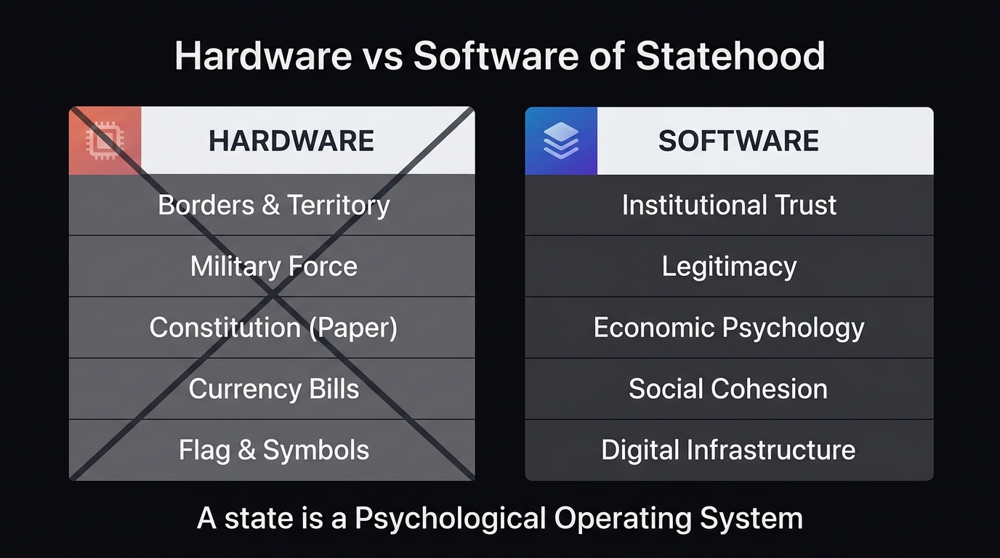
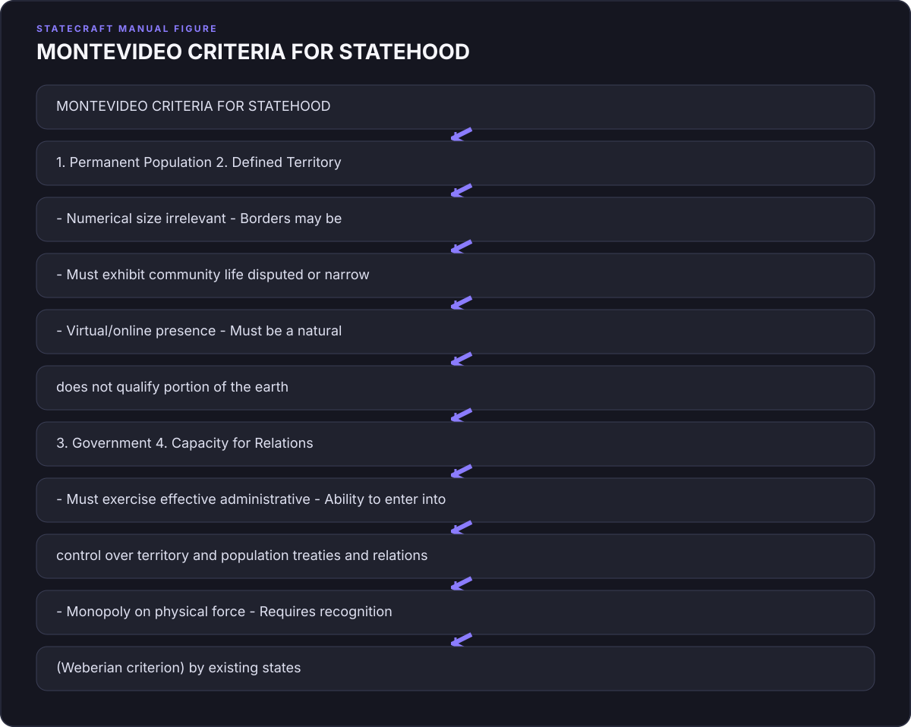
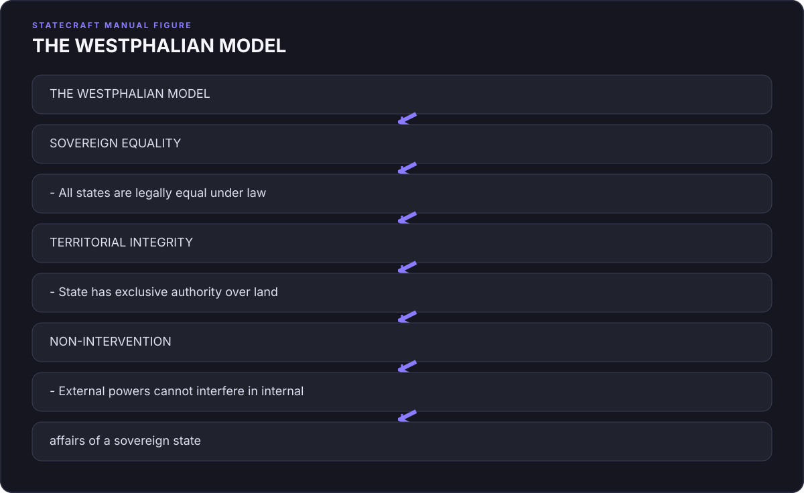
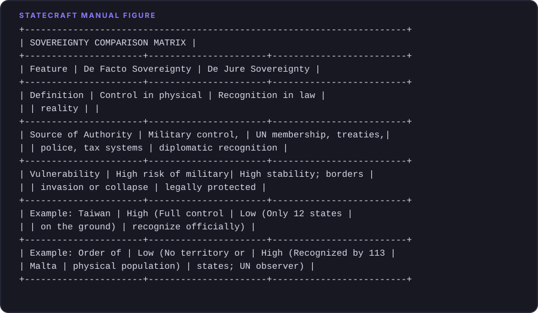

# Introduction: The Sandbox Fallacy

{#fig-hardware-software fig-align="center"}

## 1. The Hook: The Danube Anomaly

If you travel to the borderlands where Croatia meets Serbia, about halfway between the cities of Zagreb and Belgrade, you will find yourself in a landscape that feels suspended in time. Here, the Danube River flows slow and heavy, a muddy artery cutting through low-lying floodplains, dense willow forests, and silent marshes. The air in summer is thick with humidity and the high-pitched hum of millions of mosquitoes. It is a quiet place, where the only sounds are the occasional call of a heron and the gentle lapping of the river against the clay banks. But in the spring of 2015, this damp, forgotten corridor of Eastern Europe suddenly became the center of a bizarre global drama.

At the heart of this drama was a seven-square-kilometer pocket of land known as Gornja Siga. In the local dialect, it means "upper tufa," referring to the porous limestone deposits found along the riverbank. Gornja Siga is a peninsula of sorts, bounded on three sides by a wide, sweeping bend of the Danube and on the fourth by a drainage canal. It has no paved roads, no running water, and no electricity. For decades, its only inhabitants were wild boars, deer, and the occasional fisherman seeking shelter from a sudden storm. 

But Gornja Siga possessed one attribute that made it unique on the surface of the earth. Due to a historical quirk of cartography and post-war diplomacy, it was unclaimed. 

To understand how a piece of land in the heart of Europe could belong to no one, you have to go back to the nineteenth century. Under the Austro-Hungarian Empire, engineers undertook a massive project to straighten the winding course of the Danube. The river, which had previously looped and meandered across the landscape like a discarded ribbon, was channeled into a cleaner, more navigable bed. In doing so, the engineers inadvertently created a geographical puzzle. 

When the Socialist Federal Republic of Yugoslavia dissolved in the early 1990s, the newly independent republics of Croatia and Serbia had to draw their borders. Croatia argued that the border should follow the old meanders of the river, as recorded in the Austro-Hungarian cadastral land registry. This would give Croatia several large pockets of land on the Serbian side of the river. Serbia, on the other hand, argued that the border should follow the current, straightened course of the Danube. 

This disagreement created a series of territorial mismatches. If you accepted the Serbian claim, certain parcels of land belonged to Serbia. If you accepted the Croatian claim, they belonged to Croatia. But Gornja Siga was different. Because of the mismatch, it fell into a diplomatic blind spot. Serbia, following the straightened river, declared that Gornja Siga—which lay on the west bank of the river, the Croatian side—was Croatian territory. Croatia, sticking to the old cadastral map, insisted that the land belonged to Serbia. Neither country wanted to claim it, because doing so would undermine their broader legal arguments for the rest of the disputed border. 

In the language of international law, Gornja Siga had become *terra nullius*—no man's land. It was a blank spot on the map, a tiny tear in the fabric of global sovereignty.

Enter Vít Jedlička.

Jedlička was a thirty-one-year-old Czech politician and activist, a man with a round face, a quick smile, and a relentless, boyish energy. He was a devout believer in the principles of libertarianism, a political philosophy that views state intervention as the root of most human suffering. For years, Jedlička had fought within the mainstream Czech political system, running for office and writing articles decrying high taxes, government regulation, and the bureaucratic overreach of the European Union. But he had grown frustrated. He felt that the modern state was an inescapable, self-replicating machine. No matter who you voted for, the bureaucracy only grew larger, the tax codes longer, and the individual less free.

"I realized it was impossible to change the system from within," Jedlička would later reflect. "The state has too much inertia. If you want to show the world a better way, you have to start from scratch. You have to build a new model."

In early 2015, Jedlička was reading about territorial disputes on Wikipedia when he stumbled upon the Danube anomalies. He stared at the screen, transfixed. A piece of land in Europe that no state claimed. It was the ultimate blank canvas. 

On April 13, 2015—a date chosen because it was the birthday of Thomas Jefferson—Jedlička, his girlfriend Jana Markovičová, and a childhood friend loaded a modest car with a yellow-and-black flag, a folding table, a camera, and a bottle of champagne. They drove east from Prague, crossing the borders of Slovakia and Hungary, until they reached the muddy tracks that led into the floodplains of the Danube.

The journey to Gornja Siga was not a heroic march; it was a damp, exhausting struggle. The road quickly deteriorated into a swamp of deep clay. The car got stuck, forcing them to continue on foot. They hiked through dense undergrowth, their boots sinking into the wet earth, fighting off swarms of early-spring insects. After hours of walking, they reached a small clearing beneath a towering willow tree. 

Jedlička planted the flagpole in the soft soil. The flag he raised was simple: a yellow field representing libertarianism and individual liberty, split by a black stripe representing anarchy and the absence of state coercion. In the center was a coat of arms featuring a bird (symbolizing freedom) soaring above a river (the Danube) and a tree (representing growth and life). 

With the flag fluttering in the river breeze, Jedlička uncorked the champagne and made a declaration. He proclaimed the establishment of the Free Republic of Liberland. Its motto was simple and uncompromising: *To live and let live*.

"We wanted to build a country where people could prosper without the heavy hand of the state," Jedlička said. "A place where taxes are voluntary, where regulation is minimal, and where the individual is truly sovereign."

If Jedlička had performed this ceremony twenty years earlier, it would have been nothing more than a quirky footnote, an eccentric weekend trip that ended when the champagne ran out. But Jedlička understood something fundamental about the modern world: in the digital age, a physical presence is only half the battle. The real territory is online.

The moment they returned to their hotel room, they launched the official Liberland website and posted photos of the flag-planting on Facebook. They issued a press release to international news agencies, declaring the birth of the world’s newest sovereign state and inviting people to apply for citizenship.

What happened next was a tipping point of the digital era.

The story was picked up by a local news portal, then by national newspapers in the Balkans, and within forty-eight hours, it had exploded across the global media. The BBC, CNN, *The New York Times*, and *Time* magazine all carried features on the young Czech who had founded a country in a swamp. 

To a world weary of economic stagnation, rising taxes, and political polarization, the idea of Liberland was intoxicating. It was the ultimate startup. 

Within three days, the Liberland website crashed under the weight of traffic. Within a week, Jedlička had received over 200,000 applications for citizenship from every corner of the globe. Within a month, that number had grown to half a million. Engineers in Silicon Valley, doctors in Turkey, entrepreneurs in Germany, and refugees in Syria all applied to become "Liberlanders." 

Volunteers emerged to draft a constitution based on the ideas of the American founding fathers and Swiss direct democracy. A virtual economy began to take shape, complete with a native cryptocurrency called the Merit. People offered to donate boats, solar panels, and building materials to help construct the new capital city, to be named Liberpolis.

For a brief, shining moment, it seemed as if the old rules of geography and power had been rewritten. The internet had democratized the state. If you could build a virtual community of half a million people, who cared about the mud and the mosquitoes? The digital republic had arrived.

---

## 2. The Pivot: The Arrest on the Riverbank

On May 9, 2015, less than a month after the flag-planting, Vít Jedlička was feeling confident. He had spent the preceding weeks traveling across Europe, giving interviews, meeting with potential investors, and basking in the glow of international celebrity. He had become a head of state in exile, a president without a palace but with a massive, loyal online following. 

Now, he decided, it was time to return to his country. He wanted to establish a permanent camp on Gornja Siga, to begin the physical transformation of the swamp into a libertarian utopia.

Jedlička and a small group of supporters chartered a boat in the Hungarian town of Mohács and began sailing south down the Danube. They carried tents, generators, and food supplies. As the boat neared the bend of the river where Liberland lay, the mood was celebratory. They were the pioneers of a new age, preparing to settle the last free land in Europe.

But as the boat approached the shore of Gornja Siga, a sleek, blue-and-white patrol boat surged out from the reeds. On its side were the words *Policija*—the Croatian border police. 

The officers on the patrol boat did not look like they were interested in libertarian philosophy. They were armed, professional, and stone-faced. They intercepted Jedlička’s vessel, ordered him to step onto Croatian soil, and immediately placed him under arrest. 

The self-proclaimed president of Liberland was put into the back of a police van, driven to the small Croatian town of Beli Manastir, and locked in a holding cell. The next morning, he was brought before a local magistrate, charged with illegally crossing the state border.

The courtroom scene was a masterpiece of legal absurdity. 

Jedlička’s lawyers argued that he could not have committed a border offense because he had entered Gornja Siga, a territory that Croatia officially claimed was *not* part of Croatia. If the land did not belong to Croatia, how could the Croatian police arrest someone for entering it? The Croatian government’s position was equally convoluted: they insisted that the land was not Croatian, but it was also not *terra nullius*. It was, they claimed, a "disputed zone" under temporary Croatian administrative control, and they were legally obligated to secure it as the external border of the European Union.

The magistrate was unimpressed by the philosophical arguments. Jedlička was found guilty, fined 2,400 Croatian kunas, and released. Over the following months, the pattern repeated itself. Whenever Liberland volunteers tried to land on the peninsula—by boat, by foot, or even by swimming—they were met by Croatian police, arrested, fined, and sometimes jailed. The Croatian authorities established a permanent checkpoint near the site and declared Gornja Siga a restricted military zone.

The arrest of Vít Jedlička is the point where the romantic myth of the accidental founder collides head-on with the cold, unyielding machinery of the international system. It is the moment where we must pivot from the internet to the law library, from the ideals of freedom to the hard reality of power.

To understand why Liberland stalled on the muddy banks of the Danube, we must look at the legal framework that defines what a state actually is. 

For nearly a century, the gold standard for statehood has been the Montevideo Convention on the Rights and Duties of States, signed in Uruguay in 1933. The convention was a product of a specific historical moment—an attempt by the nations of the Americas to establish clear, objective rules that would prevent stronger powers (namely the United States) from arbitrarily declaring which governments were legitimate and which were not.

Under Article 1 of the Montevideo Convention, a state as a person of international law should possess the following qualifications:
1. A permanent population;
2. A defined territory;
3. A government; and
4. The capacity to enter into relations with other states.

At first glance, Jedlička’s Liberland seemed to have a plausible claim to all four. 
*   **Territory**: Gornja Siga was a defined, seven-square-kilometer parcel of land.
*   **Population**: While no one lived there permanently, over 500,000 people had signed up for citizenship online, forming a committed community.
*   **Government**: Liberland had a president, a cabinet, a constitution, and a set of laws.
*   **Capacity for Relations**: Jedlička was actively writing letters to foreign governments, setting up representative offices, and lobbying diplomats.

But the Montevideo Convention is not a self-executing checklist. It is a legal framework that exists within a political reality. And that reality was defined long before 1933 by a German sociologist named Max Weber.

In January 1919, in the chaotic aftermath of the First World War, Weber delivered a lecture at Munich University titled *Politik als Beruf* (Politics as a Vocation). In it, he laid out a definition of the state that has remained the bedrock of political science ever since. 

A state, Weber argued, cannot be defined by its ends or its ideals. It can only be defined by the specific means that are peculiar to it: physical force. 

"A state," Weber wrote, "is a human community that (successfully) claims the *monopoly of the legitimate use of physical force* within a given territory."

Note the words Weber uses: *successfully*, *monopoly*, and *physical force*. 

The Montevideo Convention describes the outward symptoms of a state, but Weber describes its DNA. A state does not exist because it has a constitution or a population list on a server. A state exists because it has the physical capability to exclude others from its territory, and because its neighbors recognize its right to do so. 

When the Croatian police officer stepped onto the bank of Gornja Siga and put handcuffs on Vít Jedlička, he was demonstrating Weber’s monopoly in action. Croatia did not need to win the intellectual argument about who owned Gornja Siga. Croatia had the boats, the guns, the courts, and the prisons. Croatia had the monopoly on physical force. Liberland had a website. 

In the struggle between the digital checklist and the physical monopoly, the monopoly wins every single time.

---

## 3. The Investigation: The Sandbox Fallacy

The story of Liberland is not unique. It is part of a long, colorful history of people who have tried to build their own countries, only to find themselves crushed by the physical and legal reality of the international system. 

To understand why these attempts fail, we have to examine a cognitive bias that is particularly common among modern founders: the Sandbox Fallacy.

In the world of software development, a "sandbox" is a safe, isolated environment where programmers can test new code, build applications, and run experiments without the risk of damaging the host operating system. If something goes wrong in the sandbox, you simply delete the instance and start over. There are no legacy databases to corrupt, no dependencies to break, and no real-world consequences.

The Sandbox Fallacy is the belief that the physical world contains sandboxes. 

It is the assumption that if you can find a piece of land that is unclaimed, or a reef that is submerged, or an old military platform in international waters, you have found a blank space where you can write your own political operating system from scratch. It is the belief that the state is a modular, plug-and-play technology.

But the physical world has no sandboxes. Every square inch of the earth is already written in deep, messy, historical legacy code. 

When a modern founder looks at a map and sees a blank space, they are seeing a map projection, not the reality of power. Modern borders are not lines drawn on a piece of paper; they are relational networks of agreements, treaties, and military alliances. They are kept in place because the states on either side have agreed, through decades of negotiation and often violence, that those lines serve their mutual interests.

Consider the physical reality of how borders are actually defended. It is rarely about high walls and barbed wire. It is about administrative consensus. 

If you walk across the border between France and Belgium today, there are no guards, no passports, and no fences. You only know you have crossed because the road signs change language. But this border is not soft; it is incredibly hard. It is backed by the entire weight of the European Union, the Schengen Agreement, and the mutual recognition of two sovereign governments. If you try to build a cabin in the middle of that border and declare it a new country, you will not be met by a military force; you will be met by a local building inspector and a police car. The state's monopoly on force is so complete that it does not even need to be visible.

When we compare Liberland's failure to other historical micronation attempts, we see the Sandbox Fallacy play out in three distinct ways.

### Case 1: The Loophole Strategy (Sealand)

The most famous micronation in the world is the Principality of Sealand. In 1967, a former British army major named Roy Bates took over HM Fort Roughs, a derelict anti-aircraft platform built by the British government during the Second World War. The platform sat in the North Sea, roughly seven miles off the coast of Suffolk, England. 

Bates’s strategy was built on a legal loophole. At the time, British territorial waters only extended three miles from the coast. Fort Roughs sat in international waters. Because the platform was abandoned and outside the jurisdiction of any state, Bates argued it was *terra nullius*, and that he could legally occupy it and declare it a sovereign principality.

For a while, the loophole held. In 1968, when the British navy tried to evict Bates, his son Michael fired warning shots from the platform. The British government brought Bates to court, but the judge ruled that because the incident occurred outside territorial waters, the court had no jurisdiction. Sealand had won its first legal battle.

But Sealand’s sovereignty was an illusion. In 1978, a German businessman who had been appointed "prime minister" of Sealand staged a coup, taking Michael Bates hostage. Roy Bates hired a helicopter, launched a counter-offensive, and retook the platform, holding the German businessman captive. The German government sent a diplomat from its London embassy to the platform to negotiate the hostage's release. 

Bates claimed this visit was *de facto* recognition of Sealand's sovereignty by Germany. But the international club was unimpressed. When the UK government eventually extended its territorial waters to twelve miles in 1987, Sealand found itself inside British territory. The UK chose to ignore Sealand rather than evict it, viewing it as a harmless tourist curiosity. Sealand survived not because it was sovereign, but because it was too small and insignificant for the British state to bother crushing it. The loophole had not created a state; it had created a hostage to tolerance.

### Case 2: The Engineering Strategy (The Republic of Minerva)

In the early 1970s, a Lithuanian-American real estate millionaire named Michael Oliver decided to bypass the problem of finding unclaimed land by building his own. 

Oliver was a radical libertarian who wanted to create a society free from taxes and government regulations. He identified the Minerva Reefs, a pair of submerged coral reefs in the Pacific Ocean, south of Fiji and Tonga. The reefs were underwater at high tide, meaning they did not belong to any country. 

Oliver’s organization, the Ocean Life Research Foundation, raised millions of dollars. They sent a ship to the reefs and began dumping tons of sand and gravel to raise the land above sea level. They constructed a small stone tower, planted a flag featuring a torch, and declared the Republic of Minerva in January 1972. They even minted their own silver currency, the Minerva dollar.

The reaction of the neighboring states was immediate and hostile. 

The Kingdom of Tonga, a Pacific island nation, did not care about the libertarian theory of *terra nullius*. They saw an artificial island being built in their economic backyard, and they viewed it as a threat. In June 1972, King Tāufaʻāhau Tupou IV of Tonga issued a royal proclamation claiming the Minerva Reefs. 

Tonga sent a small military force on a royal vessel to the reefs. They landed on the artificial sandbar, hauled down the Minerva flag, and raised the Tongan flag. The Tongan parliament ratified the annexation, and the South Pacific Forum formally recognized Tonga’s claim. 

Oliver and his supporters, having no military capability, could do nothing. The Republic of Minerva vanished beneath the waves, swallowed by the physical force of a neighboring kingdom. The engineering strategy had failed because Oliver had forgotten that physical land, once created, must be physically defended.

### Case 3: The Legalistic Strategy (The Principality of Hutt River)

In 1970, an eccentric wheat farmer named Leonard Casley found himself in a bitter dispute with the government of Western Australia over wheat production quotas. Casley faced ruin because the state had introduced strict limits on the amount of wheat he could sell. 

Instead of filing a lawsuit, Casley decided to secede. 

He studied British and Australian constitutional law and identified what he believed was a legal loophole. He argued that under the British Treason Agreement Act of 1495, a subject had the right to secede from the Crown if the monarch failed to protect them. Casley declared his 75-square-kilometer farm to be the Principality of Hutt River, appointed himself Prince Leonard, and declared independence from Australia.

For fifty years, the Australian government’s response was a masterclass in administrative containment. They did not send the army to evict Prince Leonard. Instead, they treated him with a cold, bureaucratic silence. 

They did not recognize his passport, they did not allow him to run his own post office, and they insisted that he was still subject to Australian tax laws. When Casley stopped paying income tax, the Australian Taxation Office quietly built a case against him. 

For decades, the dispute simmered. Hutt River became a quirky tourist attraction, selling its own stamps and currency to visitors. But the administrative machinery of the Australian state never stopped grinding. 

In 2017, the Supreme Court of Western Australia ordered the Principality to pay $3 million in unpaid taxes. Prince Leonard’s son and successor, Prince Graeme, was forced to announce the dissolution of the Principality in August 2020. The farm was sold to pay the tax bill. The legalistic strategy had failed because Casley had confused the complexity of legal arguments with the raw power of administrative enforcement.

---

| Attempt | Strategy | Primary Loophole / Method | Failure Mode | Outcome |
| :--- | :--- | :--- | :--- | :--- |
| **Liberland** (2015) | The Geopolitical Gap | Territorial dispute between Croatia and Serbia (*terra nullius*) | Intercepted by Croatian police exercising administrative control | Exists only online; territory inaccessible |
| **Sealand** (1967) | The Maritime Loophole | Military platform in international waters outside 3-mile limit | Tolerate-but-ignore policy; territorial waters eventually extended | Harmless tourist curiosity; no real sovereignty |
| **Minerva** (1972) | The Engineering Feat | Dredging submerged reefs in the South Pacific | Military annexation by the Kingdom of Tonga | Land reclaimed by the sea and Tongan sovereignty |
| **Hutt River** (1970) | The Legalistic Secession | Wheat quota dispute; interpretation of 1495 Treason Act | Administrative enforcement of tax laws | Sovereign claim dissolved to pay Australian tax debt |

---

What these stories teach us is that sovereignty is not a game of legal hide-and-seek. You cannot find a loophole so clever that the state will simply shrug its shoulders and let you walk away with a piece of its territory. 

The state is not a computer program that can be hacked. It is a social, historical, and physical reality. If you want to build a country, you cannot ignore the legacy code. You must learn how to write it.

---

## 4. The Manual Page: Technical Reference

{#fig-chapter-0-intro-01-statecraft-manual-section-0-foundatio fig-align="center"}

### I. The Montevideo Convention Criteria (1933)

The Montevideo Convention on the Rights and Duties of States remains the primary treaty governing the definition of statehood under public international law. While signed as a regional treaty in the Americas, its Article 1 is widely accepted as reflective of customary international law.

{#fig-chapter-0-intro-02-montevideo-criteria-for-statehood fig-align="center"}

#### Legal Interpretations & Operational Constraints

1.  **Permanent Population**: The population must inhabit the territory with the intent of permanent residence. A transient or purely virtual population is legally insufficient. Under custom, there is no minimum population requirement (e.g., Vatican City has fewer than 1,000 residents), but the population must have a physical presence and an organized social structure within the territory.
2.  **Defined Territory**: The territory must be a natural portion of the earth's surface. Artificial islands, oil platforms, or digital domains do not constitute territory under public international law. Border disputes with neighboring states do not invalidate statehood (e.g., Israel’s borders are disputed, yet its statehood is recognized), but there must be a stable, recognizable core territory.
3.  **Government**: The government must exhibit **effective control** over the territory. This means it must possess the administrative capacity to enforce laws, collect taxes, maintain public order, and exclude unauthorized actors. The government must be independent of foreign control.
4.  **Capacity to Enter into Relations**: This criterion is deeply tied to the concept of **Recognition**. A state cannot enter into relations if no other state is willing to receive its diplomats or sign treaties with it.

#### Theoretical Perspectives: Declaratory vs. Constitutive Theories

In international law, two competing schools of thought explain how a state achieves sovereignty:

*   **The Declaratory Theory**: This theory, explicitly endorsed by Article 3 of the Montevideo Convention, states that the political existence of a state is independent of recognition by other states. If a territory meets the four criteria of Article 1, it is a state. Recognition is merely a "declaration" of an existing fact.
*   **The Constitutive Theory**: This theory argues that a state only becomes a person of international law through the act of **recognition** by other states. Under this view, even if an entity has a population, territory, and government, it is not a state until the existing members of the international club choose to recognize it. In practice, the constitutive theory dominates modern geopolitics.

---

### II. Westphalian Sovereignty

Westphalian Sovereignty is the foundational organizing principle of the modern international system. It emerged from the Peace of Westphalia in 1648, which ended the Thirty Years' War in the Holy Roman Empire and the Eighty Years' War between Spain and the Dutch Republic.

{#fig-chapter-0-intro-03-the-westphalian-model fig-align="center"}

#### Core Tenets

1.  **Territoriality**: The state is tied to a specific geographic space. Within this space, the state's authority is absolute and exclusive. No external authority (such as the Pope or the Holy Roman Emperor) has jurisdiction within the state's borders.
2.  **Sovereign Equality**: Regardless of size, population, wealth, or military power, all sovereign states are legally equal in the international arena. A vote by Tuvalu in the UN General Assembly carries the same legal weight as a vote by the United States.
3.  **Non-Intervention**: States are legally prohibited from intervening in the domestic affairs of other sovereign states. This rule is designed to prevent stronger states from using internal political disputes as a pretext for invasion or regime change.

---

### III. De Facto vs. De Jure Sovereignty

The distinction between *de facto* (in fact) and *de jure* (in law) sovereignty is one of the most critical concepts for any founder to understand. It represents the divide between physical reality and legal recognition.

{#fig-chapter-0-intro-04-sovereignty-comparison-matrix fig-align="center"}

#### Operational Definitions

*   **De Facto Sovereignty**: The actual, physical exercise of power over a territory and population. An entity with *de facto* sovereignty has its own courts, police force, military, and tax collection mechanisms. It governs the territory in reality, regardless of whether the rest of the world recognizes its right to do so.
*   **De Jure Sovereignty**: The legal recognition of a state's sovereignty by the international community, typically formalized through diplomatic recognition and membership in the United Nations. An entity with *de jure* sovereignty has the legal right to govern, even if it does not have physical control over the territory (e.g., governments-in-exile during wartime).

#### Case Studies in the Sovereign Divide

1.  **Somaliland**: An absolute outlier of *de facto* sovereignty. Somaliland has met all the Montevideo criteria since 1991. It has a stable democracy, its own currency, and a professional military. Yet, it has zero *de jure* recognition. It is legally treated as a province of Somalia. Because it lacks *de jure* status, Somaliland cannot access loans from the World Bank, sign official trade treaties, or purchase modern defensive weaponry.
2.  **Taiwan (Republic of China)**: A highly successful, high-tech nation of 23 million people with complete *de facto* sovereignty. However, because of the geopolitical influence of the People's Republic of China, Taiwan's *de jure* sovereignty is suppressed. It exists in a diplomatic twilight zone, relying on informal relationships and defensive alliances to protect its physical autonomy.
3.  **The Sovereign Military Order of Malta (SMOM)**: A mirror image of Somaliland. The Order has no territory and no population, meaning it has zero *de facto* sovereignty. Yet, it enjoys *de jure* sovereignty, maintaining diplomatic relations with 113 states and issuing passports that are honored worldwide. It is a legal ghost that exists in the diplomatic ledger but not on the physical map.

---

![[END OF SECTION 0]](../assets/diagrams/manual-blocks/chapter_0_intro-05-end-of-section-0.svg){#fig-chapter-0-intro-05-end-of-section-0 fig-align="center"}
