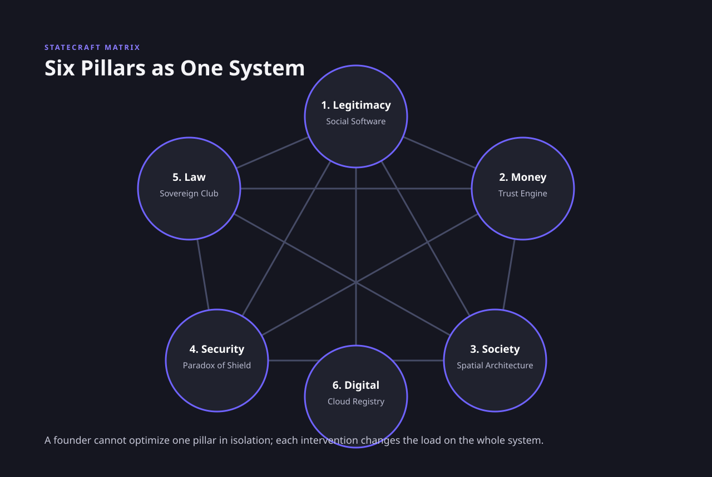

# Conclusion: The Architecture of the Accidental State

## I. The Hook: The Shifting Sands of Gornja Siga

In the spring of 2015, a thirty-one-year-old Czech libertarian and former financial analyst named Vít Jedlička did something that most of us have only ever contemplated in the quiet hours of a restless Sunday afternoon. He found a blank space on the map, drove to it, and declared himself president. 

The space in question was a seven-square-kilometer patch of marshy woodland on the west bank of the Danube River, known locally as Gornja Siga. Because of a historical cartographic quirk following the breakup of Yugoslavia—where Croatia claimed borders based on old cadastral registries and Serbia claimed borders based on the shifting, natural flow of the river—neither country officially claimed Gornja Siga. Under the long-standing doctrines of international law, Gornja Siga was *terra nullius*. No man's land. 

Jedlička, a man of quick smiles and boundless ideological enthusiasm, saw Gornja Siga not as a muddy floodplain, but as a blank canvas. He planted a flag, declared the birth of the Free Republic of Liberland, launched a sleek website, and drafted a constitution that banned taxation except on a strictly voluntary basis. Within weeks, the server hosting Liberland’s portal crashed under the weight of half a million citizenship applications. It was a modern fairy tale of the digital age: a country created out of nothing more than a flag, an unclaimed sandbar, and an internet connection. It was the ultimate expression of what we might call the *Sandbox Fallacy*—the seductive belief that a state is a modular, plug-and-play playground that can be assembled from scratch if you simply have enough passion, a clean slate, and a fast server.

But then, the world intervened. 

When Jedlička and a small band of pioneer-citizens attempted to physically occupy their new homeland, they were not met by Serbian or Croatian bureaucrats offering diplomatic handshakes. They were met by the Croatian police. The officers did not claim Gornja Siga belonged to Croatia; they simply arrested anyone who tried to step foot on it. Serbia, too, issued a dry statement clarifying that while they did not claim the territory, they would not tolerate the establishment of a foreign state on their border. Jedlička found himself banned from the very land he claimed to govern, relegated to hosting cabinet meetings in cheap hotels in neighboring towns, running a country that existed entirely on a hard drive in his backpack.

What Jedlička had run into was not a legal dispute, but the hard, unforgiving wall of human coordination. He had treated the state as a software package—something you could code, debug, and upload to the cloud. But a state is not software. Or rather, it is a piece of software that cannot run without a massive, heavy, and incredibly complex set of physical hardware. 

To understand why Jedlička failed, and why the task of building a country is so deceptively difficult, we have to look to another corner of the world, where another group of accidental founders faced a problem that was the exact opposite of Gornja Siga. 

In 1991, the East African nation of Somalia ceased to exist in any meaningful sense. The dictatorship of Siad Barre collapsed, plunging the country into a horrific civil war. Mogadishu became a labyrinth of warring clans and rocket-propelled grenades. The international response was swift, expensive, and orthodox. Under the banner of the United Nations and backed by billions of dollars, the world’s leading experts descended on the region. They held peace conferences in luxury hotels in Nairobi and Addis Ababa. They drafted impeccable, Western-style constitutions. They created parliaments, funded national armies, and appointed prime ministers. 

And every single one of those governments collapsed. The moment the UN peacekeepers left their fortified compounds, the institutions they built evaporated. The top-down, copy-paste state-building project did not bring stability; it brought decades of ruin.

But while the UN was failing in Mogadishu, a few hundred miles to the north, in the territory of Somaliland, a miracle was happening. Somaliland was a former British protectorate that had briefly merged with Italian Somalia. In the wake of the collapse, the local leaders declared their independence. They received no UN aid. No foreign peacekeepers secured their borders. Indeed, the international community actively refused to recognize their existence, viewing them as an illegal breakaway province. 

Yet, over the next three decades, Somaliland built a stable, peaceful, and functioning democracy. They held regular democratic elections with biometric voter registration. They created their own currency, the Somaliland shilling, and established a functioning police force and judiciary. Today, capital city Hargeisa is one of the safest cities in East Africa.

How did Somaliland succeed where the multi-billion-dollar UN apparatus failed? 

The answer lies under the shade of the acacia trees. 

Instead of gathering in air-conditioned conference rooms in foreign capitals, the founders of Somaliland gathered in the dust of their own villages. They held a series of grand clan conferences, or *shir*, that lasted for months. They did not try to copy-paste the constitutional machinery of a European democracy. Instead, they looked to their own traditional legal system, known as *Xeer*, which had governed the pastoralist clans for centuries. *Xeer* is a polycentric legal system where disputes are resolved not by central judges, but by negotiation and compensation between clan groups, overseen by elders.

Somaliland's founders realized something profound: they could not erase the clan system and replace it with a modern bureaucracy. If they tried, the bureaucracy would have no legitimacy. So they did something counter-intuitive. They integrated them. They created a hybrid parliament. The lower house, the House of Representatives, is elected by direct popular vote, representing modern democratic aspirations. But the upper house, the *Guurti*, is composed entirely of traditional clan elders. The *Guurti* acts as a constitutional anchor. If a political crisis arises, it is not resolved by a constitutional court using foreign legal texts; it is resolved by the *Guurti* using traditional negotiation methods. 

Legitimacy, the Somalilanders proved, cannot be imported. It must be grown from the soil.

This is the central paradox that links all accidental founders. The state-builder is constantly trying to balance the abstract with the physical, the imaginary with the real. Consider Siim Kallas in the summer of 1992. He was the president of the Bank of Estonia, a country that had just broken free from the Soviet Union. The Russian rouble was undergoing hyperinflation, losing value by the hour. Estonia had no control over its monetary policy; Moscow controlled the printing presses. The country was flooded with worthless paper money. Shops were empty, fuel was strictly rationed, and people stood in long lines just to buy bread. 

Kallas knew that political independence was an illusion without monetary independence. Estonia needed its own currency: the Kroon. But Kallas faced a psychological puzzle. A currency is, at its core, a collective hallucination. A piece of paper has value only because we believe others will accept it. Why would anyone trust a brand-new currency issued by a tiny, impoverished Baltic country with no foreign reserves and no track record? 

Kallas’s solution was to look backward. Before the Soviet occupation of 1940, the pre-war Republic of Estonia had deposited its national gold reserves in Western banks—specifically the Bank of England, the Swedish Riksbank, and the Bank for International Settlements in Switzerland. For fifty-two years, those banks had frozen the gold. Now, Kallas demanded it back. The Western governments agreed, and Estonia suddenly found itself in possession of 11.3 tons of physical gold. 

But Kallas did not spend the gold. Instead, he used it as a psychological shield. He established a Currency Board, pegging the new Kroon to the German Deutsche Mark at a fixed rate of 8 to 1. The law was absolute: the Bank of Estonia could not issue a single Kroon unless it had the physical reserves to back it. The psychological effect was immediate. By tying their currency to the strongest economy in Europe, Estonia imported the credibility of the German Bundesbank. Inflation plummeted, foreign investment flooded in, and the Kroon became the foundation of the Estonian economic miracle.

But what happens when the challenge is not trust in money, but trust in each other? 

In July 1964, Singapore was a powder keg. The tiny island was a dense, volatile patchwork of ethnic enclaves—Chinese shophouses in Chinatown, Malay stilt houses in Geylang, Indian quarters in Little India. There was almost no interaction between the groups. When a minor clash occurred during a religious procession, ethnic riots tore through the city, leaving thirty-six people dead and hundreds injured. A year later, when Singapore was expelled from the Federation of Malaysia, its prime minister, Lee Kuan Yew, wept on national television. He was the leader of a country that was not a country, but a collection of immigrant communities who had no common language, no natural resources, and a deep, simmering hatred for one another.

Lee Kuan Yew realized that you could not build a national identity through speeches and flags alone. You had to build it into the physical architecture of the city. He used the Housing and Development Board (HDB) to execute a radical social experiment: the Ethnic Integration Policy of 1989. The government cleared the slums, but they did not allow residents to resettle in their old ethnic enclaves. Instead, they enforced strict ethnic quotas in every single public housing block. If a block exceeded its Malay or Chinese quota, no flat could be sold to a member of that group. 

It was an authoritarian restriction on property rights, but the social consequences were transformative. A Chinese teacher, a Malay port worker, and an Indian accountant were forced to live on the same corridor. Their children played in the same playgrounds. They ate at the same hawker centers. The physical proximity forced a psychological proximity. Singapore did not build a nation by celebrating diversity in isolation; they built a nation by making isolation physically impossible.

And then there is the question of survival itself. How does a state protect itself in a hostile world? 

On December 1, 1948, the provisional president of Costa Rica, José Figueres Ferrer, walked up to the stone wall of the Cuartel Bellavista military fortress in San José. He lifted a heavy sledgehammer and struck the wall, sending plaster flying. He announced that Costa Rica was abolishing its national army. 

In 1948, this was considered suicidal. The Cold War was freezing the globe, and Central America was a landscape of military dictatorships, coups, and civil wars. Yet, while its neighbors spent the next half-century tearing themselves apart with tanks and death squads, Costa Rica remained a stable, peaceful democracy. By dismantling the military, Figueres did not make the country vulnerable; he made it secure. He eliminated the primary engine of domestic coups, redirected the military budget into public education and healthcare, and relied on the Rio Treaty of 1947 to guarantee international protection. Costa Rica proved that sometimes, the ultimate shield is the absence of a sword.

Finally, we must confront the strange, legalistic theater of sovereignty. Consider the Sovereign Military Order of Malta. The Order has no territory. Its "population" consists of a few dozen members living in a baroque palace on the Via Condotti in Rome and a villa on the Aventine Hill. Yet, under international law, it is a sovereign entity. It prints stamps, mints coins, issues license plates, and grants diplomatic passports that are recognized by over a hundred nations. It has a seat as a permanent observer at the United Nations. 

Now, contrast the Order of Malta with Taiwan. Taiwan has twenty-three million people, a defined territory, a modern high-tech military, a booming democratic economy, and control over the world’s most advanced semiconductor supply chains. Yet, Taiwan is a legal ghost. It is excluded from the United Nations, unrecognized by all but a handful of countries, and barred from using its own name at the Olympics. 

Sovereignty, it turns out, is not a physical attribute. It is a social construct. It is a club, and the gatekeeper is the collective consensus of the other members. 

What links all of these stories—from the mud of Gornja Siga to the acacia trees of Somaliland, from the gold vaults of Tallinn to the high-rises of Singapore, from the fortress walls of San José to the baroque palaces of Rome—is a singular, radical truth. A state is not a natural occurrence. It is not a feature of the landscape. It is a highly artificial, incredibly fragile coordination game. And the accidental founder is someone who, by choice or by necessity, is forced to sit down at the board and play.

***

## II. The Pivot: The Statecraft Matrix

To play the game of statecraft successfully, one must abandon the illusion of linear causality. In the world of business, we are taught to think in terms of inputs and outputs: if you build a better product, you will attract customers; if you optimize your supply chain, you will increase your margins. But in the architecture of a country, there are no independent variables. 

Instead, a state is governed by what we can call the **Statecraft Matrix**: a closed, highly sensitive system of six core pillars that are bound together in a continuous web of feedback loops. These six pillars are:

1. **Legitimacy** (The Social Software)
2. **Money** (The Trust Engine)
3. **Society** (The Spatial Architecture)
4. **Security** (The Paradox of the Shield)
5. **Law** (The Sovereign Club)
6. **Digital Infrastructure** (The Cloud Registry)

In the matrix, you cannot touch one pillar without vibrating the other five. If you attempt to manipulate a single lever in isolation, the system will self-correct, often with catastrophic consequences for the founder. 

{#fig-statecraft-matrix fig-align="center"}

Consider the relationship between **Legitimacy** and **Money**. The standard textbook economics view is that a currency is backed by the productive capacity of an economy. But as Estonia’s Siim Kallas understood, a currency is actually backed by *trust*. If a population does not believe in the legitimacy of the state, they will not hold its currency. They will dump it for dollars, gold, or stablecoins, triggering a run that destroys the state’s fiscal capacity. Conversely, if a currency collapses—as the rouble did in Estonia in 1991—it drags down the legitimacy of the government with it. Hyperinflation is not just an economic metric; it is a political acid that dissolves the social contract. Estonia’s Currency Board was not merely a monetary tool; it was a legitimacy machine. By tying the Kroon to the Deutsche Mark, Kallas was outsourcing Estonia’s monetary legitimacy to a country that already possessed it.

Now, trace the loop from **Money** to **Society**. A state’s economic policy is the architect of its social geography. In Singapore, Lee Kuan Yew did not treat housing as a welfare program; he treated it as a nation-building mechanism. By using state funds to build public housing and then implementing strict ethnic quotas, the state manipulated the physical spaces where citizens interacted. This spatial engineering (Society) had a direct impact on the stability of the currency (Money) and the economy. A city divided into hostile, segregated ethnic enclaves is a city prone to riots. Riots destroy businesses, scare away foreign capital, and devalue the currency. By forcing integration in the apartment corridors, Singapore secured its social peace, which in turn secured its economic credibility. The apartment lottery was the prerequisite for the Singapore Dollar’s stability.

But how do you protect that social peace and spatial integrity? This brings us to the friction between **Security** and **Law**. The conventional instinct of the state-builder is to build a massive wall—to invest in the tools of violence to deter external threats. But as Costa Rica demonstrated, a standing army is a highly volatile instrument. In a developing state with fragile institutions, a military is far more likely to turn its guns inward (destroying internal Legitimacy and Society) than to defend the borders against a foreign invader. Costa Rica resolved this by replacing physical security with legal security. They traded their army for a treaty. They realized that in the modern international system, **Law** (membership in the sovereign club and mutual defense pacts) could act as a substitute for physical **Security**. 

This trade-off, however, is only possible if the state has already secured its entry into the sovereign club. Taiwan, which has a massive military and a highly sophisticated society, remains insecure because it lacks international legal recognition. It is a giant without a birth certificate. The Sovereign Military Order of Malta, conversely, has no military and no land, yet it is secure in its sovereignty because it possesses the legal recognition of the club. 

In the twenty-first century, a new pillar has entered the matrix: **Digital Infrastructure**. Estonia’s transition to a digital state represents a fundamental realignment of the matrix. By building the X-Road and creating e-Residency, Estonia decoupled the state registry from physical territory. If a state’s land registry, treasury, and citizen database are decentralized across global servers with diplomatic immunity (Data Embassies), the physical occupation of the territory (Security) no longer means the death of the state. 

This digital infrastructure, in turn, rewrites the rules of **Legitimacy** and **Society**. An e-resident of Estonia lives in India, runs a company registered in Tallinn, pays taxes to the Estonian system, and signs contracts with partners in Brazil. The social contract is no longer bounded by geography. The state has become a service provider, and its legitimacy is determined not by historical narrative or ethnic cohesion, but by the uptime and security of its servers.

The lesson for the accidental founder is clear: you cannot build a country in parts. You cannot focus on security while ignoring the currency. You cannot draft laws that do not align with the spatial realities of your society. If you pull the lever of digital infrastructure, you must be prepared for it to reshape the nature of your legitimacy. The state is a clockwork mechanism; every gear is connected to the next. If you do not design for the matrix, the matrix will design you.

***

## III. The Investigation: The Future of Statecraft

If the twentieth century was defined by the expansion of the Westphalian club from a handful of colonial empires to nearly two hundred nations, the twenty-first century will test its rules to their limit. Our coordination systems are designed for a specific set of physical parameters: they assume that land is permanent, that humans are the sole authors of decisions, and that gravity keeps us bound to a single planet. 

But what happens when those parameters change? 

To understand the scale of the coming crisis, look to the Pacific Ocean, where Tuvalu is slowly drowning. A collection of nine low-lying atolls home to eleven thousand people, its highest point is just fifteen feet above sea level. By the end of this century, the entire country could be submerged. 

Under the Montevideo Convention, a state must possess a "defined territory" and a "permanent population." If Tuvalu’s land disappears beneath the waves, what happens to its statehood? 

In a traditional Westphalian world, the answer is simple: the state ceases to exist. A country without land is a contradiction in terms. But Tuvalu’s leaders are refusing to accept this legal death sentence. Instead, they have launched the "Rising Nations Initiative." They are digitizing their entire nation. They are mapping their islands in three dimensions, uploading their cultural heritage, their language, and their historical records to the cloud. More importantly, they are attempting to rewrite international law to recognize a new category: the *sovereign cloud state*. 

If Tuvalu moves its entire population to Fiji or Australia, but maintains its digital registry, its seat at the United Nations, its .tv top-level web domain (which funds a significant portion of its budget), and its sovereign authority over its exclusive economic zone, is it still a country? 

This is not a hypothetical question. It is the beginning of a fundamental decoupling of sovereignty from soil. If a state can survive as a legal and digital registry in the cloud, then the physical world is no longer the ultimate arbiter of nationhood. We are entering an era of "Virtual Westphalianism," where the landless state is no longer an anomaly like the Order of Malta, but a mainstream survival strategy. The accidental founder of the future may not be a pioneer planting a flag on a sandbar, but a digital archivist preserving a nation's ghost on a server in Luxembourg.

But if climate change threatens the physical foundation of the state, artificial intelligence threatens its cognitive foundation. 

Historically, the state has been managed by what we have called the "Bureaucratic Ghost"—the army of clerks, assessors, judges, and administrators who turn the abstract rules of the constitution into daily reality. Bureaucracy is a human technology, designed to solve the problem of scale. But it is slow, expensive, and prone to corruption. 

Now, imagine a state where the bureaucracy is run not by humans, but by decentralized autonomous agents powered by artificial intelligence. 

In this world, the land registry is a blockchain database. Disputes are resolved by algorithmic arbitration systems that parse legal precedents in milliseconds. Tax collection is automated, executed by smart contracts that monitor transactions in real time. The Currency Board is not run by economists like Siim Kallas, but by a predictive AI model that adjusts the money supply based on global macroeconomic feeds. 

This is not science fiction. It is the logical conclusion of Estonia’s e-Residency and X-Road. But it introduces a terrifying new question into the Statecraft Matrix: if you automate the state, where does **Legitimacy** reside? 

Legitimacy is a human relationship. It is built on trust, on shared culture, and on the belief that the ruler is accountable to the ruled. If the state is an algorithm, who do you appeal to when the system makes a mistake? When the AI judge denies your citizenship or the smart contract seizes your assets, you cannot negotiate under an acacia tree like the elders of Somaliland. You cannot strike the wall with a sledgehammer. The code is silent, and it is absolute. 

By replacing the human bureaucracy with algorithmic efficiency, we risk creating a state that is perfectly coordinated but completely detached from the society it governs. The accidental founder who builds an AI-driven network state may find that they have built a machine that runs flawlessly—but has no human citizens left inside it.

This tension between coordination and humanity reaches its absolute limit when we look beyond the Earth, to the prospect of private space colonization. 

In the near future, private corporations and charismatic billionaires plan to establish permanent human settlements on Mars and the Moon. These founders often fall victim to the ultimate version of the Sandbox Fallacy. They look at Mars and see the ultimate blank slate: a planet with no history, no existing populations, no borders, and no laws. They believe they can draft a new social contract from scratch, free from the red tape of Earth.

But Mars is not a sandbox. It is a vacuum. 

On Earth, the state does not control the air you breathe. It does not control the water that falls from the sky. The physical environment is a common good, provided by nature. But in space, the environment is entirely artificial. Every breath of oxygen, every drop of recycled water, every degree of heat, and every shield against solar radiation must be engineered and maintained by technology. 

And in a space colony, that technology will be owned by the company that built it. 

This creates a terrifying concentration of power. If the sovereign corporation controls the life support systems, it controls absolute power. There is no space for dissent, no room for strike or protest. If you disagree with the management, they do not need to send police to arrest you; they simply turn down the oxygen valve in your sector. 

In space, the **Security** pillar of the matrix is no longer about defending against external invaders. It is about the absolute control of the physical conditions of survival. 

How do you establish **Legitimacy** in an environment where survival depends on absolute obedience to a technical system? Can a private corporate colony ever transition into a true state, or will it inevitably devolve into a high-tech feudalism where the citizens are merely indentured servants of the life-support grid? 

The accidental space founder will learn, in the most brutal way possible, that you cannot build a society on technical coordination alone. Without the soft software of human rights, mutual trust, and democratic accountability, the colony will eventually suffer a catastrophic social collapse, long before the life-support machines fail.

What all of these trends point to is not the end of statehood, but the fragmentation of the Westphalian order. 

For nearly four hundred years, the nation-state has been the dominant unit of human organization. But the pressures of climate change, artificial intelligence, and space exploration are cracking the mold. We are likely to see a world of competing sovereign models: traditional nation-states clinging to their soil, landless cloud states representing displaced populations, algorithmic network states operating across borders, and corporate enclaves claiming sovereignty in space. 

The future of statecraft will not be defined by a single blueprint. It will be defined by a chaotic, experimental marketplace of governance. And the winners of that market will not be the ones with the biggest armies or the most data, but the ones who understand how to balance the delicate, interconnected clockwork of the Statecraft Matrix.

***

## IV. The Manual Page: The Accidental Founder's Checklist

If you are reading this manual, it is because you have decided to build a state. Perhaps you have found a sandbar on a river, perhaps you are building a digital community on a blockchain, or perhaps you are planning a city in a foreign desert. 

Before you plant your flag, write your constitution, or print your token, you must subject your project to a rigorous diagnostic test. The following checklist is designed to assess the viability of your state-building project across the six pillars of the Statecraft Matrix. 

Answer these questions honestly. If you cannot answer a question, or if your answer reveals a gap in your matrix, do not proceed. In the game of statecraft, an unbalanced matrix is a fatal flaw.

{#fig-chapter-11-conclusion-01-statecraft-viability-diagnostic fig-align="center"}

### Pillar 1: Legitimacy (The Social Software)
*Legitimacy is not imported; it must be grown from the soil of existing human relationships.*

*   **Question 1.1: What is your Cultural Anchor?** 
    What existing, pre-state social structures, traditions, or beliefs are you formalizing? (e.g., Somaliland’s *Guurti*). If you are building a state that ignores or attempts to erase the cultural software of your population, what is your plan for when the population rejects your hardware?
*   **Question 1.2: The Crisis Protocol.** 
    When your government makes a highly unpopular decision or faces a constitutional crisis, what is the non-coercive mechanism that prevents the state from splintering? Who is the trusted arbiter of last resort?
*   **Question 1.3: The Accountability Loop.** 
    How do the governed voice their dissent, and how does the system adapt to that dissent? If the only feedback mechanism is exit (leaving the state) or voice (protest), how do you prevent exit from draining your tax base and voice from turning into rebellion?

### Pillar 2: Money (The Trust Engine)
*Monetary sovereignty is the discipline to prove you do not need to print money.*

*   **Question 2.1: The Credibility Anchor.** 
    Why should a rational agent accept your currency or token in exchange for real goods? If you do not have decades of institutional track record, whose credibility are you leasing? (e.g., Estonia’s Currency Board).
*   **Question 2.2: The Capital Flight Test.** 
    If your currency loses 30% of its value tomorrow, what prevents your citizens from converting all their assets to a foreign reserve currency or cryptocurrency and leaving your system? Do you have the reserves to defend your peg?
*   **Question 2.3: The Fiscal Engine.** 
    How does the state extract value (taxes, transaction fees) to fund its public services? Is this extraction voluntary, automated, or coercive? If it is coercive, do you have the enforcement capacity to collect it without destroying your legitimacy?

### Pillar 3: Society (The Spatial Architecture)
*National unity is built on shared floors, not flags.*

*   **Question 3.1: The Segregation Prevention Mechanism.** 
    How will you prevent your citizens from self-segregating along economic, ethnic, or ideological lines in the physical or digital spaces you control? (e.g., Singapore’s Ethnic Integration Policy).
*   **Question 3.2: The Hawker Center Test.** 
    Where are the shared physical or digital spaces where different classes, groups, and ideologies are forced to interact, dine, and communicate on a daily basis? If these spaces do not exist, how will you prevent the formation of political echo chambers?
*   **Question 3.3: The Common Language.** 
    What is the shared medium of communication that binds your population together? If your citizens cannot understand each other’s stories, how do you expect them to coordinate in a crisis?

### Pillar 4: Security (The Paradox of the Shield)
*Sometimes, the ultimate shield is the absence of a sword.*

*   **Question 4.1: The Internal Threat Assessment.** 
    If you build a security force or a military, what prevents that force from turning its weapons inward and launching a coup? (e.g., Costa Rica’s demilitarization).
*   **Question 4.2: The Diplomatic Deterrent.** 
    If you do not have the military capacity to defeat your largest neighbor, what is the international legal or diplomatic treaty that makes the political cost of invading your territory too high for them?
*   **Question 4.3: The Life-Support Dependency (For Space/Hostile Environments).** 
    If you are building a state in an artificial environment, who owns and controls the life-support infrastructure? If it is owned by a corporate entity, how do you separate sovereign political power from the control of the air and water?

### Pillar 5: Law (The Sovereign Club)
*Territory is optional; recognition is mandatory.*

*   **Question 5.1: The UN Recognition Path.** 
    What is your realistic path to securing recognition from the United Nations or its member states? If you are locked out of the club, how will you protect your borders from being erased by recognized powers? (e.g., the Taiwan problem).
*   **Question 5.2: The Jurisdictional Interface.** 
    How does your legal system interface with the legal systems of the surrounding states? When a crime is committed across your borders, who has jurisdiction, and how do you execute extradition?
*   **Question 5.3: The Historical Precedent.** 
    What is the historical or legal legacy that justifies your claim to sovereignty in the eyes of international courts? (e.g., the Order of Malta’s historical legator status).

### Pillar 6: Digital Infrastructure (The Cloud Registry)
*Your territory can be occupied, but your database cannot.*

*   **Question 6.1: The Data Embassy Plan.** 
    If your physical territory is invaded and occupied tomorrow, where is your state registry backed up? Can your government continue to run, collect taxes, and verify identity from the cloud? (e.g., e-Estonia).
*   **Question 6.2: The Cyber-Security Shield.** 
    How do you protect your decentralized registries from state-sponsored cyberattacks or data corruption? If a foreign power hacks your citizen database and alters property records, how do you restore trust in the registry?
*   **Question 6.3: The Digital Divide.** 
    If 99% of your services are digital, how do you prevent the disenfranchisement of citizens who lack digital literacy, access, or connectivity? How do you maintain a physical anchor for your digital state?

***

## V. The Accidental Founder's Verdict

If your scores are high, your pillars balanced, and your coordination mechanisms robust, you may proceed. But do so with humility. 

Starting a country is not a sandbox game. It is a high-wire act where the safety net is spun from the very laws, currencies, and social ties you construct. The history of statecraft is littered with the ghosts of founders who ignored the plumbing. 

But for those who understand the matrix, design for the feedback loops, and build with the patience of the elders under the acacia tree, the prize is immortality. You are building the home where humanity will survive the storms of tomorrow. Welcome to the club.

