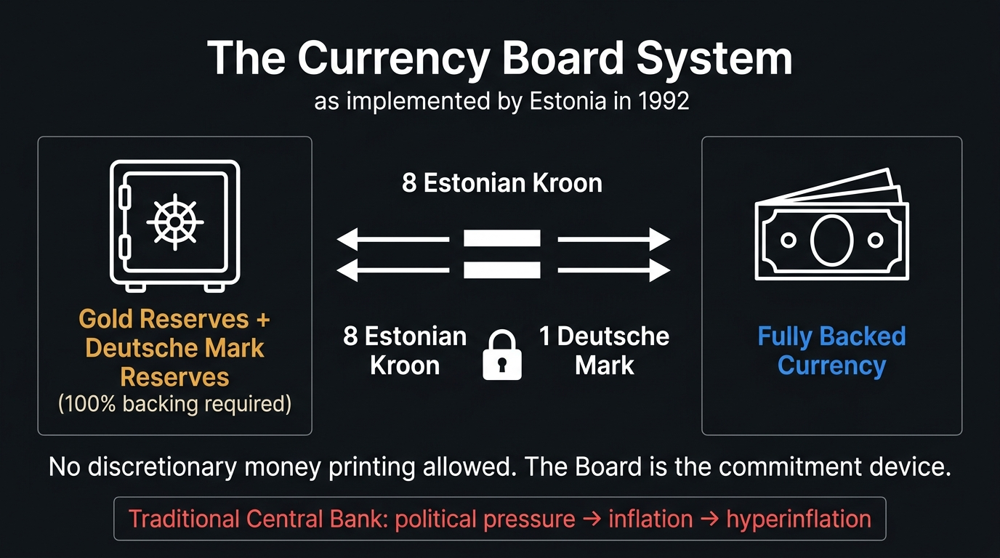

# Chapter 2: The Infrastructure of Trust (The Gold in the Vaults)

{#fig-currency-board fig-align="center"}

## 1. The Hook: The Cold Winter of Tallinn

In the early morning hours of January 11, 1992, the Baltic wind off the Gulf of Finland did not merely blow through the streets of Tallinn; it seemed to inhabit them. It was a wind that carried the scent of frozen salt, damp concrete, and the sulfurous tang of low-grade Russian oil. Tallinn, the medieval capital of Estonia, was a city caught in a peculiar state of suspension. On paper, it was free. Five months earlier, during the chaotic collapse of the Soviet Union, the Estonian parliament had declared the restoration of its independent republic. The red, green, and white flag of the Estonian Soviet Socialist Republic had been lowered from the Tall Hermann tower, replaced by the blue, black, and white tricolor of a sovereign nation. 

But sovereignty is a slippery concept. You can hoist a flag, you can write a constitution, and you can declare yourself free to the heavens, but if you walk down to the local grocery store on Pikk Street in the winter of 1992, you quickly discover that independence does not keep the radiators warm. 

Estonia was dying of economic exposure. The shops were not merely empty; they were clean, swept of even the illusion of commerce. If you wanted to buy milk, you did not look for a carton; you looked for a queue that had begun forming at four in the morning, where citizens stood in the sub-zero dark, stamping their feet to keep the blood moving, holding empty glass bottles and paper coupons. The Soviet command economy had disintegrated, and in its place was a vacuum. Russia, Estonia’s primary supplier of raw materials, had cut off the supply of petrol and heating fuel. The central heating systems of Tallinn’s massive, gray panel-block suburbs—places like Lasnamäe and Mustamäe—grew cold. Hot water was rationed to a few hours a week. In the offices of government ministers, coats remained buttoned to the chin. People burned old newspapers, broken furniture, and books in cast-iron stoves.

At the center of this misery was a small, rectangular slip of paper: the Soviet rouble. 

Estonia was still member to the "rouble zone." It was a monetary union where Estonia had all of the obligations of partnership and none of the control. The printing presses that manufactured the rouble sat in Moscow, controlled by a Russian Central Bank that was desperately trying to finance a massive state deficit by printing currency at a rate that defied physics. The result was a classic economic contagion: hyperinflation. By the end of 1991, the inflation rate in Estonia was running at over 1,000 percent. The rouble was not money; it was a hot potato. If you received a handful of roubles for a week’s work, your primary objective was to get rid of them within hours, converting them into anything of physical substance—a sack of flour, a pair of boots, a box of matches, a bottle of vodka. 

To make matters worse, Moscow had run out of the actual paper currency itself. In January 1992, the Russian printing presses simply could not keep pace with the hyperinflation they had created. There was a physical shortage of banknotes. The Bank of Estonia was forced to ration cash to commercial banks. Enterprises could not pay wages; retirees could not withdraw their pensions. The economy was reverting to barter. A local heating plant would exchange hot water for timber; a dairy would trade butter for glass bottles.

It was in this climate of freezing rooms and empty pockets that a thirty-four-year-old former bank director named Siim Kallas sat in his office at the Bank of Estonia. Kallas was not a revolutionary in the traditional sense. He did not possess the theatrical charisma of a guerrilla leader or the soaring rhetoric of a political philosopher. He was a man of numbers—tidy, structured, wearing wire-rimmed glasses and a thick mustache that gave him the appearance of a school superintendent. But Kallas understood a fundamental truth that many of his political colleagues, caught up in the romance of national liberation, had missed.

"A country that does not control its own money," Kallas would later observe, "is not a country at all. It is a province with a flag."

Kallas’s office was located in a grand, neo-Renaissance building in central Tallinn that had once belonged to the pre-war Estonian central bank. The building had been returned to the state, but its vaults were empty. The Soviet authorities, upon occupying Estonia in 1940, had liquidated the country’s financial assets, shipped its gold to Moscow, and integrated its banking system into the Gosbank network. Now, fifty years later, Kallas was the president of a central bank that possessed no foreign exchange reserves, no gold, no credit rating, and no access to international capital markets. All he had was a staff of young, enthusiastic academics—many of them in their early twenties, who had never seen a modern commercial bank, let alone run one—and a printing order for a new currency, the Estonian Kroon, which had been designed and printed in Germany and Sweden but remained locked in crates because no one knew how to give it value.

How do you start a currency from nothing? 

If Kallas simply opened the crates and distributed the new Kroons to the public, the result would be predictable. The Kroon would immediately merge with the rouble in the public consciousness: a worthless piece of paper issued by a bankrupt government. It would be traded on the black market at a fraction of its face value, inflation would resume its march, and the dream of Estonian independence would dissolve into economic collapse. 

To understand the scale of Kallas’s problem, we have to understand what a currency actually is. We tend to think of money as a physical object—a gold coin, a silver dollar, a green piece of paper with the portrait of a president. But money is not a physical thing. Money is a system of relations. It is a social technology designed to solve a fundamental human problem: the problem of trust. 

In a small village, you do not need money. If you are a baker and your neighbor is a blacksmith, you can trade bread for iron tools because you know your neighbor. You know where he lives, you know his family, and you know his reputation. If he takes your bread and fails to deliver the tools, the social cost to him is catastrophic; he will be ostracized by the village. The trust is personal, local, and immediate. 

But what happens when the village grows into a city? What happens when the baker wants to trade with a merchant from another country, a man whose language he does not speak, whose gods he does not worship, and whose reputation he cannot verify? Personal trust no longer works. The system scales past the limits of human memory. 

To solve this, we invented money. Money is a device that allows us to depersonalize trust. It is an instrument that carries its own credibility. When you hand a merchant a gold coin, he does not need to know your name or your character; he only needs to know that the coin is made of gold, and that gold is scarce, durable, and universally valued. The trust is transferred from the person to the object. 

But in the twentieth century, we did something radical. We unmoored money from the physical world. We moved from commodity money—money backed by gold or silver—to fiat money. The word "fiat" comes from the Latin, meaning "let it be done." A fiat currency has value not because it is made of precious metal, but because a sovereign authority declares that it has value, and because the population agrees to participate in that declaration. 

This is what the historian Yuval Noah Harari calls a "collective hallucination." A hundred-dollar bill is, in reality, just a piece of paper with green ink. You cannot eat it, you cannot wear it, and you cannot use it to build a shelter. It has value only because we all agree that it has value. And we agree because we trust the institution that stands behind it—the Federal Reserve, the United States government, the legal system that enforces contracts. 

In 1992, Estonia had the flag, the parliament, and the desire. But it did not have the institution. It did not have the trust. If Siim Kallas wanted to save his country, he had to find a way to manufacture trust out of the frozen ground of Tallinn.

---

## 2. The Pivot: The Ghosts in the Vault

In the spring of 1992, Siim Kallas and his team of reformers found their solution not in an economic textbook, but in a legal archive. 

In June 1940, as the Red Army moved across the Baltic states, the diplomats of the independent Republic of Estonia did something that was small, bureaucratic, and ultimately redemptive. They did not attempt to ship the nation’s gold reserves back to Tallinn. Instead, they left them where they were. 

Over the course of the 1920s and 30s, the Bank of Estonia had deposited its gold reserves in three foreign institutions: the Bank of England in London, the Swedish Riksbank in Stockholm, and the Bank for International Settlements in Basel, Switzerland. When the Soviet Union annexed Estonia, the Soviet government presented the paperwork to these Western banks, demanding the immediate transfer of the Estonian gold to Moscow. 

It was a crucial geopolitical moment. If the Western powers complied, they would be tacitly recognizing the legality of the Soviet occupation. But they did not. The United States, followed by Great Britain and several other Western nations, issued the Stimson Doctrine—a policy of non-recognition of territorial changes achieved by force. The Western banks froze the Estonian accounts. For fifty-two years, the gold sat in the dark vaults of London, Basel, and Stockholm. It was a financial ghost, a legal fiction that remained intact while the Soviet Union rose, stagnated, and fell.

In early 1992, as Estonia struggled in the rouble zone, Kallas and the Estonian government made a formal request to the British, Swedish, and Swiss governments: We are back. We want our gold.

The response was not immediate. There were diplomatic hurdles, legal audits, and administrative hesitations. Sweden, which had controversially handed over some Baltic assets to the Soviets in 1946, agreed to compensate Estonia with cash and physical gold. The Bank of England, after verifying the legal succession of the Estonian state, agreed to release the gold held in its vaults. The Bank for International Settlements followed suit. 

By the summer of 1992, Estonia was suddenly in possession of 11.3 tons of physical gold. 

It was a triumph of historical justice, but it presented Kallas with a second, more complicated problem. Eleven tons of gold was a beautiful symbol, but in the brutal arithmetic of global finance, it was a pittance. At the prevailing market prices of 1992, 11.3 tons of gold was worth approximately $120 million. 

To put that number in perspective, $120 million was roughly equivalent to the cost of two weeks of oil imports for the country. If Kallas used the gold to buy goods, it would vanish before the winter returned. If he used the gold to back a traditional central bank, the market would look at the $120 million reserve, look at the country’s massive economic problems, and realize that the central bank was a paper tiger. Speculators would short the Kroon, dump their currency for foreign reserves, and deplete the gold in a matter of days. 

This is the pivot. The gold was not a solution because of its physical utility. It was a solution because of its *psychological* utility. 

Kallas realized that he could not use the gold to build a traditional central bank. A traditional central bank is an institution built on discretion. It has a board of governors who meet in wood-paneled rooms to decide how much money to print, what interest rates to set, and which banks to bail out. It is a political institution, constantly subject to pressure from politicians who want to win the next election by printing money to pay for projects. 

In a mature democracy like Germany or the United States, this discretion is balanced by decades of institutional independence, legal precedent, and public trust. The Federal Reserve or the Bundesbank can adjust the money supply because the market trusts that they will not abuse that power. 

But Estonia did not have decades. It did not have institutional independence. If the Bank of Estonia had the power to print money at discretion, the public would assume that the politicians would eventually force Kallas to print Kroons to pay for civil service wages or subsidize failing state-owned factories. The Kroon would be dead before it hit the streets.

If you cannot build trust, you must lease it. 

Kallas and his advisors, including a brilliant, twenty-five-year-old lawyer named Jüri Luik and a group of Western advisors, turned to an economic concept that was both ancient and radical: the **Currency Board System**. 

The Currency Board is not a central bank. It is, in fact, the anti-central bank. It is a system that strips the central bank of all discretion, all policy-making power, and all political utility. It takes the steering wheel of monetary policy and locks it in a steel box, throwing the key into the Baltic Sea.

Under a Currency Board, the rules are simple, transparent, and absolute:

First, the domestic currency is pegged to a foreign "anchor" currency at a fixed exchange rate.
Second, the currency board is legally obligated to hold foreign reserve assets equal to 100 percent of the domestic currency in circulation.
Third, the currency board must guarantee unlimited convertibility. Anyone can walk into the bank with domestic notes and exchange them for the anchor currency at the fixed rate, no questions asked.
Fourth, the currency board has no power to set interest rates, no power to conduct open-market operations, and—crucially—no power to lend money to the government or bail out commercial banks. 

By implementing this system, Estonia was not asking the world to trust the Bank of Estonia. It was asking the world to trust the German Deutsche Mark. 

The Deutsche Mark was the undisputed anchor of stability in Europe. The German Bundesbank was legendary for its fanatical commitment to price stability, a commitment forged in the trauma of the Weimar hyperinflation of the 1920s. By pegging the Kroon to the Deutsche Mark and backing every Kroon with German marks or gold, Estonia was effectively importing the credibility of the Bundesbank. It was a monetary transfusion, grafting the institutional heart of Europe’s strongest economy onto the fragile body of a Baltic state.

It was a high-stakes gamble. It meant that Estonia was giving up its monetary sovereignty. If the German economy experienced high interest rates, Estonia would experience high interest rates. If the German mark rose against the dollar, the Kroon would rise against the dollar, regardless of whether that was good for Estonian exporters. 

But Kallas knew that the alternative was not monetary sovereignty; the alternative was monetary chaos. In the hierarchy of national needs, credibility comes before independence.

---

## 3. The Investigation: The Vending Machine of Statecraft

To understand how the Estonian Currency Board functioned in practice, we have to look past the grand language of international treaties and examine the plumbing. The system was designed to run not like a government department, but like a mechanical vending machine. 

Imagine a vending machine that sells sodas for one dollar. The machine has a simple rule: if you put a dollar bill into the slot, it drops a can of soda. If you do not put a dollar bill in, no soda comes out. The machine does not have a committee that meets to discuss whether you deserve a soda. It does not look at your credit history. It does not decide to print "soda coupons" because the local economy is in a recession. It is a mechanical reflex. 

The Estonian Currency Board was that vending machine. 

The Bank of Estonia was legally divided into two distinct departments: the Issue Department and the Banking Department. The Issue Department was the vending machine. It held the nation’s foreign reserves—the pre-war gold, which had been converted into German Deutsche Marks and interest-bearing German government bonds. 

The exchange rate was set by law at **8 Estonian Kroons (EEK) to 1 German Deutsche Mark (DEM)**. 

This ratio was not chosen at random. It was the result of a precise mathematical calibration. Kallas and his team calculated the total value of Estonia's initial reserves—the $120 million in gold and foreign currency, plus the value of some state-owned forestry assets that were transferred to the bank's balance sheet—and divided it by the estimated monetary base of the country (the total value of roubles in circulation that would need to be exchanged). The 8:1 ratio ensured that the bank’s reserves were more than 100% of the liabilities. In fact, on the day of the launch, the Bank of Estonia’s reserves backed the Kroon at roughly 110 percent.

The legal framework was designed to be ironclad. The Currency Law, drafted by Jüri Luik and passed by the Estonian parliament in May 1992, made it a constitutional violation for the Bank of Estonia to alter the exchange rate or issue Kroons that were not backed by foreign assets. 

Here is how the automatic stabilizer of the currency board worked:

If a German investor wanted to build a furniture factory in the Estonian town of Pärnu, he would take 100,000 Deutsche Marks and wire them to the Bank of Estonia. The Issue Department would receive the marks, place them in its reserve account in Frankfurt, and automatically print 800,000 Kroons, which it would deliver to the investor’s account in Tallinn. The money supply in Estonia expanded. The investor would use those Kroons to buy timber, hire workers, and build the factory. 

But what if the factory failed? What if the investor decided to pull his money out of the country? He would take his 800,000 Kroons, walk into the Bank of Estonia, and demand his Deutsche Marks back. The Issue Department would take the Kroons, shred them (or remove them from circulation), and release 100,000 Deutsche Marks from its reserves. The money supply in Estonia contracted. 

There was no intervention. No central bank governor sat at a desk deciding whether to defend the currency by raising interest rates or buying bonds. The market adjusted itself. If money flowed out of the country, the money supply shrank, interest rates naturally rose (because money was scarce), and the economy cooled down, making Estonian assets cheaper and more attractive to foreign investors again. If money flowed into the country, the money supply expanded, interest rates fell, and the economy grew.

This mechanical simplicity created a stark contrast with the other nations that emerged from the wreckage of the Soviet Union. 

Look at Ukraine. In 1992, the Ukrainian government decided to take a conventional path. They established the National Bank of Ukraine as a standard central bank with full discretionary powers. They launched a transitional currency, the Karbovanets (commonly known as the coupon). 

Unlike Estonia, the Ukrainian government was dominated by old Soviet-era directors who ran massive, inefficient coal mines and agricultural collectives. These directors went to the parliament and demanded subsidies to keep their enterprises afloat and pay their workers. The parliament, fearing social unrest, turned to the National Bank of Ukraine and ordered it to print money. 

The National Bank complied. It had the discretion to do so. It printed Karbovanets to finance the government’s budget deficit, to lend to commercial banks controlled by oligarchs, and to prop up bankrupt state enterprises. 

The result was an economic catastrophe. In 1993, Ukraine’s annual inflation rate reached **4,735 percent**. The Karbovanets became a joke. Workers were paid in stacks of banknotes that were literally bound in bricks, and they had to spend them during their lunch hour because by dinner, the money would have lost ten percent of its value. The middle class was wiped out, savings were destroyed, and the economy contracted by more than 50 percent over the course of the 1990s. The country was trapped in a cycle of corruption, economic stagnation, and political instability that would hobble its development for a generation.

The same story played out in Belarus, in Georgia, and in Russia itself. In each case, the central bank’s ability to exercise "discretion" became a mechanism for political plunder. The politicians could not resist the temptation of the printing press. 

By choosing the Currency Board, Estonia took the steering wheel out of the hands of its politicians. It was an act of supreme institutional humility. The Estonians admitted that they did not have the political maturity, the institutional strength, or the public trust to run a discretionary monetary policy. So, they outsourced it to Frankfurt.

The launch of the Kroon was set for June 20, 1992. It was a logistical operation of military precision. 

At 4:00 AM, hundreds of conversion centers across the country—set up in schools, post offices, and municipal buildings—opened their doors. Every resident of Estonia, from pensioners to children, was allowed to exchange up to 1,500 Soviet roubles for Kroons at a rate of 10 roubles to 1 Kroon. This gave every citizen a starting balance of 150 Kroons (about 18.75 Deutsche Marks). Any savings beyond 1,500 roubles could be exchanged, but at a punitive rate of 100 roubles to 1 Kroon. 

It was a brutal, necessary devaluation. It wiped out the cash savings of the old Soviet elite and the black marketeers who had accumulated millions of roubles. But it gave the new Kroon a clean start. 

The reaction of the Estonian public was a mixture of anxiety and pride. People queued for hours, not to buy bread, but to hand over their dirty, worn Soviet paper and receive in return the crisp, beautifully printed Estonian Kroons. The notes featured portraits of Estonian cultural heroes—the writer Anton Hansen Tammsaare on the 25-kroon note, the linguist Ferdinand Johann Wiedemann on the 50-kroon note, the poet Lydia Koidula on the 100-kroon note. 

For the first time in fifty years, Estonians held money that felt like theirs. 

But did it work?

The statistics are striking. In May 1992, the month before the reform, the monthly inflation rate in Estonia was 21 percent. By July, the month after the reform, it had dropped to 11 percent. By September, it was 6.6 percent. Within two years, Estonia's annual inflation rate had stabilized in the low double digits, and by the late 1990s, it was matching West European standards. 

More importantly, the stability of the Kroon transformed the real economy. Foreign investors, who had previously looked at the Baltic states as a chaotic, high-risk zone, realized that they could invest in Estonia without the fear of currency risk. If they made a profit in Kroons, they could immediately convert those Kroons back into Deutsche Marks at a guaranteed rate of 8:1 and repatriate their capital. 

Money poured into the country. Swedish telecom firms, Finnish electronics manufacturers, and German logistics companies set up operations in Tallinn. The city’s port became one of the busiest on the Baltic Sea. Estonia became the "Baltic Tiger," transitioning from an impoverished Soviet province to a high-tech, digital economy in less than a decade. 

The currency board was the foundation of this miracle. It was not a perfect system—as we will see in the manual page, it carried significant risks—but for a state starting from scratch, it was the only way to build a house that would stand.

---

## 4. The Manual Page: The Monetary Founder's Blueprint

### SECTION II: MONETARY INFRASTRUCTURE
#### SYSTEM DESIGN: THE CURRENCY BOARD ARCHITECTURE

```
   ┌─────────────────────────────────────────────────────────────┐
   │                     THE SOVEREIGN STATE                     │
   │   (No fiscal printing authority; must balance budget or    │
   │    borrow at market rates from commercial lenders)          │
   └──────────────────────────────┬──────────────────────────────┘
                                  │ (No Credit / No Deficit Financing)
                                  ▼
   ┌─────────────────────────────────────────────────────────────┐
   │                  THE CURRENCY BOARD SYSTEM                  │
   │                                                             │
   │  ┌──────────────────────┐         ┌──────────────────────┐  │
   │  │   ISSUE DEPARTMENT   │         │  BANKING DEPARTMENT  │  │
   │  │                      │         │                      │  │
   │  │ Holds 100% Backing   │         │ (Optional)           │  │
   │  │ in foreign reserve   │         │ Clearing & settlement│  │
   │  │ assets (Gold/DEM/EUR)│         │ services for banks.  │  │
   │  │                      │         │ No lender-of-last-   │  │
   │  │ Prints domestic notes│         │ resort capability.   │  │
   │  │ only upon receipt of │         └──────────────────────┘  │
   │  │ anchor reserves.     │                                   │
   │  └──────────┬───────────┘                                   │
   └─────────────┼───────────────────────────────────────────────┘
                 │ (100% Legal Peg: e.g., 8 EEK = 1 DEM)
                 ▼
   ┌─────────────────────────────────────────────────────────────┐
   │                     THE REAL ECONOMY                        │
   │    (Unlimited exchange: Domestic Notes <──> Foreign Reserves)│
   └─────────────────────────────────────────────────────────────┘
```

#### I. Core Operational Principles

A Currency Board is a monetary authority that issues notes and coins exchangeable into a foreign anchor currency at a fixed rate and backed 100% by foreign reserves. It is designed for new, reforming, or hyperinflationary states that lack the institutional credibility to manage a discretionary central bank.

1. **The Rule of 100% Reserve Backing**: The board must hold foreign reserve assets (gold, top-tier foreign government bonds, or liquid cash deposits in the anchor currency) equal to at least 100% of the value of the domestic currency in circulation (M0 monetary base). 
2. **The Fixed Peg**: The exchange rate between the domestic currency and the anchor currency is fixed by statute, ideally at a level that is simple, memorable, and mathematically aligned with the initial reserves.
3. **Guaranteed Convertibility**: The authority is legally obligated to buy and sell domestic currency for the anchor currency in unlimited quantities at the official rate. There are no capital controls or foreign exchange restrictions.
4. **The Credit Firewall**: The board is prohibited from extending credit to the government, state-owned enterprises, or commercial banks. It cannot purchase government debt or print money to finance fiscal deficits. 
5. **No Lender of Last Resort**: The board does not bail out failing banks. Commercial banks must manage their own liquidity or seek support from foreign parent banks or private credit markets.

---

#### II. Step-by-Step Implementation Guide

##### Step 1: The Reserve Audit and Sourcing
Before launching a currency board, the state must secure its initial reserve assets. 

1. **Calculate the Minimum Reserve Requirement (MRR)**:
   $$\text{MRR} = \text{Target Monetary Base (M0)} \times \text{Exchange Rate (Peg)}$$
   The target M0 must include all physical banknotes in circulation plus all commercial bank clearing accounts held at the monetary authority.
2. **Asset Mobilization**:
   - Recover historical sovereign assets frozen in foreign jurisdictions.
   - Secure stabilization loans from the International Monetary Fund (IMF) or World Bank.
   - Liquidate non-essential state-owned assets (forestry, land, ports) and convert the proceeds into the anchor currency.
   - If reserves are insufficient to cover 100% of M0, execute a one-time devaluation of the existing domestic currency (or the foreign currency in circulation, e.g., roubles) to reduce the liabilities of the monetary authority until they match the available reserves.

##### Step 2: Selecting the Anchor Currency
The choice of anchor currency is the most critical decision in the architecture design. The anchor currency must be:
- **Liquid and Stable**: Issued by a country with low inflation, a deep capital market, and a highly independent central bank.
- **Trade-Aligned**: The anchor country should be a primary trading partner or the source of significant foreign direct investment (FDI) for the new state.
- **Historically/Psychologically Credible**: The currency must carry immediate prestige in the minds of the local population (e.g., the German Deutsche Mark in Eastern Europe, the US Dollar in Latin America).

##### Step 3: Drafting the Legislative Charter
The currency board must be established by a statutory law that is difficult to repeal, ideally requiring a supermajority in the national parliament. The law must contain the following provisions:
- **The Mandate**: "The sole purpose of the Monetary Authority is to maintain the fixed exchange rate of [X] domestic units to [1] anchor unit."
- **The Reserve Restriction**: "The Issue Department shall at all times maintain reserves in [Anchor Currency/Gold] valued at no less than 100 percent of the total outstanding notes, coins, and demand liabilities of the Authority."
- **The Loan Ban**: "The Authority shall not extend credit, directly or indirectly, to the Government, any public agency, or any commercial bank."
- **The Convertibility Guarantee**: "The Authority shall, upon demand, exchange domestic currency for the anchor currency at the official rate without limitation or fee."

##### Step 4: Structuring the Balance Sheet
The monetary authority must be split into two separate ledgers: the **Issue Department** and the **Banking Department**.

*   **Issue Department (The Currency Board Vending Machine)**:
    *   *Assets*: Gold reserves, anchor currency deposits at foreign central banks, foreign government bonds.
    *   *Liabilities*: Banknotes and coins in circulation, commercial bank reserve deposits.
*   **Banking Department (Operational Services)**:
    *   *Assets*: Liquid deposits, clearing system assets.
    *   *Liabilities*: Government accounts, clearing accounts.

```
   TYPICAL BALANCE SHEET: ISSUE DEPARTMENT
   ┌─────────────────────────────────────┬─────────────────────────────────────┐
   │ ASSETS                              │ LIABILITIES                         │
   ├─────────────────────────────────────┼─────────────────────────────────────┤
   │ 1. Gold Reserves (Valued at market) │ 1. Banknotes in circulation         │
   │ 2. Anchor Currency Cash Deposits    │ 2. Coins in circulation             │
   │ 3. Anchor Government Bonds (Liquid) │ 3. Commercial Bank clearing deposits│
   ├─────────────────────────────────────┼─────────────────────────────────────┤
   │ TOTAL ASSETS (e.g., $110M)          │ TOTAL LIABILITIES (e.g., $100M)     │
   ├─────────────────────────────────────┴─────────────────────────────────────┤
   │ NET SURPLUS (RESERVE RATIO: 110%)                                         │
   └───────────────────────────────────────────────────────────────────────────┘
```

##### Step 5: Executing the Conversion Protocol
1. **Declare a Conversion Window**: Typically 3 to 5 days.
2. **Establish Conversion Centers**: Utilize schools, post offices, and commercial bank branches. Securitization must be managed by the national police or military.
3. **Apply the Exchange Ratio**:
   - Establish a low-tier threshold (e.g., $100 equivalent) for immediate 1:1 parity exchange to protect small savers.
   - Apply a devalued rate for balances above the threshold to wipe out speculative capital and balance the reserve ledger.
4. **De-monetize the Old Currency**: Collect and physically destroy the old banknotes or ship them back to the issuing nation (if exiting a monetary union like the rouble zone).

---

#### III. System Vulnerabilities & Mitigation Strategies

While a Currency Board provides immediate credibility and price stability, it introduces structural vulnerabilities that the accidental founder must manage:

##### 1. The Loss of the Lender of Last Resort (LOLR)
*   **The Risk**: If a commercial bank experiences a run (panic withdrawals by depositors), the currency board cannot print money to bail it out. If a major bank collapses, it can trigger a systemic banking crisis.
*   **Mitigation**: 
    *   *Reserve Requirements*: Force commercial banks to maintain high liquid reserve ratios (e.g., 10-15%) in the anchor currency.
    *   *Fiscal Reserve Fund*: The government must build a separate fiscal surplus (e.g., Estonia's Stabilization Reserve Fund) held in foreign banks, which can be used to extend emergency loans to solvent but illiquid banks.
    *   *Foreign Parent Banking*: Encourage foreign acquisition of the domestic banking sector. If Swedish or German banks own the local banks, the parent banks in Stockholm or Frankfurt will act as the lenders of last resort, importing foreign banking stability.

##### 2. The Interest Rate Shock (The German Collar)
*   **The Risk**: The domestic economy loses control over its interest rates. If the anchor country raises interest rates to cool down its own economy, the currency board state will experience rising interest rates, even if its local economy is in a recession.
*   **Mitigation**:
    *   *Labor Market Flexibility*: Since the exchange rate cannot adjust to make exports cheaper during a crisis, domestic wages and prices must be flexible. The state must deregulate the labor market to allow wages to fall during economic downturns, restoring competitiveness without devaluation (internal devaluation).
    *   *Fiscal Discipline*: The government must run balanced budgets or surpluses during boom years to build a buffer for recession years.

---

## 5. The Gladwellian Epilogue: The Outlier of the Baltics

In the study of economic transitions, there is a concept known as path dependency. It is the idea that the decisions made in the first hours of a crisis create a groove so deep that the nation is bound to travel along it for decades, regardless of where it leads. 

In the winter of 1992, Estonia stood at a crossroads. Its neighbors—Ukraine, Belarus, Russia—chose a path of discretion, of gradualism, of political negotiation. They believed that the transition from communism to capitalism could be managed by central planners, that the pain of reform could be cushioned by printing money, and that the state could preserve its industrial past while building its democratic future. 

It was a path that led to hyperinflation, oligarchic capitalism, and institutional decay. 

Estonia chose the other path. It chose the path of the vending machine. By adopting the Currency Board System, Estonia made a choice that was counter-interactive, radical, and deeply humbling. It acknowledged its own weaknesses. It accepted that the ultimate proof of sovereignty is not the power to print money, but the discipline to prove you don't have to. 

By tying its currency to the Deutsche Mark, Estonia did not lose its independence. It imported the rule of law. It created a stable, predictable, and transparent economic space that allowed its citizens to look past the survival of the next hour and start planning for the next decade. 

In 2011, nineteen years after Siim Kallas stood in his empty vault, Estonia officially retired the Kroon. The currency had done its job. The country was admitted to the Eurozone, completing its integration into the economic heart of Europe. Today, Estonia is one of the most prosperous, tech-savvy nations in the world—a country where taxes are filed online in three minutes, where voting is done from laptops, and where the freezing winters of 1992 feel like a distant, half-forgotten dream. 

But if you walk through the streets of Tallinn's Old Town, past the medieval walls and the modern glass offices of tech startups, you are walking on a foundation that was built in the dark, cold days of 1992, out of eleven tons of old gold and a collective hallucination that worked.
