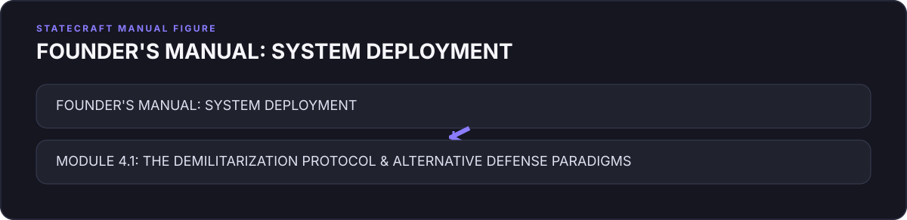
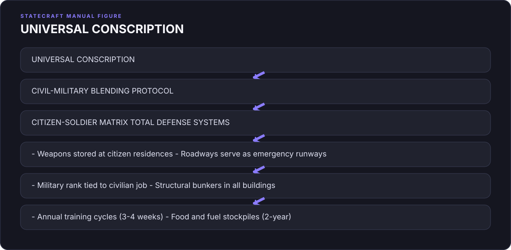
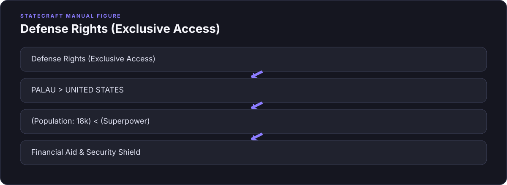
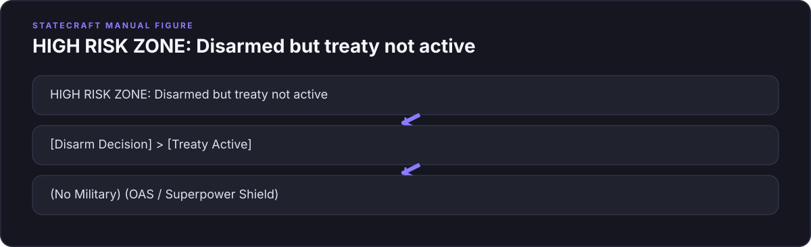

# Chapter 4: The Country Without a Shield (The Paradox of Power)

## 1. The Hook: The Sledgehammer at the Gate

On the damp, gray morning of December 1, 1948, the air in the Central Valley of Costa Rica carried the sharp, earthy scent of wet soil and tropical mist, mixed with the faint, sulfurous tang of the Irazú volcano sleeping in the distance. The capital city of San José, situated in a high volcanic bowl nearly four thousand feet above sea level, was waking up to a quietness it had not known for months. For forty-four days, this tiny Central American republic had been convulsed by a savage, desperate civil war. It was a brief conflict in the grand scale of global history, but for Costa Rica, it was an existential earthquake. More than two thousand men—farmers, coffee pickers, students, and shopkeepers—had died in the muddy mountain passes of the Cerro de la Muerte and along the cobblestone avenues of Cartago. The country, long proud of its peaceful civic culture, was bruised, traumatized, and deeply divided.

At the center of this fractured capital stood the Cuartel Bellavista.

The Bellavista was not merely a military barracks; it was a physical statement of dominance. It was a massive, lemon-yellow stone fortress that sat on a hill overlooking the eastern side of San José, its crenellated battlements rising like the teeth of a medieval dragon. Its walls, constructed of thick masonry and heavy brick, were over three feet thick, designed to withstand siege artillery. At each corner, imposing octagonal towers jutted into the sky, their walls pierced by narrow gun slits for Maxim machine guns. The yellow paint of the fortress was scarred and pockmarked with fresh, jagged bullet holes and black scorch marks from the rebel artillery barrages. For decades, the Bellavista had been the nerve center of the Costa Rican military, the ultimate sanctuary of the state’s monopoly on physical force. To the citizens of San José, it was an ominous presence—a monument to the power of the barracks over the assembly.

On this morning, a highly unusual crowd had assembled on the muddy parade ground outside the fortress. There were members of the foreign diplomatic corps, dressed in dark, formal wool suits and fedoras despite the damp warmth, whispering to one another in English, French, and Spanish. There were school children from the nearby Lyceum, wearing their crisp, white-linen uniforms and blue ties, clutching small paper flags. There were mothers in heavy black lace veils, holding the hands of young children, their eyes hollowed by the loss of husbands and sons in the mountain fighting.

And then, standing in neat, rigid rows, were the rebel soldiers of the National Liberation Army. These were the men who had just won the war. Their faces were dark and sunburned from weeks in the highlands, their khakis stained with the red volcanic clay of the coffee plantations, their leather boots caked in mud. They stood with their chests pushed out, their Mauser rifles held at attention, their leather holsters heavy on their hips. They were waiting for what soldiers always wait for in the wake of a victorious campaign: the military parade, the promotion of colonels to generals, the distribution of medals, the speeches celebrating martial valor, and the division of the spoils of state power.

But the man who was about to speak did not look like a general.

José Figueres Ferrer, known to every Costa Rican simply as "Don Pepe," was a remarkably compact man. Standing barely five feet three inches tall, he had a high, balding forehead, intensely bright dark eyes that seemed to constantly scan his surroundings, and a thin, neatly trimmed mustache. He did not wear a dress uniform adorned with gold braid or medals. Instead, he wore a simple, slightly rumpled khaki civilian suit that hung loosely on his small frame. 

Don Pepe was not a career officer. He was an engineer, a agriculturalist, and an intellectual. He had spent his youth studying at the Massachusetts Institute of Technology, wandering the libraries of Boston, and reading classical philosophy, economics, and sociology. When he returned to Costa Rica, he bought a rugged, wild plot of land in the mountains of the southern valley, naming it *La Lucha sin Fin*—"The Struggle Without End." There, he built a successful agricultural community, growing cabbages, raising dairy cattle, and cultivating sisal to make rope. He had been dragged into politics only when the corrupt government of Teodoro Picado, backed by the military and allied with the local communist party, systematically rigged the 1948 presidential election to prevent the opposition candidate, Otilio Ulate, from taking office. Figueres had fled to the mountains, organized a ragtag army of volunteers, and launched a rebellion to restore democratic order.

Don Pepe walked slowly toward the towering yellow wall of the Cuartel Bellavista. He was accompanied by his top commanders and members of the founding junta. But in his hands, he did not carry a ceremonial sword or a field marshal's baton. He carried a heavy, double-faced iron sledgehammer with a long, weathered hickory handle.

The chatter in the crowd died down. A heavy silence fell over the parade ground. The only sound was the wind rustling through the pine trees on the hillsides. Don Pepe stopped three feet from the fortress wall. He looked up at the yellow battlements, his small figure completely dwarfed by the massive stone structure. He planted his feet, gripped the hickory handle with both hands, swung the hammer back over his shoulder, and drove it forward with all his strength.

*Thwack.*

The sound was a dull, bone-jarring impact that echoed off the cobblestones and reverberated through the hollow corridors of the barracks. The iron head of the hammer struck the plaster, sending a shower of white dust and yellow stone chips flying into the air. Don Pepe did not pause. He pulled the hammer back and swung again.

*Thwack.*

A collective murmur, a mixture of shock and confusion, ran through the ranks of the rebel officers. This was not a symbolic, gentle tap. Don Pepe was swinging the hammer like a laborer clearing a field, his shoulders bunching, his face flush with exertion. With each blow, the yellow plaster crumbled away, exposing the dark, rough clay bricks underneath. He was defacing the military's holiest shrine. 

After several heavy blows, breathing heavily, Don Pepe lowered the sledgehammer, turned his back to the broken wall, and looked out at the crowd. He did not shout. He spoke in the dry, precise, almost academic tone of an engineer presenting a technical report to a board of directors.

"The military spirit is the enemy of the republic," Figueres declared. "We are transforming this fortress into a house of culture. Today, we declare the national army of Costa Rica dissolved. We believe that a country does not need an army of soldiers, but an army of teachers. We hand the keys of this barracks to the University of Costa Rica, so that it may become a national museum for all our people."

He reached into his pocket, pulled out a large, heavy ring of iron keys, and handed them to the rector of the university. The rebel officers stood frozen. The diplomats looked at one another in disbelief. 

In the long, bloody history of the nation-state, what Don Pepe had just done was not just unusual; it was an act of political heresy. 

Consider the context of December 1948. The world was not entering an era of peaceful disarmament. It was entering the darkest, most paranoid phase of the Cold War. In Washington, the Joint Chiefs of Staff were drawing up plans for global containment. In Moscow, Stalin was consolidating his grip on Eastern Europe. In Asia, Mao Zedong's armies were sweeping across China. And closer to home, the Caribbean basin was a geopolitical minefield. To the north of Costa Rica lay Nicaragua, ruled by the ruthless dictator Anastasio Somoza García, who possessed a highly trained, American-armed National Guard and a personal hatred for Figueres. To the northwest lay Honduras and El Salvador, both governed by military regimes that had ruled through terror for decades. To the south, Panama was dominated by the massive military apparatus of the United States.

For a tiny, impoverished nation of fewer than a million people, surrounded by hostile, heavily armed dictatorships, to voluntarily dismantle its military was the equivalent of a man walking into a room full of hungry wolves and deliberately throwing away his gun. It violated the most fundamental axiom of classical political theory.

Since the Peace of Westphalia in 1648, the definition of a sovereign state had been built on a single, non-negotiable foundation: the monopoly on the legitimate use of physical force. Max Weber, the great German sociologist, argued that a state only exists to the extent that it can defend its borders and enforce its laws through the threat of violence. Without an army, a state is not a state; it is merely a target.

To the political realists of the era, Figueres was a fool. They predicted that within months, Costa Rica would be invaded by Nicaragua, its democracy crushed, and its territory carved up by its neighbors. 

But José Figueres Ferrer was not a fool. He was a mathematician of power. He had spent his years of exile observing the political pathology of Central America, and he had noticed a pattern—a pattern that the military strategists in Washington, with their maps and troop counts, had completely ignored. 

Don Pepe had realized that for a small, developing nation in the twentieth century, the classical model of national security was a lie. He had realized that the greatest threat to a democracy does not come from the army across the border. 

It comes from the army in the barracks down the street.

***

## 2. The Pivot: The Pathology of the Praetorian State

To understand the genius of Don Pepe’s sledgehammer, we must first look at the pathology of the neighborhood. In the mid-twentieth century, Central America was a laboratory for a political disease known to historians as **Praetorianism**.

The term, of course, has its roots in the Roman Empire. In 27 BC, the Emperor Augustus, seeking to secure his personal safety in a city prone to political assassinations, established the Praetorian Guard. It was a highly logical, defensive measure: nine cohorts of elite, well-paid soldiers stationed in and around Rome, loyal directly to the emperor. 

But Augustus had introduced a fatal flaw. By creating an autonomous, elite force loyal directly to its commander rather than to the Senate, he established a group with its own corporate interests. The protectors soon became the masters. In 41 AD, they assassinated Caligula and declared Claudius emperor. In 193 AD, they murdered Emperor Pertinax and auctioned the Roman Empire to senator Didius Julianus for 25,000 sesterces per soldier. The shield had become the sword.

In the twentieth century, the nations of Central America had become modern Praetorian States. The military was not an instrument of the state; the state was an instrument of the military.

Take the case of Nicaragua. In the 1920s, the United States Marines occupied Nicaragua to protect American commercial interests and stabilize the country. Before they left, they created the *Guardia Nacional* (National Guard). The American goal was noble on paper: to train a professional, non-partisan constabulary that would stand apart from the country’s warring political factions and maintain order. 

But the Americans made the classic mistake of focusing on the hardware of the state rather than its software. The moment the Marines sailed away, a clever, ambitious officer named Anastasio Somoza García seized control of the Guard. He used the military’s monopoly on organization and weapons to assassinate his rivals, depose the civilian president, and install himself as dictator. For the next forty-three years, the Somoza family ruled Nicaragua as a private fiefdom. The National Guard did not protect Nicaragua from foreign enemies; it protected the Somoza family from the Nicaraguan people, operating as a private army, a tax collector, and a political police force.

Or look at Guatemala. In 1944, a popular uprising led by students and reformist junior officers overthrew the dictator Jorge Ubico, initiating a decade of democratic progress known as the "Guatemalan Spring." The new government, led by Juan José Arévalo and later Jacobo Árbenz, attempted to build a modern social democracy, constructing schools, implementing labor laws, and introducing agrarian reform. 

But the military remained a separate, autonomous caste. It had its own courts, its own financial institutions, and its own internal chain of command that answered to no civilian minister. In 1954, when Árbenz attempted to expropriate unused land owned by the American multinational United Fruit Company, the company lobbied the Eisenhower administration, which launched a CIA-backed coup. The military, realizing that its corporate privileges were threatened by the civilian government’s conflict with the United States, refused to fight. They forced Árbenz to resign and installed a military junta. For the next thirty-six years, Guatemala was ruled by a succession of military regimes that conducted a scorched-earth campaign against their own population, resulting in the genocide of Mayan communities and the deaths of more than two hundred thousand civilians.

This was the default setting of Latin American politics. A civilian leader would propose a reform—a new tax on the wealthy, a labor law, a school building program. The traditional landowning elites, feeling threatened, would appeal to the officer corps. The tanks would rumble out of the barracks, the constitution would be suspended, and the president would be sent into exile.

In his classic 1968 study, *Political Order in Changing Societies*, the Harvard political scientist Samuel Huntington identified this phenomenon as the defining feature of politically underdeveloped societies. In a Praetorian society, Huntington argued, there is no consensus on the rules of political competition. The social forces of the country—the wealthy, the church, the students, the labor unions—confront one another directly. And in a direct confrontation between social forces, the force that possesses the guns always wins. 

"In a praetorian system," Huntington wrote, "the military does not just defend the state; it becomes the state."

Why is the military in a developing country so prone to this?

First, there is **Resource Asymmetry**. Where civilian courts, legislatures, and civil services are weak, the military is a model of efficiency, possessing communication networks, transport, and arms. When a crisis occurs, it is the only tool that works. The temptation to intervene is overwhelming.

Second, there is **Threat Misalignment**. With the United States guaranteeing regional defense, Central American nations faced zero external invasion risk. Having no foreign wars to fight, national militaries turned inward. The "enemy" became the labor organizer, the peasant, or the student activist. The military ceased to be a shield and became a political referee and internal occupier.

José Figueres Ferrer understood this mathematical reality. He looked at the Costa Rican military—which had historically been small but had still intervened in politics, most notably in the brutal dictatorship of Federico Tinoco in 1917—and realized that it was a useless ornament for external defense. If Nicaragua chose to invade Costa Rica with its full military power, Costa Rica’s tiny, poorly trained army of three thousand men would be swept aside in a weekend. But if Costa Rica kept its army, the army would eventually turn on the government.

Don Pepe realized that the only way to win the game was to change the rules. He did not try to reform the military, to professionalize it, or to subject it to civilian oversight. He knew that once the military existed as an institution, it would always protect its own power. 

So, he deleted the institution. He took the gun off the table, melted it down, and used the metal to build schools.

***

## 3. The Investigation: The Judo of the Defenseless

But how do you survive in a neighborhood of dictators when you have no army?

To the political realists of 1948, Costa Rica's survival was a mystery. They assumed that without a military, the country would be immediately swallowed by its neighbors. Yet, over the next eight decades, while its neighbors were devastated by civil wars, military coups, and state-sponsored terror, Costa Rica remained the most stable, prosperous democracy in Latin America. It did not have a single coup. It did not have a single political assassination. 

How did they pull off this geopolitical miracle?

The answer lies in understanding a concept we can call **Systemic Security**. Costa Rica did not simply disarm and hope that the world would be nice to them. Instead, they engaged in a highly sophisticated form of diplomatic engineering. They realized that if they could not build a physical shield, they had to construct a legal and moral shield so strong that no neighbor would dare to cross it. They turned their very defenselessness into their greatest strategic asset.

The first pillar of this strategy was the **Inter-American Treaty of Reciprocal Assistance**, signed in Rio de Janeiro in September 1947, commonly known as the Rio Treaty. The Rio Treaty was a historic agreement. Signed two years before the North Atlantic Treaty Organization (NATO), it was the world’s first regional collective security pact. Its core mechanism was simple but absolute, laid out in Article 3: "An armed attack by any State against an American State shall be considered as an attack against all the American States, and, consequently, each one of the said Contracting Parties undertakes to assist in meeting the attack."

For Costa Rica, the Rio Treaty was a diplomatic goldmine. By signing it, they had effectively outsourced their hard-power requirements to the United States and the other nations of the Western Hemisphere. But a treaty is only as strong as its enforcement. To make it work, Costa Rica had to develop a new doctrine of security—a doctrine based on the mobilization of international law rather than military force.

This doctrine was put to the test almost immediately. On December 10, 1948—nine days after Don Pepe struck the wall of the Cuartel Bellavista—a force of several hundred Costa Rican exiles, loyal to the deposed president Calderón Guardia and backed by the Nicaraguan dictator Anastasio Somoza, crossed the border from Nicaragua. They captured the border town of La Cruz and began marching south toward San José.

In any other country, the response would have been standard: declare martial law, mobilize the army, call up the reserves, and send troops to the front lines. But Costa Rica had no army to mobilize.

Instead, Don Pepe did not call his generals. He called his diplomats.

Costa Rica appealed immediately to the newly formed **Organization of American States (OAS)** in Washington, D.C. The OAS had been founded in Bogotá, Colombia, earlier that year, and the Costa Rican crisis was its very first test. The Costa Rican ambassador argued before the OAS Council that his nation was the victim of an unprovoked, foreign-sponsored invasion that violated the Rio Treaty.

The OAS acted with unprecedented speed. They invoked the treaty, formed an emergency committee, and dispatched an military-diplomatic commission to Costa Rica. The commissioners flew to San José, traveled by jeep and horseback to the northern border, and verified that the invasion force had been organized, armed, and launched from Nicaraguan territory with the direct assistance of Somoza’s National Guard.

Here we see the counter-intuitive mechanics of the **Asymmetry of Defenselessness**.

Imagine if Costa Rica had possessed a standing army. If they had sent troops to the border to fight the invaders, Somoza would have claimed that Costa Rican forces had provoked the clash, or that Costa Rica was planning an invasion of Nicaragua. The conflict would have been framed as a typical, muddy, bilateral border skirmish between two rival militaries. The international community, faced with two armed nations clashing in the jungle, would have responded with diplomatic caution. They would have called for "both sides to exercise restraint," proposed a ceasefire, and dragged out negotiations for months while the fighting continued on the ground.

But because Costa Rica had no army, there was no "both sides." The narrative was clean, sharp, and morally unambiguous: a heavily armed, brutal military dictatorship was invading a peaceful, unarmed democracy that had just abolished its army. The moral clarity was absolute. 

The United States, which was eager to prove that the new OAS system could resolve conflicts in the Americas without direct U.S. military intervention, put immense pressure on Somoza. Washington made it clear to the Nicaraguan dictator that if he did not withdraw his support for the invasion, the Rio Treaty would be fully activated, which meant the U.S. Navy and Air Force could be deployed to secure the Costa Rican border. Somoza, realizing he was facing the combined power of the hemisphere, backed down. He disarmed the exiles, closed the border, and the invasion collapsed without a major battle.

In January 1955, the system was tested again, and this time, the threat was far more serious. Somoza, still furious at Figueres, authorized a second, much larger invasion. A force of nearly five hundred well-armed exiles, led by Calderón Guardia’s brother, crossed the border. This time, they possessed a small fleet of military aircraft—including AT-6 Texan trainers converted for combat—which began strafing and bombing Costa Rican towns, including Liberia and San Ramón.

Costa Rica’s "defense force" was a ragtag collection of civil guards, police officers, and volunteer civilians—farmers, teachers, and shopkeepers—who rushed to the historic hills of Santa Rosa carrying old Mauser rifles, hunting shotguns, and machetes. They fought with incredible bravery in the dry forest, holding the line at the Hacienda Santa Rosa—the same site where Costa Ricans had defeated the American filibuster William Walker in 1856. But they were completely outgunned in the air. They had no anti-aircraft weapons and no planes.

Don Pepe did not panic. He did not try to buy weapons on the black market. Once again, he mobilized the OAS. 

The OAS Council met in emergency session in Washington. The moral clarity of the situation was once again absolute. Under the authority of the OAS, the United States government agreed to sell Costa Rica four P-51 Mustang fighter planes—some of the most potent fighter aircraft of the era—for the symbolic price of exactly one dollar each. 

The Mustangs were delivered to San José within twenty-four hours. Costa Rican commercial airline pilots, who had never flown a military fighter in their lives, were given a crash course in the cockpit. They took to the skies, intercepted the rebel planes, and established air superiority. The OAS also sent military observers to patrol the border and establish a demilitarized buffer zone. Somoza, realizing that he was fighting not just Costa Rica but the entire inter-American system backed by the United States, pulled his forces back. The invasion was over.

These two crises demonstrated a counter-intuitive principle of modern statecraft: **Strategic Vulnerability**. 

In the anarchic world of international relations, we assume that safety is a function of strength. But for a small state, strength can be a trap. A small state with a medium-sized army is a target; it invites attack because it can be engaged on military terms. But a small state with *no* army is a taboo. To attack it is to commit a naked violation of the international legal order, forcing the guardians of that order to intervene to preserve their own credibility. Costa Rica's lack of defense was its greatest defense. It placed the moral, legal, and military burden of its protection entirely on its allies.

But the diplomatic shield was only half the story. The true miracle of the Costa Rican model was what happened inside the country once the military was gone. This is the story of the **Peace Dividend**.

When a state maintains a military, it is committing to a massive, permanent, and non-productive drain on its treasury. Tanks, combat aircraft, and artillery are depreciating assets. They do not generate wealth; they consume it. They sit in hangars and motor pools, requiring constant, expensive maintenance, until they are obsolete, at which point they must be replaced by even more expensive systems. 

In 1948, Costa Rica's national defense budget was roughly 15% of the national budget. When Figueres abolished the army, he did not return this money to the wealthy landowners or spend it on grand government buildings. Instead, he redirected the funds to two specific sectors: public education and public healthcare.

Let us look at the numbers. In the decades following the 1949 Constitution, Costa Rica's education budget rose to over 20% of its national expenditure—one of the highest ratios in the world. They built schools in every mountain village, every coastal port, and every coffee-growing valley. They made primary and secondary education free, universal, and compulsory. They trained a professional corps of teachers and built a world-class university system.

By the 1980s, the results were staggering. While its neighbors—Guatemala, El Salvador, Honduras, and Nicaragua—struggled with literacy rates below 60%, Costa Rica’s literacy rate reached 96%, higher than many parts of the United States.

Next, they invested the remaining funds in the *Caja Costarricense de Seguro Social* (CCSS), a universal, single-payer healthcare system. They built modern hospitals in the cities and mobile health clinics in the rural areas. They eradicated malaria, tuberculosis, and hookworm. They built clean, chlorinated water systems in nearly every community, drastically reducing infant mortality. Today, Costa Rica's life expectancy is 80.8 years—higher than that of the United States, despite having a fraction of the U.S. per capita GDP.

This investment in human capital had a profound sociological impact. 

In her study of Central American stability, the political scientist Deborah Norden notes that the greatest predictor of political stability in a country is not the size of its security forces, but the size of its middle class. When a population is educated, healthy, and has a stake in the economic system, the appeal of radical political movements drops to zero.

In the 1970s and 1980s, Central America was consumed by the fires of the Cold War. In Nicaragua, the Sandinista revolution overthrew the Somoza dynasty, leading to a brutal counter-revolutionary war funded by the United States. In El Salvador, a civil war between Marxist FMLN guerrillas and right-wing military death squads killed more than seventy-five thousand people. In Guatemala, a succession of military dictators carried out a genocidal campaign against indigenous communities, killing over two hundred thousand.

But in Costa Rica, the fire never caught. 

There were no Marxist guerrilla movements. There were no right-wing death squads. Why? Because there was no landless, illiterate, desperate class of peasants for the guerrillas to recruit. The "peace dividend" had built a wall of social cohesion that was far stronger than any military fortress. A Costa Rican citizen, even a poor one in a rural province, had access to a school, a doctor, and a clean glass of water. They believed in the democratic system because the system actually delivered tangible benefits to their lives.

In 1987, the President of Costa Rica, Oscar Arias Sánchez, stood before the Nobel Committee in Oslo to receive the Nobel Peace Prize for drafting the Esquipulas Peace Agreement, which helped bring an end to the civil wars of Central America. 

In his acceptance speech, Arias spoke of his country not as a weak nation that had survived by luck, but as a strong nation that had survived by design.

"We are an unarmed people," Arias said. "We have destroyed our weapons. We have built schools where our barracks used to be. And because of this, we are stronger than all the armies that surround us. We are a country of teachers, not soldiers. We have proven that peace is not a dream; it is a policy."

Don Pepe’s sledgehammer had not just broken a wall. It had rewritten the formula for state survival.

***

## 4. The Manual Page: Founder's Manual: Defense & Security

{#fig-chapter-4-security-01-founder-s-manual-system-deployment fig-align="center"}

### I. Conceptual Definitions

For the accidental founder, designing the security architecture of a new state requires discarding classical militarist assumptions. You must understand three core variables:

1. **The Praetorian Coefficient ($\mathcal{PC}$)**
   The probability that the state’s military apparatus will intervene in domestic politics to overthrow the civilian administration.
   $$\mathcal{PC} = \frac{\text{Internal Police Role} \times \text{Institutional Autonomy}}{\text{External Threat Salience} \times \text{Civilian Bureaucratic Strength}}$$
   *Rule of Thumb:* If your state has low external threats but maintains a high-strength military with internal policing powers, your $\mathcal{PC}$ approaches $1.0$ (guaranteed coup within a 20-year horizon).

2. **Collective Security Arbitrage ($\mathcal{CSA}$)**
   The policy of outsourcing hard-power deterrence to a multilateral treaty network or a hegemonic protector, thereby reducing the state’s defense expenditure to near-zero while maintaining sovereign integrity.

3. **The Peace Dividend Multiplier ($\mathcal{PDM}$)**
   The fiscal rate of return achieved by redirecting capital from non-productive, depreciating military assets (tanks, small arms ammunition, combat aircraft) to productive, appreciating human capital assets (public schools, preventative healthcare clinics, research infrastructure).

---

### II. Comparative Matrix of Defense Paradigms for Small States

| Paradigm | Core Mechanism | Primary Benefit | Primary Risk | Ideal Use Case | Examples |
| :--- | :--- | :--- | :--- | :--- | :--- |
| **Complete Demilitarization** | Constitutional ban on standing army; security outsourced to international law and regional treaties. | Zero defense budget; $\mathcal{PC} = 0$; high moral and diplomatic leverage. | Vulnerability to sudden, systemic collapse of international treaties. | Insular/border states with strong regional integration. | Costa Rica, Iceland, Mauritius |
| **Citizen Militia** | Universal conscription; civil-military integration; weapons kept at home; "porcupine" defense-in-depth. | High deterrence value; prevents military-civilian divide; strong civic cohesion. | High ongoing economic cost of conscription; risk of domestic weapons proliferation. | States facing highly credible, land-border threats. | Switzerland, Singapore, Finland |
| **Hegemonic Underwriting** | Formal bilateral agreement (e.g., COFA) yielding defense rights to a foreign superpower. | Absolute hard-power protection; zero capital expenditure on advanced weapon systems. | Significant loss of foreign policy autonomy; dependency on the domestic politics of the protector. | Small microstates or island nations. | Palau, Monaco, Micronesia |
| **Private Security Outsourcing** | Relies on private military contractors (PMCs) for specific defense and intelligence services. | Highly scalable; no permanent domestic military class; pay-as-you-go hard power. | Mercenary loyalty volatility; high risk of human rights abuses; lack of international legitimacy. | Transition states with temporary security deficits. | Historical Sierra Leone, small corporate enclaves |

---

### III. The Demilitarization Checklist

If your analysis indicates that complete demilitarization is the optimal path for your state, you must execute the transition systematically to prevent a security vacuum.

![[ ] STEP 1: CONSTITUTIONAL DE ESCALATION](../assets/diagrams/manual-blocks/chapter_4_security-02-step-1-constitutional-de-escalation.svg){#fig-chapter-4-security-02-step-1-constitutional-de-escalatio fig-align="center"}

---

### IV. Alternative Model Case Studies

#### 1. The Swiss/Singapore Citizen Militia Model

For states where complete demilitarization is impossible due to immediate, hostile neighbors, the **Citizen Militia** model offers an alternative method to suppress the Praetorian Coefficient.

{#fig-chapter-4-security-03-universal-conscription fig-align="center"}

*   **Mechanic:** Every able-bodied citizen undergoes mandatory training, returning to civilian life with their basic infantry gear and service rifle. The army does not exist as a separate, isolated professional caste.
*   **Result:** A professional officer corps cannot easily launch a coup, because the weapons and the bulk of the fighting force are distributed throughout the general population. If the generals try to seize the parliament, they face an armed, trained citizenry defending their own homes.

#### 2. Hegemonic Underwriting: The Palau/COFA Model

For micro-states (population < 100,000), the administrative overhead of maintaining any military or militia is economically ruinous. The solution is **Hegemonic Underwriting**.

{#fig-chapter-4-security-04-defense-rights-exclusive-access fig-align="center"}

*   **Mechanic:** Under the Compact of Free Association (COFA), the United States provides direct financial assistance, access to federal programs, and full defense protection. In return, the U.S. receives exclusive military access to the island’s land, territorial waters, and airspace, with the right of veto over any third-party military presence.
*   **Result:** Palau maintains sovereign control over its domestic affairs, currency, and culture, while paying zero dollars for national defense.

---

### V. Operational Warning to the Founder

If you choose to dismantle your military, you must prepare for the **Disarmament Transition Phase (DTP)**. The most dangerous moment for a reforming state is the window *after* the decision is made but *before* the international treaties and social trust systems are fully mature.

{#fig-chapter-4-security-05-high-risk-zone-disarmed-but-treaty fig-align="center"}

During this transitional window (typically 6 to 18 months), you must maintain a highly alert, covert intelligence unit to monitor internal military factions. The old guard of the military will seek to strike *before* they lose their weapons and their pensions. You must bribe the senior officer corps with generous early-retirement packages and land grants, converting their physical threat into economic complacency. 

Do not attempt to fight the old guard with ideals; buy them out with the very budget you will soon save.
