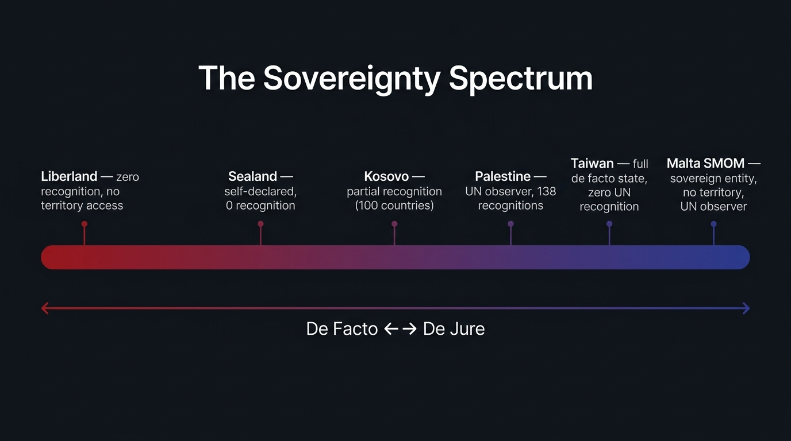

# Chapter 5: The Legal Ghosts (The Sovereign Club)

{#fig-sovereignty-spectrum fig-align="center"}

## I. The Via Condotti Paradox

If you take a taxi to the Via Condotti in the heart of Rome’s luxury shopping district on a warm afternoon, you will find yourself in one of the most intensely commercialized, highly congested corridors on the planet. This is a street of sensory overload, a glittering runway of human aspiration. The air is thick with the scent of dark espresso, expensive leather, and the heavy, sweet perfume wafting from the open doorways of high-end boutiques. On any given day, the narrow cobblestones are crowded with tourists, influencers, and window shoppers gazing at the latest displays from Gucci, Valentino, Prada, and Bulgari. It is a temple dedicated to the material markers of modern success and physical presence.

But if you walk down the street to number 68, you will encounter a grand, baroque palace with massive, iron-studded wooden gates. Above the portal hangs a carved coat of arms featuring a white, eight-pointed cross on a red shield. If you look closely, you might notice two flags flying from the first-floor windows: the green, white, and red tricolor of Italy, and a red banner bearing that same white cross. 

If you step through those gates, you are performing a minor miracle. You are, in the eyes of international law, leaving Italy. 

This is the Palazzo Malta. It is the headquarters of the Sovereign Military Order of Malta—or, to use its full name, the Sovereign Military Hospitaller Order of Saint John of Jerusalem, of Rhodes, and of Malta. The Palazzo, along with the Villa del Priorato di Malta on the Aventine Hill, enjoys extraterritorial status. The Italian police have no jurisdiction here. The Italian tax authorities cannot cross the threshold. The ground beneath your feet is a sovereign enclave, a tiny island of independence floating in the middle of Rome.

This is where the story of statecraft enters the realm of the surreal. The Sovereign Military Order of Malta (SMOM) does not control a single square mile of land. It has no physical territory other than these two properties in Rome, which are leased from Italy. Its permanent population is virtually non-existent; the knights and dames who make up the Order live all over the world as citizens of their home countries. It has no tax base, no national army, and no domestic economy. 

Yet, the Order is recognized as a sovereign entity by 113 nations. It exchanges ambassadors, conducts diplomatic missions, and enters into binding international treaties. It issues its own passports, which are accepted at border controls from Frankfurt to Tokyo. It prints its own postage stamps, which mail letters across the globe through bilateral agreements. It mints its own currency, the scudo, and registers its own diplomatic vehicles. And, perhaps most remarkably, it has a seat as a permanent observer at the United Nations, sitting in the same assembly halls as the United States, China, and the United Kingdom.

How does an entity with no land, no taxpayers, and no physical borders obtain the ultimate legal shield of sovereignty? To answer that, we must travel back nearly a thousand years, to a dusty hospital in the city of Jerusalem.

In the mid-eleventh century, before the first crusader had set foot in the Holy Land, a group of merchants from the Italian republic of Amalfi obtained permission from the Caliph of Egypt to build a church, a convent, and a hospital in Jerusalem. Their purpose was simple: to care for the pilgrims of all faiths who arrived in the holy city exhausted, sick, and penniless. The journey from Europe to Jerusalem was an extraordinary ordeal, fraught with physical peril. Pilgrims faced shipwrecks, banditry, extortion, and devastating diseases. By the time they reached the gates of the Holy City, many were near death, their bodies broken by the road. The hospital, led by a Benedictine monk known to history as Blessed Gerard, was designed as a sanctuary from this harsh reality.

Gerard and his companions were not warriors. They were healers and administrators of charity. They established a hospice that could accommodate hundreds of patients, providing them with food, clean clothing, and medical care. The patients were referred to as "our lords, the sick," reflecting a radical theology of service. To prevent infection—long before the germ theory of disease was ever conceived—the hospital enforced strict codes of hygiene. The patients were bathed regularly, their linen was changed daily, and they were served food on silver platters. The use of silver was not an exercise in luxury; rather, it was a practical observation that food served on silver was less likely to spoil, a medieval anticipation of silver's natural antimicrobial properties. Furthermore, the hospital was open to everyone: Christians, Muslims, and Jews were treated side-by-side by the same healers. It was a high-functioning system of universal care built in a region torn by sectarian strife.

But the world changed. In 1099, the armies of the First Crusade captured Jerusalem. The quiet, monastic hospital suddenly found itself at the epicenter of a global conflict. As the crusader states were established, they faced constant military threats. The Hospitallers realized that they could not protect their patients if they could not protect themselves. Under Gerard’s successor, Raymond du Puy, the Order took on a dual identity. They remained hospitallers, but they also became knights. Clad in black surcoats with a white cross, they built castles, trained soldiers, and became one of the most formidable military forces in the medieval world.

For the next seven centuries, the history of the Order was a history of displacement and reinvention. When Jerusalem fell to Saladin in 1187, the knights retreated to Acre. When Acre fell in 1291, they fled to Cyprus. Seeking their own territory, they launched a naval invasion of Rhodes in 1310. For two centuries, they ruled Rhodes as a sovereign maritime state, building a powerful navy and a legendary fortress city. In 1522, after a desperate six-month siege by Ottoman Sultan Suleiman the Magnificent, the outnumbered knights negotiated an honorable surrender. Suleiman, admiring their courage, allowed them to leave the island with their weapons, their treasures, and their flags.

In 1530, Emperor Charles V of Spain granted the knights the islands of Malta and Gozo. The rent was famously symbolic: one Maltese falcon, delivered every year on All Saints’ Day to the Viceroy of Sicily. In Malta, the knights constructed Valletta, a stone fortress city, and survived the legendary Great Siege of 1565. Suleiman sent a massive armada to crush them, but the Grand Master, Jean de Valette, led a desperate, brilliant defense. Against all odds, the knights held the island, converting Malta into the maritime shield of Southern Europe.

But in 1798, that land was taken from them by Napoleon Bonaparte. On his way to Egypt, Napoleon arrived off the coast of Malta and demanded entry. The Grand Master, Ferdinand von Hompesch, refused, citing the Order's charter which forbade them from taking up arms against fellow Christians. Napoleon used this as a pretext to invade. The knights, bound by their vows and lacking the will to fight a French army, surrendered. Napoleon expelled the Order from Malta, confiscated their treasury, and established French rule. The knights were scattered across Europe. For decades, the Order existed in a legal limbo, moving its headquarters from Trieste to Ferrara, and finally, in 1834, to Rome.

When the knights settled at the Palazzo Malta in Rome, they had no land left. The Treaty of Amiens in 1802 had promised to restore Malta to the Order, but the British eventually took control of the island, and the knights never returned. By all conventional metrics of political science, the Order should have dissolved. Instead, they pulled off one of the greatest survival acts in the history of international law: they convinced the world that their sovereignty was a property of their historical identity, not the soil.

Consider the tools of this landless sovereignty. The diplomatic passport issued by the Order is a dark red booklet, embossed with gold insignia. It is one of the rarest travel documents in existence, with only about 500 active passports in circulation for high officials and envoys. The passport is accepted at border controls worldwide, granting its holders full diplomatic immunity. 

Similarly, the Order’s postal service, the Poste Magistrali, has printed stamps since 1966. Through bilateral treaties signed with Italy and dozens of other nations, letters mailed from the Palazzo Malta are collected, transferred to the Italian postal system, and delivered internationally. 

Even more striking is the Aventine Hill property, the Villa del Priorato di Malta. The gate designed by the architect Piranesi in 1765 features a small, brass keyhole that frames a vaulted path of manicured cypresses. At the far end of the path rises the dome of Saint Peter’s Basilica. It is a stunning visual metaphor. Piranesi, a master of perspective and spatial drama, designed the gate to create an active tension between proximity and distance. By looking through a tiny keyhole, you look across three distinct sovereign jurisdictions: you are standing in Italy, looking through the garden of the Sovereign Military Order of Malta, at the dome of the Vatican City. It is a reminder that sovereignty is not about scale; it is about geometry. It is about how the lines are drawn, and who agrees to look through them.

How do we explain this? Why does Italy allow a landless organization to run a sovereign enclave in the middle of its capital? Why does the United Nations allow its ambassadors to speak in the General Assembly? 

The answer is that the Sovereign Military Order of Malta is the ultimate insider in what we might call the "Sovereign Club." It has a history that predates most modern states. It has a track record of diplomatic engagement that spans centuries. And, crucially, it poses no threat to anyone. The Order does not claim territory from its neighbors. It does not run a military that could threaten Italian security. Its modern mission is entirely humanitarian; it runs hospitals, ambulance corps, and disaster relief operations in over 120 countries. For the nations of the world, recognizing the Order of Malta is a low-risk, high-prestige gesture. It allows them to participate in a grand, historical tradition of diplomacy while supporting a global charity. It is sovereignty as a performance, a legal fiction that has been accepted for so long and by so many that it has become concrete reality.

But what happens when you are a physical giant, but a legal ghost that the club refuses to admit?

## II. The Spectrum of Existence

To understand the bizarre nature of the Sovereign Club, we must contrast the landless knights of Rome with a very different entity located six thousand miles to the east: the island of Taiwan.

If you fly into Taipei, you are entering a society that is, by every physical measure, a superpower. Taiwan has a population of 23 million people—more than three-quarters of the member states of the United Nations. It occupies a defined territory of 36,000 square kilometers, complete with bustling cities, high-speed rail networks, and deep-water ports. It has its own constitution, its own laws, and a highly stable democratic government with a president and a parliament elected through free and fair elections. 

Taiwan has its own currency, the New Taiwan Dollar, which is traded on global markets. It has its own central bank, its own tax system, and its own police force. Most importantly, it has its own military—a highly sophisticated force of over 150,000 active-duty personnel, equipped with F-16 fighter jets, Patriot missile defense systems, and modern naval destroyers. 

In the global economy, Taiwan is not just a participant; it is an indispensable hub. It produces over 60 percent of the world’s semiconductors and over 90 percent of the most advanced microchips. If Taiwan were to disappear tomorrow, the global technology sector would grind to a halt within days. The smart phones in our pockets, the servers that power the internet, the navigation systems in our cars—all of them depend on the physical factories of Taiwan, specifically those run by the Taiwan Semiconductor Manufacturing Company (TSMC). 

The story of TSMC is a study in structural leverage. Founded in 1987 by Morris Chang, a Chinese-born, American-educated engineer, TSMC pioneered the "pure-play foundry" model. Before TSMC, chip companies designed and manufactured their own silicon. Chang realized that as chips became more complex, the cost of building factories (fabs) would grow exponentially. His solution was simple: build a factory that only manufactured chips designed by others, promising never to compete with its customers. Today, that single business-model decision has made Taiwan the ultimate bottleneck of global capitalism. The world cannot afford to let Taiwan fall, not because of legal treaties, but because its factories are the physical foundation of the digital age. This is what policy analysts call Taiwan's "Silicon Shield."

Yet, if you look at an official map of the United Nations, Taiwan is not there. 

Taiwan has no ambassador in Washington, D.C. Instead, its diplomats work out of an office building called the "Taipei Economic and Cultural Representative Office." When Taiwan’s president travels abroad, the visits are classified as "transit stops" or "private tours" to avoid offending other nations. Taiwan is excluded from the World Health Organization, the International Civil Aviation Organization, and Interpol. When its athletes compete in the Olympic Games, they cannot fly their national flag or play their national anthem; they must march under the synthetic banner of "Chinese Taipei" and listen to a "National Banner Song" instead.

As of 2026, only twelve countries in the world maintain official diplomatic relations with Taiwan. Almost all of them are tiny microstates in the Pacific, Latin America, and Africa—nations like Palau, Tuvalu, and Paraguay, along with the Holy See. 

If the Sovereign Military Order of Malta is a state without land, Taiwan is a land without statehood. It is a ghost in the machine of international relations. It exists in reality, but it does not exist in the official ledger of nations.

And then, at the far end of this spectrum, there is a third entity that challenges the very definitions of what a country can be: the Principality of Sealand.

In the early 1960s, during the height of the pirate radio boom in the United Kingdom, pirate radio broadcasters sought places to set up transmitters outside the jurisdiction of British law. They found their answer in the Thames Estuary. During the Second World War, the British government had built several offshore fort platforms to defend against German bombers. These forts, known as the Maunsell Forts, consisted of concrete towers topped by steel decks, anchored to the seabed.

One of these platforms was HM Fort Roughs. Located approximately seven miles off the coast of Suffolk, it was situated in international waters—at the time, British territorial waters extended only three miles from the coast. After the war, the military abandoned the fort, leaving it to rust in the North Sea.

On September 2, 1967, a former British army major named Roy Bates occupied the platform, evicting a rival group of pirate radio broadcasters. But Bates did not just launch a radio station; he declared the platform to be the Principality of Sealand. He appointed himself Prince Roy, his wife Joan became Princess Joan, and their son Michael became the Crown Prince. They raised a flag—a red, white, and black diagonal tricolor—and declared their independence. 

For the next fifty years, the Bates family treated Sealand like a real country. They minted Sealand silver dollars, printed Sealand postage stamps, and designed passports. They established a constitution with a senate and a judiciary. 

They also defended their sovereignty with force. In 1968, when a British trinity house vessel approached the fort, Michael Bates fired warning shots from a .22 pistol. The British government arrested him. In the resulting trial, Regina v. Bates, the defense argued that because the platform lay seven miles out, it was in international waters, outside the three-mile limit of British territorial authority. The judge, Mr. Justice Chapman, agreed, ruling that the courts of England and Wales had no jurisdiction over the incident. The charges were dismissed. For Roy Bates, this was a de facto recognition of Sealand’s independence. If British law did not apply on the fort, then the fort must be a sovereign space.

Ten years later, in 1978, Sealand faced a coup. A German businessman named Alexander Achenbach hired a group of Dutch and German mercenaries. They stormed the platform while Prince Roy was away, taking Michael Bates hostage. Roy Bates launched a counter-attack, hiring a helicopter pilot and launching a dawn raid to recapture the platform. They held the mercenaries as prisoners of war. Germany was forced to send a diplomat from its London embassy directly to the platform to negotiate the release of the prisoners. Prince Roy claimed this visit was yet another official recognition of Sealand's sovereignty by West Germany.

Today, Sealand still sits in the North Sea. It is a rusting platform, its territory no larger than a tennis court. It has no permanent population and is not recognized by any country in the world. 

How do we make sense of this spectrum? We are looking at two competing theories of what makes a country: the **Constitutive Theory** and the **Declarative Theory**.

The Constitutive Theory of statehood argues that a state is a social construct. An entity does not become a state simply by existing; it becomes a state because other, existing states decide to recognize it. Recognition is "constitutive" of statehood. Think of it like admission to an exclusive country club. You must be accepted by the existing members. Under this theory, the Order of Malta is a state because 113 members have signed the ledger. Taiwan is not a state because the most powerful members have blackballed its application. Sealand is a fantasy because the club doesn't even know it exists.

The Declarative Theory of statehood, by contrast, was formalized in the **Montevideo Convention on the Rights and Duties of States** in 1933. Article 1 defines the four classic criteria: a permanent population, a defined territory, a government, and the capacity to enter into relations with other states. Crucially, Article 3 states: "The political existence of the state is independent of recognition by the other states." 

Under the Declarative Theory, statehood is a matter of fact, not permission. Under this view, Taiwan is indisputably a state. Sealand has a weak, disputed claim. The Order of Malta is not a state under Montevideo, as it has no permanent population of citizens and no defined territory.

In the abstract halls of law schools, these two theories are presented as equal options. But in the cold, hard world of international politics, the Constitutive Theory wins every time. Why? Because the Declarative Theory is a description of reality, but the Constitutive Theory is a description of power. If you want to run a country, you cannot survive on reality alone. You need power, and that power comes from the consensus of the Sovereign Club.

## III. The Gates of the Club

To understand why the Sovereign Club guards its gates so fiercely, we have to look at the tragic history of Taiwan’s diplomatic isolation. It is a story that reveals the cold, transactional nature of sovereignty—and shows why recognition is the ultimate legal shield.

In 1945, the Republic of China (ROC), led by Chiang Kai-shek’s Nationalist government, was a founding member of the United Nations and one of the five permanent members of the UN Security Council, holding the veto power alongside the United States, the Soviet Union, the United Kingdom, and France. 

But in 1949, Nationalist forces lost the Chinese Civil War to Mao Zedong’s Communists. Mao declared the People’s Republic of China (PRC) in Beijing, and Chiang’s government fled to the island of Taiwan. 

At that moment, two governments claimed to represent China. For the next two decades, the international system engaged in a massive exercise in denial. Led by the United States, the Western alliance insisted that the government in Taipei was the sole legitimate government of all of China. The UN seat remained in the hands of the ROC. The ambassador from Taipei sat on the Security Council, representing a mainland population of over 500 million people with whom he had no contact.

But by the late 1960s, this arrangement was becoming structurally unsustainable. The PRC was growing in economic and military power. Furthermore, the Sino-Soviet split offered a massive geopolitical opportunity. In Washington, Richard Nixon and Henry Kissinger saw a chance to rewrite the Cold War map by forging a relationship with Beijing to isolate Moscow.

In July 1971, Kissinger embarked on a secret trip to Beijing, code-named Operation Marco Polo. Feigning a stomach ailment during a visit to Pakistan, he vanished from public view and flew to Beijing to meet with Premier Zhou Enlai. The meetings were highly successful, laying the groundwork for Nixon’s historic visit. But Beijing’s price for this normalization was absolute: the derecognition of Taiwan. Under the "One China" principle, any country that wanted to have diplomatic relations with the PRC had to sever all official ties with the ROC.

The climax occurred on October 25, 1971, in the General Assembly hall of the United Nations in New York. For years, the UN had debated the "Question of China." George H.W. Bush, the U.S. Ambassador to the UN, fought a desperate rearguard action, proposing a "dual representation" formula where the PRC would take the Security Council seat and the ROC would retain its seat in the General Assembly. 

It was a sensible compromise, but it was dead on arrival. Neither Beijing nor Taipei would accept it; both insisted that sovereignty was indivisible. Chiang Kai-shek’s government remained fiercely committed to the "Han and rebels cannot stand together" policy, refusing to sit in the same chamber as the Communists. Mao Zedong was equally uncompromising.

The debate over UN General Assembly Resolution 2758 was intense and highly charged. The representatives of the ROC argued that they were the founders of the UN and had upheld the charter. But the arguments of realpolitik were stronger. The resolution was short, declaring it had decided "to restore all its rights to the People's Republic of China and to recognize the representatives of its Government as the only legitimate representatives of China to the United Nations, and to expel forthwith the representatives of Chiang Kai-shek from the place which they unlawfully occupy at the United Nations..."

The vote was a landslide: 76 in favor, 35 against, and 17 abstentions. The representatives of Taiwan gathered their papers and walked out of the assembly hall before the final vote was recorded. They did not return. The passage of Resolution 2758 triggered a diplomatic cascade. One by one, the nations of the world scrambled to establish relations with Beijing, cutting ties with Taipei. Japan switched recognition in 1972. The United Kingdom, Australia, Canada, and West Germany followed. The final blow came on December 15, 1978, when President Jimmy Carter announced that the United States would formally recognize the PRC as the sole legal government of China, terminate its mutual defense treaty with Taiwan, and withdraw its military forces from the island.

For the people of Taiwan, this was the "Diplomatic Apocalypse." Overnight, they went from being a pillar of the international order to a non-person. What happens to a state when the club revokes its membership? It loses the legal protections that keep it safe.

Consider the case of the Twin Oaks estate in Washington, D.C., the official residence of the ROC Ambassador. Built in 1888, the stunning Georgian Revival mansion was a symbol of Taiwan’s diplomatic prestige. When the Carter administration switched recognition, the PRC claimed ownership of Twin Oaks under international laws governing state property succession. To prevent Beijing from seizing it, Taiwan's diplomats sold the estate for the symbolic price of $10 to a private American organization, the Free China Relief Association, just before the January 1 deadline.

The property was saved only because the United States Congress intervened, passing the **Taiwan Relations Act (TRA)** of 1979. The TRA is a unique piece of legislation designed to maintain a relationship with a country that the US officially claims does not exist. It declared that the laws of the United States would apply to Taiwan in the same way they apply to foreign countries, guaranteeing that all property owned by Taiwan before 1979 would remain theirs. To conduct relations, the TRA established the **American Institute in Taiwan (AIT)**, a private, non-profit corporation staffed by State Department officials on "temporary leave" to act as a de facto embassy.

The Taiwan model is a brilliant piece of legal engineering, but it is a fragile existence. Because Taiwan lacks official recognition, its security is a constant source of anxiety. It cannot join collective defense treaties. If China were to launch an invasion of Taiwan, the United States is not legally bound to defend the island in the way it is bound to defend its NATO allies. 

This is why recognition is the ultimate legal shield. When a state is recognized, its borders are protected by the charter of the United Nations. Article 2(4) of the UN Charter prohibits the threat or use of force against the territorial integrity or political independence of any state. An attack on a recognized state is a violation of international law, triggering the possibility of UN-sanctioned military action.

Without recognition, a state exists in a legal gray zone. If China attacks Taiwan, Beijing can argue that it is not invading a sovereign country, but is merely conducting a domestic police action to reclaim a renegade province. To the rest of the world, intervening in such a conflict carries immense legal and political risks.

The Sovereign Club is a protection cartel. The existing members guard the gates because they want to preserve their own security and territorial integrity. If the club makes it easy to get in, then any separatist region—be it Catalonia, Scotland, Kurdistan, or Somaliland—can demand a seat at the table. By keeping the gates locked, the club maintains the fiction that borders are permanent. It is a system designed by the winners of history to protect their winnings.

For the accidental founder, this reality is both a warning and a guide. If you want to build a country, you cannot rely on the Montevideo criteria alone. You can build the most efficient bureaucracy and the strongest economy, but if you do not understand how to navigate the Sovereign Club, you will remain a ghost. You will be a country without a shield.

## IV. The Manual Page: Navigating the Sovereign Club

::: {.manual-panel}
**SECTION 5.1: THE SOVEREIGN CLINIC [ADMINISTRATIVE PROTOCOL**

- SECTION 5.1: THE SOVEREIGN CLINIC [ADMINISTRATIVE PROTOCOL]
- This document outlines the playbook for securing, managing, and leveraging
- sovereignty under international law. In statecraft, sovereignty is a dual-key
- system requiring both de facto functionality (Declarative) and de jure
- acceptance (Constitutive).
- 1. THE DUAL-KEY SOVEREIGNTY MATRIX
- A founder must monitor their state's status across both dimensions. Failure
- in either matrix results in systemic vulnerability.
- PARAMETER DECLARATIVE STATEHOOD CONSTITUTIVE STATEHOOD
- Legal Source Montevideo Convention (1933) International Consensus
- Focus Internal Reality (Facts) External Recognition (Club)
- Core Requirement Control of Territory & Pop. Diplomatic Treaties & Votes
- Primary Tool Bureaucracy, Police, Taxes Foreign Relations Office
- Vulnerability Diplomatic Isolation Territorial Eviction
- Example Taiwan (High Fact, Low Club) SMOM (Low Fact, High Club)
- 2. THE MONTEVIDEO COMPLIANCE PROTOCOL (DECLARATIVE PATHWAY)
- Before seeking external recognition, you must establish a baseline of de facto
- control that satisfies the four criteria of the Montevideo Convention:
- A. Population Stabilization:
- * Establish a registry of citizens with unique biometric identifiers.
- * Document a permanent residency requirement (minimum 183 days per year).
- * Issue physical identity documents to prevent nomadic dilution.
- B. Territorial Delineation:
- * Map borders using GPS coordinates registered with the International
- Hydrographic Organization or relevant regional body.
- * Establish border checkpoints, even if they are symbolic or virtual.
- * Maintain physical infrastructure on the claimed land to show occupancy.
- C. Administrative Execution (Government):
- * Create a centralized system for the collection of taxes or duties.
- * Deploy a security force holding a monopoly on the legitimate use of
- violence within the defined territory.
- * Establish a dispute resolution mechanism (courts) accessible to citizens.
- D. Capacity for External Relations:
- * Establish a Ministry of Foreign Affairs (MFA).
- * Appoint diplomatic representatives with clear credentials.
- * Create a communications network capable of sending secure cables.
- 3. THE RECOGNITION PLAYBOOK (CONSTITUTIVE PATHWAY)
- Gaining entry to the Sovereign Club is a progressive, non-linear process. A
- founder should follow the "Staircase of Recognition" to minimize risk and
- maximize diplomatic return.
- THE STAIRCASE OF DIPLOMATIC RECOGNITION
- [ LEVEL 4: UN MEMBERSHIP ] > The Ultimate Goal (Veto Barrier)
- [ LEVEL 3: BILATERAL TREATIES ] > Formal Recognition (Ambassadors)
- [ LEVEL 2: UNOFFICIAL MISSIONS ] > De Facto Relations (Trade Offices)
- [ LEVEL 1: TECHNICAL ENGAGEMENT ] > Functional Recognition (ITU, ISO)
- ### LEVEL 1: Technical & Functional Engagement
- Do not begin by asking superpowers for recognition. Instead, target functional,
- apolitical international bodies where entry criteria are technical rather
- than political.
- * **The Postal Play**: Apply for UPU membership or sign treaties with
- neighboring postal authorities. Postal delivery is a soft marker of sovereignty.
- * **The Standards Game**: Join the ISO to obtain a country code (e.g., ISO
- 3166-1 alpha-2). A two-letter code is required for internet TLDs (.tw, .ee)
- and financial routing.
- * **The Registries**: Establish ship and aviation registries that conform
- strictly to international safety standards.
- ### LEVEL 2: The Unofficial Representation Model (The "Taiwan Playbook")
- When formal recognition is blocked by a geopolitical rival, establish a
- dual-track system to conduct relations without official status.
- * **Corporate Shelling**: In target countries, incorporate a private,
- non-profit entity (e.g., "The [State Name] Economic and Cultural Center").
- This entity will act as your de facto embassy.
- * **Staffing Fictions**: Staff these offices with MFA officials who are
- placed on "temporary leave" or "secondment" from the civil service. This
- protects their career path while maintaining operational professionalism.
- * **Consular Services Under the Table**:
- * Do not issue visas directly from the representative office. Instead,
- issue "travel authorizations" online.
- * Use a private database to verify identities, printing the entry permit
- as a PDF that the traveler presents at your border.
- * **Asset Protection**: Store all state property abroad in the name of these
- private corporations. This prevents a rival from claiming them under
- sovereign succession laws.
- ### LEVEL 3: Bilateral Treaties & Mutual Recognition
- Target vulnerable, small, or transactionally minded members of the UN.
- * **The Microstate Coalition**: Target Pacific, Caribbean, or African microstates
- who have low geopolitical exposure. These countries often trade diplomatic
- recognition for economic development assistance or trade agreements.
- * **The Mutual Recognition Treaty (MRT)**: Draft bilateral treaties that focus
- on mutual benefits. Frame the treaty around joint challenges:
- * *Double Taxation Treaties*: Crucial for business flows.
- * *Extradition Treaties*: Establishes mutual trust in legal systems.
- * *Visa-Free Agreements*: Enhances the value of your passport.
- ### LEVEL 4: UN Membership (The Sovereign Apex)
- UN membership is the ultimate legal shield, but it is defended by the five
- permanent members of the Security Council (P5), who hold veto power.
- * **The Observer Pathway**: If a veto is guaranteed, apply for Permanent
- Observer status under the precedent of the Holy See and the Sovereign
- Military Order of Malta. This requires a majority vote in the General
- Assembly but avoids the Security Council veto.
- * **The Leverage Strategy**: Build a coalition of G77 (developing) nations by
- aligning your diplomatic positions with their resource demands. A large
- bloc of votes in the General Assembly can force concessions from the P5.
- 4. TREATY DRAFTING PROTOCOL: THE MUTUAL RECOGNITION AGREEMENT (MRA)
- When drafting an MRA, use the following standardized clauses to ensure
- compliance with international legal norms.
- MUTUAL RECOGNITION AGREEMENT
- Between: The State of [Founder's State] ("Party A")
- And: The Republic of [Partner State] ("Party B")
- ARTICLE I: RECOGNITION OF SOVEREIGNTY
- The Parties formally recognize each other as sovereign, independent states under
- the principles of international law, and agree to conduct relations in
- accordance with the Charter of the United Nations.
- ARTICLE II: DIPLOMATIC MISSIONS
- The Parties agree to establish formal diplomatic relations and to exchange
- diplomatic representatives at the rank of Ambassador Extraordinary and
- Plenipotentiary. The properties, personnel, and communications of these
- missions shall enjoy the immunities set forth in the Vienna Convention on
- Diplomatic Relations of 1961.
- ARTICLE III: APPLICABILITY OF LAW
- Party B agrees that all assets, properties, and accounts registered in the name
- of Party A, its agencies, or its designated representative corporations within
- the jurisdiction of Party B shall remain the exclusive property of Party A,
- immune from seizure, expropriation, or transfer to any third party claiming
- sovereign succession.
- 5. TROUBLESHOOTING DIPLOMATIC CRISES
- A. Derecognition Event:
- * *Symptom*: A key ally announces they are switching recognition to a rival.
- * *Immediate Action*: Within 24 hours, transfer all embassy real estate and
- bank assets to a pre-established private foundation.
- * *Mitigation*: Restructure the official embassy into an "Economic Office"
- under the Taiwan model to preserve operational channels.
- B. Passport Rejection:
- * *Symptom*: A major transit hub refuses to accept your citizens' passports.
- * *Immediate Action*: Negotiate a bilateral transit document agreement.
- Agree to issue a secondary identity document read by standard scanners.
- * *Mitigation*: Ensure your passport chip conforms strictly to the International
- Civil Aviation Organization (ICAO) Doc 9303 standards. Many rejections
- are technical, not political.
- END OF FILE [STATECRAFT INSTRUCTIONS]
:::
