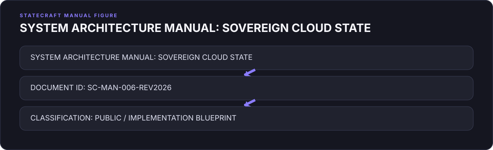
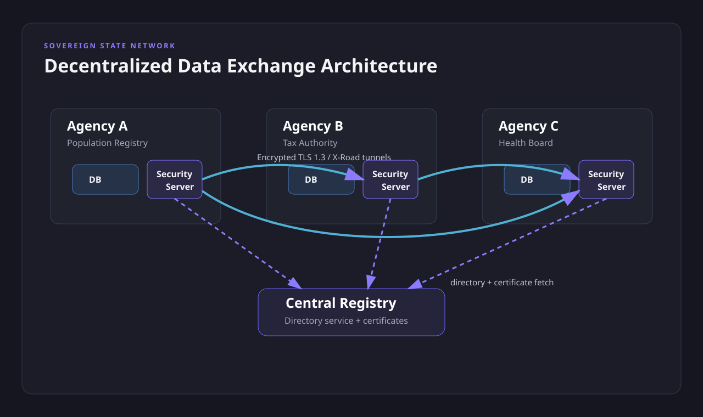
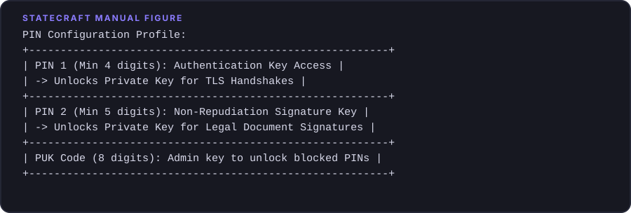
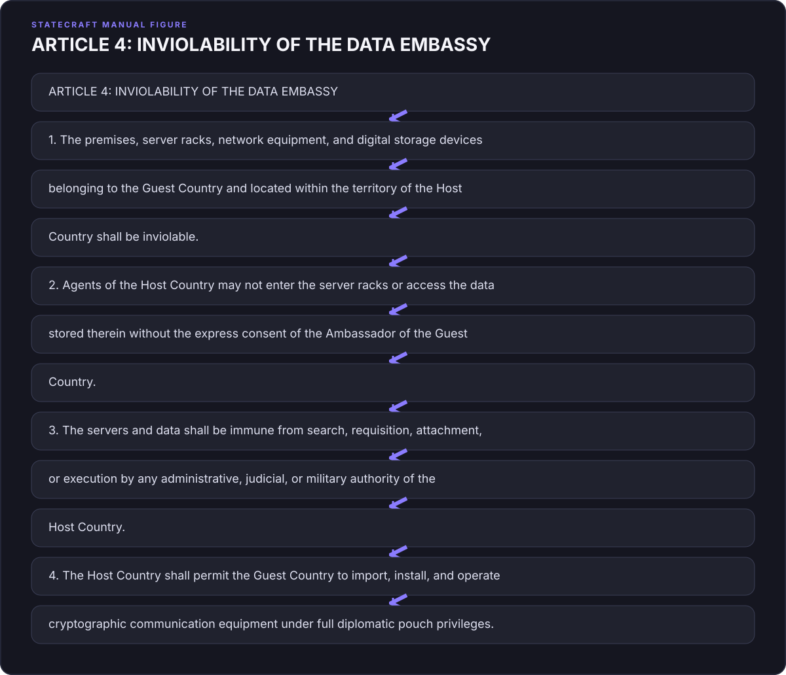
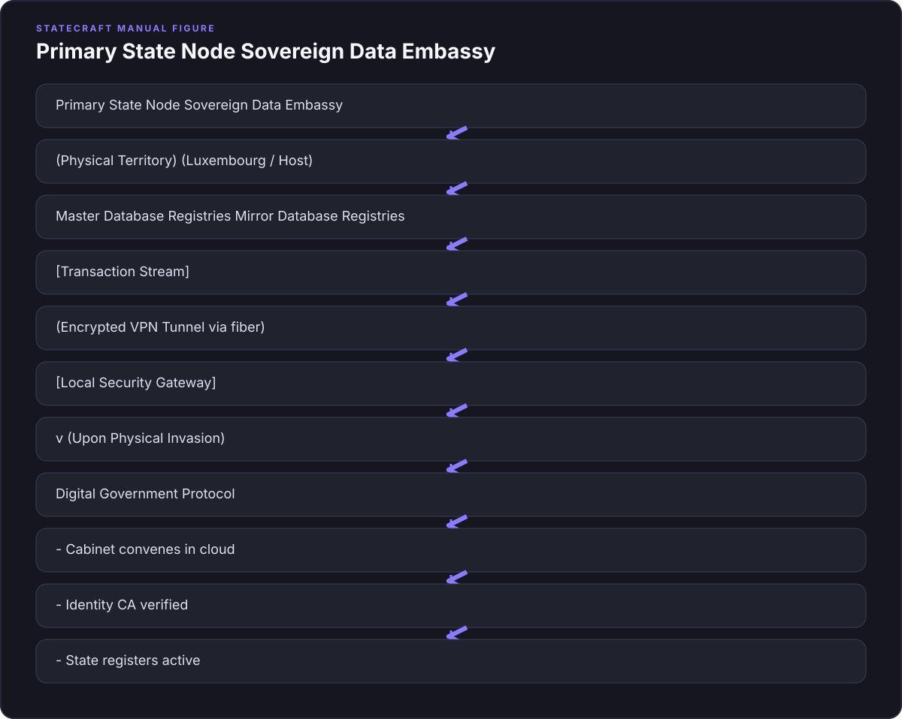

# Chapter 6: The Digital Fortress (The Cloud State and the Decoupled Registry)

## 1. The Hook: The Startup in the Ruins

If you had walked into the prime minister’s office in Tallinn in the late autumn of 1992, you would have been forgiven for thinking you had stepped backward in time, or perhaps into a stage play about the collapse of an empire. The walls were covered in the dreary, institutional wallpaper favored by Soviet bureaucrats—a shade of faded mustard that seemed designed to induce melancholy. The radiator clanked and hissed like a dying steamship, emitting more soot than heat. Outside the window, the Baltic sky was the color of wet slate, and the air smelled of burning lignite and cheap diesel fuel. 

Sitting behind a massive, dark oak desk was Mart Laar. He was thirty-two years old. 

By any conventional measure of political leadership, Laar was absurdly, almost comically, unqualified. He was a historian by training, a man who spent his twenties studying the nineteenth-century Estonian national awakening and the armed resistance of the "Forest Brothers" against Soviet occupation. He had never run a business. He had never managed a government department. He had never even owned a computer. When he was appointed Prime Minister of the newly restored Republic of Estonia, his entire cabinet was similarly green. The average age of his government was thirty-five. They were known, not entirely affectionately, as the "boys' choir."

"I was young and crazy," Laar would later recall, his voice carrying the mild, self-deprecating chuckle of a survivor. "We didn’t know what was possible, so we did what was impossible."

The country Laar inherited was not just poor; it was structurally broken. For fifty years, Estonia had been integrated into the command economy of the Soviet Union. When the union collapsed, it took Estonia’s economic foundations with it. The inflation rate of the Russian rouble, which Estonia was still forced to use, was running at over 1,000 percent. The shops were empty of bread, milk, and soap. In the freezing winter of 1991–1992, the government had to ration heating oil; apartments in Tallinn dipped below freezing, and residents slept in coats and boots. The state’s administrative machinery was a mountain of carbon-paper ledgers, rusting filing cabinets, and rotary-dial telephones that rarely connected to lines outside the city limits.

But the most terrifying thing in Estonia in 1992 was not the economic ruin. It was the geography.

If you stand on the top of Toompea Hill in Tallinn and look north, you see the Gulf of Finland. Look south and west, and you see flat, marshy plains that roll uninterrupted toward the horizon. Now look east. Just two hundred kilometers away lies Russia. 

In 1992, the Russian military was not a distant threat; it was an occupying force. There were still over twenty thousand Russian troops stationed on Estonian soil, occupying military bases, controlling airfields, and refusing to leave. The tanks of the Northwestern Group of Forces were parked in forests just a few hours’ drive from the parliament building. Estonia’s own military consisted of a few thousand poorly armed volunteers with mismatched uniforms and hunting rifles. If Moscow decided to reverse the events of 1991 and send its armored divisions back across the border, the physical defense of Estonia would have lasted less than forty-eight hours. The country would have been swallowed before the United Nations could draft a resolution.

This is the classic dilemma of the accidental founder of a nation. You have successfully declared your independence. You have a flag, a national anthem, and a seat at the table of nations. But you are tiny, your neighbor is a nuclear-armed giant with imperial nostalgia, and you have no money to build a conventional military deterrent. How do you survive?

Most nations in this position would have followed the historical playbook. They would have built concrete bunkers along the border, instituted mandatory conscription, and spent every scrap of their meager GDP buying surplus cold-war weapons from the West. They would have tried to play the game of physical deterrence, even though the math was hopelessly against them.

Mart Laar and his young reformers did something else. They realized that in the game of physical mass, Estonia would always lose. Therefore, they had to change the game entirely. They had to decouple the state from the physical territory it occupied. 

The story of how they did this begins with a surprising visit from a delegation of Swedish diplomats in 1993. 

The Swedes, eager to help their newly independent neighbor across the Baltic Sea, arrived in Tallinn with a generous offer. They were upgrading their own telecommunications network and had a large quantity of analog telephone exchanges that were being decommissioned. They offered to donate these exchanges to Estonia, free of charge. To a country where getting a telephone line installed could take ten years of waiting on a bureaucratic registry, this seemed like a godsend. 

Mart Laar looked at the analog exchanges, looked at his young cabinet, and said no. 

The Swedes were flabbergasted. "They thought we were crazy," Laar said. "Here we were, a country with nothing, refusing free technology from one of the richest nations in the world."

But Laar had a different logic. He understood what economists call the *advantages of backwardness*—a concept popularized by the economic historian Alexander Gerschenkron. Gerschenkron argued that relatively backward countries do not need to follow the same step-by-step path that advanced nations took. Because they do not have massive capital invested in older, obsolete technologies, they can leapfrog directly to the cutting edge. 

If Estonia accepted Sweden's analog exchanges, they would spend the next twenty years building an analog infrastructure, hiring technicians to maintain it, and locking themselves into a technology that was already dying. They would be constantly trying to catch up to Sweden. By refusing the gift, Estonia forced itself to go straight to digital. They skipped the analog era entirely.

This was the spark that ignited what would become "e-Estonia." The reformers looked at the mountain of paper bureaucracy that defined the post-Soviet state—the stamps, the signatures, the carbon copies, the long lines of citizens waiting in drafty corridors to get a permit to get another permit—and they saw it not as a necessity, but as a liability.

In a traditional state, bureaucracy is physical. It is housed in brick-and-mortar buildings. It is filed in cabinets. It is signed with ink. This physical nature makes it vulnerable. In 1940, when the Soviet Union occupied Estonia, they did not just march in troops; they walked into the government offices, seized the paper land registries, confiscated the citizen files, and rewrote the records. They erased the old Estonia by seizing its paper.

Laar and his team asked a radical question: What if the state did not exist in paper? What if the registry of who owns what land, who is a citizen, who has paid what taxes, and who has what rights was not stored in a physical building that could be bombed, burned, or occupied by a foreign army?

What if the state could be moved to the cloud?

To do this, however, they had to solve a fundamental problem of human coordination. They had to build an infrastructure of trust in a society where trust had been systematically destroyed by fifty years of totalitarian rule. Under the Soviet regime, the state was the enemy; citizens survived by lying to it, hiding from it, and subverting it. The reformers had to construct a digital system that was so secure, so transparent, and so efficient that the population would willingly trust it with their lives.

They did not start with a grand master plan. They started with a series of small, counter-intuitive experiments. They created a flat tax system that was so simple it could be calculated on a single sheet of paper—and later, filed online in less than three minutes. They passed a law that made digital signatures legally equivalent to handwritten ones. They put computers in every school and connected them to the internet, a project called the *Tiigrihüpe* (Tiger Leap).

And then, in 2001, they launched the technology that would permanently rewrite the rules of statecraft. They called it the X-Road.

---

## 2. The Pivot: State as a Service (SaaS)

To understand what the X-Road is, it is helpful to understand what it is not. 

When most governments decide to digitize their operations, they build a giant, centralized computer system. They build a master database—a digital fortress—where they store everything: your tax records, your medical history, your driver's license, your address, and your criminal record. They build a giant server farm, surround it with barbed wire and armed guards, and call it secure.

But this centralized model is a relic of the mainframe era. It is the digital equivalent of the old Westphalian state: a single, vulnerable target. If you are an enemy state, or a sophisticated hacker, you only need to penetrate one wall to get everything. If that central server goes down, the entire government grinds to a halt.

Estonia’s tech reformers, led by a brilliant cyberneticist named Uuno Vallner, realized that a centralized database was a geopolitical suicide note. If Russia launched a cyberattack against a central Estonian database, they could erase the country's records in an afternoon. 

So, Estonia built the X-Road as a decentralized network. 

The X-Road is not a database. It is a set of protocols, an invisible secure highway that connects hundreds of independent databases maintained by different government agencies and private companies. There is no master server. The police department has its database; the tax board has its database; the hospitals have theirs; the schools have theirs. If a police officer pulls you over on a dark road near the Russian border and needs to check if your driver's license is valid, their patrol car computer does not query a central government hub. Instead, via the X-Road, it sends an encrypted query directly to the transport department's database. The transport department verifies the license and sends the answer back. The transaction takes milliseconds.

This architecture represents a profound philosophical shift in the nature of the state. It is the transition from the state as a *landowner* to the state as a *service provider*—or, in the language of modern technology, **State as a Service (SaaS)**.

In the Westphalian system, which has governed the world since 1648, sovereignty is strictly tied to soil. A state is defined by the physical territory within its borders. The government is the entity that exercises a monopoly on the legitimate use of violence within that territory. If you lose the soil, you lose the state.

But SaaS decouples the functions of the state from the physical land. 

Think about what a government actually does on a day-to-day basis. Strip away the flags, the military parades, and the ceremonial speeches, and what remains? A state is essentially a manager of registries. It is a giant database that keeps track of who owns what house (the land registry), who is allowed to practice medicine (the medical registry), who owes what money (the tax registry), and who is a member of the community (the citizen registry). 

If you can digitize these registries, secure them with cryptography, and make them accessible from anywhere in the world, the physical territory of the state becomes secondary. The state becomes a software platform that runs on top of the physical world.

This decoupling has two revolutionary consequences for the accidental founder.

First, it changes the economics of governance. In the physical world, scaling a state is incredibly expensive. If your population grows, you need to build more government offices, hire more clerks, print more forms, and build bigger archives. The marginal cost of adding a new citizen is high. But in a SaaS model, the marginal cost of adding a new user to the state platform is virtually zero. Once you have built the secure data exchange layer and the digital identity infrastructure, adding the one-millionth citizen costs the same as adding the one-hundredth.

Second, it changes the nature of national defense. In a conventional invasion, the enemy’s goal is to capture the capital city, occupy the government buildings, and seize control of the state apparatus. If the state's registries are physical, they are captured. But if the state is run via a decentralized digital registry like the X-Road, there is no central apparatus to seize. The physical government buildings in Tallinn could be occupied, the parliament could be turned into barracks for foreign troops, but the state would still exist. 

The registry of who owns the land in Estonia, who has money in the banks, and who has the right to vote would remain intact, running on servers located outside the country's physical borders. The physical territory would be occupied, but the sovereign registry would remain free.

"The X-Road," says Tarvi Martens, one of the key architects of Estonia's digital identity system, "is not just a technical solution. It is a social contract written in code."

To make this social contract work, however, the founders of e-Estonia had to solve the twin problems of identity and consent. They had to create a way for citizens to prove who they were in the digital wilderness, and they had to give them absolute control over their own data. They had to build the digital identity card.

---

## 3. The Investigation: The Architecture of the Cloud State

To understand how Estonia built its digital fortress, we must look at the specific, elegant pieces of engineering that make it work. The system rests on three pillars: the decentralized data exchange (X-Road), the digital identity (eID), and the immutable log.

Let us start with the digital identity card, the eID. 

In most Western countries, digital identity is a fragmented, insecure mess. You log into your bank with one password, your tax portal with another, and your health records with a third. Many of these systems rely on weak authentication methods, like SMS verification or security questions about your mother's maiden name. They are easily phished, easily hacked, and offer no legal certainty.

Estonia bypassed this by making the digital identity card mandatory for every citizen and resident. 

The card looks like a standard credit card, but it contains a gold-plated microchip. This chip holds two private cryptographic keys, protected by two separate PIN codes. 
*   **PIN1** (four digits) is used for **authentication**. It proves who you are. When you insert your card into a reader (or use your mobile phone with a secure SIM card) and enter PIN1, you generate a cryptographic handshake that proves your identity to any connected database.
*   **PIN2** (five digits) is used for **authorization**. It creates a digital signature. Under Estonian law—specifically the Digital Signatures Act of 2000—a signature created with PIN2 has the exact same legal validity as a handwritten signature on a physical piece of paper. It cannot be repudiated. You can use it to sign a mortgage, buy a car, or cast a vote in a parliamentary election.

The genius of the eID is that the private keys never leave the chip. When you sign a document, the document is sent to the chip, the chip signs it using the private key, and the signed document is sent back. The key itself is never exposed to the computer or the internet. It is cryptographically impossible to steal the key without physically possessing the card and knowing the PIN.

But how do these databases talk to each other without compromising privacy? This is where the X-Road’s architecture becomes crucial. 

The X-Road operates on a principle called the **Once-Only Principle**. 

In a traditional bureaucracy, you are constantly asked to provide the same information to different agencies. The DMV wants your utility bill to prove your address; the school district wants your birth certificate to enroll your child; the tax office wants your employment contract. The state is constantly duplicating data, creating mismatched records and massive administrative friction.

Under the Once-Only Principle, the Estonian state is legally forbidden from asking you for information it already has stored in another database. Your address is stored in the Population Registry, and only there. Your medical records are stored in the Health Registry, and only there. 

If the Ministry of Education needs to verify that you are eligible for a student grant, they cannot ask you to bring in a paper tax return. Instead, their system automatically sends an encrypted query via the X-Road to the Tax and Customs Board’s database. The tax database verifies your income and sends a simple "Yes" or "No" back to the Ministry of Education. The data is not copied; it is merely accessed.

This brings us to the third, and perhaps most revolutionary, pillar of the system: the **Immutable Log**.

In most countries, the greatest threat to data privacy is the state itself. Citizens fear that government officials—police officers, tax inspectors, politicians—are sifting through their private records behind closed doors. And historically, they have been right. In the physical world, if a corrupt clerk opens your paper file in a filing cabinet, they leave no trace.

Estonia solved this by turning the tables. In e-Estonia, the citizen is the owner of their data. 

Every time any government official or private company accesses your data via the X-Road, the transaction is logged. The log is not stored by the agency that accessed the data, nor is it stored by the agency that holds the data. Instead, it is recorded in a secure, decentralized ledger. 

When you log into your personal state portal (eesti.ee), you can see a complete list of everyone who has looked at your records. You can see that a doctor looked at your health records at 10:14 AM on a Tuesday, or that a police officer checked your driver's license at 11:30 PM on a Saturday. 

If a government employee accesses your data without a valid legal reason—if, for example, a police officer looks up the address of their neighbor or a celebrity—it is a serious criminal offense. The log is admissible in court. In Estonia, government officials have been fired and prosecuted because citizens noticed unauthorized queries in their logs and alerted the data protection ombudsman. 

To ensure that these logs cannot be altered or erased by the government itself, Estonia uses a technology called **KSI Blockchain** (Keyless Signature Infrastructure). Developed by an Estonian cybersecurity company called Guardtime in the mid-2000s, KSI Blockchain is a distributed ledger designed to verify the integrity of data without relying on trusted central authorities. 

Long before Bitcoin made the term "blockchain" famous, Estonia was using cryptographic hash chains to sign every state log, every registry entry, and every system configuration. Every second, the state generates a cryptographic hash of all system events, which is merged into a global Merkle tree. Once a hash is written to the blockchain, it is mathematically impossible to change a single digit of any record without breaking the entire chain. Even the Prime Minister, or the chief system administrator, cannot erase a log entry to cover their tracks. The state's past is permanently written in cryptographic stone.

In 2014, having secured their internal state, the Estonian reformers took another step. They realized that if the state is a software platform, they did not have to limit its users to people who happened to be born within Estonia's physical borders. 

They launched **e-Residency**. 

The program was the brainchild of Taavi Kotka, the state's first Chief Information Officer, Siim Sikkut, a policy adviser, and Ruth Annus, a government official. Their goal was simple: to grow Estonia’s digital economy by exporting its digital infrastructure. 

For a fee of around one hundred euros, anyone in the world can apply for e-residency. After a background check by the Estonian police, the applicant receives a digital ID card identical to the one used by Estonian citizens. 

An e-resident does not get a physical passport. They do not get the right to live in Estonia, nor do they get the right to vote in Estonian elections. But they do get access to the e-Estonia platform. From their laptop in Tokyo, Berlin, or Lagos, an e-resident can register an Estonian company in less than fifteen minutes, open an EU bank account, access international payment processors, and sign contracts with legal certainty under EU law. 

For digital nomads, freelancers, and entrepreneurs in developing countries who are locked out of the global financial system, e-residency is a lifeline. For Estonia, it is a massive economic driver. Today, there are more than 100,000 e-residents who have founded over 25,000 companies in Estonia, paying millions of euros in taxes and fees to a country they may never have physically visited.

But the ultimate test of the cloud state came not from economic growth, but from geopolitical crisis. 

In April 2007, Estonia was hit by the world's first coordinated state-sponsored cyberattack. Following a dispute with Russia over the relocation of a Soviet war memorial in Tallinn, Estonia's government websites, bank networks, newspaper servers, and telecommunications infrastructure were flooded by a massive Distributed Denial of Service (DDoS) attack. The traffic came from Russian IP addresses, including government servers. For a few days, the digital state was under siege. ATMs stopped working, government offices could not communicate, and the country was temporarily cut off from the digital world.

Estonia survived the attack because of the decentralized nature of the X-Road and the quick response of its cybersecurity teams. But the event was a wake-up call. It proved that if the servers hosting Estonia's registries were physically located only in Estonia, they were still vulnerable to physical destruction or network isolation. 

What if a physical invasion cut the underwater internet cables connecting Estonia to Europe? What if a bomb destroyed the state server farm in Tallinn?

The solution was the **Data Embassy**. 

In 2017, Estonia signed a bilateral agreement with the government of Luxembourg. Under the treaty, Estonia leased a highly secure, Tier 4 data center run by the Luxembourg government. 

This data center hosts a mirror copy of Estonia's critical state registries: the land registry, the population registry, the business registry, the treasury, and the identity management system. 

The legal engineering of this agreement is as important as the technical engineering. Under the treaty, the servers in Luxembourg enjoy the exact same diplomatic status as a physical embassy. They are sovereign Estonian territory. The Luxembourg police cannot enter the server room; the Luxembourg courts cannot subpoena the data; the Luxembourg government cannot touch the power switches. The servers are protected by the Vienna Convention on Diplomatic Relations.

If Russian tanks were to roll across the border tomorrow, capture Tallinn, and shut down the physical infrastructure of the country, the Estonian state would not die. 

The government would invoke its disaster recovery protocol. The Prime Minister and the cabinet, using their eID cards from secure locations abroad, would log into the Luxembourg servers. They would declare the digital government active. 

The land registry in Luxembourg would still prove who owns every house in Estonia, preventing the occupying power from confiscating property. The bank registries would prove who owns what money. The citizen registry would prove who is an Estonian. The state would continue to collect taxes, pay pensions, and pass laws from the cloud. 

"We can lose our territory," Taavi Kotka once said. "But as long as we keep our data, we keep our country."

---

## 4. The Manual Page: Blueprints for the Cloud State

This section provides the technical specifications, architectural designs, and legal frameworks required to deploy a decentralized, sovereign digital state.

{#fig-chapter-6-digital-01-system-architecture-manual-sovereig fig-align="center"}

### 4.1 Decentralized Data Exchange Architecture (X-Road Model)

A sovereign government must avoid centralized database architectures. All public and private sector systems must connect via a peer-to-peer, secure data exchange layer.

{#fig-x-road-architecture fig-align="center"}

#### Technical Components:
1.  **Security Servers**: The gatekeepers of the network. Every agency or database must connect to the data exchange layer through a physical or virtual Security Server. The Security Server manages:
    *   **Mutual TLS Encryption**: End-to-end encryption between security servers.
    *   **Cryptographic Signatures**: Every message sent is signed with the sender’s organization certificate (X.509) and timestamped.
    *   **Access Control**: Enforcement of local database access policies.
2.  **Central Registry**: A non-data-hosting directory service that publishes:
    *   The list of active members (agencies and security servers).
    *   The public key infrastructure (PKI) certificates for all members.
    *   The address lookup table for message routing.
3.  **Semantic Interoperability Layer**: A unified schema registry (e.g., XML/JSON schemas via WSDL or OpenAPI) that defines standard data formats for all queries.

#### Operational Rules for Data Exchanges:
| Parameter | Rule | Implementation Specification |
| :--- | :--- | :--- |
| **Data Ownership** | Once-Only Principle | Data must be stored in one authorized registry only. No secondary database may store a permanent copy of primary data fetched from another registry. |
| **Logging** | Mandatory KSI Signatures | Every request and response payload hash must be signed and written to a Keyless Signature Infrastructure (KSI) blockchain ledger within 1.0 seconds. |
| **Authentication** | Two-Factor Cryptographic | All queries must contain the digital signature of the querying system, matching an active certificate in the Central Registry. |

---

### 4.2 Digital Identity (eID) Infrastructure

A sovereign digital identity requires a Public Key Infrastructure (PKI) backed by hardware security modules (HSM) and physical cryptographic tokens.

#### The Cryptographic Token Specification:
*   **Chip Standards**: ISO/IEC 7816 compliant smart card or eSIM with Common Criteria EAL6+ certification.
*   **Cryptographic Algorithms**: Elliptic Curve Cryptography (ECDSA) with NIST P-384 or Ed25519 for signatures; RSA 4096 as a legacy fallback.
*   **Key Storage**: Private keys must be generated directly on the smart card chip and marked as non-exportable. 

{#fig-chapter-6-digital-02-pin-configuration-profile fig-align="center"}

#### Verification Lifecycle Workflow:
1.  **Enrollment**: Citizen registers in person at a physical government station. Biometrics (fingerprints, facial scans) are bound to a unique state identification number.
2.  **Key Generation**: The HSM on the card generates the public/private key pairs. The private key remains on the card. The public key is sent to the State Certification Authority (CA).
3.  **Certificate Issuance**: The CA signs the public key, creating an X.509 certificate. The certificate is loaded onto the card.
4.  **Revocation (OCSP)**: When a transaction occurs, the relying party verifies the certificate validity in real-time using the Online Certificate Status Protocol (OCSP) or a Certificate Revocation List (CRL).

---

### 4.3 Data Sovereignty and Immutable Logging Protocol

To prevent internal surveillance and maintain trust, governments must implement an auditable logging system that empowers the citizen.

#### The Data Tracker Audit Mechanism:
1.  **Query Tracing**: Every database read query must log the ID of the individual clerk, the legal basis of the query (e.g., case number), the timestamp, and the target citizen’s identification number.
2.  **Citizen Dashboard**: The citizen portal must expose these logs via an immutable read-only API.
3.  **Redress Path**: Citizens must have a single-click interface to flag unauthorized queries, triggering an automated alert to the State Data Protection Inspectorate.

#### KSI Blockchain Integration Blueprint:
Every transaction log entry must be hashed and aggregated into a Merkle tree at the end of each block window (e.g., 1 second).

$$\text{Root Hash } R = H(Hash_1 \parallel Hash_2 \parallel \dots \parallel Hash_n)$$

The Root Hash $R$ is published to a distributed ledger across multiple independent jurisdictions. If a malicious actor alters a log entry in the local database:

$$\text{Local Hash } H(\text{Modified Log}) \neq Hash_x$$

$$\text{Recomputed Root } R' \neq R$$

The system instantly detects the mismatch, flags the tampering, and invalidates the altered records in court proceedings.

---

### 4.4 Government Disaster Recovery: The Data Embassy Blueprint

When physical sovereignty is threatened, digital sovereignty must be preserved through geographic distribution under international diplomatic protection.

#### Legal Architecture (The Treaty Design):
A formal bilateral treaty must be signed between the Host Country and the Guest Country. The treaty must contain the following clauses:

{#fig-chapter-6-digital-03-article-4-inviolability-of-the-data fig-align="center"}

#### Technical Disaster Recovery Protocol (Active-Passive Replication):

{#fig-chapter-6-digital-04-primary-state-node-sovereign-data-e fig-align="center"}

1.  **Synchronization**: Real-time write-ahead log (WAL) replication of critical databases (Land, Population, Business, Treasury) from the primary node to the Data Embassy over encrypted, dedicated fiber networks.
2.  **Heartbeat Monitoring**: The Data Embassy monitors the primary node. If the primary node goes offline due to physical destruction, cyber war, or network partition:
    *   The Data Embassy enters **Standby Sovereign Mode**.
    *   It initiates DNS redirection for all state services (`.gov` equivalent) to point to the Data Embassy IP addresses.
3.  **Cloud Cabinet Activation**: Cabinet members log in from secure locations using their eID cards. The cabinet executes a signed cryptographic command to activate the Data Embassy as the primary state authority.
4.  **State Continuity**: The state functions continue. Citizens access services, banks verify balances, and foreign partners verify identities through the Data Embassy node, maintaining the continuity of the legal state.
