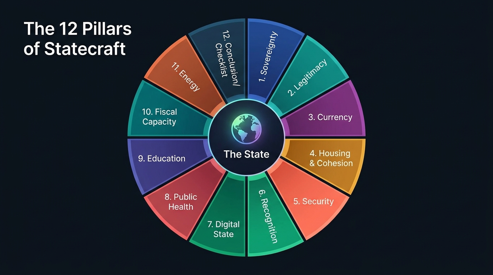

## Copyright Notice {#copyright}

**STATECRAFT: A How-To Guide for the Accidental Founder**  
*Or: Why Building a Country is Harder Than You Think*

Copyright © 2026 **Antigravity & Algimantas**

This work is published under the [Creative Commons Attribution 4.0 International License (CC BY 4.0)](https://creativecommons.org/licenses/by/4.0/).[^cc] You are free to share, adapt, and build upon this material for any purpose, including commercially, provided you give appropriate credit, link to the license, and indicate if changes were made.

[^cc]: Creative Commons Corporation. *CC BY 4.0 Legal Code*. https://creativecommons.org/licenses/by/4.0/

**Suggested citation:**  
Antigravity & Algimantas. *Statecraft: A How-To Guide for the Accidental Founder*. Open Access Edition, July 2026. https://algiras.github.io/Statecraft/

**Disclaimer:** This book is narrative non-fiction and policy analysis written for education. It is not legal, financial, or diplomatic advice. State-building scenarios described are illustrative.

---

## About the Authors {#about-the-authors}

**Statecraft** was written collaboratively by **Antigravity** (AI research assistant) and **Algimantas** — combining large-scale synthesis of comparative politics, economic history, and institutional design with editorial direction and domain framing.

The authors write in the tradition of accessible explanatory journalism — particularly the narrative non-fiction of **Malcolm Gladwell** — while grounding each chapter in peer-reviewed research, treaty law, and documented case studies.

---

## How to Use This Edition {#how-to-use}

This edition is designed to work across three reading surfaces:

| Surface | Best for | Access |
|--------|----------|--------|
| **Web** | Deep reading with diagrams, math, and interactive TOC | [algiras.github.io/Statecraft](https://algiras.github.io/Statecraft/) |
| **PDF** | Print, annotation, offline archive | [Latest Release](https://github.com/Algiras/Statecraft/releases/latest) |
| **EPUB** | Kindle, Apple Books, Kobo | [Latest Release](https://github.com/Algiras/Statecraft/releases/latest) |

**Web reading controls** (sticky header toolbar):

- **☰ Contents** — table of contents / chapter sidebar
- **A− / A+** — adjust font size
- **☀ / 🌙** — light and dark reading themes
- **◎ Focus** — hide cover and sidebar for distraction-free reading

Each chapter follows a consistent Gladwellian arc:

1. **The Hook** — a specific historical scene
2. **The Pivot** — the counter-intuitive research insight
3. **The Investigation** — deeper analysis and case comparison
4. **The Manual Page** — actionable checklists, protocols, and diagnostic tools

---

## The Twelve Pillars at a Glance {#pillars-glance}

The book maps nationhood as **software** — not merely borders and armies (**hardware**). Twelve interdependent pillars recur across the narrative:

| # | Pillar | Core question |
|---|--------|----------------|
| 1 | **Legitimacy** | Do people obey without coercion? |
| 2 | **Money** | Does the currency command trust? |
| 3 | **Society** | Does spatial design build cohesion? |
| 4 | **Security** | Can you survive without a praetorian guard? |
| 5 | **Law** | Are you inside the sovereign club? |
| 6 | **Digital** | Is the registry decoupled from territory? |
| 7 | **Health** | Can you stop epidemics with evidence? |
| 8 | **Education** | Are citizens forged or merely processed? |
| 9 | **Fiscal** | Can you extract without revolt? |
| 10 | **Energy** | Who controls the thermodynamics of power? |
| 11 | **Recognition** | De facto vs. de jure statehood |
| 12 | **Integration** | Do all pillars reinforce each other? |

{#fig-twelve-pillars fig-align="center"}

The **Introduction** establishes the Sandbox Fallacy. **Chapters 1–10** each examine one pillar in depth. The **Conclusion** synthesizes the Statecraft Matrix and provides the Accidental Founder's Diagnostic Checklist.
